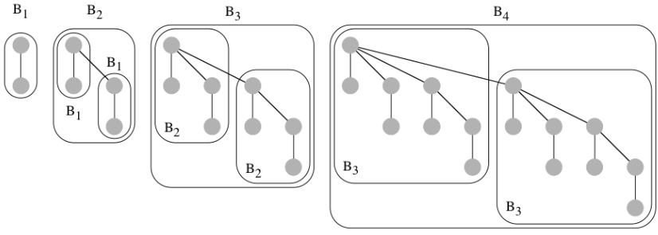

# Il problema della Coda con Priorità

E' usata nella gestione di code in risorse condivise, gestione priorità in processi concorrenti, progettazione di algoritmi efficienti per diversi problemi come il calcolo dei 
cammini minimi in un grafo, minimo albero ricoprente, ordinamento.

```
Tipo CodaPriorità:
dati: 
    un insieme S di n elementi di tipo elem a cui sono associate chiavi di tipo chiave prese da un universo totalmente ordinato.

operazioni:
    findMin() -> elem
        restituisce l'elemento in S con la chiave minima.

    insert(elem e, chiave k)
        aggiunge a S un nuovo elemento e con chiave k.

    delete(elem e)
        cancella da S l'elemento e.

    deleteMin()
        cancella da S l'elemento con chiave minima.

    increaseKey(elem e, chiave d)
        incrementa della quantità d la chiave dell'elemento e in S.

    decreaseKey(elem e, chiave d)
        decrementa della quantità d la chiave dell'elemento e in S.

    merge(CodaPriorità c1, CodaPriorità c2) -> CodaPriorità
        restituisce una nuova coda con priorità c3 = c1 U c2.
```

## Implementazioni elementari

|                 | FindMin     | Insert | Delete | DeleteMin   |
|:---------------:|:-----------:|:------:|:------:|:-----------:|
| Array non ord.  | $\theta(n)$ | $O(1)$ | $O(1)$ | $\theta(n)$ |
| Array ordinato  | $O(1)$      | $O(n)$ | $O(n)$ | $O(1)$      |
| Lista non ord.  | $\theta(n)$ | $O(1)$ | $O(1)$ | $\theta(n)$ |
| Lista ordinata  | $O(1)$      | $O(n)$ | $O(1)$ | $O(1)$      |

## 1. D-Heap

### DEF

- **Struttura**: è completo almeno dino al penultimo livello, e tutte le foglie sull'ultimo livello sono compattate verso sinistra.
- **Informazioni**: ogni nodo $v$ contiene `elem(v)` ed una chiave `chiave(v)` presa da un dominio totalmente ordinato. 
- **Ordinamento**: Ordinamento parziale (inverso) dell'heap (min-heap). $chiave(v) \ge chive(parent(v))$ per ogni nodo $v$ diverso dalla radice. 

### Prorietà

- Un d-heap con $n$ nodi ha altezza $\theta(log_{d}(n))$.
- La radice contiene l'elemento con chiave minima (per via della priorità di ordinamento a heap).
- Può essere rappresentato implicitamente tramite vettore posizionale.

**Alcune procedure ausiliarie**, utili per ripristinare la priorità di ordinamento a heap su un nodo v che non la soddisfi

```
MuoviAlto(v)
    while(v != radice(T) AND chiave(v) < chiave(padre(v))) do 
        scambia di posto v e padre(v) in T
```
**Complessità Temporale**: $T(n) = O(log_{d}(n))$

```
MuoviBasso(v)
    repeat
        sia u il figlio di v con la minima chiave(u), se esiste
        if(v non ha figli o chiave(v) <= chiave(u)) then break
        scambia di posto v e u in T
```
**Complessità Temporale**: $T(n) = O(d \cdot log_{d}(n))$

### Operazioni

#### `FindMin()` & `Insert(elem e, chiade k)`
```
findMin() -> elem
    restituisce l'elemento nella radice di T
```

**Complessità Temporale**: $T(n) = O(1)$

```
insert(elem e, chiave k)
    sia F un nodo con elem = e e chiave = k
    aggiungi F come foglia sull'ultimo livello di T
    MuoviAlto()
```

**Complessità Temporale**: $T(n) = O(log_{d}(n))$

#### `Delete(elem e)` & `DeleteMin()`

```
delete(elem e)
    scambia il nodo v contenente l'elemento e con una qualunque foglia di u sull'ultimo livello di T, e poi elimina v.
    Ripristina infine la proprietà dell'ordinamento a heap spingendo il nodo u verso la
    sua posizione corretta scambiandolo ripetutamente con il proprio padre o col il proprio figlio contenente la chiave più piccola.
```

**Complessità Temporale**: $T(n) = O(log_{d}(n))$ o $O(d \cdot log_{d}(n))$ per 
l'esecuzione di MuoviAlto o MuoviBasso.  
DeleteMin si può implemetare allo stesso modo, con costo $O(d \cdot log_{d}(n))$.

#### `DecreaseKey(elem e, chiave d)` & `IncreseaseKey(elem e, chiave d)`

```
decreaseKey(elem e, chiave d)
    sia v il nodo contenente l'elemento e
    chiave(v) = chiave(v) - d
    MuoviAlto(v)
```

**Complessità Temporale**: $T(n) = O(log_{d}(n))$

```
increaseKey(elem e, chiave d)
    sia v il nodo contenente l'elemento e
    chiave(v) = chiave(v) + d
    MuoviBasso(v)
```

**Complessità Temporale**: $T(n) = O(d \cdot log_{d}(n))$

#### `Merge(CodaPriorità c1, CodaPriorità c2)` 

- **Costruire da zero**: si distruggono le due code e se ne crea una nuova contenente l'unione degli elementi.
L'idea è quella di generare un nuovo d-heap contenente tutti gli elementi di $c1$ e $c2$.
    
    - generalizzazione della procedura `heapify`
    - rendo i $d$ sottoalberi della radice heap ricorsivamente e chiamo `MuoviBasso` sulla radice

**Complessità Temporale**:  
Sia $n = |c1| + |c2| => T(n) = d \cdot T(\frac{n}{d}) + O(d \cdot log_{d}(n)) => T(n) = \theta(n)$.  

- **Inserimenti ripetuti**: si inseriscono ripetutamente gli elementi della coda più piccola in quella più grande. 

Inseriamo ad uno ad uno gli elementi della più piccola nella coda più grande.

Sia $k = min{|c1|, |c2|}$ e $n = |c1| + |c2|$. Eseguiamo quindi $k$ inserimenti nella coda
più grande.   
**Complessità Temporale**: $O(k \cdot log(n))$. L'approccio conviene quindi per $k \cdot log(n) = o(n)$, cioè per $k = o(\frac{n}{log(n)})$.

**Osservazione**: Nel caso peggiore entrambe le operazioni hanno un coso di $\Omega(n)$.

|                | FindMin     | Insert          | Delete                  | DeleteMin               | Incr. Key       | Decr. Key               | Merge  |
|:--------------:|:-----------:|:---------------:|:-----------------------:|:-----------------------:|:---------------:|:-----------------------:|:------:|
| Array non ord. | $\theta(n)$ | $O(1)$          | $O(1)$                  | $\theta(n)$             | $O(1)$          | $O(1)$                  | $O(n)$ |
| Array ordinato | $O(1)$      | $O(n)$          | $O(n)$                  | $O(1)$                  | $(n)$           | $O(n)$                  | $O(n)$ |
| Lista non ord. | $\theta(n)$ | $O(1)$          | $O(1)$                  | $\theta(n)$             | $(1)$           | $O(1)$                  | $O(n)$ |
| Lista ordinata | $O(1)$      | $O(n)$          | $O(1)$                  | $O(1)$                  | $(n)$           | $O(n)$                  | $O(n)$ |
| D-Heap         | $O(1)$      | $O(log_{d}(n))$ | $O(d \cdot log_{d}(n))$ | $O(d \cdot log_{d}(n))$ | $O(log_{d}(n))$ | $O(d \cdot log_{d}(n))$ | $O(n)$ |


## 2. Heap Binomiali

### DEF (albero binomiale)

Un albero binomiale $B_{i}$ è definito ricorsivamente come segue: 

1. $B_{0}$ consiste di un unico nodo 
2. Per $i > 0$, $B_{i+1}$ è ottenuto fondendo due alberi binomiali $B_i$, ponendo la radice dell'uno come foglia della radice dell'altro.



### Proprietà

1. Numero di nodi $(|B_{h}|): n = 2^h$.
2. Grado della radice: $D(n) = log_{2}(n)$.
3. Altezza: $H(n): h = log_{2}(n)$.
4. Figli della radice: i sottoalberi radicati nei figli della radice di $G_{h}$ sono $B_{0}$, $B_{1}$,..., $B_{h-1}$.

### DEF (heap binomiale)

Un heap binomale è una foresta di alberi binomiali che gode delle seguenti proprietà:

1. **Unicità**: per ogni intero $i \ge 0$, esiste al più un $B_{i}$ nella foresta.
2. **Informazioni**: ogni nodo $v$ contiene un elemento `elem(v)` ed una chiave `chiave(v)` presa da un dominio totalmente ordinato. 
3. **Ordinamento a heap**: `chiave(v)` $\ge$ `chiave(parent(v))` per ogni nodo $v$ diverso da un delle radici. 

**Quanti alebri binomiali può avere al massimo un heap binomiale con $n$ nodi?** 

Dalla proprietà di unicità degli alberi binomiali che lo costituiscono, ne deriva che un heap binomiale di $n$ elementi è formato dagli alberi binomiali
$B_{i0}$, $B_{i1}$, ..., $B_{ih}$, dove $i_{0}$,...,$i_{h}$ corrispondono alle posizioni degli $1$ nella rappresentazione in base 2 di $n$.  
=> In un heap binomiale con $n$ nodi, vi sono al più $log(n)$ alberi binomiali, ciascun con grado ed altezza $O(log(n))$.

**Procedura ausiliaria**

```
ristruttura()
    i = 0
    while(esistono ancora due B(i)) do 
        si fondano i due B(i) per formare un albero B(i+1), ponendo la radice con 
        chiave più piccola come genitore della radice con chiave più grande
        i = i + 1
```
**Complessità Temporale**: $T(n)$: lineare nel numero di alberi binomiali in input.
E' utile per ripristinare la proprietà di unicità in un heap binomale (scorrendo la lista delle radice da sinistra verso destra, in ordine crescente rispetto all'indice deglialberi binomiali).

```
classe HeapBinomiale implementa CodaPriorità:
dati: 
    una foresta H con n nodi, ciascuno contenente un elemento di tipo elem e una chiave
    di tipo chiave presa da un universo totalmente ordinato.

operazioni:
    findMin() -> elem
        scorre le radici in H e restituisce l'elemento a chiave minima

    insert(elem e, chiave k)
        aggiunge ad H un nuovo B(0) con dati e e k. Ripristina poi la proprietà di 
        unicità in H mediante fusioni successive dei doppioni B(i)

    deleteMin()
        trova l'albero T(h) con radice a chiave minima. Togliendo la radice a T(h),
        esso si spezza in h alberi binomiali, che vengono aggiunti ad H. Ripristina 
        la proprietà di unicità in H mediante fusioni successive dei doppioni B(i)

    DecreaseKey(elem e, chiave d)
        decrementa di d la chiave del nodo v contenente l'elemento e. Ripristina 
        poi la proprietà dell'ordinamento a heap spingendo il nodo v verso l'alto 
        tramite ripetuti scambi di nodi. 

    delete(elem e)
        richiama decreaseKey(e, -inf) e poi deleteMin()

    increaseKey(elem e, chiave d)
        richiama delete(e) e poi insert (elem, k + d), dove k è la chiave associata
        all'elemento e

    merge(CodaPriorità c1, CodaPriorità c2) -> CodaPriorità
        unisce gli alberi in c1 e c2 in un nuovo heap binomiale c3. Ripristina poi 
        la proprietà di unicità nell'heap binomiale c2 mediante fusioni successive 
        dei doppioni B(i)
```

**Complessità Temporali**: Tutte le operazioni richiedono tempo $T(n) = O(log(n))$

## 3. Heap di Fibonacci

### DEF 

- **Heap binomiale rilassato**: si ottiene da un heap binomale rilassando la proprietà
    di ***unicità*** dei $B_{i}$ ed utilizzando un atteggiamento più 'pigro' durante 
    l'operazione insert.
- **Heap di Fibonacci**: si ottiene da un heap binomale rilassato indebolendo la 
    proprietà di struttura dei $B_{i}$ che non sono più necessariamente alberi 
    binomiali. 

- **Analisi Armonizzata**: E' il costo 'medio' rispetto a una sequenza qualsiasi di 
    operazioni. Si ottiene dividendo il costo complessivo della sequenza di operazioni
    per il numero di operazioni della sequenza. Molto utile quando si vogliono buone 
    prestazioni sull'intera sequenza e non garanzie sulla singola operazione.

|           | FindMin     | Insert      | Delete        | DelMin        | IncKey        | DecKey      | Merge       |
|:---------:|:-----------:|:-----------:|:-------------:|:-------------:|:-------------:|:-----------:|:-----------:|
| D-Heap    | $(O(1))$    | $O(log(n))$ | $O(log(n))$   | $O(log(n))$   | $O(log(n))$   | $O(log(n))$ | $O(n)$      |
| Heap Bin. | $O(log(n))$ | $O(log(n))$ | $O(log(n))$   | $O(log(n))$   | $O(log(n))$   | $O(log(n))$ | $O(log(n))$ | 
| Heap Fib. | $O(1)$      | $O(1)       | $O(log(n))^*$ | $O(log(n))^*$ | $O(log(n))^*$ | $O(1)^*$    | $O(1)$      |

