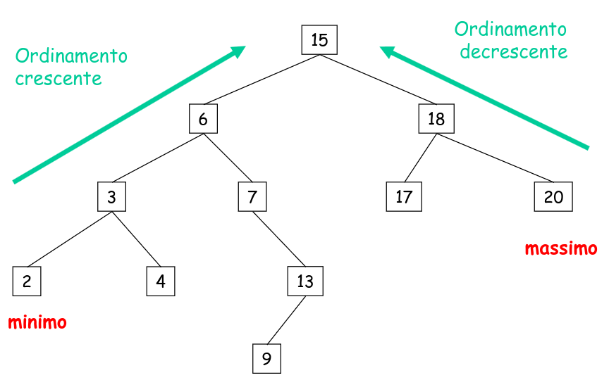
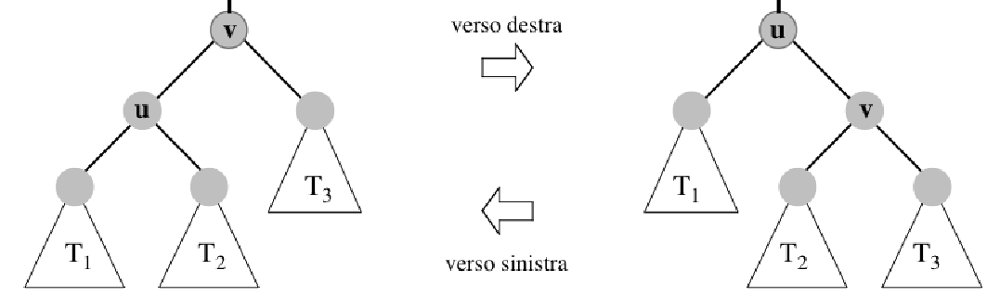
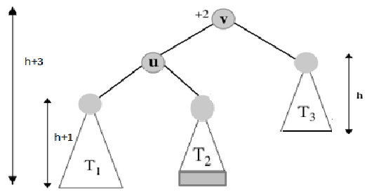
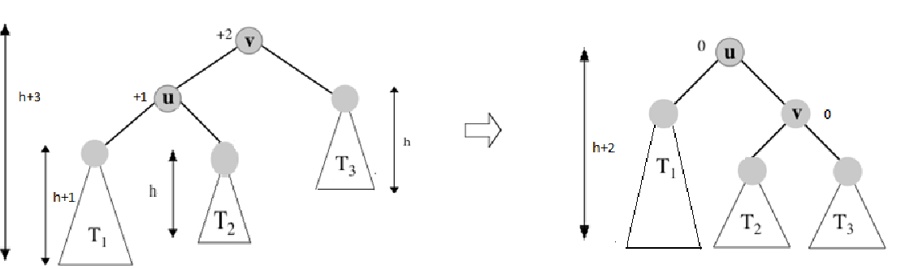
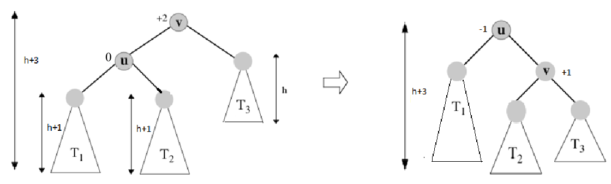
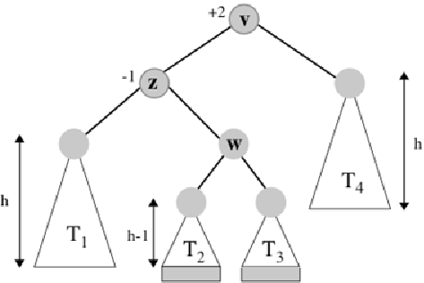
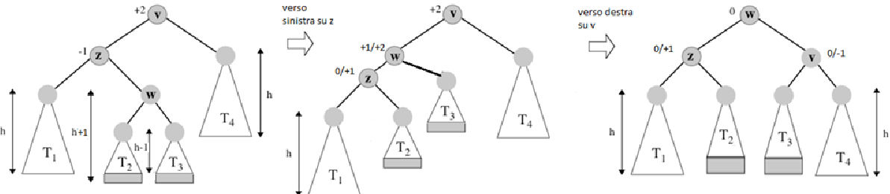

# Il problema del Dizionario

```
Tipo Dizionario:
dati: un insieme S di coppie (elem, chiave)
operazioni:
    insert(elem e, chiave k)
        aggiunge a S una nuova coppia (e, k)
    delete(elem e)
        cancella da S l'elemento e
    search(chiave k)
        se la chiave k è presente in S restituisce un elemento e ad essa associato e NULL altrimenti.
```

Per garantire che le operazioni su un dizionario di $n$ elementi abbiano tempo $O(log(n))$.

**Idee**:

- Definire un albero (binario) tale che ogni operazione richiede tempo $O(h)$ (BST).

- Fare in modo che l'altezza dell'albero sia sempre $O(log(n))$ (AVL)

## Binary Search Tree

E' un albero binario che soddisfa le seguenti proprietà:

- ogni nodo $v$ contiene un elemento `elem(v)` in cui è associata una chiave  `chiave(v)` presa da un dominio totalmente
ordinato. Per ogni nodo $v$ vale che:
- le chiavi nel sottoalbero sinistro di $v$ sono $\leq$ `chiave(v)`.
- le chiavi nel sottoalbero destro di $v$ sono $>$ `chiave(v)`.

**Proprietà**:
- Il minimo si trova nell'ultima foglia nel cammino più a sinistra
- Il massimo si trova nell'ultima foglia nel cammino più a destra
- Visitando il BST in ordine simmetrico otteniamo un array ordinato in modo crescente.

<center>

</center>

### 1. Search

Traccia un cammino nell'albero partendo dalla radice: su ogni nodo, usa la proprietà di ricerca per decidere se proseguire
nel sottoalbero sinistro o destro.

```
Search(chiave k) -> elem 
    v = radice di T
    while(v != NULL) do 
        if(k = chiave(v)) then return elem(v)
        else if(chiave(v) > k) then v = figlio_des(v)
        else v = figlio_sin(v)
    return NULL
```
### 2. Insert

**Idea**: aggiunge la nuova chiave come nodo foglia; per capire dove mettere la foglia simula una ricerca con la chiave
da inserire.

1. Crea un nuovo nodo $u$ con `elem = e` e `chiave = k`.
2. Cerca la chiave k nell'albero, identificando così il nodo $v$ che diventerà padre di $u$.
3. Appendi $u$ come figlio/sinistro di $v$ in modo che sia mantenuta la proprietà di ricerca.

```
Insert(chiave k, elem e)
    sia F un nuovo nodo con chiave = k e elem = e
    v = radice di T
    while(v != NULL) do 
        if(chiave(v) > k) then v = figlio_des(v)
        else v = figlio_sin(v)
    if(chiave(v) > k) then figlio_des(v) = F
    else figlio_sin(v) = F
```
### 3. Delete 

Prima di vedere l'operazione di delete, bisogna definire alcune funzioni ausiliarie.

1. Ricerca del massimo e del minimo

```
max(nodo u) -> nodo
    v = u
    while(figlio_des(v) != NULL) do
        v = figlio_des(v)
    return v
```

```
min(nodo u) -> nodo
    v = u
    while(figlio_sin(u) != NULL) do
        v = figlio_sin(v)
    return v
```

2. Successore e Predecessore

- Il predecessore di un nodo $u$ in un BST è il nodo $v$ nell'albero avente massima chiave $\leq$ `chiave(u)`
- Il successore di un nodo $u$ in un BST è il nodo $v$ nell'albero avente minima chiave $\geq$ `chiave(u)`

```
Predecessore(nodo u) -> nodo
    if(u ha figlio sinistro)
        return max(sin(u))
    while(parent(u) != NULL e u è figlio sinistro di suo padre) do 
        u = parent(u)
    return parent(u)
```
---------------------------
```
Successore(nodo u) -> nodo
    if(u ha figlio destro)
        return max(des(u))
    while(parent(u) != NULL e u è figlio destro di suo padre) do
        u = parent(u)
    return parent(u)
```

Con queste funzioni adesso possiamo definire l'operazione di delete.

Sia $u$ il nodo contenente l'elemento $e$ da cancellare. 

1. $u$ è una foglia: rimuovila.
2. $u$ ha un solo figlio: rimuovo $u$ e `parent(u).sin` = figlio di $u$.
3. $u$ ha due figli: sostituiscilo con il predecessore (o successore) ($v$) e rimuovi fisicamente il predecessore 
(o successore) (che ha al più un figlio).

**In conclusione**:
- Tutte le operazioni hanno complessità temporale $O(h)$ dove $h$ è l'altezza dell'albero.
- Nel caso peggiore $O(n)$, nel caso di alberi sbilanciati e molto profondi.

## AVL

#### DEF 
- Fattore di bilanciamento $\beta(v)$ di un nodo $v$: altezza del sottoalbero sinistro di $v$ - altezza del sottoalbero 
destro di v. Generalmente $\beta(v)$ è mantenuto come informazione addizionale nel record relativo di $v$.
- Un albero si dice bilanciato in altezza se ogni nodo $v$ ha fattore di bilanciamento in valore assoluto $\leq 1$.
- Un albero AVL è un albero BST bilanciato in altezza.

**Corollario**: Un albero AVL con $n$ nodi ha altezza $O(log(n))$.  
**Dim**: Per dimostrare ciò, di tutti gli alberi AVL andiamo a prendere quelli più sbilanciati, ovvero gli alberi di 
Fibonacci. Sono alberi AVL di altezza $h$ con il minimo numero di nodi $n_{h}$. Quindi se dimostriamo che gli alberi 
di Fibonacci hanno altezza $O(log(n))$ allora tutti gli alberi AVL hanno altezza $O(log(n))$.  
Sia $T_{i}$ l'albero di Fibonacci di altezza $i$. Se a $T_{i}$ tolgo un nodo, o diventa sbilanciato, o cambia la sua 
altezza. Inoltre ogni nodo (non foglia) ha fattore di bilanciamento pari (in valore assoluto) a 1.  
$n_{h} = F_{h+3} -1 = \theta(\phi^n) => h = \theta(log(n_{h})) = O(log(n))$ con $n_{h} \leq n$.

L'operazione di search non va a modificare la struttura dell'albero, perciò rimane uguale come nel BST. Le uniche 
operazioni che cambiano i fattori di bilanciamento di +-1 sono l'insert e la delete. Per mantenere il bilanciamento 
si usano una serie di **rotazioni**.

#### Ribilanciamento tramite rotazioni

**Rotazione verso destra/sinistra sul nodo $v/u$**

<center>

</center>

- Mantiene la proprietà di ricerca
- Richiede tempo $O(1)$

Le rotazioni sono effettuate su nodi sbilanciati. Sia $v$ un nodo con profondità massima (nodo critico) con fattore di bilanciamento $\beta(v) = +- 2$, allora 
esiste un sottoalbero $T$ di $v$ che lo sbilancia, a seconda della posizione di $T$ si hanno 4 casi:

- `Sinistra - Sinistra (SS)` $=>$ $T$ è il sottoalbero sinistro del figlio sinistro di $v$ con $\beta(v) = +2$
- `Destra - Destra (DD)` $=>$ $T$ è il sottoalbero destro del figlio destra di $v$ con $\beta(v) = -2$
- `Sinistra - Destra (SD)` $=>$ $T$ è il sottoalbero destro del figlio sinistro di $v$ con $\beta(v) = +2$
- `Destra - Sinistra (DS)` $=>$ $T$ è il sottoalbero sinistro del figlio destro di $v$ con $\beta(v) = -2$

#### Caso SS $(\beta(v) = +2, h(T_{1}) = h + 1)$

<center>

</center>

Sia $h$ l'altezza del sottoalbero destro di $v$.  

- L'altezza di $T(v) = h + 3$
- L'altezza di $T(u) = h + 2$ 
- L'altezza di $T_{3} = h$

$=> \beta(v) = +2$ e lo sbilanciamento è provocato da $T_{1}$. Si applica una rotazione semplice verso sinistra su $v$, bilanciando cosi l'albero.

Ci sono due sottocasi possibili:

1. l'altezza di $T_{2} = h =>$ l' altezza dell'albero coinvolto nella rotazione passa da $h + 3$ a $h + 2$

<center>

</center>

2. l'altezza di $T_{2} = h + 1 =>$ l'altezza dell'albero coinvolto nella rotazione rimane pari a $h + 3$

<center>

</center>

**Osservazioni**

- Dopo la rotazione l'albero è bilanciato (tutti i fattori di bilanciamento sono in modulo $\leq 1$)
- L'inserimento di un elemento nell'AVL (ovvero, l'aggiunta di una foglia a un albero bilanciato) può provocare solo il sottocaso $(1)$, perché altrimenti l'AVL era gia sbilanciato!
- Invece, la cancellazione di un elemento dall'AVL (che necessariamente fa diminuire l'altezza di qualche sottoalbero) può provocare entrambi i casi

#### Caso SD $(\beta(v) = +2, h(T_{1})\neq h + 1)$

<center>

</center>

Sia $h$ l'altezza del sottoalbero destro di $v$.

- L'altezza di $T(w) = h + 1$
- L'altezza di $T_{1} = h$
- L'altezza di $T(z) = h + 2$

$=> \beta(v) = +2$ e lo sbilanciamento è provocato dal sottoalbero destro di $z$. Applicare due rotazioni semplici: una verso sinistra sul figlio sinistro del nodo critico (nodo $z$),
l'altra verso destra sul nodo critico (nodo $v$).

<center>

</center>

**Osservazioni**

- I fattori di bilanciamento di tutti i nodi tornano ok
- L'altezza dell'albero dopo la rotazione passa da $h + 3$ a $h + 2$
- Il caso SD può essere provocato sia da inserimenti (in $T_{2}$ o $T_{3}$), sia da cancellazioni che abbassano di 1 l'altezza di $T_{4}$


