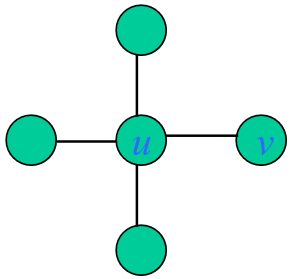

# Grafi

**DEF** (grafo non orientato):
Un grafo $G = (V, E)$ consiste in:

- un insieme $V$ di vertici (o nodi).
- un insieme $E$ di coppie (non ordinate) di vertici, detti archi.

**DEF** (grafo diretto):
Un grafo $D = (V, A)$ consiste in:

- un insieme $V$ di vertici (o nodi).
- un insieme $A$ di coppie ordinate di vertici, detti archi diretti.

**Terminologia**:

- $n = |V|$ (numero di vertici)
- $m = |E|$ (numero di archi)
- $u$ e $v$ sono adiacenti (vicini)
- $(u, v)$ è incidente a $u$ e $v$ (detti estremi)
- $\delta(u)$: grado di $u$, ovvero il numero di archi incidenti a $u$
- grado di $G$ = $max_{v\in V}(\delta(v))$
- $\sum_{v\in V}\delta(v) = 2\cdot m$ (grafo non orientato)
- $\sum_{v\in V}\delta_{out}(v) = \sum_{v\in V}\delta_{in}(v) = m$ (grafo orientato)

**In ogni grafo il numero di nodi di grado dispari è pari**

**Terminologia**:

- *cammino*: sequenza di nodi connessi da archi.
- *lunghezza* di un cammino: numero di archi del cammino.
- *distanza*: la lunghezza del più corto cammino tra due vertici si dice *distanza* tra i due vertici.
In un grafo orientato, il cammino deve rispettare il verso di orientamento degli archi.
- G è *connesso* se esiste un cammino per ogni coppia di vertici.
- *ciclo*: un cammino chiuso, ovvero un cammino da un vertice a se stesso.
- il *diametro* è la massima distanza fra due nodi. 
- *grafo pesato*: è un grafo $G = (V, E, w)$ in cui ad ogni arco viene associato un valore definito dalla funzione peso $w$ (definita sun un opportuno insieme, di solito i reali).

**Grafo totalmente sconnesso**: è un grafo $G = (V, E)$ tale che $V \neq \emptyset$ ed $E = \emptyset$.  
**Grafo completo**: per ogni coppia di nodi esiste un arco che li congiuge. Il grafo completo con $n$ vertivi verrà indicato con $k_{n}$. $m = |E| = \frac{n\cdot (n - 1)}{2}$  
Un grafo (senza cappi o archi paralleli) può avere un numero di archi: $0 \leq m \leq \frac{n \cdot (n - 1)}{2}$

**DEF**: Un albero è un grafo connesso è aciclico.

**TEOREMA**: Sia $T = (V, E)$ un albero; allora $|E| = |V| - 1$.

**Dim** (per induzione su $|V|$):  
- caso base: $|V| = 1 => |E| = 0 = |V| - 1$ 
- caso induttivo: $|V| > 1$, sia $n$ il numero di nodi ti $T$. Poiché $T$ è connesso e aciclico ha almeno una foglia (se tutti i nodi avesero grado almeno 2 ci sarebbe un ciclo).
  Rimuovendo tale foglia si ottiene un grafo connesso e aciclico con $n - 1$ nodi che per ipotesi induttiva ha $n - 2$ archi, $=> T$ ha $n - 1$ archi.

**Per un grafo connesso con $n$ nodi e $m$ archi vale: $n - 1 \leq m \leq \frac{n\cdot (n - 1)}{2} => m = \Omega(n)$ e $m = O(n^2)$**.

**Se una grafo ha $m \geq n - 1$ archi, non è detto che sia connesso. Deve avere almeno $\frac{n\cdot (n - 1)}{2}$ archi**.

**DEF**: Dato un grafo $G$, un ciclo (rispettivamente un cammino) Euleriano è un ciclo (rispettivamente un cammino non chiuso) di G che passa per tutti gli archi di $G$ una e una sola
volta.

**DEF**: Un grafo $G$ ammette un ciclo Euleriano se e solo se tutti i nodi hanno grado pari. Inoltre, ammette un cammino Euleriano se e solo se tutti i nodi hanno grado pari tranne due
(i due nodi di grado dispari sono gli estremi del cammino).

