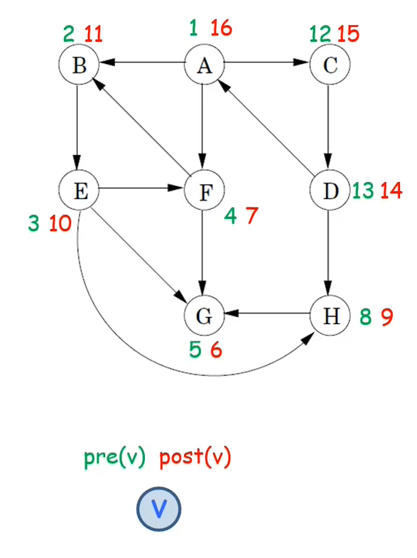
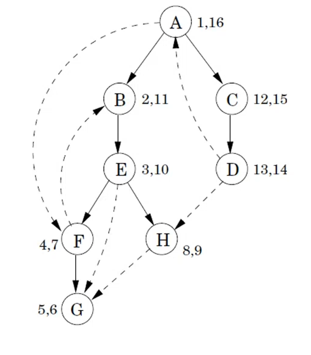
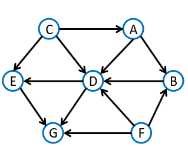
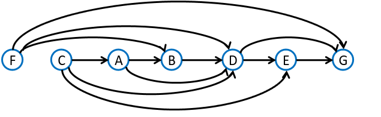
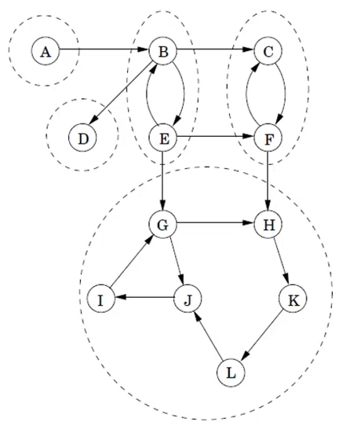
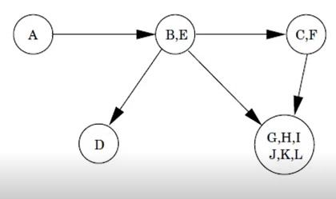

# Algoritmi di visita di un grafo

Per capire quali parti del grafo sono raggiungibili da un certo nodo, eseguo una visita del grafo.

- Una visita di un grafo $G$ permette di esaminare i nodi e gli archi di $G$ in modo sistematico (***Se** $G$ **è connesso***)
- genera un albero di visita
- problema di base in molte applicazioni

## 1. Visita in Ampiezza - BFS

**Proprietà**: Dato un grafo $G$ non pesato e un nodo $s$ (sorgente), trova tutte le ***distanze/cammini minimi*** da $s$ verso ogni altro nodo $v$.

Si parte da un nodo, si va in tutti i vicini raggiungibili con un arco, poi andare ai successivi vicini raggiungibili con un altro arco. Quindi prima si visitano i nodi a distanza 1,
poi a distanza 2, etc... . In parole povere si va per livelli.

#### Pseudocodice
```
visitaBFS(nodo s) -> albero
    rendi tutti i nodi non marcati
    Sia T un albero formato da un solo nodo s
    Coda F
    marca il vertice s
    F.enqueue(s)
    while(not F.isempty()) do 
        u = F.dequeue()
        for each (arco(u, v) in G) do // for each (vicino di u in G) do 
            if (v non è ancora marcato) then
                F.enqueue(v)
                marca il vertice v
                rendi u padre di v in T
    return T
```

Restituisce l'albero dei **cammini minimi** con radice $s$ (sorgente)

**Complessità Temporale**:

- Matrice di adiacenza: $T(n) = O(n^2)$
- Liste di adiacenza: $T(n) = O(n + m)$. (dimensione lineare nella dimensione del grafo)

**Osservazioni**.

- Se il grafo è connesso allora $m \geq n - 1$ quindi $O(m + n) = O(m)$.
- Sapende che $m \leq \frac{n\cdot (n - 1)}{2}$, si ha $O(m + n) = O(n^2)$, quindi per 
  $m = o(n^2)$ la rappresentazione mediante liste di adiacenza è temporalmente più 
  efficiente.

**Teorema**: Per ogni nodo $v$, il livello di $v$ nell'albero BFS è pari alla distanza di 
$v$ dalla sorgente $s$ (sia per grafi orientati che non orientati).

## 2. Visita in profondità - DFS

- La DFS garantisce di visitare tutti i nodi e gli archi di un grafo connesso, fornendo 
  una conoscenza completa della struttura.
- L'algoritmo si basa sul pricipio di "seguire un sentiero fino al suo termine" prima di 
  tornare indietro e esplorare altri rami (analogia con il labirinto).
- Questo approccio assicura che non vengano tralasciate porzioni del grafo, garantendo un'
  analisi completa.

#### Pseudocodice
```
visitaDFSRicorsiva(nodo v, albero T)
    marca e visita il vertice v
    for each (arco (v, w)) do 
        if(w non è marcato) then
            aggiungi l'arco (v, w) all'albero T
            visitaDFSRicorsiva(w, T)

visitaDFS(nodo s) -> albero
    T = albero vuoto
    visitaDFSRicorsiva(s, T)
    return T
```
**Complessità Temporale**: $T(n) = O(n + m)$

### Usi della visita DFS

#### 1. Tenere traccia del tempo 

```
visitaDFSRicorsiva(nodo v, albero T)
    marca e visita il vertice v
    prev(v) = clock
    clock += 1
    for each (arco (v, w)) do 
        if(w non è marcato) then
            aggiungi l'arco (v, w) all'albero T
            visitaDFSRicorsiva(w, T)
    post(v) = clock
    clock += 1

visitaDFS(nodo s) -> albero
    clock = 1
    T = albero vuoto
    visitaDFSRicorsiva(s, T)
    return T
```

- **`Prev(v)`: tempo in cui viene "scoperto" $v$**
- **`Post(v)`: tempo in cui si "abbandona" $v$**

Inoltre si può modificare la visita DFS in modo tale da esplorare tutti i nodi del grafo,
anche se non sono raggiungibili dal punto di partenza

```
visita DFS(grafo G) -> foresta 
    for each nodo v do imposta v vome non marcato
    clock = 1
    F = foresta vuota
    for each nodo v do 
        if (v non è marcato) then
            T = albero vuoto
            visitaDFSRicorsiva(v, T)
            aggiungi T ad F
    return F
```
**Complessità Temporale**: $T(n) = O(n + m)$





**Proprietà**: Per ogni coppia di nodi $u$ e $v$, gli intervalli `[pre(u), post(u)]` e 
`[pre(v), post(v)]` o sono disgiunti o l'uno è contenuto nell'altro.

Se $u$ è antenato di $v$ nell'albero DFS, se `pre(u)` < `pre(v)` < `post(v)` < `post(u)`  
condizione che rappresentiamo cosi: $[_{u}$ ___ $[_{v}$ ___ $]_{v}$ ___ $]_{u}$

Questa proprietà è utile per riconoscere il tipo di arco

| pre/post (u, v)                             | tipo di arco    |
| ------------------------------------------- | --------------- |
| $[_{u}$ 
ciao 
$[_{v}$ ciao $]_{v}$ ciao $]_{u}$ | in avanti       |
| $(_{v}$ ___ $(_{u}$ ___ $)_{u}$ ___ $)_{v}$ | all'indietro    |
| $[_{v}$ ___ $]_{v}$ ___ $[_{u}$ ___ $]_{u}$ | trasversali     |

- in avanti: da un vertico $u$ verso un qualche discendente $v$ nell'albero (A, B)
- all'indietro: da un vertice $u$ verso un qualche antenato $v$ nell'albero (F, B)
- trasversali: da un vertice $u$ a un vertice $v$ che non è ne antenato ne discendente 
  (D, H)

Per riconoscere la presenza di un ciclo in un grafo diretto, effetturare una visita DFS 
e controlla se c'è un arco all'indietro.

**Proprietà**: Un grafo diretto $G$ ha un ciclo se e solo se la visita DFS rivela un arco 
all'indietro.

#### 2. Ordinamento Topologico

**DEF**: Un grafo diretto aciclico (***DAG***) è un grafo $G$ che non contiene cicli 
(diretti).

- sorgente: noso in cui ci sono solo archi uscenti.
- pozzo: nodo in cui ci sono solo archi entranti.

**DEF**: Un ordinamento topologico di un grafo diretto $G = (V, E)$ è una funzione 
biettiva $\sigma: V$ -> {$1, 2, ..., n$} tale che per ogni arco $(u, v)\in E$, 
$\sigma(u) < \sigma(v)$.

Un uso importante dell'ordinamento topologico sono le reti delle dipendenze.

- nodi: compiti da svolgere
- `arco(u, v)`: $u$ deve essere eseguito prima di $v$

Il problema è di trovare un ordine in cui eseguire i compiti in modo da rispettare le 
dipendenze.




**Teorema**: Un grafo diretto $G$ ammette un ordinamento topologico se e solo se $G$ è un 
DAG.

Per trovare l'ordinamento topologico di un DAG, effettua un visita DFS e restituisci i 
nodi in ordine decrescente rispetto ai tempo di fine visita `post(v)`

```
OrdinamentoTopologico(grafo G)
    top = n
    L = lista vuota
    chiama visita DFS ma:
        quando hai finito di visitare un nodo v (quando imposti post(v)):
            sigma(v) = top
            top = top - 1
            aggiungi v in testa alla lista L
    return L e sigma
```
**Complessità Temporale**: $T(n) = O(n + m)$

Alternativamente:

```
OrdinamentoTopologico(grafo G) -> lista
    G' = G
    ord = lista vuota di vertici
    while(esiste un vertice u senza archi entranti in G') do 
        appendi u come ultimo elemento di ord
        rimuovi da G' il vertice u e tutti i suoi archi uscenti
    if(G' non è diventato vuoto) then errore il grafo G non è aciclico
    return ord
```
**Complessità Temporale**: $T(n) = \theta(n + m)$, se riesco a estrarre in tempo costante
la sorgente.

#### 3. Componenti Fortemente Connesse 

**DEF**: Due vertici sono fortemente connessi se esiste un cammino da $u$ a $v$ ed esiste un camminoda $v$ ad $u$.

**DEF**: Una componenete fortemente connessa di un grafo $G = (V, E)$ è un insieme 
massimale di veritici $C \subseteq V$ tale che per ogni coppia di nodi $u$ e $v$ in $C$,
$u$ è raggiungibile da $v$ e $v$ è raggiungibile da $u$.

- massimale: se si aggiunge un qualsiasi vertice a $C$ la proprietà non è più vera 






Il grafo delle componenti fortemente connesse ha un nodo per ciascuna componenete 
fortemente connessa e c'è un arco da una componente $C$ a una componente $C'$ se 
esistono due nodi, uno in $C$ e uno in $C'$ per cui c'è un nodo tra il primo nodo 
e il secondo. Il grafo delle componenti fortemente connesse è sempre un **DAG**.
```
visitaDFS(grafo G)
    calcola GR 
    esegui DFS(GR) per trovare valori post(v)
    return CompConnesse(G)

CompConnesse(grafo G)
    for each nodo v do imposta v come non marcato
    comp = foresta vuota
    for each nodo v in ordice decrescente di post(v) do 
        if(v non è marcato) then
            T = albero vuoto 
            visitaDFSRicorsiva(v, T)
            aggiungi T a comp
    return Comp
```
