# Raccolta di esercizi sui grafi

## Esercizio 3 del 20/02/2023

La vostra città è modellata come un grafo diretto e pesato $G = (V, E, w)$. Voi siete nel nodo $s$ e dovete raggiungere il nodo $t$ dove si svolgerà l’esonero del corso di ASD.
Ma siete in ritardo. Dovete fare in fretta. Per fortuna avete una bicicletta. Con la vostra bicicletta, attraversare un arco $e\in E$ richiede tempo $w(e)$.

La bicicletta non è il solo mezzo che potete usare. Sapete che ci sono dei nodi del grafo, i nodi nell’insieme $X\subseteq V$,
in cui potete affittare scooter, monopattini e altra roba.
Avete soldi per affittare un solo mezzo. Per ogni nodo $x\in X$, conoscete due cose:

- il tempo $\tau_{x}$ che vi richiede lo scambio fra la bicicletta e il mezzo che si trova in $x$
- il fattore di speed-up $\sigma_{x} \leq 1$ del mezzo: con il mezzo preso nel nodo $x$ il tempo di attraversamento di un arco e scende da $w(e)$ a $\sigma_{x}\cdot w(e)$.

Progettate un algoritmo che in tempo $O(m + n log n)$, calcola la strategia che vi porta a $t$ nel minor tempo possibile.

Quindi per trovare la strategia migliore, bisogna confrontare $d(s, t)$ con $const(v)$ per ogni $v\in V$.

$const(v) = d(s, v) + \tau_{v} + \sigma_{v}\cdot d(v, t)$ dove:

- se $v\in X$ allora $v = x$ e $\tau_{v} = \tau_{x}$ e $\sigma_{v} = \sigma_{x}$.
- se $v\notin X$ allora $\tau_{v} = 0$ e $\sigma_{v} = 1$.

La distanza $d(s, v)$ si può calcolare in tempo $O(m + nlogn)$ usando Dijkstra. Mentre per trovare $d(v, t)$, l'idea è quella di invertire gli archi del grafo $G$ e far partire 
l'algoritmo di Dijkstra con sorgente $t$. In tempo costante possiamo accedere alle distanze calcolate.

Per ogni nodo $v$, in tempo costante accedo alla distanza $d(s, v)$ e alla distanza $d(v, t)$ e calcolo $const(v)$, ovvero il costo del cammino passando per il nodo $v$.
```
1.  Dijkstra(G, s)
2.  Dijkstra(G, t)
3.  z = arg(min{const(v)})
4.  return const(z)
```
**Corretteza**: L'algoritmo è corretto poiché l'algoritmo di Dijkstra è corretto. Inoltre per ogni nodo $v$, calcolo il cammino minimo, quindi provo tutti i cammini possibili, e 
sceglo quello ottimale.

**Complessità Temporale**: $T(n) = O(m + nlogn)$.

## Esercizio 3 del 04/07/2023

Sia $G = (V, E)$ un grafo diretto con $n$ nodi ed $m$ archi. Ci sono Alice e Bob che vogliono incontrarsi in un nodo di $G$.
Inizialmente, Alice si trova sul nodo $S_{A}$ ed ha a disposizione $\Delta(A)$ monete di tipo $A$, mentre Bob si trova sul nodo $S_{B}$ ed ha a disposizione $\Delta(B)$ monete di tipo $B$.
Ad ogni arco $e\in E$, sono associati due interi, $c_{e}^{A}$ e $c_{e}^{B}$, che rappresentano rispettivamente il numero di monete di tipo $A$ che Alice deve pagare per attraversare $e$,
e il numero di monete di tipo $B$ che Bob deve pagare per poter attraversare $e$.
Progettate un algoritmo di complessità $O(m + n log n)$ che calcola, se esiste, un modo per far incontrare Alice e Bob.

<div align="center" style="margin-bottom: 20px">
    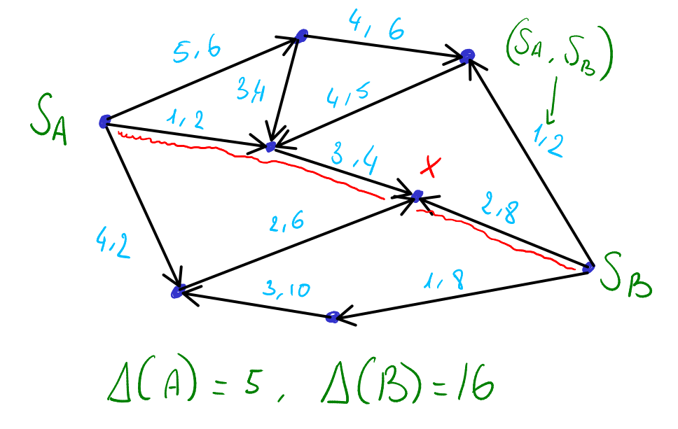
</div>

L'idea è quella di andare a calcolare attraverso l'algoritmo di Dijkstra l'SPT radicato in $S_{A}$ e l'SPT radicato in $S_{B}$. Cosi ottieniamo le distanze dalle 2 sorgenti verso tutti i
nodi $x\in V$. 

- $cost_{A}(x) = d(S_{A, x}) = \sum_{e\in E} (w_{A}(e) = c_{e}^{A})$

- $cost_{B}(x) = d(S_{B, x}) = \sum_{e\in E} (w_{B}(e) = c_{e}^{B})$

Per ogni nodo $x$, trovo il cammino minimo, e vado a confrontare $\Delta(A)$ e $\Delta(B)$ con $cost_{A}(x)$ e $cost_{B}(x)$. Se Il costo è superiore per tutti i nodi $x$, allora non esiste 
uno nodo in cui Alice e Bob si possono incontrare.

```
1.  Dijkstra(G, SA) // SPT radicato in SA 
2.  Dijkstra(G, SB) // SPT radicato in SB 
3.  for each x do
4.      A = costA(x)
5.      B = costB(x)
6.      if A <= DeltaA and B <= DeltaB then
7.          return A, B, x
8.  return -1
```
**Complessità Temporale**: $T(n) = O(m + nlog(n))$

**Corretteza**: L'algoritmo è corretto poiche l'algoritmo di Dijkstra è corretto. Inoltre provo tutti i nodi $x$ per cui ho calcolato la distanza e trovo il nodo in comune $x$ se esiste 
nel quale Alice e Bob si possono incontrare spendendo meno monete di quante ne hanno a disposizione.


## Esercizio 3 del 07/25/2023

Nell’ultimo gioco rilasciato dalla Mintendo, Super Ciano Bross si trova su un nodo $s$ di un grafo orientato $G = (V, E)$ con $n$ nodi ed $m$ archi, e deve raggiungere il nodo $t$ 
per vincere il livello. Ogni arco $e$ è associato inizialmente uno stato $\sigma(e)\in$ {on, off}. Super Ciano può attraversare solo gli archi che sono nello stato on. 
C'è inoltre un insieme di nodi $B\subseteq V$ che contengono un bottone speciale. Se Ciano è su un nodo $b\in B$ può decidere di schiacciare il bottone e tutti gli archi
invertono il proprio stato, quelli che erano nello stato on passano allo stato off e quelli che erano nello stato off passano nello stato on.
Progettate un algoritmo di complessità $O(m + n)$ che calcola, se esiste, una strategia per Super Ciano che lo porta a vincere il livello nel nodo $t$.

**Idea**

L'idea è quella di creare un grafo ausiliario $G'$ a livelli, più precisamente con 2 livelli. Appena Ciano incontra un nodo con un bottone può decidere se premere il bottone e andare 
nel secondo livello oppure continuare nel primo livello (se l'arco successivo è on). Nel secondo livello, si invertono on e off, quindi se Ciano preme il bottone perchè 
davanti a se l'arco è off e non può procedere, premendo il bottone andrà nel secondo livello dove potrà procedere. Ciano può ripetere questo processo finchè non vince.

<div style="margin-bottom: 300px">
    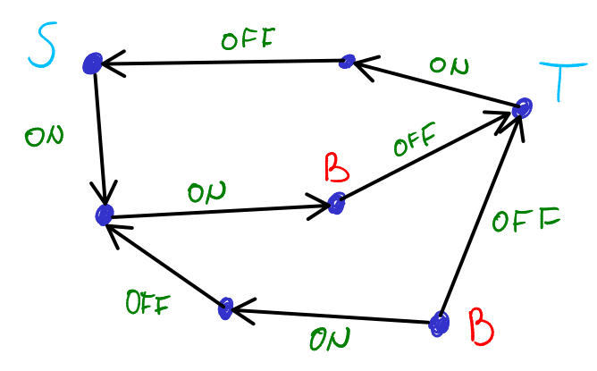
    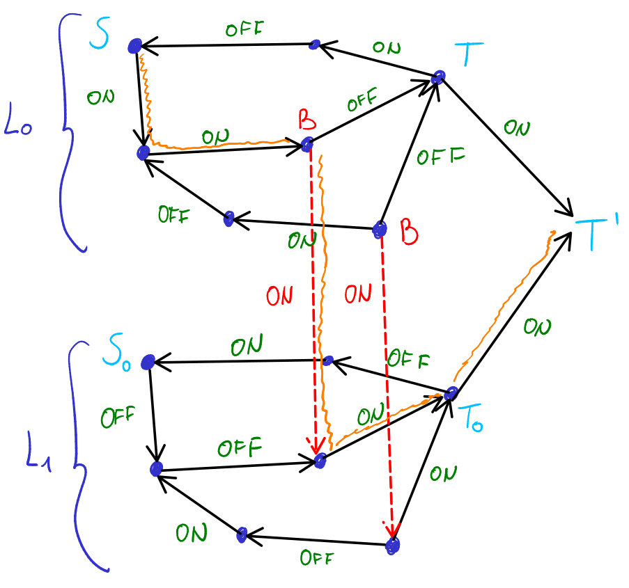
</div>

Come viene creato il grafo $G^{'} = (V^{'}, E^{'})$

**Nodi**: 

- $|V^{'}| = 2|V| => V^{'} = V_{1}^{'} + V_{2}^{'}$
- un nodo finale $T'$ 

**Archi**:

- per ogni nodo $u\in G$ bottone aggiungo due archi $(u_{1}^{'}, u_{2}^{'})$ e $(u_{2}^{'}, u_{1}^{'})$ dove $u_{1}^{'}\in V_{1}^{'}, u_{2}^{'}\in V_{2}^{'}$.
- Per ogni arco $(u, v)\in G$ ho l'arco $(u_{1}^{'}, v_{1}^{'})\in G^{'} <=> \sigma(u, v) =$ ON.
- Per ogni arco $(u, v)\in G$ ho l'arco $(u_{2}^{'}, v_{2}^{'})\in G^{'} <=> \sigma(u, v) =$ OFF. 
- due archi $(T_{1}^{'}, T^{'})$ e $(T_{2}^{'}, T^{'})$
- $m^{'} = m + 2\cdot O(n) = O(m)$

**Proprietà**: Esiste un cammino da $S$ a $T$ in $G$ se e soltanto se esiste un cammino da $S'$ a $T'$ in $G'$. Per trovare questo cammino si può effettuare una visita BFS o DFS, entrambe 
con costo $O(n + m)$, poiché il numero di livelli è costante ovvero 2.

La costruzione del grafo $G'$ costa $O(n + m)$. 

## Esercizio 2 del 27/09/2023

Un labirinto è modellato come un grafo non diretto $G = (V, E)$. Voi siete nel nodo $s$ e l’uscita si trova nel nodo $t$. Potete percorrere gli archi, spendendo un minuto per ogni arco. 
Nel labirinto inoltre c'è un nodo speciale $p$ che è un teletrasporto, e un insieme di nodi $U\in V$ che sono uscite del teletrasporto. 
Se siete su $p$ potete teletrasportarvi in un qualsiasi nodo $q\in U$ a vostra scelta. Il tempo del teletrasporto è di 3 minuti.
Progettate un algoritmo efficiente che calcoli la strategia più veloce, se esiste, per uscire dal labirinto.

**Idea**

L'idea è quella di andare a confrontare la distanza da $s$ a $t$ con la minima distanza $const(u_{i})$ dove   
$const(u_{i}) = d(s, p) + 3 + d(u_{i}, t)$.  
Essendo un grafo pesato, con pesi tutti 1, possiamo usare una BFS per calcolare le distanze. Per calcolare $d(u_{i}, t)$ invertiamo gli archi del grafo è facciamo una BFS con sorgente $t$.

Di conseguenza abbiamo due casi:

<div style="margin-bottom: 300px">
    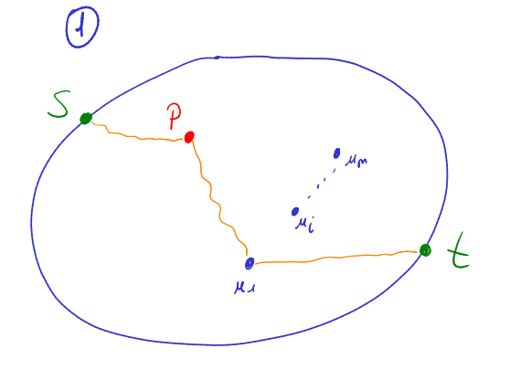
    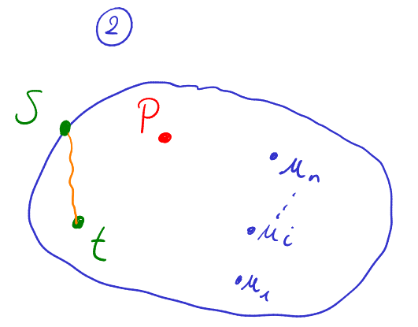
</div>

```
1.  BFS(G, s)
2.  BFS(G, t)
3.  z = arg(min(const(x))) // dove x è uno dei nodi uscita u
4.  d = d(s, t)
5.  if const(z) > d then
6.      return d
7.  else
8.      return const(z)
```

**Complessità Temporale**: Costo della BFS ovvero $O(n + m)$, lineare nella dimensione del grafo.

## Esercizio 2 del 18/07/2022

Si consideri il seguente gioco giocato su un grafo diretto $G = (V, E)$ con $n$ nodi ed $m$ archi. Una pedina è posizionata inizialmente su un nodo $s$. 
E' possibile spostare la pedina dalla posizione corrente, diciamo $u$, su un nodo $v$, se esiste un arco diretto $(u, v)\in E$ in $G$. Inoltre, c'è un insieme di nodi speciali $X\in V$. 
Se la pedina si trova su un nodo speciale $x\in X$ è possibile muovere la pedina anche lungo archi entranti in $x$, oltre quelli uscenti da $x$,
ovvero è possibile muovere la pedina da $x$ a $v$ se e solo se $(v, x)\in E$ o $(x, v)\in E$, o entrambi.
Progettare una algoritmo che in tempo $O(m + n)$ decide se, indipendentemente dalla posizione iniziale $s$, è sempre possibile spostare la pedina da $s$ a ogni altro nodo $t$ del grafo
con un'opportuna sequenza di mosse.

**Idea**:

L'idea è quella di creare un grafo ausiliario $G'$ dove per ogni nodo $x\in E$, se esiste l'arco $(u, x)$ (entrante) allora esiste anche l'arco $(x, u)$ (uscente).

<div style="margin-bottom: 200px">
    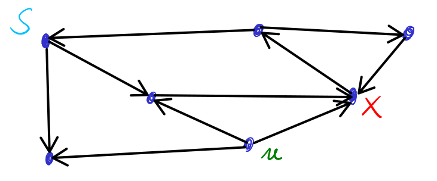
    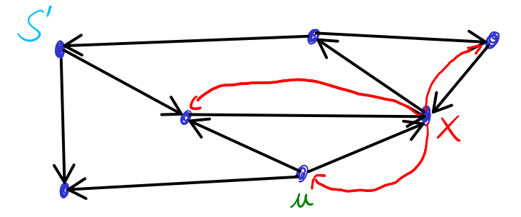
</div>

In questo caso il nodo $u$ nel grafo $G$ non è raggiungibile da $s$, ma lo è nel grafo $G'$, poiche viene aggiunto l'arco $(x, u)$.

**Proprietà**: Esiste una sequenza di mosse (cammino) che pemette di spostare la pedina da $s$ a ogni altro nodo in $G$ se e soltanto se esiste un cammino da $s$ a tutti gli altri 
nodi in $G'$.

**Complessità Temporale**: Costo di una visita BFS, $O(n + m)$, lineare nella dimensione del grafo.

## Esercizio 2 del 03/02/2020

La Mintendo ha finalmente rilasciato il gioco Super Ciano Bross. Nel gioco voi dovete aiutare Ciano, un strano tipo basso con eterni problemi di peso e diete e dimagrimenti.
Siete chiusi in un labirinto, un reticolo di cunicoli di diversa dimensione. Il labirinto è modellato come un grafo diretto e pesato $G = (V, E, w)$ di $n$ nodi ed $m$ archi,
dove i nodi rappresentano stanze e gli archi cunicoli che uniscono stanze. Per ogni arco $e$, il peso $w(e)$ è la larghezza del corrispondente cunicolo.
Alcune stanze, diciamo quelle corrispondenti ai nodi dell'insieme $U\subseteq V$ , contengono cibo. Ciano ha sempre fame e quando finisce in una stanza con del cibo lo
mangia senza pensarci due volte. Se Ciano mangia il cibo nella stanza speciale $u\in U$ , la sua dimensione diventa $c(u)$.
Lui inizialmente si trova nel nodo $s\in U$ e quindi, dopo aver mangiato, ha dimensione $c(s)$.
L'uscita è nel nodo $t$. Ciano può chiaramente attraversare solo archi/cunicoli il cui peso è maggiore o uguale alla sua dimensione attuale. 
Progettate un algoritmo – il più efficiente possibile – che aiuti Ciano a trovare, se c'è, un modo per uscire dal labirinto.

**Idea**:

Creare un grafo ausiliario $G'$ a livelli con $k$ livelli, uno per ciascun nodo $u_{i}\in U$ contente quantità di cibo $c(u_{i})$ diverso rispetto agli altri nodi.
Inoltre in ogni livello rimuovo i cunicoli (archi) con peso $\leq c(u_{i})$. In questo modo Ciano non potrà mai entrare in un cunicolo la quale larghezza è minore al suo peso.

Per trovare poi l'uscita dal labirinto, si può effettuare una visita DFS o BFS con costo $O(k(n + m))$ lineare nella dimensione del grafo.

<div style="margin-bottom: 250px">
    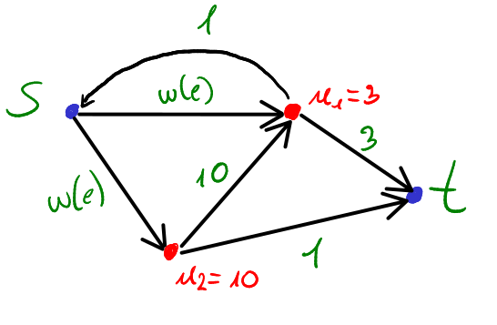
    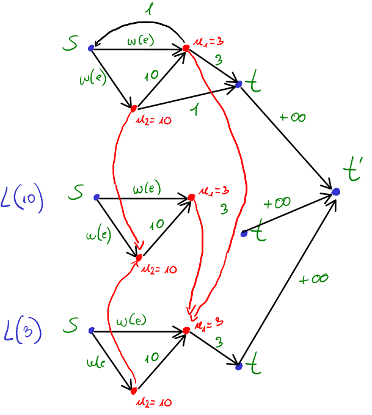
</div>

Come è strutturato $G^{'} = (V^{'}, E^{'})$:

**Nodi**:

- per ogni $v\in V$ ho $k + 1$ nodi in $G'$ con $k$ il numero di nodi speciali. Si ha quindi $v_{0}$, $v_{1}$, ..., $v_{k}$ 
- un nodo finale $T'$

**Archi**:

- Per ogni arco $(v, w)\in E$ dove $v\notin U$ ho archi del tipo $(v_{0}^{'}, w_{0}^{'}) <=> weight(v, w) \geq c(s)$
- Per ogni nodo $u\in U$ per ciascun livello aggiungo $k$ archi da $u$ verso il nodo nel $k-esimo$ livello corrispondente a $c(u_{k})$ con peso $w = c(u_{k})$ 
- Nel $k-esimo$ livello corrispondente a $u_{k}$ con valore $c(u_{k})$, tolgo gli archi con peso $<$ a $c(u_{k})$
- Infine, ho archi del tipo $(t_{i}, T^{'})$ con peso $+\infty$

**Costo di Costruzione di G^{'}**:

- $n^{'} = O((k+1)n) = \theta(nk)$
- $m^{'} = O(mk)$

$=> O(k(n + m))$

**Proprietà**: Esiste un cammino per Ciano da $s$ a $t$ in $G$ se e soltanto se esiste un cammino in $G'$ da $S'$ a $T'$.

## Esercizio 3 del 28/01/2019

La rete stradale su cui viaggiate è modellata con un grafo orientato e pesato $G = (V, E, w)$, dove il peso $w(u, v)$ di un generico arco $(u, v)\in E$ rappresenta il tempo di percorrenza dell'arco.
Voi siete su $s\in V$ e volete arrivare sul nodo $t\in V$ nel minor tempo possibile. 
La vostra macchina è equipaggiata con un moderno meccanismo di turbo. Se attivato lungo un arco, questo meccanismo permette di dimezzare il tempo di percorrenza dell’arco. 
Il meccanismo però può essere attivato una volta sola.

###### a) Mostrare che la soluzione migliore non consiste sempre nell’attivare il turbo lungo il cammino minimo in $G$ da $s$ a $t$.
###### b) Progettate un algoritmo efficiente che calcola una soluzione ottima, ovvero una strategia che vi porta a $t$ nel minor tempo possibile.

##### a)

<div style="margin-bottom: 10px;" align=center>
    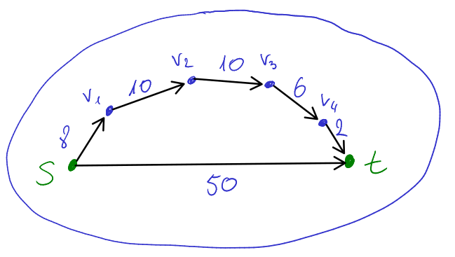
</div>

Sia $d_{1} = 36$ la lunghezza del cammino minimo da $s$ a $t$ passando per i nodi $v1, v2, v3, v4$.  
Sia $d_{2} = 50$ +la lunghezza del arco diretto da $s$ a $t$.  

- Se decidessimo di usare il turbo in $d_{1}$, scegliendo magari anche di usarlo sull' arco più lungo, per esempio sull'arco $(v_{1}, v_{2})$, otteremo un tempo $d_{1}' = 31$.  
- Se decidessimo di usare il turbo in $d_{2}$, otteremo un tempo $d_{2}' = 25$. 

Notiamo quindi che non è detto che è ottimale usare sempre il turbo nel cammino minimo, poiché usandolo nel cammino $d_{2}$ che non è minimo, ottieniamo $d_{2}' \leq d_{1}'$, quindi
è più effiente usare il turbo nel cammino non minimo $d_{2}$.

##### b)

**Idea**:

L'idea è creare un grafo ausiliario $G'$ a livelli, precisamente con 2 livelli. Poi mediante l'algoritmo di Dijkstra andremo a trovare il cammino minimo da $s$ a $t$.

<div style="margin-bottom: 250px">
    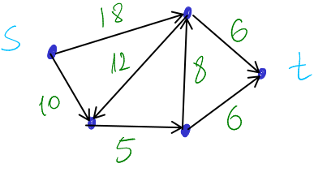
    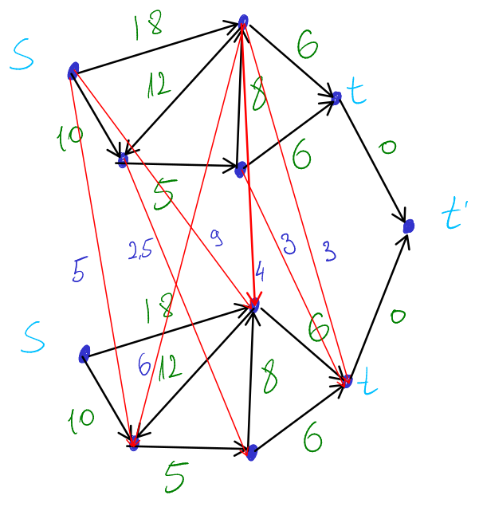
</div>


Come viene creato il grafo $G^{'} = (V^{'}, E^{'})$

**Nodi**

- $|V^{'}| = 2|V| => V^{'} = V_{1}^{'} + V_{2}^{'}$
- un nodo finale $T'$ 

**Archi**:

- per ogni arco $(u, v)$ in $G$ ho l'arco $(u_{1}^{'}, v_{1}^{'})$ in $G^{'}$ con peso $w(u, v)$
- per ogni arco $(u, v)$ in $G$ ho l'arco $(u_{1}^{'}, v_{2}^{'})$ in $G^{'}$ con peso $\frac{w(u, v)}{2}$
- due archi $(t_{1}^{'}, T^{'})$ e $(t_{2}^{'}, T^{'})$ con peso 0

**Proprietà**: Esiste un cammino minimo in $G$ da $s$ a $t$ usando solo una volta il turbo se e soltanto se esiste un cammino minimo da $S'$ a $T'$ in $G'$.

**Costo di Costruzione di G'**:
- $n^{'} = 2\cdot n + 1 = \theta(n)$
- $m^{'} = 3\cdot m + 2 = \theta(m)$

$=> O(n + m)$

**Complessità Temporale**: $O(m + nlog(n))$, ovvero il costo dell'algoritmo di Dijkstra.


## Esercizio 2 del 10/09/2019

Sei un topo che si aggira per i cunicoli di Sogene, dove, fra le altre cose, hai seguito il corso di algoritmi e strutture dati.
Con le tue competenze hai modellato Sogene come un grafo non orientato e pesato $G = (V, E, w)$ di $n$ nodi ed $m$ archi,
dove i nodi rappresentano stanze e gli archi cunicoli che uniscono stanze. Per ogni arco e, il peso $w(e)$ è la larghezza del corrispondente cunicolo.

Tu sei largo $L$ e puoi attraversare solo archi il cui peso è almeno $L$. Alcuni nodi contengono del formaggio. Sia $U\in V$ l'insieme di tali nodi. 
Ora, tu sei nel nodo $s$, devi recuperare un (singolo) pezzo di formaggio in uno dei nodi di $U$ e tornare nella tana al nodo $t$.
Devi stare attento, perchè una volta recuperato il formaggio la tua dimensione aumenta da $L$ a $L' > L$.

Progetta un algoritmo (possibilmente con complessità temporale lineare) che è in grado di dire se c'è un modo di portare un pezzo di formaggio in $t$.


