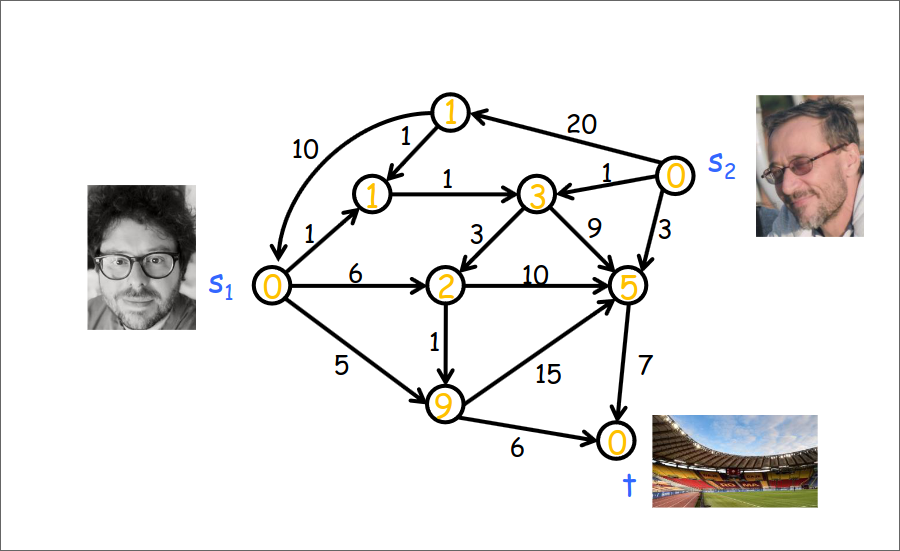
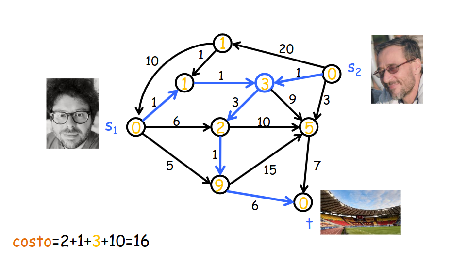
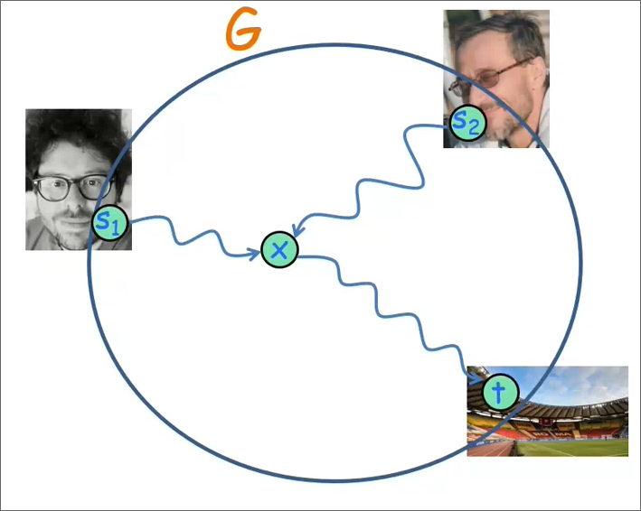

# Esercitazione sui grafi

## 1. Gualà e Clementi vanno allo stadio

Una città è modellata come un grafo diretto e pesato $G = (V, E, w)$, dove ogni arco $e$ è associato un peso $w(e) \geq 0$
che rappresenta il costo, in termini di costo di benzina consumata, per attraversare l'arco (strada) $e$. In questa 
città, i vostri docenti del corso di algoritmi, Gualà e Clementi, vogliono andare a vedere la partita della Roma allo 
stadio, che si trova nel nodo $t$. Loro sono rispettivamente nei nodi $s_{1}$ e $s_{2}$, e possiedono una macchina 
ciascuno. Volendo, possono incontrarsi in un nodo del grafo, parcheggiare un delle due macchine, e proseguire insieme. 
Ma di solito in questa città, parcheggiare costa. Per ogni nodo $v$, dunque, conoscono il costo $c(v)$ del parcheggio
presente in $v$ (si può assumere per semplicità che $c(s_{1}) =$ $c(s_{2}) =$ $c(t) = 0$). Progettare un algoritmo 
che in tempo $O(m + n\cdot log(n))$ calcoli la soluzione che Gualà e Clementi devono adottare per spendere
complessivamente il meno possibile in termini di corso della benzina più costo del parcheggio.





**Idea**: "Indovinare" il nodo $x$ dove Gualà e Clementi si incontrano per lasciare una macchina.

$cost(x) = d(s_{1}, x) + d(s_{2}, x) + c(x) + d(x, t)$, costo totale se Gualà e Clementi parcheggiano una macchina in $x$.

**Osservazione**: $cost(x)$ è disponibile in tempo costante se ho tutte le distanze a singola sorgente da $s_{1}$, 
$s_{2}$, e $t$.



E' corretto perche provo tutti i nodi $x$, e caloco le distanze minime.
L'unico problema è come calcolare in tempo lineare $d(x, t)$, poichè bisobnerebbe fare Dijkstra per ciacun nodo $x$. 
Per calcolare queste distanze in tempo lineare, l'idea è quella di prendere il grafo $G$, girare gli archi e fare 
Dijkstra dal nodo $t$ verso tutti gli altri nodi.

```
CamminiStadio(Grafo G)
    Dijkstra(G, s1) // calcolo SPT con sorgente s1
    Dijkstra(G, s2) // calcolo SPT con sorgente s2
    Dijkstra(G, t)  // calcolo SPT con sorgente t 
    z = arg(min(cost(x))) // per ogni nodo x
    return cost(z) // d(s1, z) + d(s2, z) + c(z) + d(z, t)
```
