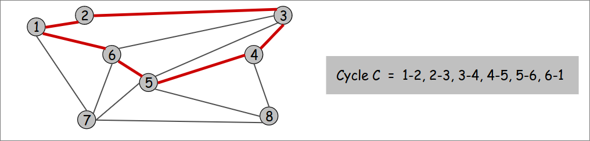
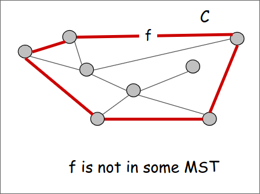
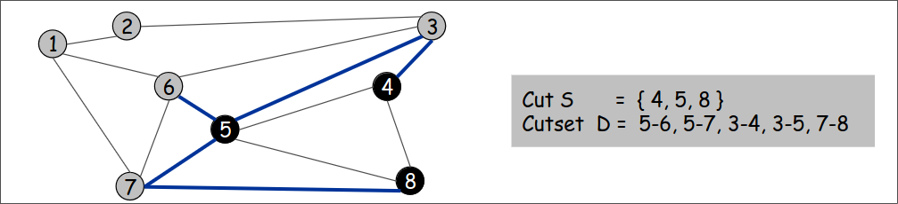
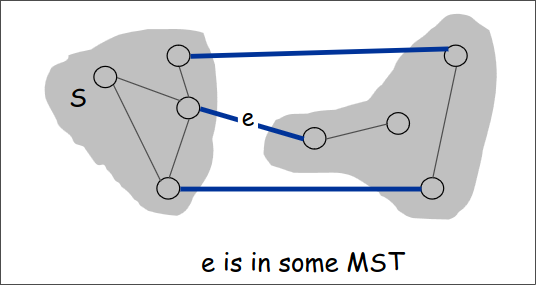
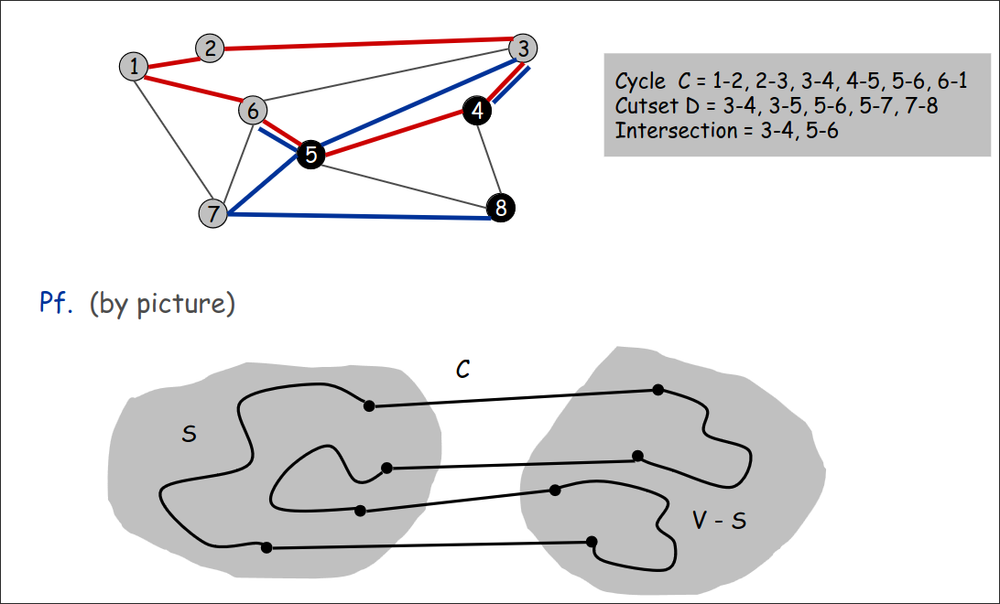
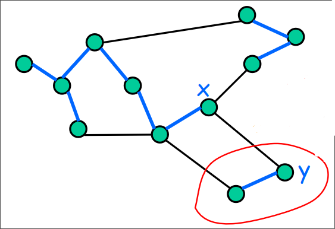

# Minimum Spanning Tree

- Input
Un grafo $G = (V, E)$ pesato e connesso non orientato, con valori reali dei pesi $c_{e}$

- Soluzione ammisibile
Un `Spanning Tree` di $G$ è un albero $T = (V, F)$ con $T \subseteq E$ tale che i vertici raggiungono tutti i nodi del grafo.

- Misura (da minimizzare)
Il costo totale dei pesi dell'albero T, ovvero $c(T) = \sum_{e\in T}c_{e}$

> [!IMPORTANT]
> Se $G$ ha pesi diversi per ciascun arco, l' MST è unico. In generale, se i pesi sono anche uguali, ci sono $n^{n-2}$ MST di un 
> grafo con $n$ nodi (Teorema di Cayley).

### Cycle
Un **ciclo** è un cammino chiuso nel grafo del tipo `a-b, b-c, ...., y-z, z-a`.



> [!IMPORTANT]
> Cycle property: Sia $C$ un ciclo, e sia $f$ l'arco di costo massimo appartenente a $C$. Allora esiste un MST $T^{\star}$ che non contiene $f$.
> Dim.  
> - Supponiamo che $f$ appartiene a $T^{\star}$.
> - Cancellando $f$ da $T^{\star}$, si crea un cut $S$ in $T^{\star}$.
> - L'arco $f$ sta sia nel ciclo $C$ e sia nel cutset $D$ corrsipondente a $S$. Allora esiste un altro arco, $e$ che sta sia in $C$ che in $D$.
> - $T^{'} = T^{\star} \cup ( e ) - ( f )$ è ancora uno spanning tree.
> - Siccome $c_{e} \leq c_{f} => cost(T^{'}) \leq cost(T^{\star})$.
> - Allora $T^{'}$ è un MST che non contiene $f$.



### Cut
Il **cut** è un sottoinsieme di nodi $S$. (Definito anche come una partizione di $V$: $S$ e $V - S$).
Il **cutset** $D$ di un cut $S$ è un sottoinsieme di archi con un nodo in $S$ e un nodo in $V - S$.



> [!IMPORTANT]
> Cut property: Sia $S$ un sottoinsieme di nodi, e sia $e$ l'arco di costo minimo con un nodo in $S$ e un nodo in $V - S$. Allora 
> esiste un MST $T^{\star}$ contenente $e$.
> Dim.  
> - Supponiamo che $e$ non appartiene a $T^{\star}$.
> - Aggiungendo $e$ a $T^{\star}$ crea un ciclo $C$ in $T^{\star}$.
> - L'arco $e$ appartiene sia a $C$ che al cutset $D$ corrsipondente a $S$, allora esiste un altro arco, $f$ che appartiene sia a $C$ che a $D$.
> - $T^{'} = T^{\star} \cup ( e ) - ( f )$ è ancora uno spanning tree.
> - Siccome $c_{e} \leq c_{f} => cost(T^{'}) \leq cost(T^{\star})$.
> - Allora $T^{'}$ è un MST contenente $e$.



> [!IMPORTANT]
> L'intersezione tra un ciclo e un cutset contiene un numero pari di vertici.



Partendo da una nodo in S, esiste un arco per passare da $S$ a $V - S$. Avendo un ciclo C, allora esiste un arco per 
passare da $V - S$ a $S$. Di conseguenza, ci sono almeno 2 archi nell'intersezione. In generale ci sono $2\cdot k$ archi nell'intersezione.

## 1. Algoritmo di Kruskal

Considera gli archi ordinati in modo crescente in base al costo. Aggiungi a $T$, che inizialmente è un albero vuoto, gli archi 
finchè non si crea un ciclo.

Per implementare in modo efficiente l'algoritmo di Kruskal, si usa la struttra dati `Union-Find`, perché:
- Per mantenere le componenti connessi delle soluzioni correnti-
- Per controllare se l'arco corrente forma un ciclo (con la soluzione corrente).

```
Kruskal(graph G=(V, E, c))
    UnionFind UF 
    Sia T un albero vuoto
    ordina gli archi in modo crescente in base ai costi
    for each vertex v do UF.makeset(v)
    for each edge (x, y) do 
        set_x = UF.find(x)
        set_y = UF.find(y)
        if set_x != set_y then 
            UF.union(set_x, set_y)
            aggiungi l'arco (x, y) a T
    return T
```

**Correttezza**: 



- Prendiamo in considerazione il cut $S$ di vertici appartenenti alla stessa componente connessa di $y$. 
- Dato che l'algoritmo guarda i vertici in ordine crescente, per collegare $S$ a $V - S$, l'algoritmo andrà a prendere l'arco (x,y) di costo minimo che attraversa il cut (`cut property`). 

**Complessità Temporale**:

- Ordinare gli archi costa: $O(m log m) = O(m log n)$
- Operazioni sulla Union-Find: 
    - $n$ `makeset`
    - $n - 1$ `union`
    - $m$ `find`
- Usando QuickFind con l'euristica *union by size*: $O(m log n + m + n log n) = O(m log n)$
- Usando QuickUnion con l'euristica *union by size*: $O(m log n + m log n + n) = O(m log n)$


## 2. Algoritmo di Prim 

Parti da un nodo sorgente $s$ e ad ogni passo aggiungi all'albero $T$ il minimo arco $e$ di tutti gli archi che hanno un nodo in $T$ e un nodo fuori da $T$.

L'algoritmo di Prim si può implementare in maniera semplice ma inefficiente in questo modo:
- Per $n - 1$, trova il minimo arco che attraversa il il cut definito dall'albero corrente in $O(m)$.
- In totale, $O(nm)$.

Un'implementazione migliore consiste nel:
- Mantenere un insieme di nodi esplorati $S$.
- Usare una coda con priorità per mantenere i nodi non esplorati.
- Per ogni nodo non esplorato $v$, la priorità di ciascun elemento è `a[v]`: il minimo costo dell'arco incidente $v$ avente l'altra estremità in $S$.


```
Prim(G, s)
    for each vertex v do a[v] = inf 
    a[s] = 0
    Sia Q una coda con priorità
    Sia S un insime vuoto
    Sia T un albero con root s
    for each vertex v do 
        Q.insert(a[v], v)

    while(not Q.isEmpty())
        u = Q.deleteMin()
        aggiunge u a S
        for each (e = arco(u,v) incidente a u)
            if((v non è in S) and (w(e) < a[v]))
                rendi u genitore di v in T
                delta = w(e) - a[v]
                Q.decreaseKey(v, delta)
    
    return T
```
**Correttezza**: E' un immediata conseguenza della cut property, che viene usata esattamente $n - 1$ volte.


**Complessità Temporale**:  
- $O(m + n)$ più il costo delle operazioni sulla coda con priorità.
- $n$ `insert`, $n$ `deleteMin`, $m$ `decreaseKey`
- Con un un d-heap o heap binomiale: $O(m log n)$.
- Con gli heap di Fibonacci: $O(m + n log n)$.

## Clustering

> [!IMPORTANT]
> Dato un insieme $U$ di $n$ oggetti (foto, video, documenti) etichettati $p_{1}$, ..., $p_{n}$, un **clustering** è una classificazione in gruppi coerenti.

> [!IMPORTANT]
> Una funzione distanza, specifica quanto sono vicini due oggetti.
> In generale, le funzioni di distanza soddisfano determinate proprietà, tipo:
> - $d(p_{i}, p_{j}) = 0 <=> p_{i} = p_{j}$: **identità dei indiscernibili**.
> - $d(p_{i}, p_{j}) \geq 0$: **non negatività**
> - $d(p_{i}, p_{j}) = d(p_{j}, p_{i})$: **simmetria**  

> [!IMPORTANT]
> - **K-Clustering** classifica gli oggetti in $k$ gruppi non vuoti.  
> - **Spacing**: distanza minima fra coppie di oggetti in cluster diversi.
> - Dato un intero $k$, trovare il k-clustering di spacing massimo.

```
Single-Linkage_k-clustering(set U)
    Crea un grafo G=(V, E), dove V = U, corrsipondente a n clusters
    Trova la coppia di oggetti più vicini tale che ciascun oggetto appartiene a un cluster diverso, e aggiungi un arco tra loro
    Ripeti n-k volte finché non trovi esattamente k clusters
```

> [!NOTE]
> - Si osserva facilmente che questa provedura è esattamente l'algoritmo di Kruskal (con eccezzione che ci fermiamo quando ci sono k componenti connesse).  
> - La provedura è equivalente a trovare un MST e trogliere gli $k - 1$ archi costosi.
> - Eseguendo l'algoritmo di Kruskal fino alla fine produce implicitamente una Gerarchia di Clustering, ovvero un k-clustering per 
> ogni $k = n$, $n-1$, ..., $1$.


