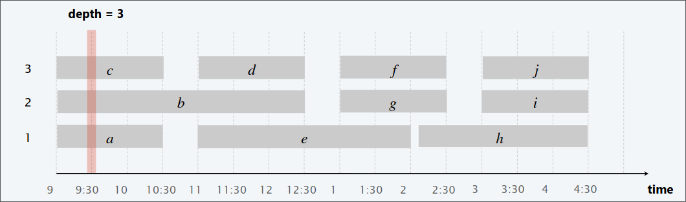

# 1. Interval Scheduling

Il problema consiste nel trovare un algoritmo che dato un insieme di 
task, ognuno caratterizato da un intervallo di tempo, selezionare un 
sottoinsieme massimale di questi task compatibili tra loro per poterli 
svolgere.

**Input**:
- Un insieme di $n$ intervalli $I_{1}$, ..., $I_{n}$.
- L'intervallo $I_{i}$ ha tempo iniziale $s_{i}$ e tempo finale $f_{i}$.

**Soluzione Ammissibile**:
- Un sottoinsieme $S$ di intervalli mutualmente compatibili, tale che 
  $\forall I_{i}, I_{j} \in S$, $I_{i}$, non si sovrappone con $I_{j}$.

**Misura (da massimizzare)**:
- La misura da tenere in considerazione è la cardinalità di $S$, ovvero 
  il numero di intervalli da schedulare.


## Approccio Greedy (Goloso)

Considera i task in qualche ordine naturale. Aggiungi ad $S$ solo i task 
compatibili con quelli già presenti in $S$.

Come decidere in quale ordine prendere i task? Ci sono 4 possibilità:

1. **[Earliest start time]**, ovvero considera i task in ordine crescente di $s_{i}$ (tempo iniziale).
2. **[Earliest finish time]**, ovvero considera i task in ordine crescente di $f_{i}$ (tempo finale).
3. **[Shortest interval]**, ovvero considera i task in ordine crescente di $f_{i} - s_{i}$.
4. **[Fewest conflicts]**, per ogni task $i$, conta il numero di task in 
conflitto $c_{i}$. Schedula in ordine crescente di $c_{i}$.
2

Di questi 4, quale andremo a utilizzare? Andiamo per esclusione


Quindi, come possiamo osservare, andando per esclusione è rimasto solo 
earliest finish time.

```
IntervalScheduling(Tasks)
    Sort Task, in funzione dei tempi di fine 
    Sia S un insieme vuoto
    for i = 1 to n do 
        if(Tasks[i] è compatibile con S)
            aggiungi a S Tasks[i]
    return S
```
**Complessità Temporale**: $T(n) = O(n log n)$.

- Ordiniamo i task in tempo $O(n log n)$. 
- Per effettuare il controllo della compatibilità con $S$ in tempo costante, possiamo tener traccia di $j^{\star}$, ovvero dell'ultimo taskaggiunto a $S$. L' $i-esimo$ task è compatibile con $S$ se solo se $s_{i} \geq f_{j^{\star}}$.

**Correttezza**:

Siano $i_{1}$, $i_{2}$, ..., $i_{k}$ un insieme di task selezionati dall'
algoritmo greedy (ordinati per tempo finale).
Siano $j_{1}$, $j_{2}$, ..., $j_{m}$ un insieme di task di una soluzione 
ottima (ordinati per tempo finale).

Denotiamo con $f(i_{r})$, il tempo di fine del task $i_{r}$.

> [!IMPORTANT]
> Lemma. $\forall r = 1, 2, ..., k$ abbiamo $f(i_{r}) \leq f(j_{r})$  
> Dim: (Per Induzione)
> - $r = 1 =>$ Ovvio
> Osserviamo che il primo task dell'algoritmo greedy finisce prima del primo task del ottimo. Questo perchè i task sono ordinati in modo crescente per tempo finale, e il greedy va a scegliere il più piccolo in assoluto. 
> - $r > 1$
> Supponiamo vera per $r - 1$ la proprietà, ovvero $f(i_{r-1}) \leq f(j_{r-1})$. Adesso l'ottimo sceglie il task $j_{r}$, che a sua volta è compatibile con gli $r-1$ task selezionati dal greedy. Quindi il greedy, avendo i task ordinati per finish time, per forza andrà a guardare task con $f(i_{r}) \leq f(j_{r})$ andando a selezionare o uno che finisce prima, quindi $f(i_{r})$ oppure proprio $f(j_{r})$.


> [!IMPORTANT]
> Teorema. L'algoritmo "earliest-finish-time-first" è ottimale.  
> Dim (Per Assurdo)
> - Siano $i_{1}$, $i_{2}$, ..., $i_{k}$ un insieme di task selezionati dall'algoritmo greedy (ordinati per tempo finale)
> - Siano $j_{1}$, $j_{2}$, ..., $j_{m}$ un insieme di task di una soluzione ottima (ordinati per tempo finale)
> - Assumiamo che il greedy non è ottimo, allora $m > k$
> Applicando il lemma, con $r = k$, otteniamo che $f(i_{k}) \leq f(j_{k})$. Siccome $m > k$, significa che l'ottimale sceglie un 
> task $k + 1$, che inizia dopo la fine di $j_{k}$, e anche dopo che finische $i_{k}$ (per il lemma). Di conseguenza il task $j_{i + k}$ è compatibile anche con i task selezionati dal greedy, perciò per definizione anche il greedy deve selezionare il task $j_{k + 1}$, ottenendo quindi un insieme di task ottimale, dimostrando quindi che il greedy è ottimo.

# 2. Interval Partitioning

**Input**
- Un insieme $n$ di intervalli $I_{1}$, ..., $I_{n}$
- L'intervallo $I_{i}$ ha tempo di inzio $s_{i}$ e tempo di fine $f_{i}$

**Soluzione Ammissibile**
- Una partizione di sottoinsiemi di intervalli (chiamati classi) $C_{1}$, ..., $C_{d}$, tale che ogni $C_{i}$ contiene intervalli
  mutualmente compatibili.

**Misura (da minimizzare)**
- il numero di classi


## Approccio Greedy (Goloso)

Consideriamo i task in un ordine naturale. Assegna ciascun task ad una classe (poi vedremo come); alloca una nuova classe se 
nessuna è disponibile.

Come decidere in quale ordine prendere i task? Ci sono 4 possibilità:

1. **[Earliest start time]**, ovvero considera i task in ordine crescente di $s_{i}$ (tempo iniziale).
2. **[Earliest finish time]**, ovvero considera i task in ordine crescente di $f_{i}$ (tempo finale).
3. **[Shortest interval]**, ovvero considera i task in ordine crescente di $f_{i} - s_{i}$.
4. **[Fewest conflicts]**, per ogni task $i$, conta il numero di task in conflitto $c_{i}$. Schedula in ordine crescente di $c_{i}$.

Di questi 4, quale andremo a utilizzare? Andiamo per esclusione


Quindi, come possiamo osservare, andando per esclusione è rimasto solo earliest start time.

```
IntervalPartitioning(Tasks)
    sort tasks in funzione dei tempi di inizio
    classes = 0
    for i = 1 to n do 
        if(Tasks[i] è compatibile con una qualunque classe)
            schedula il Tasks[i] in una qualunque classe k 
        else 
            alloca un nuova classe d + 1
            schedula il Tasks[i] nella classe d + 1
            d = d + 1
    return schedule
```
**Complessità Temporale**: $T(n) = O(n log n)$ se:
- Ordinare in funzione del tempo di inizio in $O(n log n)$.
- Possiamo memorizzare le classi in una coda con priorità, con chiave il tempo di fine di ciascun task.
    - per allocare una nuova classe, `INSERT` la nuova classe nella coda con priorità.
    - per schedulare il $j - esimo$ task nella classe $k$, `INCREASE-KEY` della classe $k$ a $f_{j}$.
    - per determinare se il $j - esimo$ task è compatibile con una qualunque classe, confrontare $s_{j}$ con `FIND-MIN`.
- Il numero totale di operazioni sulla coda con priorità è $O(n)$, ognuna di queste con tempo di esecuzione $O(log n)$.

> [!IMPORTANT]
> DEF: La **profondità** di un insieme di intervalli aperti è il numero massimo di intervalli che contengono un dato punto.



> [!NOTE]
> Il numero di classi necessarie $\geq$ profondità, inoltre l'algoritmo schedula i task in un numero di classi uguale alla profondità.

> [!NOTE]
> L'algoritmo non schedula mai due incompatibili task nella stessa classe.

> [!IMPORTANT]
> Teorema: L'algoritmo greedy è ottimale.
> - Sia $d$ il numero di classi che l'algoritmo alloca
> La classe $d$ è aperta perchè dobbiamo schedulare il $j-esimo$ task, che è incompatibile con tutti i task allocati nelle $d - 1$ classi.
> Quindi ogni $d$ task finisce dopo $s_{j}$.
> Dato che abbiamo ordinato in funzione del tempo di inizio, ognuno di questi task incompatibili iniziano prima di $s_{j}$.
> Dunque, abbiamo $d$ task che si sovrappongono al tempo $s_{j} + \varepsilon$.
> Di conseguenza, si usano al più $d$ classi.


