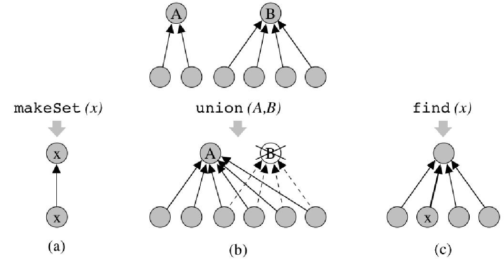

# Struttura Dati Union Find

Mantenere una **collezione di insiemi disgiunti** contenenti elementi distinti (ad esempio interi) durante l'esecuzione di una 
sequenza di operazioni del seguente tipo:
- `makeSet(x)`: crea il nuovo insieme `x = {x}` di nome `x`.
- `union(A, B)`: unisce gli insiemi `A` e `B` in un unico insieme, di nome `A` e distrugge i vecchi insiemi (si suppone di accedere
direttamente ai due insiemi).
- `find(x)`: restituisce il nome dell'insieme a cui appartiene `x` (si suppone di accedere direttamente a `x`).


> [!NOTE]
> Con $n$ elementi posso fare al più $n - 1$ `union`

## 1. QuickFind

Usiamo una foresta di alberi di altezza 1 per rappresentare gli insiemi disgiunti. In ogni albero:
- La `root` rappresenta il nome dell'insieme
- Le `foglie` rappresentano gli elementi dell'insieme, **incluso** l'elemento rappresetativo il cui valore è nella radice è da 
il nome all'insieme.

```
classe QuickFind implementa UnionFind:
dati: 
    una collezione di insiemi disgiunti di elementi elem; ogni insieme ha un nome name.

operazioni:
    makeSet(elem e)
        crea un nuovo albero, composto da due nodi: una radice ed un unico figlio (foglia). 
        Memorizza e sia nella foglia dell'albero che come nome della radice.

    union(name a, name b)
        considera l'albero A corrispondente all'insieme di nome a, e l'albero B corrispondente all'insieme di nome b, 
        Sostituisci tutti i puntatori dalle foglie di B alla radice di B con puntatori alla radice di A. Cancella la 
        vecchia radice di B

    find(elem e) -> name
        accede alla foglia x corrispondente all'elemento e. Da tale nodo segue il puntatore al padre, che è la radice dell'albero,
        e restituisce il nome memorizzato in tale radice.
```


**Complessità Temporale**: 
- `makeSet(elem e) e find(elem e)` richiedono tempo costante $O(1)$.
- `union(name a, name b)` richiede tempo lineare $O(n)$.

> [!NOTE]
> Inoltre a noi interessa il tempo di esecuzione di seguenze di union, ed esistono alcune sequenze molto inefficienti che richiedono tempo $\theta(n^2)$.


