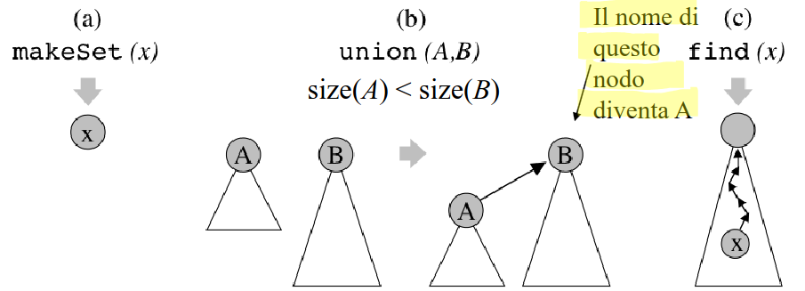

# Struttura Dati Union Find

Mantenere una **collezione di insiemi disgiunti** contenenti elementi distinti (ad esempio interi) durante l'esecuzione di una 
sequenza di operazioni del seguente tipo:
- `makeSet(x)`: crea il nuovo insieme `x = {x}` di nome `x`.
- `union(A, B)`: unisce gli insiemi `A` e `B` in un unico insieme, di nome `A` e distrugge i vecchi insiemi (si suppone di accedere
direttamente ai due insiemi).
- `find(x)`: restituisce il nome dell'insieme a cui appartiene `x` (si suppone di accedere direttamente a `x`).


> [!NOTE]
> Con $n$ elementi posso fare al più $n - 1$ `union`

## 1. QuickFind

Usiamo una foresta di alberi di altezza 1 per rappresentare gli insiemi disgiunti. In ogni albero:
- La `root` rappresenta il nome dell'insieme
- Le `foglie` rappresentano gli elementi dell'insieme, **incluso** l'elemento rappresetativo il cui valore è nella radice è da 
il nome all'insieme.

```
classe QuickFind implementa UnionFind:
dati: 
    una collezione di insiemi disgiunti di elementi elem; ogni insieme ha un nome name.

operazioni:
    makeSet(elem e)
        crea un nuovo albero, composto da due nodi: una radice ed un unico figlio (foglia). 
        Memorizza e sia nella foglia dell'albero che come nome della radice.

    union(name a, name b)
        considera l'albero A corrispondente all'insieme di nome a, e l'albero B corrispondente all'insieme di nome b, 
        Sostituisci tutti i puntatori dalle foglie di B alla radice di B con puntatori alla radice di A. Cancella la 
        vecchia radice di B

    find(elem e) -> name
        accede alla foglia x corrispondente all'elemento e. Da tale nodo segue il puntatore al padre, che è la radice dell'albero,
        e restituisce il nome memorizzato in tale radice.
```


**Complessità Temporale**: 
- `makeSet(elem e) e find(elem e)` richiedono tempo costante $O(1)$.
- `union(name a, name b)` richiede tempo lineare $O(n)$.

> [!NOTE]
> Inoltre a noi interessa il tempo di esecuzione di seguenze di union, ed esistono alcune sequenze molto inefficienti che richiedono tempo $\theta(n^2)$.

### Euristica *union by size*

L'idea è di fare in modo che un nodo/elemento non cambi troppo spesso padre, quindi nell'unione di degli insiemi $A$ e $B$, attacchiamo gli elementi 
dell'insieme di **cardinalità minore a quello di cardinalità maggiore**, e se necessario modifichiamo la radice dell'albero ottenuto (per aggiornare il nome).
Ogni insieme mantiene esplicitamente anche la propria size (numero di elementi)

```
classe QuickFind implementa UnionFind:
dati: 
    una collezione di insiemi disgiunti di elementi elem; ogni insieme ha un nome name.

operazioni:
    makeSet(elem e)
        crea un nuovo albero, composto da due nodi: una radice ed un unico figlio (foglia). 
        Memorizza e sia nella foglia dell'albero che come nome della radice. Inizializza la cardinalità del nuovo 
        insieme ad 1, assegnando il valore size(x) = 1 alla radice x

    union(name a, name b)
        considera l'albero A corrispondente all'insieme di nome a, e l'albero B corrispondente all'insieme di nome b, 
        Se size(A) >= size(B), muovi tutti i puntatori dalle foglie di B alla radice di A, e cancella la vecchia radice di B.
        Altrimenti (size(B) > size(A)) memorizza nella radice di B il nome di A, muovi tutti i puntatori dalle foglie di A alla radice di B, 
        e cancella la vecchia radice A. In entrambi i casi assegna al nuovo insieme la somma delle cardinalità dei due insiemi originali
        (size(A) + size(B))
        
    find(elem e) -> name
        accede alla foglia x corrispondente all'elemento e. Da tale nodo segue il puntatore al padre, che è la radice dell'albero,
        e restituisce il nome memorizzato in tale radice.
```

**Complessità Temporale**  
Vogliamo dimostrare che se eseguiamo $m$ `find`, $n$ `makeSet`, e al più $n - 1$ `union`, il tempo richiesto dall'intera sequenza di operazioni è 
$O(m + n log n)$

> [!IMPORTANT]
> Dim:  
> - E' facile vedere che `find` e `makeSet` richiedono tempo $\theta(m + n)$
> - Per analizzare le operazioni di `union`, ci concentriamo su un singolo nodo/elemento e dimostriamo che il tempo speso per tale nodo è $O(log n) =>$ in totale, tempo speso è $O(n log n)$.
> - Quando eseguiamo una `union`, per ogni nodo che cambia padre pagheremo tempo costante
> Osserviamo ora che ogni nodo può cambiare al più $O(log n)$ padri, poiché ogni volta che un nodo cambia padre la cardinalità dell'insieme al quale 
> apparterrà è **almeno doppia** rispetto a quella dell'insieme cui apparteneva!
>   - all'inizio un nodo è in un insieme di dimensione 1
>   - poi se cambia padre in un insieme di dimensione almeno 2
>   - all' $i-esimo$ cambio è in un insieme di dimensione almeno $2^i$
> - Di conseguenza il tempo speso per un singolo nodo sull'intera sequenza di $n$ `union` è $O(log n)$
> L'intera sequenza di operazioni costa: $T(n) = O(m + n + n log n) = O(m + n log n)$


# 2. QuickUnion

Usiamo una foresta di alberi di altezza anche maggiore di 1 per rappresentare gli insiemi disgiunti. In ogni albero:
- `root`: elemento rappresetativo dell'insieme
- `Rimanenti nodi`: altri elementi dell'insieme (**escluso** l'elemento nella radice)


**Complessità Temporale**: 
- `makeSet(elem e) e `union(name a, name b)` richiedono tempo costante $O(1)$.
- `find(elem e)` richiede tempo lineare $O(n)$.

> [!NOTE]
> Inoltre particolari sequenze di 'union' possono generare un albero di altezza lineare, e quindi la `find` è molto inefficiente, infatti se eseguiamo 
> $n$ `makeSet` $n - 1$ `union`, seguite da $m$ `find`, il tempo richiesto dall'intera sequenza di operazioni è $O(n + n - 1 + m \cdot n) = O(m\cdot n)$.

## Euristica *union by size*

L'idea è di fare in modo che per ogni insieme, l'albero corrispondente abbia altezza piccola. Quindi nell'unione degli insiemi $A$ e $B$, rendiamo la 
radice dell'albero **con meno nodi** figlia della radice dell'albero **con più nodi**



> [!IMPORTANT]
> Lemma: Con la union by size, dato un albero QuickUnion con size (numero di nodi) $s$ e altezza $h$ vale che $s \geq 2^h$.

Di conseguenza l'operazione `find` richiede tempo $O(log n)$, quindi l'intera sequenza di operazioni costa $O(n + mlogn)$.

## Euristica *compressione dei cammini*

Idea: quando eseguo `find(x)` e attraverso il cammino da $x$ alla radice, comprimo il cammino, ovvero rendo tutti i nodi del cammino, figli della radice.
In questo modo, anche se la prima `find(x)` avrà un costo maggiore, le successive `find` costeranno di meno.


> [!IMPORTANT]
> Teorema (Tarjan e Leeuwen)  
> Usando in QuickUnion le euristiche di *union by rank* o *union by size* e compressione dei cammini, una qualsiasi sequenza di $n$ `makeSet`, 
> $n - 1$ `union` e $m$ `find` hanno un costo di $O(n + m \cdot \alpha(n +m, n))$.

Dove $\alpha(x, y)$ è la funzione inversa della funzione di Ackermann. E' una funzione lentissima infatti $\alpha(m, n) \leq 4$ per ogni scopo pratico,
(ovvero, per valori ragionevoli di $n$.
