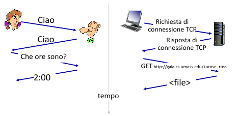
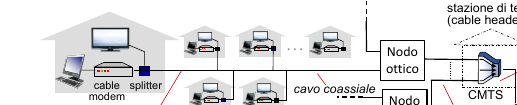
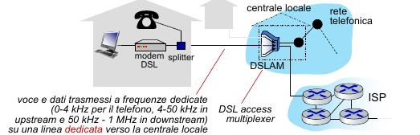
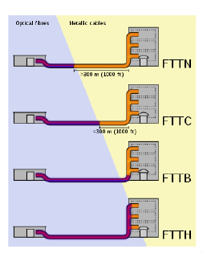
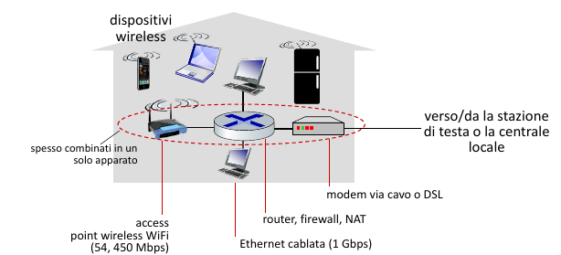

# Introduzione

## Cos'è Internet? (Rete di reti)

- E' un insieme di miliardi di **dispositivi di calcolo** connessi (host = end system), e sono gli host che eseguono le applicazioni di rete ai confini di internet (edge). Gli host sono di due tipi:
    - client: host che richiedono servizi
    - server: host che erogano servizi
- E' un insieme di **commutatori di pacchetti** (packet switches): inoltrano i pacchetti router (a livello di rete), switch (a livello di collegamento)
- E' un insieme di **reti di collegamenti**: Fibra, rame, radio; ognuna di queste avendo prestazioni diverse (transmission rate) 
- Infine è un insieme di **reti**: collezione di dispositivi, router, collegamenti gestiti da un'organizzazione.

> [!IMPORTANT]
> Quindi internet è una rete di reti, ovvero tante reti interconnessi tramite ISP (Internet Service Provider, come TIM, Telecom, etc...).

A livello di "servizi", Internet è un' **infrastruttura** che fornisce servizi alle applicazioni (web, streaming, e-commerce, gaming, etc...).
Inoltre fornisce un un' **interfaccia di programmazione** alle applicazioni distribuite:
- "hook" che consentono alle applicazioni mittente/destinataria di "connettersi", usare il servizio di trasporto Internet
- fornisce molte opzioni di servizio analogamente al servizio postale.

## Cos'è un protocollo

> [!IMPORTANT]
> Un **protocollo** definisce il **formato** e l' **ordine dei messaggi scambiati** tra due o più entità in comunicazione, così come le **azioni intraprese** in fase di trasmissione e/o di ricezione di un messaggio o di un altro evento.

## Reti di accesso

- reti di accesso residenziali
- redi di accesso aziendale (scuole, aziende)
- redi di accesso mobile (WiFi, 4G/5G)

> [!IMPORTANT]
> L' **edge router** è il primo router sul percorso dal sistema d'origine a un qualsiasi altro sistema di destinazione collocato al di fuori della stessa rete di accesso.

### 1. Accesso via cavo (coassiale)

> [!IMPORTANT]
> FDM (Frequency division multiplexing): canali diversi sono trasmessi in bande di frequenza diverse

> [!IMPORTANT]
> Velocità Assimmetriche: velocità effettive inferiori per limitazioni del provider, distanza, qualità materiale e interferenze.

- HFC (Hybrid Fiber Coax): asimmetrico, fino a 40 Mbps - 1.2 Gbps in downstream, 30-100 Mbps in upstream
- Rete ibrida a fibra e cavo coassiale collega le case ai router degli ISP
    - l' utenza domestica **condivide la rete di accesso** alla stazione di testa
        - *downstream*: download concorrenti avvengono ciascuno a velocità inferiori alla velocità totale del canale di downstream 
        - *upstream*: necessità di un protocollo di accesso multiplo distribuito per coordinare le trasmissioni 

### 2. Digital Subscriber Line (DSL)

- utilizza la linea telefonica **esistente** verso il DSLAM nella centrale locale. I dati sulla linea telefonica DSL vanno su Internet, la voce sulla linea telefonica DSL va sulla rete telefonica.
- Velocità assimmetriche:
    - 24 - 52 Mbps come tasso ti trasmissione in downstream dedicato
    - 3.5 - 16 Mbps come tasso di trasmissione in upstream dedicato

### 3. FTTx

- FTTH (Fiber-to-the-home): 1 Gbps in downlink
- FTTB (Fiber-to-the-building)
- FTTC/FTTS (Fiber-to-the-cabinet/Fiber-to-the-street): 100/200 Mbps in downlink
- FTTN (Fiber-to-the-node)
- FTTW/FTTR (Fiber-to-the-wireless/Fiber-to-the-radio)

Quando più il collegamento ottico arriva vicino alla destinazione, tanto maggiore sarà la velocità raggiunta nell'ultimo tratto.

#### FTTH

- fibra diretta: una singola fibra collega una centrale locale a un'abitazione
- alternativa: ciascuna fibra unscente dalla centrale locale è in effetti condivisa da più utenti e solo in prossimità di questi ultimi viene suddivisa in più fibre, una per ogni utente.
  
Due architetture:
- *Active Optical Network (AON)*: sono delle Ethernet commutate, con commutatori in grado di ricevere/trasmettere segnali ottici 
- *Passive Optical Network (PON)*: usano splitter ottici non alimentati che trasmette in broadcast verso gli utenti

#### Fixed Wireless Access (FWA)

E' una rete mista, ovvero fibra e radio che raggiunge i clienti con:
- una rete a banda larga, ossia con velocità fino a 30 Mbps
- una rete a banda ultralarga, ossia velocità fino a 100 Mbps

### 3. Rete domestica, aziendale, data center

- Rete domestica:

- Rete aziendale:

E' un misto di tecnologie di collegamento cablato e wireless, che collegano un misto di switch e router, avendo velocità abbastanza grandi del ordine di 1/10 Gbps.

- Rete dei data center

I collegamenti ad alta larghezza di banda (da decine o centinaia di Gbps) collegan centinaia o migliaia di server tra loro e a Internet.

## Come avviene l'invio di un pacchetto

> [!IMPORTANT]
> L'host prende il messaggio dell'applicazione e lo suddivide in frammenti più piccolo, conosciuti come **pacchetti**, di lunghezza $L$ bit. Trasmette il pacchetto nella rete di accesso al **tasso di trasferimento $R$**.  
> Quindi: ritardo di trasmissione del pacchetto = tempo necessario per trasmettere pacchetti di $L$ bit nel collegamento = $\frac{L}{R} \frac{bits}{bits/sec}$.

## Collegamenti: mezzi trasmissivi

#### 1. Doppino di rame (Twisted Pair)
E' un tipo di linea di trasmissione composta da una coppia di conduttori di rame isolati e attorcigliati uno sull'atro, allo scopo di ottimizzare alcune caratteristiche della compatibilità elettromagnetica, come ridurre la diafonia con le coppie adiacenti e in parte le interferenze esterne.

- Categoria 5: 100 Mbps, 1 Gbps Ethernet
- Categoria 6: 10 Gbps Ethernet (distanze inferiori a un centinaio di metri)

#### 2. Cavo coassiale

È composto da un singolo conduttore di rame posto al centro del cavo (anima) e da un dielettrico (generalmente in polietilene o PTFE) che separa l'anima centrale da uno schermo esterno costituito da fili metallici intrecciati (maglia) o da una lamina avvolta a spirale (treccia), garantendo costantemente l'isolamento tra i due conduttori. Lo schermo di metallo aiuta a bloccare le interferenze. Il cavo è munito poi di connettori ai suoi estremi di connessione. 

#### 3. Cavo in fibra ottica

E' un mezzo sottile e flessibile che conduce impulsi di luce, ciascuno dei quali rappresenta un bit. Ha un elevata velocità trasmissiva, essendo una trasmissione punto-punto ad alta velocità (fino a decine e centinaia di Gbps).
Attenuazione di segnale molto bassa nel raggio di 100 km, ovvero non c'e bisogno di un lelevato numero di ripetitori, inoltre è immune all'interferenza elettromagnetica.

#### 4. Canali radio

Trasportano segnali nello spettro elettromagnetico, non richiedono l'installazione fisica di cavi. 

- Wireless LAN (WiFi): decine/centinaia di Mbps, in un raggio di decine di metri
- Wide-Area: 4G / 5G
- Bluetooth: distanze brevi, velocità limitate
- Microonde terrestri: canali punto-punto, fino a 45 Mbps
- Satellitari, per esempio Starlink con velocità fino a 100 Mbs in downlink, l'unico problema è il grande ritardo. Un satellite funge da ripetitore tra due o più trasmettitori terrestri a microonde, noti come stazoni di terra.
    - Satellite in orbita LEO:   
    Non segue un orbita equitoriale, inoltre si sposta velocemente nel cielo essendo un 
    satellite a bassa quota. 
    - Satellite in orbita GEO:  
    E' sincronizzato con la rotazione terreste, infatti restra immobile nel cielo, ha un    orbita solo equitoriale ed ha un ampia copertura, essendo un satellite ad alta quota.
    
