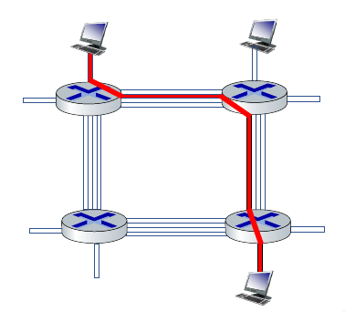
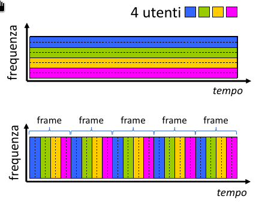

# Introduzione part 2

## Il nucleo della rete

> [!IMPORTANT]
> Il nucleo della rete è una maglia (mesh) di commutatori di pacchetti e collegamenti che interconnettono i sistemi periferici di Internet.

> [!IMPORTANT]
> La commutazione di pacchetto consiste nel inoltrare (forwarding) i pacchetti da un router successivo attraverso i collegamenti (links), lungo un percorso (path) dalla sorgente alla destinazione.

> [!NOTE]
> Inoltro (forwarding) o switching: **azione locale**, sposta i pacchetti in arrivo al collegamento di ingresso del router al collegamento di uscita appropriato.  
> Instradamento (routing): **azione globale**, determina i percorsi presi dai pacchetti dalla sorgente alla destinazione, mediante appositi algoritmi di instradamento.

Una tecnica di commutazione usata è detta **store-and-forward**, il router deve aver ricevuto l'intero pacchetto prima di poter cominciare a trasmettere sul collegamento in uscita. Ovvero, i pacchetti che arrivano vengono memorizzati all'interno di un buffer nel router.

> [!NOTE]
> Il ritardo da un capo all'altro (end-to-end) per la trasmissione di 1 pacchetto su un percorso di $N$ collegamenti di pari velocità $R$ è:  
> $d_{end-to-end} = \frac{N\cdot L}{R}$.  
> Mentre per la trasmissione di $P$ pacchetti su un percorso di $N$ collegamenti di pari velocità $R$ è:
> $d_{end-to-end} = \frac{(N + P - 1)\cdot L}{R}$.

Se il numero di pacchetti in arrivo sono molti di più rispetto alla veloità di commutazione, si verifica il fenomeno di **accodamento** (queuing), ovvero i pacchetti si accodano per essere trasmessi sul collegamento. Inoltre c'è grande possibilità che i pacchetti accodati possano essere scartati (persi) se il buffer si riempie.

Alternativamente alla commutazione di pacchetto si puo usare la commutazione di circuito.

> [!IMPORTANT]
> Nelle reti a commutazione di circuito le risorse richieste lungo un percorso (buffer e velocità di trasmissione sui collegamenti) per consentire la comunicazione tra sistemi periferici sono riservate per l'intera durata della sessione di comunicazione (risorse dedicate).

Le reti telefoniche sono esempi di reti a commutazione di circuito.

Guardiamo adesso l'immagine: Gli host sono tutti direttamente connessi a uno dei commutatori. Quando due host desiderano di comunicare, la rete stabilisce una **connessione end-to-end** dedicata a loro. 

> [!IMPORTANT]
> Multiplexing a Divisione di Frequenza (FDM): lo spettro di frequenza di un collegamento viene suddiviso in *bande*, dedicate a ciascuna connessione.
> La larghezza della banda viene detta **ampiezza di banda (brandwidth)**.

> [!IMPORTANT]
> Multiplexing a Divisione di Tempo (TDM): il tempo viene suddiviso in *frame* di durata fissa, ripartiti in un numero fisso di slot. Ciascun circuito riceve slot periodici e può trasmettere alla massima velocità della banda di frequenza solo nei propri slot temporali.

