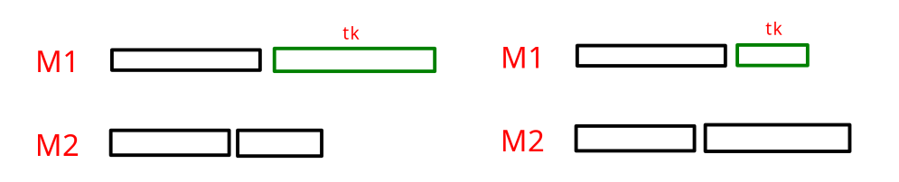
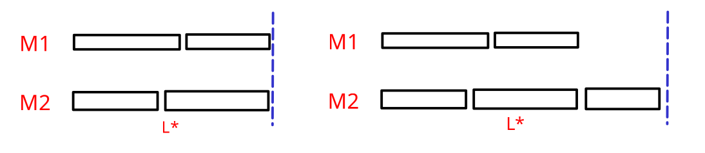
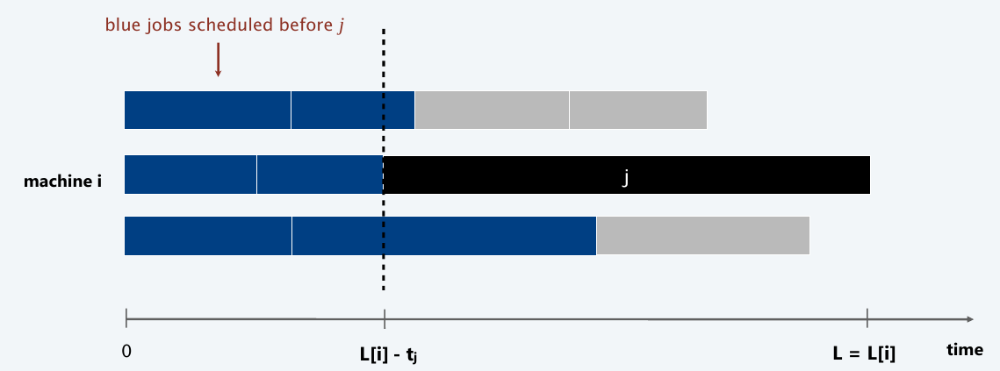
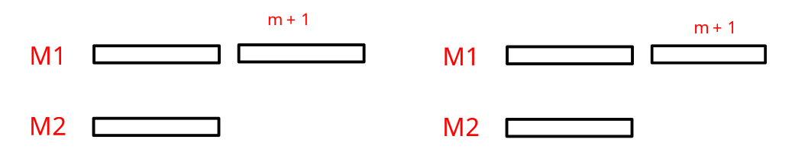

# Algoritmi di Approssimazione

## Introduzione

> [!IMPORTANT]
>
> Un algoritmo $\alpha$-approssimazione è un algoritmo polinomiale che risolve un problema di ottimizzazione tale che per ogni istanza del problema produce una soluzione il cui valore e quasi ottimale per un fattore di approssimazione $\alpha$.  

**Problemi di minimizzazione**
- $\alpha \geq 1$: Poiché stiamo minimizzando, il costo della soluzione trovata dall'algoritmo non dovrebbe superare α volte il costo della soluzione ottimale. Per ogni soluzione $x$ trovata, $costo(x) \leq \alpha \cdot OPT(x)$, dove $OPT(x)$ è il costo della soluzione ottimale.
- Supponiamo di avere un problema di minimizzazione con $\alpha = 2$. Se la soluzione ottimale $(OPT)$ ha un costo di 100, allora l'algoritmo di $\alpha$-approssimazione può produrre una soluzione con un costo fino a 200 (poiché 2 * 100 = 200).

**Problemi di massimizzazione**
- $\alpha \leq 1$: Poiché stiamo massimizzando, il valore della soluzione trovata dall'algoritmo dovrebbe essere almeno α volte il valore della soluzione ottimale. Per ogni soluzione $x$ trovata, $costo(x) \geq \alpha \cdot OPT(x)$, dove $OPT(x)$ è il costo della soluzione ottimale.
- Supponiamo di avere un problema di massimizzazione con $\alpha = 0.5$. Se la soluzione ottimale $(OPT)$ ha un valore di 200, allora l'algoritmo di $\alpha$-approssimazione può produrre una soluzione con un valore di almeno 100 (poiché 0.5 * 200 = 100).

## Load Balancing

Date in input $m$ macchine tutte uguali in termini di capacità di elaborazione. Ci sono $n$ job, con $n \geq m$ e ciascun job $j$ ha un tempo di elaborazione $t_{j}$. Inoltre, un job deve essere eseguito in modo continuo su una macchina e una macchina può eseguire un job alla volta.

> [!IMPORTANT]
> 
> Sia $S[i]$ l'insieme dei job assegnati alla macchina $i$-esima.
> 
> Definiamo **carico della macchina $i$** 
> $$L[i] = \sum_{j \in S[i]} t_{j}$$
>
> Definiamo **makespan** come il carico massimo su una qualsiasi macchina
> $$L = \max_{i}\{L[i]\}$$

Il problema del **Load Balacing** consiste nel assegnare i job alle macchine minimizzando il makespan.

### 2-Approx

> [!NOTE]
>
> **Idea**: Considera gli $n$ job in un qualsiasi ordine. Assegna il job $j-esimo$ alla macchina con carico minimo.

```
List-Scheduling(Machines, Jobs)
    for i = 1 to m
        L[i] = 0 // load
        S[i] = NULL // insieme
    
    for j = 1 to n
        i = argmin L[k] // macchina con carico minimo
        add Jobs[j] to S[i]
        L[i] += Jobs[j].time
    return S
```

> [!IMPORTANT]
>
> **Lemma 1**: Per ogni $k$, il makespan ottimo $L^* \geq t_{k}$
> 
> Qualche macchina deve processare il job che spende più tempo, che sia il job $t_{k}$ o un altro job.




> [!IMPORTANT]
>
> **Lemma 2**: Il makespan ottimo $L^* \geq \frac{1}{m} \sum_{k} t_{k}$
> 
> Il tempo totale di processamento è $\sum_{k} t_{k}$. Una delle $m$ macchine deve svolgere almeno $\frac{1}{m}$ frazione del lavoro totale.



> [!IMPORTANT]
>
> **Teorema**: L'algoritmo greedy è un 2-approssimazione.
> 
> **Dim**: Consideriamo la macchina $i$ con maggiore carico. Sia $j$ l'ultimo job assegnato alla macchina $i$. Quando il job $j$ è stato assegnato alla macchina $i$, essa ha avuto il minor carico. Il suo carico prima di assegnare il job $j$ era $L[i] - t_{j}$. Siccome $L[i] - t_{j} \leq L[k]\ \forall\ 1 \leq k \leq m$. Allora vale anche: 
> $$L[i] - t_{j} \leq \frac{1}{m} \sum_{k} L[k] = \frac{1}{m} \sum_{k} t_{k} \leq L^*$$
>
> Quindi, $L = L[i] = (L[i] - t_{j}) + t_{j} \leq 2L^*$, per la disuguaglianza di prima e per il lemma 1.



### 1.5-Approx

> [!NOTE]
>
> **Idea**: Considera gli $n$ job ordinati in modo decrescente. Assegna il job $j-esimo$ alla macchina con carico minimo.

```
LPT-List-Scheduling(Machines, Jobs)
    Sort Jobs in decreasing order

    for i = 1 to m
        L[i] = 0 // load
        S[i] = NULL // insieme
    
    for j = 1 to n
        i = argmin L[k] // macchina con carico minimo
        add Jobs[j] to S[i]
        L[i] += Jobs[j].time
    return S
```

> [!IMPORTANT]
>
> **Lemma 3**: Se ci sono più di $m$ job, allora $L^* \geq 2t_{m + 1}$
> 



> [!IMPORTANT]
>
> **Teorema**: L'algoritmo LPT greedy è un $\frac{3}{2}$-approssimazione.
> 
> **Dim**: Consideriamo la macchina $i$ con maggiore carico. Sia $j$ l'ultimo job assegnato alla macchina $i$. Quando il job $j$ è stato assegnato alla macchina $i$, essa ha avuto il minor carico. Il suo carico prima di assegnare il job $j$ era $L[i] - t_{j}$. Siccome $L[i] - t_{j} \leq L[k]\ \forall\ 1 \leq k \leq m$. Allora vale anche: 
> $$L[i] - t_{j} \leq \frac{1}{m} \sum_{k} L[k] = \frac{1}{m} \sum_{k} t_{k} \leq L^*$$
>
> Quindi, $L = L[i] = (L[i] - t_{j}) + t_{j} \leq \frac{3}{2}L^*$, per la disuguaglianza di prima e per il lemma 3.

## K-Centering

Il problema **k-Center** consiste nel trovare $k$ centri in modo che la distanza massima tra un sito e il centro più vicino sia minimizzata. Questo tipo di problema è comune in vari campi, come la gestione delle risorse, la logistica, e l'allocazione di servizi.

Dati in input $n$ siti e un intero $k > 0$. Dobbiamo selezionare $k$ centri $C$ in modo tale che la distanza massima dal sito più lontano al centro più vinico sia minimizzata. Il centro è un punto qualsiasi che serve come punto di riferimento per i siti circostanti.

- $dist(x, y)$: distanza da $x$ a $y$
- $dist(s_{i}, C) = \min_{c \in C} \{dist(s_{i}, c)\}$: distanza dal sito $s_{i}$ al centro più vicino.
- $r(C) = \max_{i} \{dist(s_{i}, C)\}$: minimo raggio ricoprente

L'obiettivo è dunque quello di trovare un insieme di centri $C$ tale che $r(C)$ è minima e $|C| = k$.

```
K-Center(k, Sites)
    C = NULL
    for i = 1 to k
        s_i = argmax(s_i, C) // il sito più lontano da ogni centro
        aggiungi s_i a C
    return C
```

L'algoritmo greedy è un 2-approssimazione.
