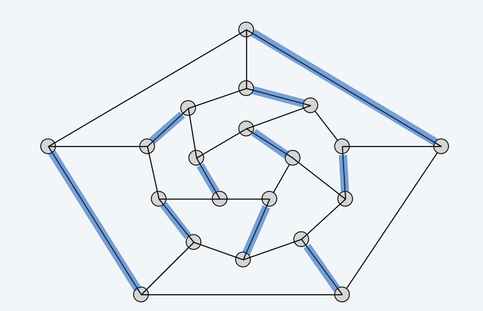
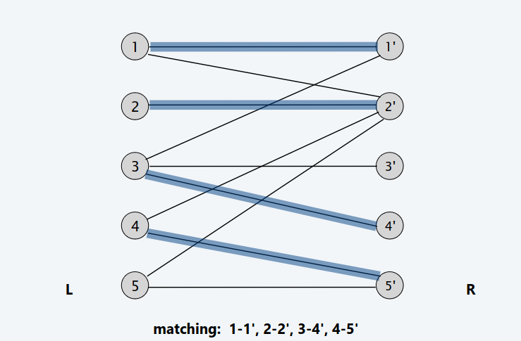
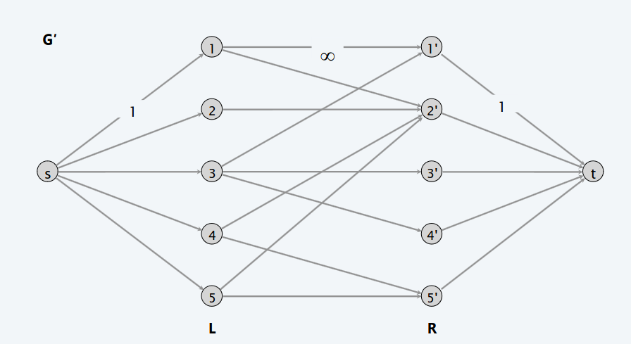
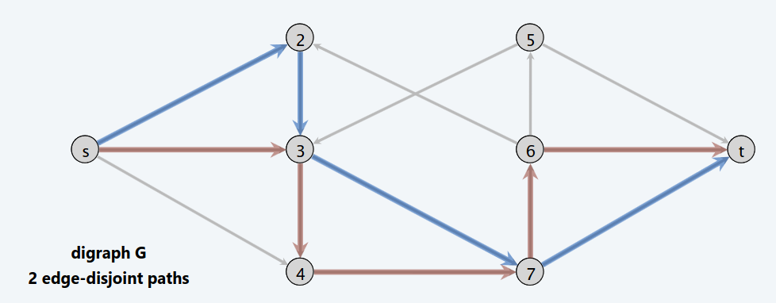
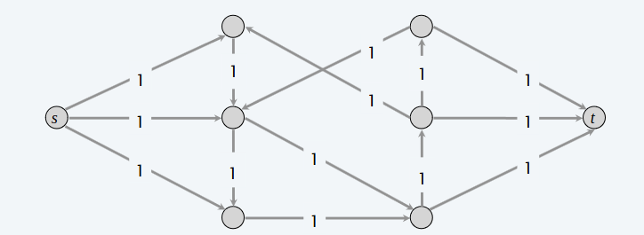

# Applicazione del Max-flow Min-cut

## 1. Accoppiamento bipartito

> [!IMPORTANT]
>
> **DEF**: Dato un grafo $G\ =\ (V,\ E)$, un sottoinsieme $M \subseteq E$ si chiama **abbinamento** se ciascun nodo appare al massimo in un arco in $M$.
>
> **Massimo abbinamento**: Dato un grafo $G$, trovare l'abbinamento di cardinalità massima.

> [!IMPORTANT]
>
> **DEF**: Un grafo $G$ è **bipartito** se i nodi possono essere partizionati in due sottoinsiemi $L$ e $R$ tale che ciascun arco collega un nodo in $L$ con un nodo il $R$
>
> **Abbinamento bipartito**: Dato un grafo bipartito $G = (L \cup R, E)$, trovare l'abbinamento di cardinalità massima

> [!IMPORTANT]
>
> **DEF**: Dato un grafo $G\ =\ (V,\ E)$, un sottoinsieme $M \subseteq E$ è un **abbinamento perfetto** se ciascun nodo appare esattamente una volta in un arco in $M$
>
> **Prolema dell'abbinamento perfetto**: Dato un grafo bipartito $G = (L \cup R, E)$, trovare un abbinamento perfetto oppure segnalare se non esiste.

**Come usare il maxflow per risolvere questo problema?**

- Creiamo un grafo diretto $G^{'} = (L \cup R \cup \{s, t\}, E^{'})$
- Gli archi da $L$ a $R$ sono diretti, ciascun arco con capacità $\infty$.
- Gli archi da $s$ a $L$, ciascuno con capacità 1.
- Gli archi da $R$ a $t$, ciascuno con capacità 1.

Possiamo risolvere dunques questo problema attraverso l'algoritmo di Ford-Fulkerson, in tempo $O(mn)$, poiché possiamo offettuare al più $n$ aumenti.

## 2. Cammini indipendenti

> [!IMPORTANT]
>
> **DEF**: Due cammini sono detti indipendenti se non hanno archi in comune.
>
> **Problema**: Dato un grafo $G = (V, E)$ diretto, e due nodi $s$ e $t$, trovare il massimo numero di cammini indipendenti da $s$ a $t$ in $G$.

**Come usare il maxflow per risolvere questo problema?**

- Assegnamo capacità 1 a ciascun arco del grafo $G = (V, E)$.

Esiste una corrispondenza 1-1 tra $k$ cammini indipendenti e flusso di valore $k$ in G.

- $(\Leftarrow)$: Siano $P_{1}, \dots, P_{k}$ $k$ cammini indipendenti in $G_{f}$. Sia 
$$
f(e) = \begin{cases}
  1 & \text{se l'arco} e \text{appartiene al percorso} P_j \\
  0 & \text{altrimenti}
\end{cases}
$$

- $(\Rightarrow)$: Sia $f$ un flusso intero in $G^{'}$ di valore $k$. Consideriamo l'arco $(s, u)$ con $f(s, u) = 1$. Per la conservazione del flusso esiste un arco $(u, f)$ con $f(u, v) = 1$. Continuiamo cosi fino a $t$ scegliendo sempre un nuovo arco. In questo modo otteniamo $k$ cammini indipendenti.

## 3. Segmentazione di imagini

## 4. Baseball elimination