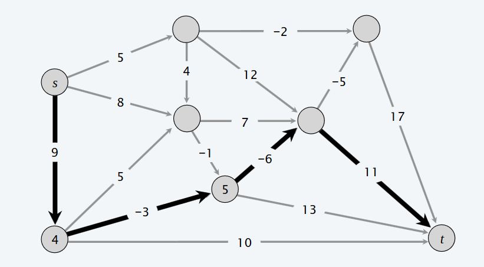
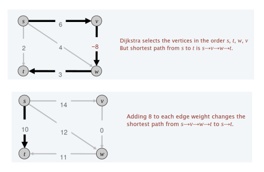
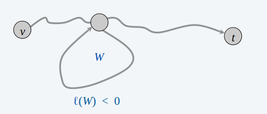

# Cammini minimi in un grafo con pesi negativi

> [!IMPORTANT]
>
>**Shortest Path Problem**: Dato un grafo diretto $G=(V, E)$ con lunghezze degli archi $l_{vw}$, trovare il cammino minimo dal nodo sorgente $s$ al nodo destinazione $t$.

La lunghezza di dell'cammino minimo sa $s -> t$ è : $9 - 3 - 6 + 11 = 11$.

L'algoritmo di Dijkstra non funziona con un grafo in cui ci sono pesi negativi. Si potrebbe pensare di aggiungere una costante $c > 0$ a ciascun peso per ottenere solo pesi positivi, ma anche così facendo, non otteremo il risultato corretto.

>[!IMPORTANT]
>
>**DEF**: Un ciclo negativo è un ciclo diretto tale che la somma dei pesi degli archi è negativa.
$$l(W) = \sum_{e\in W} l_{e} < 0$$

>[!IMPORTANT]
>
> - **Lemma 1**: Se un qualsiasi cammino da $v$ a $t$ contiene un ciclo negativo, allora non esiste un cammino minimo da $v$ a $t$.
> - **Dim**: Se esiste un tale ciclo $W$, allora è possibile costruire un cammino da $v$ a $t$ di lunghezza negativa, passando un numero arbitrario di volte per $W$ accorciando ogni volta la lunghezza del cammino. In questo caso si dice che la distanza da $v$ a $t$ è $-\infty$.

>[!IMPORTANT]
>
> - **Lemma 2**: Se $G$ non ha cicli negativi, allora esiste un cammino minimo da $v$ a $t$ che è semplice (no ha cicli), avente $\leq n - 1$ archi.
> - **Dim**: Tra tutti i cammini minimi da $v$ a $t$, consideriamo quello che usa il minimo numero di archi. Questo cammino può avere solo cicli di lunghezza 0, perchè per il lemma sopra, se esiste il cammino minimo, allora non ci sono cicli negativi, inoltre, avendo preso il cammino di lunghezza minima, siamo sicuri che non ci sono cicli di lunghezza positivi. Gli unici cicli ammissibili sono i cicli di linghezza 0, che si possono semplicemente ignorare.

**Single-destination shortest-paths problem**
- Dato un grafo diretto $G=(V, E)$ con lunghezza degli archi $l_{vw}$, senza cicli negativi e un nodo distinto $t$, trovare il cammino minimo da $v$ a $t$ per ogni nodo $v$.

