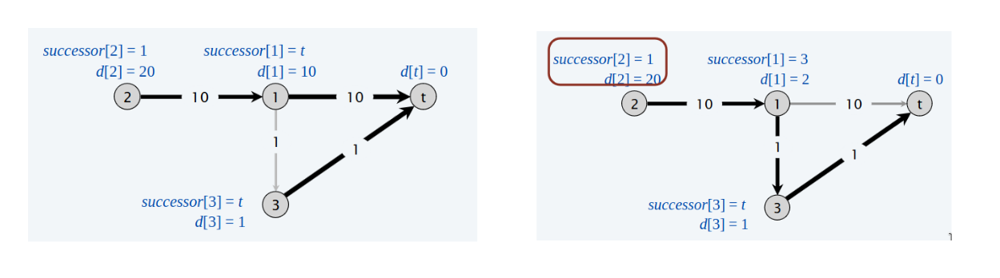

# Cammini minimi in un grafo con pesi negativi

> [!IMPORTANT]
>
>**Shortest Path Problem**: Dato un grafo diretto $G=(V, E)$ con lunghezze degli archi $l_{vw}$, trovare il cammino minimo dal nodo sorgente $s$ al nodo destinazione $t$.


La lunghezza di dell'cammino minimo sa $s -> t$ è : $9 - 3 - 6 + 11 = 11$.

L'algoritmo di Dijkstra non funziona con un grafo in cui ci sono pesi negativi. Si potrebbe pensare di aggiungere una costante $c > 0$ a ciascun peso per ottenere solo pesi positivi, ma anche così facendo, non otteremo il risultato corretto.


>[!IMPORTANT]
>
>**DEF**: Un ciclo negativo è un ciclo diretto tale che la somma dei pesi degli archi è negativa.
$$l(W) = \sum_{e\in W} l_{e} < 0$$

>[!IMPORTANT]
>
> - **Lemma 1**: Se un qualsiasi cammino da $v$ a $t$ contiene un ciclo negativo, allora non esiste un cammino minimo da $v$ a $t$.
> - **Dim**: Se esiste un tale ciclo $W$, allora è possibile costruire un cammino da $v$ a $t$ di lunghezza negativa, passando un numero arbitrario di volte per $W$ accorciando ogni volta la lunghezza del cammino. In questo caso si dice che la distanza da $v$ a $t$ è $-\infty$.


>[!IMPORTANT]
>
> - **Lemma 2**: Se $G$ non ha cicli negativi, allora esiste un cammino minimo da $v$ a $t$ che è semplice (no ha cicli), avente $\leq n - 1$ archi.
> - **Dim**: Tra tutti i cammini minimi da $v$ a $t$, consideriamo quello che usa il minimo numero di archi. Questo cammino può avere solo cicli di lunghezza 0, perchè per il lemma sopra, se esiste il cammino minimo, allora non ci sono cicli negativi, inoltre, avendo preso il cammino di lunghezza minima, siamo sicuri che non ci sono cicli di lunghezza positivi. Gli unici cicli ammissibili sono i cicli di linghezza 0, che si possono semplicemente ignorare.

**Single-destination shortest-paths problem**
- Dato un grafo diretto $G=(V, E)$ con lunghezza degli archi $l_{vw}$, senza cicli negativi e un nodo distinto $t$, trovare il cammino minimo da $v$ a $t$ per ogni nodo $v$.

E' un problema del tutto equivalente del problema dei cammini minimi a singola sorgente, a singola sorgente, o a singola destinazione, il problema algoritmicamente è identico. Avendo l'algoritmo per uno dei due problemi, basta solamente invertire gli archi e scambiare il ruole della destinazione con la sorgente.

**Negative-cycle problem**
- Dato un grafo diretto $G = (V, E)$, con lunghezza degli archi $l_{vw}$, trovare un ciclo negativo (se esiste). 

Vedremo che questo è un problema relazionato al problema dei cammini minimi, in qualche modo con l'algoritmo di Bellman-Ford, riusciremo a rispondere anche a questo quesito.

### Algoritmo di programmazione dinamica

>[!IMPORTANT]
> - **DEF**: $OPT(i, v)$: lunghezza del cammino minimo da $v$ a $t$ che utilizza $\leq$ $i$ archi.
> - **GOAL**: $OPT(n - 1, v)$ per ogni vertice $v$. Per il Lemma 2, se non ci sono cicli negativi, allora esiste un cammino minimo da $v$ a $t$ che è minimo. Quindi vogliamo trovare il cammino minimo che va da $v$ a $t$ che usa al più un arco, il cammino minimo che va da $v$ a $t$ che usa al più 2 archi è cosi via, fino a $n - 1$ archi.
> - **Caso 1**: Il cammino minimo da $v$ a $t$ usa $\leq$ $i - 1$ archi, allora $OPT(i, v) = OPT(i - 1, v)$.
> - **Caso 2**: Il cammino minimo da $v$ a $t$ usa esattamente $i$ archi. Se $(v, w)$ è il primo arco nel cammino minimo da $v$ a $t$, con costo $l_{vw}$. Allora seleziona il cammino minimo da $w$ a $t$ utilizzando $\leq$ $i - 1$ archi.

**Equazione di Bellman**
- $OPT(i, v) = 0$ se $i = 0$ e $v = t$
- $OPT(i, v) = \infty$ se $i = 0$ e $v \neq t$
- $OPT(i, v) = \min${ $OPT(i - 1)$,  $\min_{(v,w)\in E}${ $OPT(i - 1) + l_{vw}$ }} se $i > 0$

```
Shortest-paths(V, E, l, t)
    for each node v:
        OPT[0, v] = inf
    OPT[0, t] = 0
    for i = 1 to n - 1 do:
        for each node v:
            OPT[i, v] = OPT[i - 1, v]
            for each edge(v, w):
                OPT[i, v] = min{OPT[i, v], OPT[i - 1, w] + l_vw}
```

> [!IMPORTANT]
>
> - **Teorema**: Dato un grafo diretto $G = (V, E)$ senza cicli negativi, l'algoritmo calcola la lunghezza del cammino minimo da $v$ a $t$ per ogni nodo $v$ in tempo $\theta(n\cdot m)$ e spazio $\theta(n^2)$.
> - **Dimostrazione**: La tabella $OPT$ occupa spazio $\theta(n^2)$. Ogni iterazione costa $\theta(m)$ dato che esaminiamo ciascun nodo una volta sola. Quindi, andando a considerare per ogni nodo, tutti gli archi uscenti, sommando i gradi di ciascun nodo, otteniamo che il doppio ciclo `for each` costa $\theta(m)$. 

Adesso, rimane solo da trovare i nodi che formano il cammino minimo. Ci sono due approcci:
1. Mantenere `successor[i, v]`, un puntatore che punta al prossimo nodo del cammino minimo da $v$ a $t$ che usa al più $i$ archi. 
2. Calcolare `OPT[i, v]`, poi andare a considerare solo gli archi per cui vale $OPT[i, v] = OPT[i - 1, w] + l_{vw}$. Ciascun cammino diretto in questo sottografo è un cammino minimo.

L'algoritmo appena descritto sopra, utilizza memoria $\theta(n^2)$, il che lo rende molto inefficiente. Per rendere l'algoritmo più efficiente possiamo effettuare la seguente ottimizzazione, ovvero di mantere 2 array di lunghezza $n$,  invece di una matrice $n\cdot n$:
- `d[v]`: la lunghezza del cammino minimo da $v$ a $t$ che abbiamo trovato fin ora.
- `successor[v]`: nodo successivo a $v$ nel cammino da $v$ a $t$.

Con questa ottimizzazione dello spazio, segue un'ulteriore ottimizzazione. Se `d[w]` non è stato aggiornato nella $i - esima$ iterazione (passata), allora non c'è bisogno di considerare gli archi entranti nella $i - esima$ passata.

```
Bellman-Ford-Moore(V, E, l, t)
    for each node v
        d[v] = inf
        successor[v] = null
    d[t] = 0
    for i = 1 to n - 1 do
        for each node w
            if(d[w] != inf) // significa che d[w] è stato aggiornato nelle passate precedenti
                for each edge (v, w)
                    if (d[v] > d[w] + l_vw)
                        d[v] = d[w] + l_vw
                        successor[v] = w
        if (d[_] non è stato modificato nell'iterazione i) STOP.
```

Per capire meglio questo algoritmo proviamo a simularlo con il sequente grafo:


**Ordine dei nodi**: `t, D, C, B, E`.

1. Prima passata,  $i = 0$
   
   
   |     |                                      `t`                                      |                  `D`                  | `C` |                                     `B`                                     |                                   `E`                                   |
   | :-: | :---------------------------------------------------------------------------: | :-----------------------------------: | :-: | :-------------------------------------------------------------------------: | :---------------------------------------------------------------------: |
   | `t` |                                       _                                       |                   _                   |  _  |                                      _                                      |                                    _                                    |
   | `B` | $d[B] = +\infty > d[t] + l_{Bt} = -1 =>$<br>$d[B] = -1$<br>$successor[B] = t$ | $d[B] = -1 < d[D] + l_{DB} = +\infty$ |  _  |                                      _                                      |                                    _                                    |
   | `C` |  $d[C] = +\infty > d[t] + l_{Ct} = 4 =>$<br>$d[C] = 4$<br>$successor[C] = t$  | $d[C] = 4 < d[D] + l_{DC} = +\infty$  |  _  |    $d[C] = 4 > d[B] + l_{CB} = 2 =>$<br>$d[C] = 2$<br>$successor[C] = B$    |                                    _                                    |
   | `D` |                                       _                                       |                   _                   |  _  | $d[D] = +\infty > d[B] + l_{DB} = 1 =>$<br>$d[D] = 1$<br>$successor[D] = B$ | $d[D] = 1 > d[E] + l_{DE} = -2 =>$<br>$d[D] = -2$<br>$successor[D] = E$ |
   | `E` |                                       _                                       |                   _                   |  _  | $d[E] = +\infty > d[B] + l_{EB} = 1 =>$<br>$d[E] = 1$<br>$successor[E] = B$ |                                    _                                    |
   
   
    Quindi, dopo la prima passata, il vettore `d` e `successor` è:

      - $d[t] = 0$, $d[B] = -1$, $d[C] = 2$, $d[D] = -2$, $d[E] = 1$
      - $successor[t] = null$, $successor[B] = t$, $successor[C] = B$, $successor[D]$ = E, $successor[E] = B$
  
2. Seconda passata, $i = 1$
   Si osserva che nella seconda passata, $d[\_]$ non cambia, perciò l'algoritmo termina senza dover fare 4 passate.

> [!IMPORTANT]
>
> - **Lemma 3**: Per ogni nodo $v$: `d[v]` è la lunghezza di un qualche cammino che va da $v$ a $t$.
> - **Lemma 4**: Per ogni nodo $v$: `d[v]` è monotona non crescente.

> [!IMPORTANT]
>
> - **Lemma 5**: Dopo l' $i - esima$ passata, `d[v]` $\leq$ della lunghezza del cammino minimo da $v$ a $t$ che utilizza $\leq$ archi.
> - **Dim [per induzione]**:
> - Caso base: $i = 0$. E' chiaro il perché, se non ho ancora fatto nessuna passata, `d[v]` contiene la lunghezza del cammino minimo che usa al più 0 archi. Ovvero tutti sono $+\infty$ tranne `d[t]` che è 0.
> -  Assumiamo vera la passata $i-esima$. Sia $P$ un qualsiasi cammino da $v$ a $t$ composto da $\leq i + 1$ archi. Sia $(v, w)$ il primo arco in $P$ e sia $P^{'}$ un sotto cammino da $w$ a $t$. Per l'ipotesi induttiva, dopo la passata $i - esima$, `d[w]` $\leq l(P^{'})$, perché $P^{'}$ è un cammino da $w$ a $t$ con al più $i$ archi. Dopo aver considerato l'arco $(v, w)$ nella passata $i + 1$, otteniamo:
> $$d[v] \leq l_{vw} + d[w] \leq l_{vw} + l(P^{'}) = l(P)$$
> Per il **Lemma 4**, `d[v]` può solo diminuire.

> [!IMPORTANT]
>
> - **Teorema**: Assumendo che non ci sono cicli negativi, l'algoritmo di Bellman-Ford-Moore calcola le lughezze dei cammini minimi da un qualsiasi nodo $v$ a $t$ in tempo $O(m\cdot n)$ e spazio $\theta(n)$.
> - **Dim**: Lemma 2 + Lemma 5. 

> [!NOTE]
>
> **Osservazione**: L'algoritmo di Bellman-Ford-Moore è tipicamente più veloce.

> [!IMPORTANT]
>
> - **Affermazione**: Durante l'esecuzione dell'algoritmo di Bellnan-Ford-Moore, seguendo i puntatori `successor[v]`, otteniamo un cammino diretto da $v$ a $t$ di lunghezza `d[v]`.
> - **L'affermazione è falsa!** Solo dopo aver terminato la sua esecuzione, seguendo i puntatori `successor[v]` otteniamo un cammino minimo da $v$ a $t$ di lunghezza `d[v]`.
> - Osserviamo questo **controesempio**:
> - Dopo aver visitato il nodo $1$, `successor[2] = 1` e `d[2] = 20`, inoltre `successor[1] = t`. Ma dopo aver visitato il nodo $3$, `successor[1] = 3` dato che otteniamo un cammino più corto, e, di conseguenza anche il cammino minimo dal nodo $2$ non sarà più 20 ma verrà aggiornato a 12 nella seconda passata. Possiamo dunque osservare come durante l'esecuzione dell'algoritmo i puntatori cambiano, essendo locali, quindi solo dopo la fine dell'esecuzione otterremo i nodi che formano il cammino minimo.



> [!IMPORTANT]
>
> - **Lemma 6**: Qualunque ciclo diretto $W$ nel grafo dei successori è un ciclo negativo.
> - **Teorema**: Assumendo di non avere cicli negativi, l'algoritmo di Bellman-Ford-Moore trova i cammini minimi da $v$ a $t$ per ogni nodo $v$ in tempo $O(m\cdot n)$ e spazio $\theta(n)$.
> - **Lemma 7**: Se esiste un ciclo negativo nel grafo in input (che può raggiungere $t$), l'algoritmo lo segnala. 

```
Bellman-Ford-Moore(V, E, l, t)
    for each node v
        d[v] = inf
        successor[v] = null
    d[t] = 0
    for i = 1 to n - 1 do
        for each node w
            if(d[w] != inf) // significa che d[w] è stato aggiornato nelle passate precedenti
                for each edge (v, w)
                    if (d[v] > d[w] + l_vw)
                        d[v] = d[w] + l_vw
                        successor[v] = w
        if (d[_] non è stato modificato nell'iterazione i) STOP.
    for each edge (v, w)
        if(d[v] > d[w] + l_vw) then return "Esiste un ciclo negativo."
```