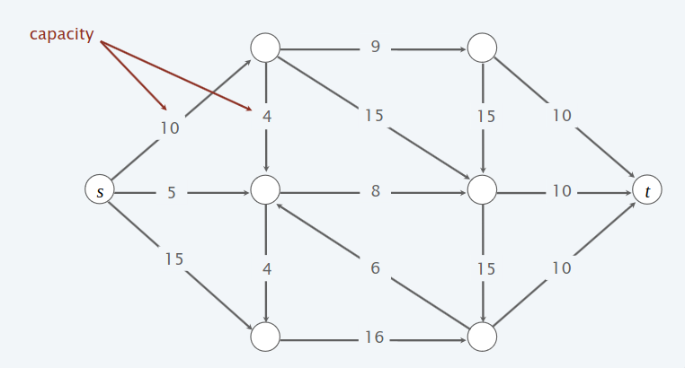
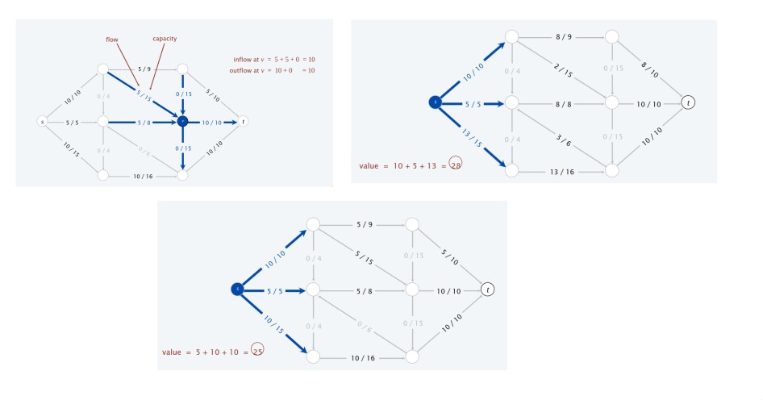
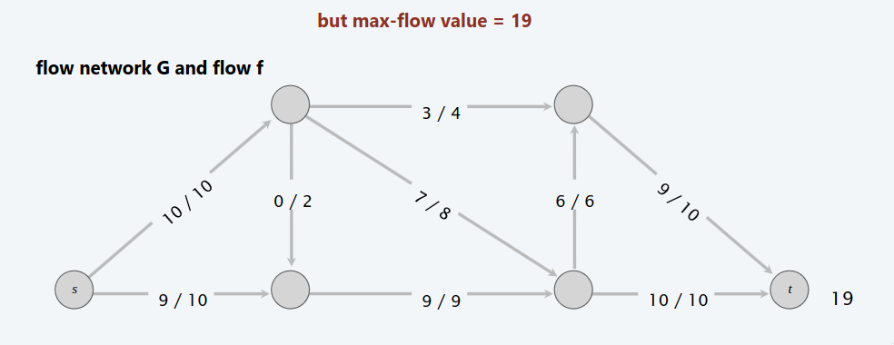
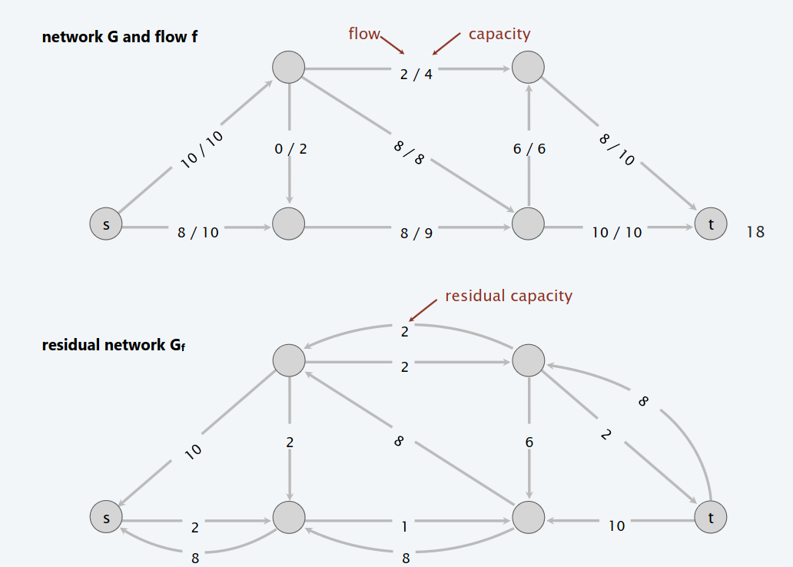

# Max flow e min cut problem e Algoritmo di Ford - Fulkerson

## Il problema del max - flow e del min-cut

Una **rete di flusso** è una tupla $G = (V, E, s, t, c)$ dove $G$ è un grafo diretto $(V, E)$ con sorgente $s\in V$ e nodo pozzo $t\in V$. Inoltre, per ogni arco $e\in E$ è definito $c(e)\geq 0$ la capacità dell'arco $e$.



### Min cut problem

> [!IMPORTANT]
>
> - **DEF**: Un **st-cut** è una partizione $(A, B)$ di nodi dove $s\in A$ e $t\in B$
> - **DEF**: La **capacità** di un cut è la somma di tutte le capacità degli archi uscenti diretti da $A$ verso $B$.
> $$cap(A, B) = \sum_{e\in A} c(e)$$1
> - **Min cut problem**: Trovare un cut di capacità minima.
 


### Max flow problem

> [!IMPORTANT]
>
> **DEF**: Un **st-flow** è una funzione $f$ che soddisfa le suguenti proprietà: 
> 1. *Capacità* $$\forall e\in E:\ 0 \leq f(e) \leq c(e)$$
> 2. *Conservazione del flusso* $$\forall v\in V \setminus \{s, t\}:\ val(f) = \sum_{e\ in\ to\ v} f(e)\ = \sum_{e\ out\ to\ v} f(e)$$
>
> **DEF**: Il **valore** del flusso $f$ è la quantità netta di flusso che sta uscendo da $s$: $$val(f) = \sum_{e\ out\ to\ s} f(e)\ - \sum_{e\ in\ to\ s} f(e)$$
>
> **Max flow problem**: Trovare un flusso di valore massimo.



## Algoritmo di Ford - Fulkerson

### Un primo algoritmo greedy

Prima di arrivare all'algoritmo di Ford - Fulkerson, cerchiamo di osservare perchè un algortimo greedy non funziona.

L'algoritmo greedy è il seguente:
1. Inzia con $f(e) = 0\ \forall e\in E$.
2. Trova un cammino $P$ da $s$ a $t$ tale che per ogni arco $e\in P,\ f(e)\ <\ c(e)$.
3. Aumenta il flusso lungo il cammino $P$.
4. Ripeti finché non rimani bloccato.


> [!NOTE]
>
> **Osservazione**: Sia $P$ da $s$ a $t$, se il primo arco, ovvero l'arco $(s, v)$ ha capacità $N$, ma lungo il cammino esiste un arco con capacità $N_{1} < N$, allora il flusso che uscirà da $s$ sarà $N_{1}$.



Perché l'algoritmo greedy fallisce? L'algoritmo greedy fallisce perché una volta che l'algoritmo incrementa il flusso su un arco, quel flusso non verrà mai decrementato. Ci serve quindi un meccanismo di "undo" in caso l'algoritmo greedy prenda una decisione sbagliata.

### Verso l'algortimo, rete residua

La rete residua è lo strumento cardine su cui si basa l'algoritmo di Ford - Fulkerson. È una rete definita a partire dalla rete iniziale e un flusso corrente.

Dato un grafo $G$ e un flusso $f$, da essi definiamo un nuovo grafo $G_{f}$ detta **rete residua**.

> [!IMPORTANT]
>
> **DEF**: Dato un grafo $G$ e un flusso $f$ definiamo $G_{f}$ nel seguente modo:
> 1. I nodi di $G_{f}$ sono gli stessi di $G$.
> 2. Dato un arco $e = (u, v)\in G$, per il quale abbiamo $f(e)$ e $c(e)$, definiamo **arco rivoltato** $e^{reverse} = (v, u)$
> 3. Definiamo la **capacità residua** 
> $$c_{f}(e) = c(e) - f(e) \iff e\in E$$
> $$c_{f}(e) = f(e^{reverse}) \iff e^{reverse}\in E$$

Dunque, definiamo **rete residua** $G_{f} = (V, E_:{f}, s, t, c_{f})$ tale che:
$$E_{f} = \{ e:\ f(e) < c(e) \} \cup \{ e: f(e^{reverse}) > 0 \}$$

**Proprietà chive**: $f^{'}$ è un flusso in $G_{f} \iff f + f^{'}$ è un flow in $G$.



> [!IMPORTANT]
>
> - **DEF**: Un **cammino aumentante** è un semplice cammino da $s$ a $t$ nella rete residua $G_{f}$.
> - **DEF**: La **bottleneck capacity (capacità di collo di bottiglia)** di un cammino aumentante $P$ è la minima capacità residua di un arco in $P$.
> - **Proprietà**: Sia $f$ un flusso a sia $P$ un cammino aumentante in $G_{f}$. Allora, dopo aver calcolato $f^{'} = AUGMENT(f, c, P)$, il valore del risultante flusso $val(f^{'}) = val(f^{'}) + bottleneck(G_{f}, P)$.

```
Augment(f, c, P)
    delta = bottleneck capacity del cammino aumentate P
    for each edge e in P
        if(e in E) f(e) = f(e) + delta
        else f(e_reverse) = f(e_reverse) - delta
    return f
```

**Algoritmo dei cammini aumentanti di Ford - Fulkerson**

1. Inzia con $f(e) = 0\ \forall e\in\ E$.
2. Trova un qualsiasi cammino $P$ nella rete residua $G_{f}$.
3. Aumenta il flusso lungo il cammino $P$.
4. Ripeti finché non rimani bloccato.

```
Ford-Fulkerson(G)
    for each edge e in E
        f(e) = 0
    G_f = rete residua definita da G e f
    while(esiste un cammino P da s a t in G_f) do
        f = Augment(f, c, P)
        Aggiorna G_f
    return f
```
