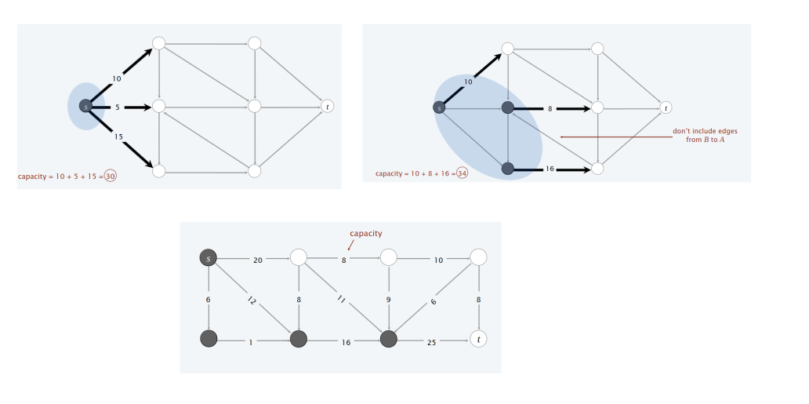

# Max flow e min cut problem e Algoritmo di Ford - Fulkerson

## Il problema del max - flow e del min-cut

Una **rete di flusso** è una tupla $G = (V, E, s, t, c)$ dove $G$ è un grafo diretto $(V, E)$ con sorgente $s\in V$ e nodo pozzo $t\in V$. Inoltre, per ogni arco $e\in E$ è definito $c(e)\geq 0$ la capacità dell'arco $e$.


### Min cut problem

> [!IMPORTANT]
>
> - **DEF**: Un **st-cut** è una partizione $(A, B)$ di nodi dove $s\in A$ e $t\in B$
> - **DEF**: La **capacità** di un cut è la somma di tutte le capacità degli archi uscenti diretti da $A$ verso $B$  $$cap(A, B) = \sum_{e\in A} c(e)$$
> - **Min cut problem**: Trovare un cut di capacità minima.
 


### Max flow problem

> [!IMPORTANT]
>
> **DEF**: Un **st-flow** è una funzione $f$ che soddisfa le suguenti proprietà: 
> 1. *Capacità* $$\forall e\in E:\ 0 \leq f(e) \leq c(e)$$
> 2. *Conservazione del flusso* $$\forall v\in V \setminus \{s, t\}:\ val(f) = \sum_{e\ in\ to\ v} f(e)\ = \sum_{e\ out\ to\ v} f(e)$$
>
> **DEF**: Il **valore** del flusso $f$ è la quantità netta di flusso che sta uscendo da $s$: $$val(f) = \sum_{e\ out\ to\ s} f(e)\ - \sum_{e\ in\ to\ s} f(e)$$
>
> **Max flow problem**: Trovare un flusso di valore massimo.


## Algoritmo di Ford - Fulkerson

### Un primo algoritmo greedy

Prima di arrivare all'algoritmo di Ford - Fulkerson, cerchiamo di osservare perchè un algortimo greedy non funziona.

L'algoritmo greedy è il seguente:
1. Inzia con $f(e) = 0\ \forall e\in E$.
2. Trova un cammino $P$ da $s$ a $t$ tale che per ogni arco $e\in P,\ f(e)\ <\ c(e)$.
3. Aumenta il flusso lungo il cammino $P$.
4. Ripeti finché non rimani bloccato.


> [!NOTE]
>
> **Osservazione**: Sia $P$ da $s$ a $t$, se il primo arco, ovvero l'arco $(s, v)$ ha capacità $N$, ma lungo il cammino esiste un arco con capacità $N_{1} < N$, allora il flusso che uscirà da $s$ sarà $N_{1}$.


Perché l'algoritmo greedy fallisce? L'algoritmo greedy fallisce perché una volta che l'algoritmo incrementa il flusso su un arco, quel flusso non verrà mai decrementato. Ci serve quindi un meccanismo di "undo" in caso l'algoritmo greedy prenda una decisione sbagliata.

### Verso l'algortimo, rete residua

La rete residua è lo strumento cardine su cui si basa l'algoritmo di Ford - Fulkerson. È una rete definita a partire dalla rete iniziale e un flusso corrente.

Dato un grafo $G$ e un flusso $f$, da essi definiamo un nuovo grafo $G_{f}$ detta **rete residua**.

> [!IMPORTANT]
>
> **DEF**: Dato un grafo $G$ e un flusso $f$ definiamo $G_{f}$ nel seguente modo:
> 1. I nodi di $G_{f}$ sono gli stessi di $G$.
> 2. Dato un arco $e = (u, v)\in G$, per il quale abbiamo $f(e)$ e $c(e)$, definiamo **arco rivoltato** $e^{reverse} = (v, u)$
> 3. Definiamo la **capacità residua** 
> $$c_{f}(e) = c(e) - f(e) \iff e\in E$$
> $$c_{f}(e) = f(e^{reverse}) \iff e^{reverse}\in E$$

Dunque, definiamo **rete residua** $G_{f} = (V, E_:{f}, s, t, c_{f})$ tale che:
$$E_{f} = \{ e:\ f(e) < c(e) \} \cup \{ e: f(e^{reverse}) > 0 \}$$

**Proprietà chive**: $f^{'}$ è un flusso in $G_{f} \iff f + f^{'}$ è un flow in $G$.


> [!IMPORTANT]
>
> - **DEF**: Un **cammino aumentante** è un semplice cammino da $s$ a $t$ nella rete residua $G_{f}$.
> - **DEF**: La **bottleneck capacity (capacità di collo di bottiglia)** di un cammino aumentante $P$ è la minima capacità residua di un arco in $P$.
> - **Proprietà**: Sia $f$ un flusso a sia $P$ un cammino aumentante in $G_{f}$. Allora, dopo aver calcolato $f^{'} = AUGMENT(f, c, P)$, il valore del risultante flusso $val(f^{'}) = val(f^{'}) + bottleneck(G_{f}, P)$.

```
Augment(f, c, P)
    delta = bottleneck capacity del cammino aumentate P
    for each edge e in P
        if(e in E) f(e) = f(e) + delta
        else f(e_reverse) = f(e_reverse) - delta
    return f
```

**Algoritmo dei cammini aumentanti di Ford - Fulkerson**

1. Inzia con $f(e) = 0\ \forall e\in\ E$.
2. Trova un qualsiasi cammino $P$ nella rete residua $G_{f}$.
3. Aumenta il flusso lungo il cammino $P$.
4. Ripeti finché non rimani bloccato.

```
Ford-Fulkerson(G)
    for each edge e in E
        f(e) = 0
    G_f = rete residua definita da G e f
    while(esiste un cammino P da s a t in G_f) do
        f = Augment(f, c, P)
        Aggiorna G_f
    return f
```

## Max-flow, min-cut theorem

> [!IMPORTANT]
>
> **Lemma (valore del flusso)**. Sia $f$ un qualsiasi flusso e sia $(A,\ B)$ un qualsiasi cut (st-cut). Allora il vallore del flusso $f$ è uguale al flusso netto che attraversa il cut $(A, B)$.
> $$val(f)\ =\ \sum_{e\ out\ of\ A}f(e)\ -\ \sum_{e\ in\ to\ A}f(e)$$
>
> **Dim**. 
> $$val(f)\ =\ \sum_{e\ out\ of\ s}f(e)\ -\ \sum_{e\ in\ to\ s}f(e)$$
> $$(*)=\ \sum_{v\in A}\ \ (\sum_{e\ out\ of\ v}f(e)\ -\ \sum_{e\ in\ to\ v}f(e)\ )$$
> $$=\ \sum_{e\ out\ of\ A}f(e)\ -\ \sum_{e\ in\ to\ A}f(e)$$

$(*)$ Per la conservazione del flusso, tutti i termini $v\neq s$ sono uguali a 0.


> [!IMPORTANT]
>
> **Dualità debole**. Sia $f$ un qualsiasi flusso e sia $(A, B)$ un qualsiasi cut (st-cut). Allora, $val(f)\ \leq\ cap(A, B)$.
> 
> **Dim**. 
> $$val(f)\ =\ \sum_{e\ out\ of\ A}f(e)\ -\ \sum_{e\ in\ to\ A}f(e)$$
> $$\leq\ \sum_{e\ out\ of\ A}f(e)\ \leq \sum_{e\ out\ of\ A}cap(e)\ =\ cap(A, B)$$

> [!IMPORTANT]
>
> **Corollario**. Sia $f$ un flusso e sia $(A, B)$ un qualsiasi cut (st-cut). Se $val(f) = cap(A, B)$, allora $f$ è un flusso massimo e $(A, B)$ è un minimo taglio.
>
> **Dim**.
> - Per un qualsiasi flusso $f^{'}$, per la dualità debole vale che: $val(f^{'} \leq cap(A, B) = val(f))$.
> - Per un qualsiasi cut $(A^{'}, B^{'})$, per la dualità debole vale che: $cap(A^{'}, B^{'}) \geq val(f) = cap(A, B)$.

> [!IMPORTANT]
>
> - **Teorema del Max-flow min-cut**. Il valore del flusso massimo è uguale alla capacità del minimo taglio.
> - **Teorema dei cammini aumentanti**. Un flusso $f$ è massimo se solo se non ci sono più cammimi aumentanti.
>
> **Dim**. Le seguenti 3 proprietà sono equivalenti per un qualsiasi flusso $f$:
> 1. Esiste un cut $(A, B)$ tale che $cap(A, B) = val(f)$.
> 2. $f$ è il flusso di valore massimo.
> 3. Non ci sono cammini aumentanti rispetto al flusso $f$. (Se l'algoritmo di Ford-Fulkerson termina, allora f è il flusso massimo).
>
> Per dimostrare che queste 3 proprietà sono equivalenti, dobbiamo dimostrare che $1 => 2$, $2 => 3$ e $3 => 1$.
> - $[1 => 2]$ -  Corollario della dualità debole.
> - $[2 => 3]$ - Dimostriamo l'inversa, ovvera che $\neg 3 => \neg 2$. Supponiamo che esiste un cammino aumentante per $f$. Allora possiamo migliorare il flusso $f$ spingendo più flusso lungo il cammino, ma allora $f$ non è il flusso massimo.
> - $[3 => 1]$ - Sia $f$ un flusso per cui non ci sono cammini aumentati. Sia $A$ l'insieme di nodi raggiungibili da $s$ nella rete residua $G_{f}$. Per definizione di $A$: $s \in A$. Per definizione del flusso $f$: $t \notin A$.
> $$val(f) = \sum_{e\ out\ of\ A}f(e)\ - \ \sum_{e\ in\ to\ A}f(e) = \sum_{e\ out\ of\ A}c(e)\ - 0 = cap(A, B)$$
> - $\sum_{e\ out\ of\ A}f(e)\ = cap(A, B)$, perché se $A$ è l'insieme dei nodi raggiungibili da $s$ nella rete residua allora nel grafo $G_{f}$ esiste un arco $e$ che è all'contrario, quindi nel grafo $G$ quel arco $e$ che va da $A$ in $B$ è saturo, ovvero $f(e) = c(e)$.
> - $\sum_{e\ in\ to\ A}f(e) = 0$, perché se $A$ è l'insieme dei nodi raggiungibili da $s$ nella rete residua, se ci sono archi in $G$ da $B$ verso $A$ allora quei archi devono avere flusso 0 perché nel grafo $G_{f}$ quei archi hanno capacità residua $c(e)$.


> [!IMPORTANT]
>
> **Terema**: Dato un qualsiasi flusso $f$, possiamo calcolare un taglio minimo $(A, B)$ in tempo $O(m)$.

Assumiamo ora che la capacità $c(e)$ di ciascun arco è intera, ovvero un numero tra $1$ e $C$.
Di conseguenza, durante l'esecuzione dell'algoritmo di Ford-Fulkerson, il flusso di ciascun arco $f(e)$ e la capacità residua $c_{f}(e)$ sono interi.

> [!IMPORTANT]
>
> **Terema**: L'algoritmo di Ford-Fulkerson termina dopo $val(f^{\star}) \leq nC$ cammini aumentanti, dove $f^{\star}$ è il flusso massimo. 

> [!IMPORTANT]
>
> **Terema**: Il tempo di esecuzione dell'algoritmo di Ford-Fulkerson è $O(m\cdot val(f^{\star})) = O(m\ n\ C)$. Ovvero l'algoritmo ha una complessità pseudo-polinomiale.

> [!IMPORTANT]
>
> **Terema**: Esiste sempre un flusso massimo $f$ intero.

## Scegliere giusti cammini aumentanti

Il problema dell'algoritmo di Ford-Fulkerson è che se i cammini aumentanti sono scelti male, allora l'algoritmo è esponenziale, altrimenti se i cammini sono scelti in modo intelligente, allora l'algoritmo è polinomiale. L'obbietivo è di scegliere bene i cammini aumentanti in modo tale da ottenere un algoritmo efficiente.

Ci sono due approci:

1. Scegliere cammini aumentanti con un collo di bottigli sufficientemente grande

- Manteniamo un parametro $\Delta$
- Sia $G_{f}(\Delta)$ sia il grafo residuo contentente solo gli archi con capacità $\geq\ \Delta$
- Qualsiasi cammino aumentante in $G_{f}(\Delta)$ ha capacità di collo di bottiglia $\geq \Delta$

```
Capacity-Scaling(G)
    for each edge e
        f(e) = 0
    
    Delta = la più grande potenza di 2 <= C

    while(Delta >= 1)
        G_f(Delta) = Delta-rete residua di G rispetto a f
        while(esiste un cammino aumentante da s a t)
            f = Augment(f, c, P)
            Aggiorna G_f(Delta)
        Delta = Delta / 2
    return f
```

**Complessità Temporale**: $T(n) = O(m^2\ log(C))$

2. Scegliere cammini aumentanti con pochi archi

```
Shortest-Augmenting-Path(G)
    for each edge e in E
        f(e) = 0
    G_f = rete residua definita da G e f
    while(esiste un cammino P da s a t in G_f) do
        P = BFS(G_f)
        f = Augment(f, c, P)
        Aggiorna G_f
    return f
```

**Complessità Temporale**: $T(n) = O(m^2\ n)$