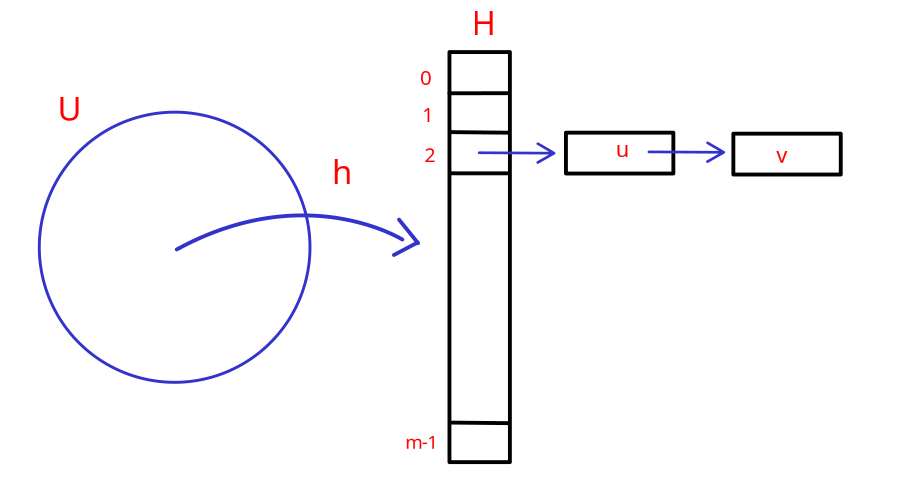

# Hash Table

## Problema del dizionario

Dato un universo $U$ di possibili elementi, dobbiamo mantenere un sott'insieme $S \subseteq U$ soggetto alle seguenti operazioni:

- `make-dictionary()`: crea un dizionario vuoto
- `insert(u)`: aggiungi l'elemento $u \in U$ a $S$
- `delete(u)`: cancella $u$ da $S$ se $u \in S$
- `look-up(u)`: determina se $u$ sta in $S$

Il problema che $U$ può avere una dimensione molto grande, e definire un array di tale dimensione non è efficiente.

**Soluzioni**:
- AVL: $O(|S|)$ spazio e $O(log(|S|))$ costo per ogni operazione.
- Hash Tables: $O(|S|)$ spazio e $O(1)$ costo per ogni operazione.

**Idea**

L'idea è quella di tenere in memoria un tabella (array $H$) e ogni $H[i]$ è una linked list di elementi mappati dalla funzione di hash.

Una **collisione** avviene quando, dati due elementi $u \in U$ e $v \in V$ tali che $u \neq v$, e $h(u) = h(v)$.

L'obiettivo è trovare una funzione $h$ di hash tale che rispetti le seguenti caratteristiche:

1. Deterministica: La stessa chiave deve produrre lo stesso indice.
2. Uniforme: Le chiavi devono essere distribuite uniformemente nell'array per minimizzare le collisioni.
3. Veloce da calcolare: Dovrebbe essere computazionalemente efficiente per garantire l'accesso rapido.

Per ogni funzione hash deterministica esiste un insieme $S$ tale che tutti gli elementi di $S$ sono mappati nello stesso slot. Per evitare che ciò accada dobbiamo randomizzare la funzione hash.

> [!IMPORTANT]
>
> Una famiglia $\mathbb{H}$ di funzioni hash si dice **universale** se per ogni $u,\ v \in U\ u \neq v$ la probabilità $\Pr_{h \in \mathbb{H}} (h(u) = h(v)) \leq \frac{1}{m}$

Questo significa che una famiglia di funzioni hash è considerata universale se la probabilità che due elementi distinti $u$ e $v$ dell'universo $U$ vengano mappati allo stesso valore è al massimo $\frac{1}{m}$ dove $m$ è la dimensione dell'intervallo delle funzioni hash.

