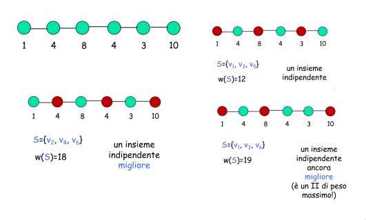
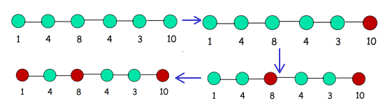
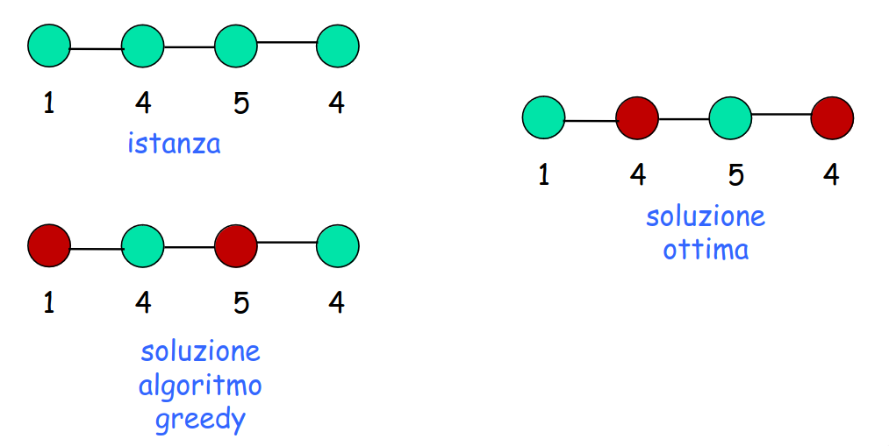
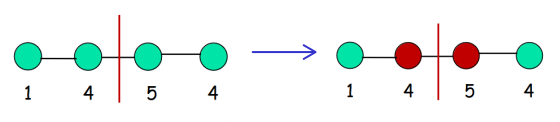

# Insieme indipendente di peso massimo

**Input**: Un cammino $G$ di $n$ nodi. Ogni nodo $v_{i}$ ha un *peso* $w_{i}$.

**Goal**: Trovare un insieme indipendente di **peso massimo**, ovvero un insieme **S** di nodi tale che:
1. $S$ è un insieme indipendente (*II*),
2. $w(S) = \sum_{v_{i}\in V} w_{i}$ è piu grande possibile.

> [!NOTE]
> Un **insime indipendente (*II*) di $G$ è un sottoinsieme di nodi che non contiene due nodi adiacenti, ovvero per ogni coppia di nodi dell'insieme, i 
> due nodi non sono collegati da un arco.

Per risolvere questo problema, possiamo tentare a risolverlo mediante algoritmi di forza bruta, greedy e divide et impera.

1. **Brute Force**.  
    L'idea è quella di enumerare tutti i sottoinsiemi degli $n$ nodi, per ognuno verifichiamo che è un insieme indipendente, ne calcoliamo il peso e teniamo quello di peso massimo. Il problema sta nel numero di sottoinsiemi che sono troppo, ovvero $2^{n}$.
2. **Greddy**.  
    L'idea è quella di costruire la soluzione in modo incrementale scegliendo ogni volta il nodo indipendente di valore massimo. Il problema sta nella corretteza di questo algoritmo, in quanto funziona solo per determinate istanze.
    
    
    
    

    Si può osservare come nella prima istanza l'algoritmo greedy ha trovato la soluzione ottima, mentre nella seconda istanza la soluzione dell'algoritmo greedy è diversa dalla soluzione ottima. Possiamo concludere che l'algoritmo greedy non funziona. 
3. **Divide Et Impera**.  
    L'idea è quella di dividere a metà il cammino, calcolare il modo ricorsivo l'insieme indipendente di peso massimo sulle due metà e poi combinare le soluzioni. 

    

