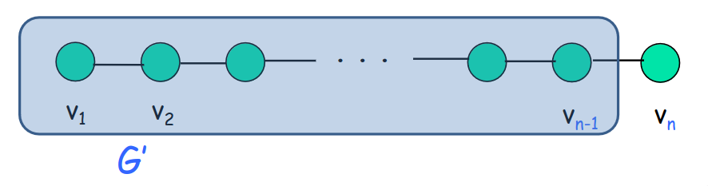
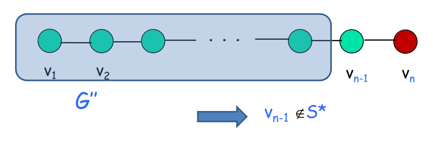
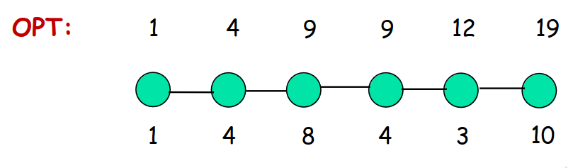
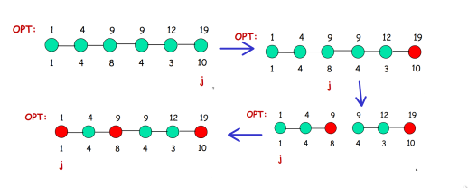

# Insieme indipendente di peso massimo

**Input**: Un cammino $G$ di $n$ nodi. Ogni nodo $v_{i}$ ha un *peso* $w_{i}$.

**Goal**: Trovare un insieme indipendente di **peso massimo**, ovvero un insieme **S** di nodi tale che:
1. $S$ è un insieme indipendente (*II*),
2. $w(S) = \sum_{v_{i}\in V} w_{i}$ è piu grande possibile.

> [!NOTE]
> Un **insieme indipendente (*II*) di $G$ è un sottoinsieme di nodi che non contiene due nodi adiacenti, ovvero per ogni coppia di nodi dell'insieme, i 
> due nodi non sono collegati da un arco.


Per risolvere questo problema, possiamo tentare a risolverlo mediante algoritmi di forza bruta, greedy e divide et impera.

1. **Brute Force**.  
    L'idea è quella di enumerare tutti i sottoinsiemi degli $n$ nodi, per ognuno verifichiamo che è un insieme indipendente, ne calcoliamo il peso e teniamo quello di peso massimo. Il problema sta nel numero di sottoinsiemi che sono troppo, ovvero $2^{n}$.
2. **Greddy**.  
    L'idea è quella di costruire la soluzione in modo incrementale scegliendo ogni volta il nodo indipendente di valore massimo. Il problema sta nella corretteza di questo algoritmo, in quanto funziona solo per determinate istanze.
    Si può osservare come nella prima istanza l'algoritmo greedy ha trovato la soluzione ottima, mentre nella seconda istanza la soluzione dell'algoritmo greedy è diversa dalla soluzione ottima. Possiamo concludere che l'algoritmo greedy non funziona. 
    

    


3. **Divide Et Impera**.  
    L'idea è quella di dividere a metà il cammino, calcolare il modo ricorsivo l'insieme indipendente di peso massimo sulle due metà e poi combinare le soluzioni. 

    Osserviamo che la soluzione migliore a "destra" è 4 mentre a "sinistra" è 5, combinando le due soluzioni ottengo una soluzione non valida, poichè 4 e 
    5 non formano un insieme indipendente. Esiste però un modo per risolvere i problemi al momento della combinazione delle due soluzione, che però 
    risulta difficile. Possiamo concludere che anche la tecnica divide et impera non funziona.


Perchè questi approcci non funzionano? Il problema principale è che non stiamo capendo davvero la **struttura del problema**. Riuscendo a capire bene la 
struttura del problema ci porterà a sviluppare un **nuovo approccio**.

**Passaggio critica**: ragionare sulla struttura/proprietà della soluzione (ottima) del problema, ovvero di ragionare in termini di soluzioni (ottime) di 
sottoproblemi più "piccoli".

**Obiettivo**: esprimere la soluzione del problema come combinazione di soluzioni di (opportuni) sottoproblemi. Se le combinazioni sono "poche" possiamo 
cercare la combinazione giusta per forza bruta.

> [!NOTE]
> Sia $S^{\star}$ la soluzione ottima, ovvero l'insieme indipendente di peso massimo di $G$. Considera l'ultimo nodo $v_{n}$ di $G$.  
> $v_{n}\in S$ oppure $v_{n}\notin S$.

1. $v_{n}\notin S$, conside $G^{'} = G - (v_{n})$, allora $S^{\star}$ è una soluzione ottima per $G^{'}$, perché se esistesse una soluzione $S$ migliore 
    per $G^{'}$, $S$ sarebbe migliore anche per $G$: assurdo!

2. $v_{n}\in S$, considera $G^{''} = G - (v_{n-1}, v_{n})$, allora $S^{\star} - v_{n}$ è una soluzione ottima per $G^{''}$, perché se esistesse una 
    soluzione $S$ migliore per $G^{''}$, $S\cup (v_{n})$ sarebbe migliore di $S^{\star}$ per $G$: assurdo! 


**Proprita**: L'insieme indipendente di peso massimo per $G$ deve essere o:
1. L'insieme indipendente di peso massimo per $G^{'}$,
2. $v_{n}$ unito all'insieme indipendente di peso massimo per $G^{''}$.

- Una prima idea sarebbe di calcolare entrambe le soluzioni e restituire la migliore delle due, purtroppo però questa soluzione richiederebbe troppo 
$O(\phi)^n$.
- Ma se invece di calcolare ogni volta tutte le soluzioni, calcolassimo solo i problemi distinti? Osserviamo che ci sono $\theta(n)$ problemi distinti ovvero c'è un sottoproblema per ogni prefisso di $G$. Quindi l'idea migliore è di procedere iterativamente considerando prefissi di $G$ dai più piccoli verso i più grandi.

Definiamo quindi:
- $G_{j}$: sottocammino composto dai primi $j$ vertici di $G$.
- Sottoproblema $j$: calcolare il peso del miglior insieme indipendente per $G_{j}$.
- $OPT[j]$: valore soluzione del $j-esimo$ sottoproblema, ovvero il peso dell'insieme indipendente di peso massimo di $G_{j}$.

> [!IMPORTANT] 
> - $OPT[1] = w_{1}$; $OPT[2] = max(w_{1}, w_{2})$. 
> - $OPT[j] = max(OPT[j - 1], w_{j} + OPT[j - 2])$.



Adesso abbiamo tutti i strumenti necessari per definire l'algoritmo.

> [!IMPORTANT]
> - $G_{j}$: sottocammino composto dai primi $j$ vertici in $G$
> - $OPT[]$: vettore di $n$ elementi. Dentro $OPT[j]$ mettiamo il peso dell'insieme indipendente di peso massimo di $G^{j}$.

```
1. OPT[1] = w1
2. OPT[2] = max{w1, w2}
3. for j = 3 to n do 
4.     OPT[j] = max{OPT[j - 1], wj + OPT[j - 2]}
5. return OPT[n]
```
**Complessità Temporale**: $T(n) = \theta(n)$.

Questo algoritmo calcola il valore della soluzione ottima, ma non la soluzione. In seguito troveremo un algoritmo anche per calcolare in tempo lineare 
l'insieme indipendente di peso massimo.

Due approcci:

1. Mentre calcoliamo OPT, possiamo mantenere esplicitamente anche la soluzione. Non è ottima in quanto andiamo a sprecare spazio e tempo.
2. Ricostruire la soluzione solo alla fine sfruttando $OPT[j]$.

> [!IMPORTANT]
> Proprità chiave: $v_{i}\in II$ di peso massimo di $G_{j} <=> w_{j} + OPT[j-2]\geq OPT[j-1]$.

```
Sia S un insieme vuoto
j = n
while j >= 3 do 
    if OPT[j - 1] >= wj + OPT[j - 2] then j = j - 1
    else 
        aggiungi il nodo vj ad S
        j = j - 2
    if j = 2 e w2 > w1 then aggiungi il nodo v2 ad S
    else aggiungi il nodo v1 ad S
return S
```
**Complessità Temporale**: $T(n) = \theta(n)$.



> [!IMPORTANT]
> ## Principi principali della programmazione dinamica:
> 1. Identificare un numero piccolo di sottoproblemi.
>   - I sottoproblemi devono essere pochi.
>   - Risolti tutti i sottoproblemi si può calcolare velocemente la soluzione al problema originale.
>   - Ci devono essere sottoproblemi "piccoli", ovvero casi base.
>   - Ci deve essere un ordine in cui risolvere i sottoproblemi.
> 2. Descrivere la soluzione di un generico sottoproblema in funzione delle soluzioni di sottoproblemi più "piccoli".
> 3. Le soluzioni dei sottoproblemi sono memorizzate in una tabella.
> 4. Avanzare opportunatamente sulla tabella, calcolando la soluzione del sottoproblema corrente in funzione delle soluzioni di sottoproblemi già risolti.
