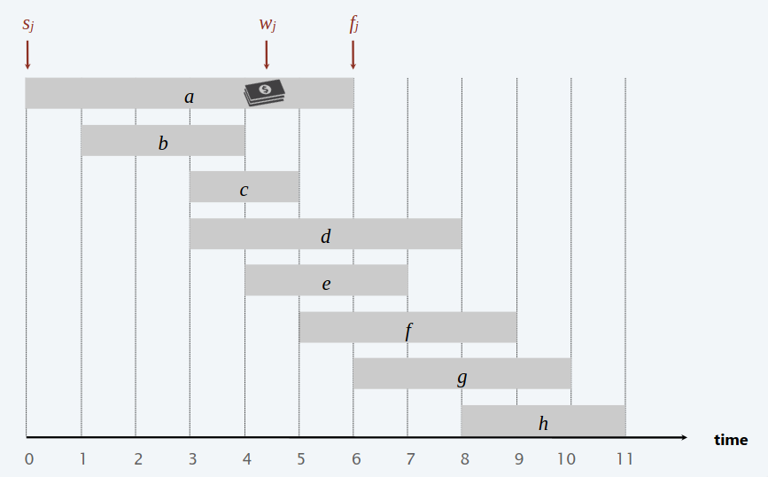
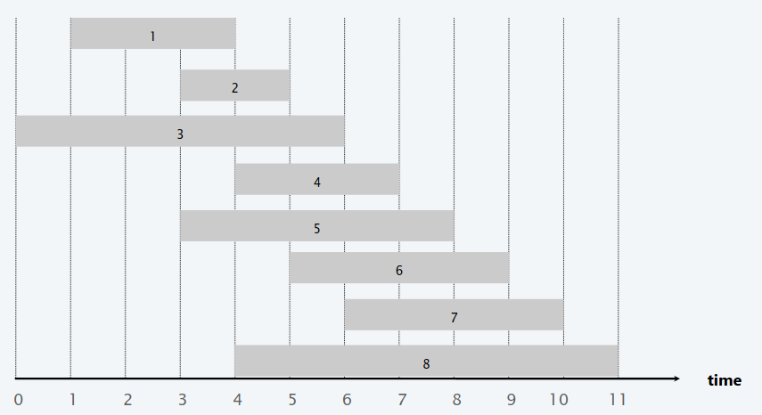
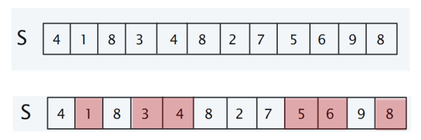
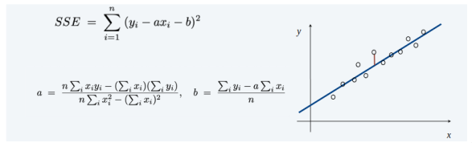
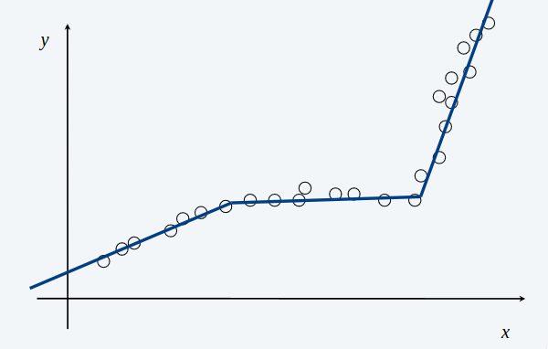

# Weighted interval scheduling 

Questo problema è una generalizzazione dell'interval scheduling, problema che abbiamo risolto mediante un algoritmo greedy. Osserveremo che il problema 
che abbiamo risolto con l'algoritmo greedy è un istanza di questo problema generale.

> [!IMPORTANT]
> - Il $j-esimo$ job inizia a $s_{j}$ e termina a $f_{j}$, avendo un peso $w_{j} > 0$, che potrebbe rappresentare il profitto guadagnato se eseguito quel job.
> - Due job $i$ e $j$ con $s_{i} \leq s_{j}$ si dicono **incompatibili** se non si sovrappongono, ovvero se $f_{j} \geq s_{i}$.
> - **GOAL**: L'obbiettivo è di trovare il sottoinsieme di peso massimo di job mutualmente compatibili.



Come detto prima, l'algoritmo `earliest finish-time first`, ovvero l'algoritmo greedy progettato in precedenza funziona solo con un determinata istanza di questo problema generale, ovvero se il peso di tutti i job è 1.

Per convenzione, ordiniamo i job in ordine crescente per finish-time, come nell'algoritmo greedy, quindi: $f_{1} \leq f_{2} \leq$...$\leq f_{n}$.

> [!IMPORTANT]
> **DEF**: $p(j)$ è il più grande indice $i < j$ tale che l' $i-esimo$ job è compatibile con il $j-esimo$ job. Ovvero $i$ è l'intervallo più a destra che finisce prima che inizi $j$.



**Per esempio:** $p(8) = 1$, $p(7) = 3$, $p(2) = 0$. Osserviamo che se il job $i$ compatibile con $j$ non esiste, allora $p(j) = 0$.

Adesso, abbiamo tutto il necessario per progettare l'algoritmo di programmazione dinamica che risolve questo problema.

> [!IMPORTANT]
> - **DEF**: $OPT(j)$ è il peso massimo di un qualunque sottoinsieme di job mutualmente compatibili per i sottoproblemi costituiti dai soli job da $1$ a $j$.  
> - **GOAL**: $OPT(n)$ è il peso massimo di un qualunque sottoinsieme di job mutualmente compatibili.

- Caso 1. $OPT(j)$ non seleziona il job $j$. Allora è una soluzione ottima per un sottoproblema costituito dai job rimanenti da $1$ a $j - 1$.
- Caso 2. $OPT(j)$ seleziona il job $j$. Allora:
    - Raccogliamo il profitto $w_{j}$.
    - Non possiamo usare job incompatibili, { $p(j) + 1$, $p{j} + 2$, ..., $j - 1$ }.
    - Deve includere la soluzione ottima dei sottoproblemi costituiti dai rimanenti job compatibili $1$, ..., $p(j)$. 

**Equazione di Bellman**:
- $OPT(j) = 0$ se $j = 0$. 
- $OPT(j) = max${$OPT(j - 1), w_{j} + OPT(p(j))$} se $j > 0$. 

```
Bottom-Up(Intervals I)
    Ordina i job per finish-time 
    Calcola p[j] per ogni j con la ricerca binaria
    OPT[0] = 0
    for j = 1 to n do 
        OPT[j] = max(OPT[j - 1], wj + OPT[p[j]])
    return M[n]
```

**Complessità temporale**: $T(n) = O(n\cdot logn)$
- Per ordina $n$ job: $O(n\cdot logn)$ con `MergeSort`.
- Per calcolare `p[j]`: $O(n\cdot logn)$ con la `BinarySearch`.
- Per calcolare `OPT[]`: $O(n)$.

Un altro approccio è quello di usare la tecnica della **memoization**. Ovvero si usa la ricorsione per calcolare OPT, ma nel mentre si memorizzano anche le soluzioni passate in un'apposita tabella.

```
Top-Down(Intervals I)
    Ordina i job per finish-time
    Calcola p[j] per ogni j con la ricerca binaria
    OPT[0] = 0
    return M-Compute-Opt(n)

M-Compute-Opt(j)
    if(OPT[j] is uninitialized)
        OPT[j] = max(M-Compute-Opt(j - 1), wj + M-Compute-Opt(p[j]))
    return OPT[j]
```
> [!IMPORTANT]
> - **Lemma**: La complessità temporale di questo algoritmo è $O(n\cdot logn)$.
> - **Dim**: 
>   - In tempo $O(n\cdot logn)$ ordiano per finish-time e calcoliamo `p[j]` per ogni j.
>   - Ogni invocazione di `M-Compute-Opt(j)` costa $O(1)$.
>   - Defiano $\phi$ come il numero di elementi inizializzati in M. All'inzio $\phi = 0$ e inoltre, per tutta l'esecuzione $\phi \leq n$. Ad ogni chiamata ricorsiva, incrementiamo $\phi$ di 1 $=>$ che è $\leq 2n$ chimate ricorsive. Di conseguenza il costo di `M-Compute-Opt(n)` è $O(n)$.

L'algoritmo sopra mostrato calcola il valore della soluzione ottima ma non la soluzione ottima.

```
Find-Solution(j)
    if(j == 0)
        return []
    else if (wj + OPT[p[j]] > OPT[j - 1])
        return [j] + Find-Solution(p[j])
    else 
        return Find-Solution(j - 1)
```

# Longest Increasing Subsequence

Data una sequenza di $n$ numeri, vogliamo trovare la sottosequenza crescente più lunga.



> [!IMPORTANT]
> - $OPT(i)$ è la lunghezza della sottosequenza crescente più lunga `S[1], ..., S[i]` che finisce con `S[i]`.
> - **GOAL**: $max_{i=1,2,...,n}$ $OPT[i]$.


**Equazione di Bellman**:
- $OPT[i] = 1 + max${$0, max_{j = 1,2,...,i-1}$ $OPT[i]$} tale che $S[j] < S[i]$.

# Segmented Least Squares
    
Partiamo dalla definizione di "least squares", (minimi quadrati). 
- Dati $n$ punti nel piano, $(x_{1}, y_{1})$, $(x_{2}, y_{2})$, ..., $(x_{n}, y_{n})$, 
- Trovare la retta $y = ax + b$ che minimizza la somma sei scarti quadratici.



Passiamo adesso alla definizione di "segmented least squares".
- Dati $n$ punti nel piano, $(x_{1}, y_{1})$, $(x_{2}, y_{2})$, ..., $(x_{n}, y_{n})$, con $x_{1} < x_{2} < ... < x_{n}$, trovare un sequenza di rette cheminimizza $f(x)$.  
- **GOAL**: Minimizzare $f(x) = E + c\cdot L$ per qualche costante $c > 0$, dove:
    - $E$ è la somma delle somme dei scarti quadratici di ciascun segmento
    - $L$ è il numero di segmenti.



> [!NOTE]
> - $OPT(j)$: è il minimo costo per i punti $p_{1}$, $p_{2}$, ..., $p_{j}$.
> - $e_{ij}$: SSE per i punti $p_{i}$, ..., $p_{j}$.

**Equazione di Bellman**

- $OPT(j) = 0$ se j = 0.
- $OPT(j) = min_{1\leq i\leq j}$ {$ e_{ij} + c + OPT(i - 1) $} se j > 0ù

```
Segmented-Least-Squares(Points, c)
    for j = 1 to n
        for i = 1 to j do 
            Calcola eij 

    OPT[0] = 0
    for j = 1 to n do 
        OPT[j] = min 1<=i<=j {eij + c + OPT[i - 1]}

    return OPT[n]
```
**Complessità Temporale**: $T(n) = O(n^3)$, se si precalcolano le somme, allora il costo è $O(n^2)$.
**Complessità Spaziale**: $T(n) = O(n^2)$.

# Knapsack Problem 


