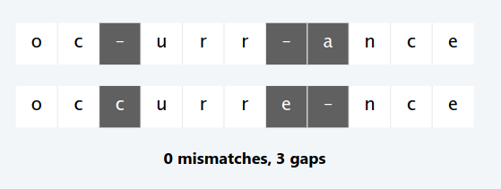
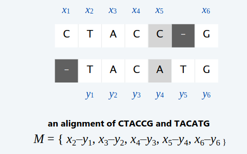
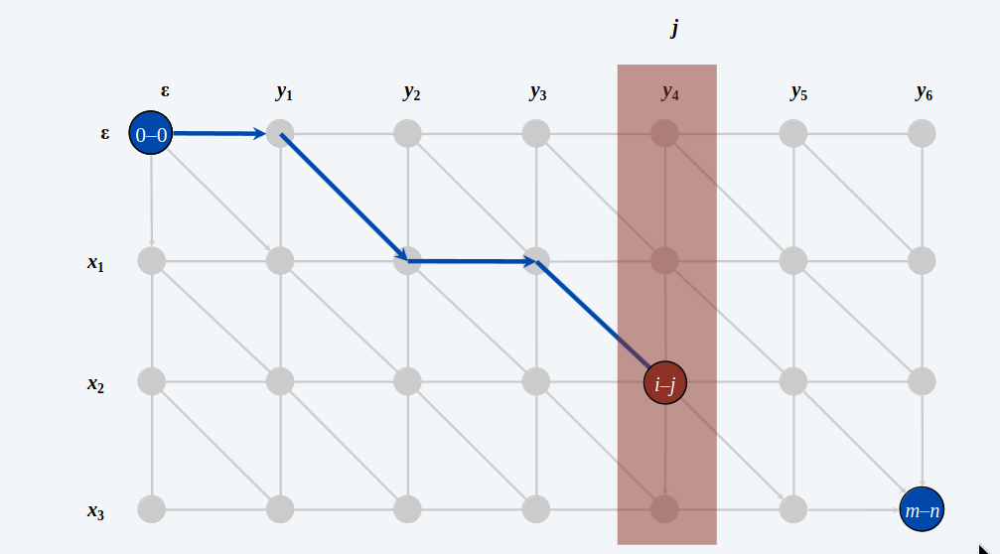
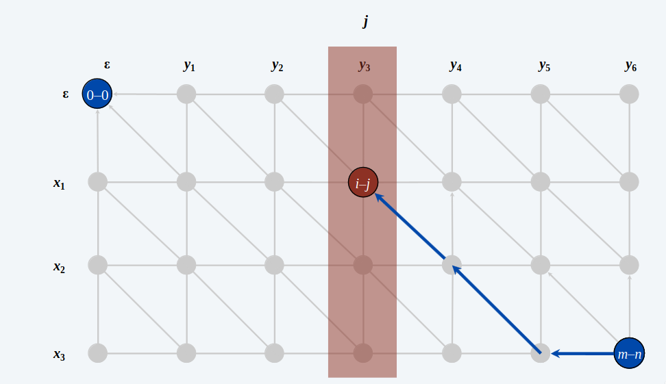
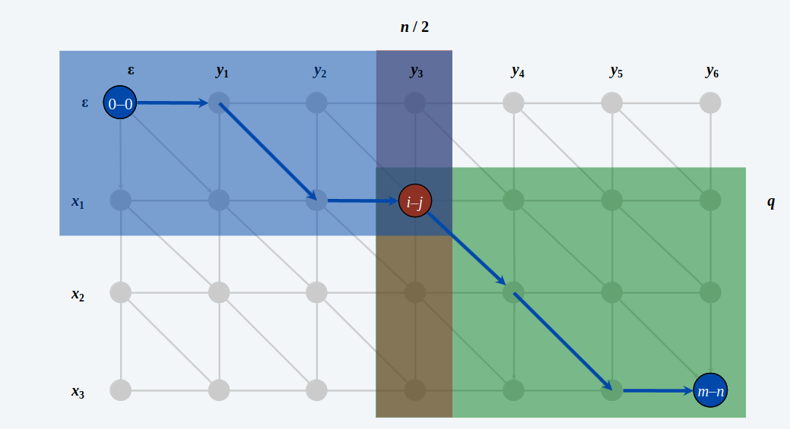

# Sequence Alignment

Date due stringhe $s_{1}$ e $s_{2}$, vogliamo in qualche modo capire quanto sono simili queste stringhe tra loro. Un approccio è di mettere le stringhe una sotto l'altra e di tenere conto dei "mismatch" tra i singoli caratteri, ovvero se due caratteri sono diversi tra loro, dati due carattere $a_{i}^{'} \in s_{1}$ e $a_{i}^{''} \in s_{2}$, $a_{i}^{'} \neq a_{i}^{''}$. Oltre ai "mismatch", prendiamo in considerazione anche i "gap", cioè se allineiamo le due stringhe, magari con lunghezze diverse, risulta un "buco".

> [!NOTE]
> - Per esempio: ocurrance e occurrence.



Per definire meglio questo concetto, è stato definita **EDIT DISTANCE**.
> [!IMPORTANT]
> **Edit Distance**  
> - Gap penalty $\delta$: il costo da pagare per gap.
> - Mismatch penalty $\alpha_{pq}$: il costo da pagare per un mismatch dati due caratteri $p$ e $q$. Questo costo può variare in base ai caratteri.
> - Costo: $\delta + \alpha_{pq}$ per ogni mismatch tra i caratteri $p$ e $q$.

## Definizione del problema

> [!IMPORTANT]
> **SEQUENCE ALIGNMENT**
> - **Goal**: Date due stringhe $X = x_{1}x_{2}...x_{m}$ e $Y = y_{1}y_{2}...y_{3}$, trovare il costo minimo di allineamento.
> - **Def**: Un *allineamento* $M$ è un insieme ordinato di coppie $x_{i}$ - $y_{i}$ tale che ciascun carattere appare al massimo in una coppia e senza incroci, $x_{i}$ - $y_{j}$ e $x_{i^{'}}$ - $y_{j^{'}}$ si incrociano se $i < i^{'}$ ma $j > j^{'}$.
> - **Def**: Il *costo* di un allineamento $M$ è:  
$$cost(M)
=
\sum_{x_{i}, y_{j}\in M}{\alpha_{x_{i}, y_{j}}} + 
\sum_{i: x_{i} unmatched}{\delta} + 
\sum_{j: y_{j} unmatched}{\delta} 
$$



## Definizione della soluzione

> [!IMPORTANT]
> - **Def**: $OPT(i, j)$: minimo costo per allineare i prefissi $x_{1}$, $x_{2}$, ..., $x_{i}$ e $y_{1}$, $y_{2}$, ..., $y_{j}$ delle stringhe $X$ e $Y$
> - **Goal**: $OPT(m, n)$.
> - **Caso 1**: $OPT(i, j)$ è il costo della mancata corrispondeza (*mismatch*) tra il carattere $x_{i}$ e il carattere $y_{j}$ più il costo minimo dell'allineamento dei prefissi $x_{1}$, ..., $x_{i - 1}$ e $y_{1}$, ..., $y_{j - 1}$.
> - **Caso 2a**: $OPT(i, j)$ lascia $x_{i}$ senza corrispondeza. Di conseguenza paghiamo il costo di un gap $x_{i}$ più il minimo costo dell'allineamento $x_{1}$, ..., $x_{i - 1}$ e $y_{1}$, ..., $y_{j}$.
> - **Caso 2b**: $OPT(i, j)$ lascia $y_{j}$ senza corrispondeza. Di conseguenza paghiamo il costo di un gap $y_{j}$ più il minimo costo dell'allineamento $x_{1}$, ..., $x_{i}$ e $y_{2}$, ..., $y_{j - 1}$.

**Equazione di Bellman**

- $OPT(i, j) = j \cdot \delta$ se $i = 0$. 
- $OPT(i, j) = i \cdot \delta$ se $j = 0$. 
- $OPT(i, j) = min${ $\alpha_{x_{i}y_{i}} + OPT(i - 1, j - 1)$, $\delta + OPT(i - 1, j)$, $\delta + OPT(i, j - 1)$ }.

```
Sequence-Alignment(X, Y, Delta, Alpha)
    m = Len(X)
    n = Len(Y)
    for i = 0 to m do
        M[i, 0] = i * Delta
    for i = 0 to n do
        M[0, j] = j * Delta

    for i = 1 to m do
        for j = 1 to n do 
            M[i, j] = min{
            Alpha[xi, yi] + M[i - 1, j - 1],
            Delta + M[i - 1, j],
            Delta + M[i, j - 1]
            }

    return M[m, n]
```
**Complessità Temporale e Spaziale:** 
$$T(n) = \theta(m\cdot n)$$

$$S(n) = \theta(m\cdot n)$$

# L'algoritmo di Hirschberg

> [!IMPORTANT]
> - **Teorema di Hirschberg**: Esiste un algoritmo per trovare l'allineamento ottimo in tempo $O(m\cdot n)$ e spazio $O(m + n)$.
> - E' una combinazione intelligente di *divide et impera* e *programmazione dinamica*.

> [!NOTE]  
> **Osservazione**: Per calcolare la prossima colonna/riga della matrice abbiamo bisogno solamente delle prime 2 colonne/righe, pertanto manterremo in memoria solo 2 array alla volta, in questo modo usiamo $O(m + n)$ spazio e non più $O(m\cdot n)$. L'unico problema è che facendo così, saremo in grado solo di calcolare il valore ottimo di edit distante, ma non l'allineamento ottimo, non avendo tutti i risultati della matrice.

> [!IMPORTANT]
> - Sia $f(i, j)$ la lunghezza del cammino minimo da $(0, 0)$ a $(i, j)$.
> - Possiamo calcolare $f(*, j)$ per ogni $j$ in tempo $O(m\cdot n)$ e spazio $O(m + n)$.
> - **Lemma**: $f(i, j) = OPT(i, j)$ per ogni $i$ e $j$.
> - **Dim (per induzione su $i + j$)**: 
> 1. Caso base: $f(0, 0) = OPT(0, 0) = 0$.
> 2. Ipotesi Induttiva: assumiamo vero per ogni $(i^{'}, j^{'})$ con $i^{'} + j^{'} < i + j$.
> 3. L'ultimo arco del cammino minimo a $(i, j)$ va da $(i - 1, j - 1)$, $(i - 1, j)$, oppure $(i, j - 1)$.
> 4. Quindi 
$$f(i, j) =$$ 
$$min(\alpha_{x_{i}, y_{i}} + f(i - 1, j - 1), \delta + f(i - i, j), \delta + f(i, j - 1)) =$$
Qui applichiamo l'ipotesi induttiva.
$$min(\alpha_{x_{i}, y_{i}} + OPT(i - 1, j - 1), \delta + OPT(i - i, j), \delta + OPT(i, j - 1)) =$$
Che è uguale all'equazione di Bellman.
$$OPT(i, j)$$



> [!IMPORTANT]
> - Sia $g(i, j)$ la lunghezza del cammino minimo da $(i, j)$ a $(m, n)$.
> - Possiamo calcolare $g(i, j)$ invertendo l'orientamento degli archi e invertendo i $(0, 0)$ e $(m, n)$.
> - Possiamo calcolare $g(*, j)$ per ogni $j$ in tempo $O(m\cdot n)$ e spazio $O(m + n)$.



> [!IMPORTANT]
> - **Oss. 1**: La lunghezza del cammino minimo passante per l'arco $(i, j)$ è $f(i, j) + g(i, j)$.
> - **Oss. 2**: Sia $q$ l'indice che minimizza $f(q, \frac{n}{2}) + g(q, \frac{n}{2})$. Allora, esiste il cammino minimo da $(0, 0)$ a $(m, n)$ che passa per $(q, \frac{n}{2})$.
> - A questo punto, possiamo utilizzare la techina **divide et conquer** per questo problema. 
> - **Divide**: Trova l'indice $q$ che minimizza $f(q, \frac{n}{2}) + g(q, \frac{n}{2})$; salva il nodo $i-j$ come nodo della soluzione.
> - **Conquer**: Ricorsivamente calcola il valore dell'allineamento ottimo per ciascun pezzo.



> [!IMPORTANT]
> - **Complessità Spaziale**: $S(n) = \theta(m + n)$, perche ci sono $\leq n$ chiamate ricorsive, ciascuna usa $\theta(m)$ spazio per calcolare $f$ e $g$.
> - **Complessità Temporale**: Sia $T(m, n)$ la il tempo di esecuzione dell'algoritmo di Hirschberg su istanze di stringhe di dimensione $m$ e $n$. 
> - Sia $T(m, n) = T(q, \frac{n}{2}) + T(m - q, \frac{n}{2})$ l'equazione di ricorrenza, usando il metodo della sostituzione otteniamo:
> - Selezioniamo una costante $c$ tale che: 
> $$T(m, 2) \leq cm$$
> $$T(2, n) \leq cn$$
> $$T(m, n) \leq cmn + T(q, \frac{n}{2}) + T(m - q, \frac{n}{2})$$
> - Allora: $T(m, n) \leq 2\cdot c\cdot m\cdot n$
> - Caso base: $m = 2$ e $n = 2$
> - Ipotesi induttiva: $T(m^{'}, n^{'}) \leq 2m^{'}n^{'}$ per ogni $(m^{'}, n^{'})$ tale che $m^{'} + n^{'} < m + n$.
> $$T(m, n) \leq T(q, \frac{n}{2}) + T(m - q, \frac{n}{2}) + cm$$
> $$\leq 2cq\frac{n}{2} + 2(m - q)\frac{n}{2} + cmn$$
> $$= cqn + cmn - cqn + cmn$$
> $$= 2mn$$


