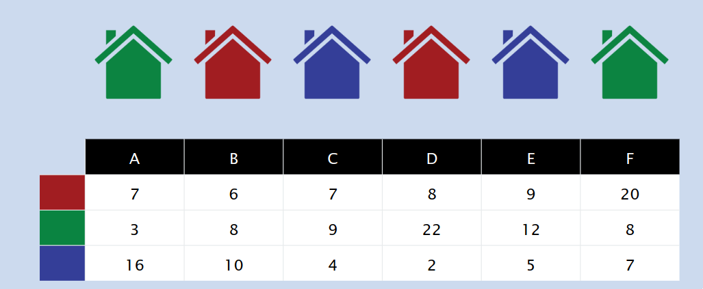

# Colorazione case

> [!IMPORTANT]
> - **GOAL**: Dipingere $n$ case di colore rosso, verde e blu tale che:
>   - Due case adiacenti devono avere colore diverso
>   - Minimizzare il costo totale, dove $cost(i, color)$ è il costo per colorare l' $i-esima$ casa con un determinato colore.



> [!IMPORTANT]
> - **DEF**: $OPT(i) = (val, col)$ è la soluzione ottima per le case $1$, ..., $i$, dove:
>   - $col$ è il colore dell' $i-esima$ casa.
>   - $val$ è il valore della soluzione ottima fino all' $i-esima$ casa.  
> - **DEF**: Siano R, G, B, 3 array dove $R[i] = cost(i, red)$, $G[i] = cost(i, green)$, $B[i] = cost(i, blue)$.
>   Sapendo quindi per ogni casa,qual è il suo colore, possiamo determinare la soluzione ottima per questo problema.
> - **RETURN**: $OPT(n).val$

**Formuala di Bellman**

- $OPT(i) = (val_{i}, col_{i}) = (min${ $R[i], G[i], B[i]$ } $, color)$ se $i = 1$ e $color$ è il colore riferito al valore minimo.
- $OPT(i) = (val_{i}, col_{i}) = (val_{i-1} + min[${ $R[i], G[i], B[i]$ } $\setminus$ { $col_{i-1}$ } $], color)$, se $i \geq 2$ e $color$ è il colore riferito al valore minimo. 

```
HouseColor(Houses)
    Sia R un array contenenti il costo per dipingere ciascuna casa con il colore rosso
    Sia G un array contenenti il costo per dipingere ciascuna casa con il colore verde
    Sia B un array contenenti il costo per dipingere ciascuna casa con il colore blu

    OPT[1] = (min(R[0], G[0], B[0]), color)
    for i = 2 to n do 
        OPT[i] = (OPT[i-1].val + min({R[i], G[i], B[i]} \ {OPT[i-1.col]}), color)

    return OPT[n].val
```
**Complessità Temporale**: $T(n) = \theta(n)$

**Codice in Python**:

```python
class House:
    def __init__(self, red, green, blue) -> None:
        self.red = red
        self.green = green
        self.blue = blue

def create_houses():
    return [
        House((7, "R"), (3, "G"), (16, "B")),
        House((6, "R"), (8, "G"), (10, "B")),
        House((7, "R"), (9, "G"), (4, "B")),
        House((8, "R"), (22, "G"), (2, "B")),
        House((9, "R"), (12, "G"), (5, "B")),
        House((20, "R"), (8, "G"), (7, "B")),
    ]

def house_coloring(Houses):
    n = len(Houses)
    OPT = [(0, 0)] * n

    R = [house.red for house in Houses]
    G = [house.green for house in Houses]
    B = [house.blue for house in Houses]

    print("[INFO]: RED ", R)
    print("[INFO]: GREEN", G)
    print("[INFO]: BLUE", B)

    OPT[0] = min(R[0], G[0], B[0])

    total_cost = OPT[0][0]

    i = 1
    for elem in OPT:
        new_elem = (0, 0)
        _, color = elem

        if i == n:
            break

        if color == "R":
            new_elem = min(G[i], B[i])
        elif color == "G":
            new_elem = min(R[i], B[i])
        elif color == "B":
            new_elem = min(G[i], R[i])

        total_cost += new_elem[0]

        OPT[i] = new_elem
        i += 1

    return OPT, total_cost

houses = create_houses()
OPT, sol = house_coloring(houses)
print("[INFO]: Il costo della soluzione ottima è", sol)
print("[INFO]: La soluzione ottima è", OPT)
```
