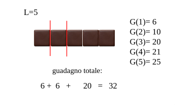
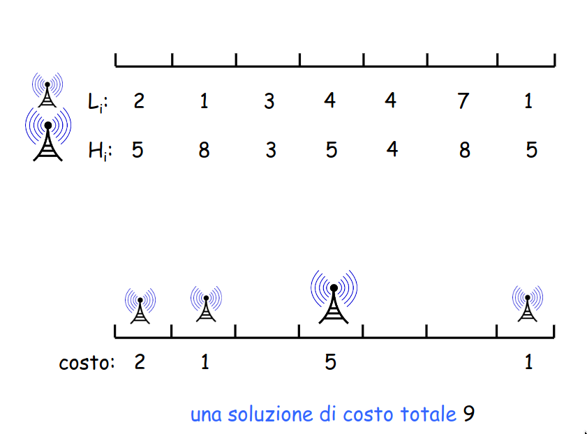
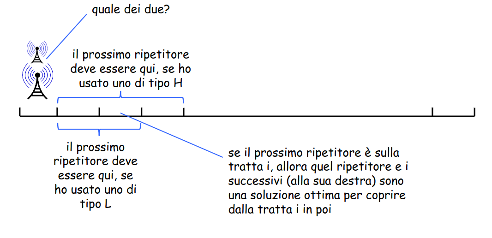

# Esercizio 1

Il signor Valter Bianchi, dopo aver fatto un bel gruzzoletto vendendo cristalli non proprio legali, ha deciso di diversificare la suà attività e si è messo a vendere della roba anch'essa non proprio legale, che per comodità chiameremo stecca di cioccolato. La stecca di cioccolata può essere venduta tutta intera o può essere spezzata in segmenti più piccoli da vendere separatamente. La lunghezza della stecca di cioccolata è $L\in \mathbb{N}$ cm.
Si assuma che nello spezzare la stecca la lunghezza dei pezzi ottenuti debba ancora essere un numero intero. Per esempio un pezzo lungo 3 cm può essere venduto così, spezzato in tre pezzi da 1 cm o in due pezzi: uno da 2 cm e l'altro da 1 cm. Il guadagno che il signor Valter Bianchi riesce a fare se vende un pezzo lungo $t$ cm è $G(t)$, $t = 1$, $2$, ..., $L$. Progettare un algoritmo di programmazione dinamica che aiuti il signor Valter Bianchi a guadagnare il più possibile. La complessità temporale dell'algoritmo deve essere polinomiale in $L$.



Nella figura è mostrato un esempio di istanza con $L = 5$. La soluzione ottima, ovvero il modo di spezzare la cioccolata per ottenere guadagno massimo è mmostrato in rosso.

> [!IMPORTANT]
> Immaginiamo di avere la soluzione ottima, il modo migliore di spezzare la stecca di cioccolata di lunghezza $L$. Sia $k$ l'ultima spezzata della soluzione ottima. Dato $k$, è chiaro che il guadagno ottenuto della soluzione ottima è uguale al guadagno ottenuto dall'ultimo pezzo di cioccolata (di lunghezza $L - k$) più il guadagno relativo ai pezzi in cui è poi ridiviso il pezzo di lughezza $k$.  
> Abbiamo quindi espresso la soluzione ottima in questo modo: $ottimo(L) = G(L - k) + ottimo(k)$.

1) **Come possiamo conoscere $k$?** Non possiamo conoscere $k$, però possiamo indovinarlo, infatti l'ultima spezzata può trovarsi in $O(L)$ posizioni, ovvero $k$ può essere uguale a $L$, $L - 1$, ..., $1$ o $0$.
Quindi l'idea è quella di provare tutte queste possibilità e prendere la migliore che, quindi, sarà la soluzione ottima. $ottimo(L) = max_{k = 0,1,...,L}(G(L - k) + ottimo(k)))$.
2) **Come definiamo i sottoproblemi?** Una volta intuita la struttura della soluzione, tutto diventa più semplice. E' chiaro che la soluzione ottima per $L$ è definita in funzione della soluzione ottima per $k$, con $k < L$. Quindi:  
> [!IMPORTANT]
> - $OPT(j)$: il guadagno massimo ottenibile da una stecca di cioccolata lunga $j$.
> - I sottoproblemi sono relativamente pochi, $O(L)$.
> - La soluzione cercata del problema è $OPT(L)$.

**Equazione di Bellmann**

- $OPT(0) = 0$
- $OPT(j) = max_{k=0,1,...j-1}(G(j - k) + OPT(k))$

```
Cioccolata(G, L)
    OPT(0) = 0
    for j = 1 to L do 
        OPT(j) = max_k (G(j - k) + OPT(k)) // per k = 0, 1, ..., j -1
    return OPT(L)
```

**Complessità temporale**: $T(n) = O(L^2)$.

# Esercizio 2

Si vuole dotare una pista ciclabile di un buon servizio wifi. Per fare questo si devono installre dei ripetitori wireless. La pista ciclabile è lunga $n$ tratte. Il costo di installazione di un ripetitore non è uniforme e dipende dalla tratta in cui si installa il ripetitore e dal tipo del ripetitore. In particolare, ci sono due tipi di ripetitori, uno di tipo $high (H)$, e uno di tipo $low (L)$.

Se nella tratta $i$ si installa:
- un ripetitore di tipo $L$, il ripetitore è in grado di fornire il servizio alle tratte $i$ e $i + 1$. Il costo di installazione è $L_{i}$.
- un ripetitore di tipo $H$, il ripetitore è in grado di fornire il servizio alle tratte $i$, $i + 1$ e $i + 2$. Il costo di installazione è $H_{i} \geq L_{i}$. 

Progettare un algoritmo di programmazione dinamica che calcoli una soluzione di costo totale minimo che fornisce il servizio a tutte le tratte.



**Idea**:
- Indovinare il tipo di ripetitore installato nella soluzione ottima nella tratta 1
- Questo copre alcune tratte che ora non è più necessario coprire
- Coprire le tratte restanti all'ottimo
- Non è detto che nell'ottimo non ci sia un ripetitore anche nella tratta 2!



> [!IMPORTANT]
> - $OPT(i)$: costo minimo per coprire le tratte $i$, $i + 1$, ..., $n$.
> - Soluzione cercata: $OPT(1)$
> - Equazione di Bellmann: $OPT(i) = min${ $L_{i} + OPT(i + 1)$, $L_{i} + OPT(i + 2)$, $H_{i} + OPT(i + 3)$ }
> - $OPT(i) = 0$ per $i > n$

```
CalcoloCostoInstallazione()
    OPT[n + 1] = OPT[n + 2] = 0
    for i = n down to 1 do 
        OPT[i] = min{L[i] + OPT[i + 1], L[i] + OPT[i + 2], H[i] + OPT[i + 3]}
    return OPT[1]
```

**Complessità temporale**: $T(n) = O(n)$.
