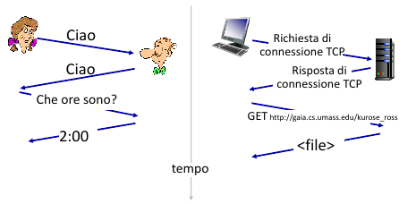
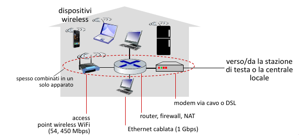

# Introduzione

## Cos'è Internet? (Rete di reti)

- E' un insieme di miliardi di **dispositivi di calcolo** connessi (host = end system), e sono gli host che eseguono le applicazioni di rete ai confini di internet (edge). Gli host sono di due tipi:
    - client: host che richiedono servizi
    - server: host che erogano servizi
- E' un insieme di **commutatori di pacchetti** (packet switches): inoltrano i pacchetti router (a livello di rete), switch (a livello di collegamento)
- E' un insieme di **reti di collegamenti**: Fibra, rame, radio; ognuna di queste avendo prestazioni diverse (transmission rate) 
- Infine è un insieme di **reti**: collezione di dispositivi, router, collegamenti gestiti da un'organizzazione.

> [!IMPORTANT]
> Quindi internet è una rete di reti, ovvero tante reti interconnessi tramite ISP (Internet Service Provider, come TIM, Telecom, etc...).

A livello di "servizi", Internet è un' **infrastruttura** che fornisce servizi alle applicazioni (web, streaming, e-commerce, gaming, etc...).
Inoltre fornisce un un' **interfaccia di programmazione** alle applicazioni distribuite:
- "hook" che consentono alle applicazioni mittente/destinataria di "connettersi", usare il servizio di trasporto Internet
- fornisce molte opzioni di servizio analogamente al servizio postale.

## Cos'è un protocollo

> [!IMPORTANT]
> Un **protocollo** definisce il **formato** e l' **ordine dei messaggi scambiati** tra due o più entità in comunicazione, così come le **azioni intraprese** in fase di trasmissione e/o di ricezione di un messaggio o di un altro evento.

## Reti di accesso

- reti di accesso residenziali
- redi di accesso aziendale (scuole, aziende)
- redi di accesso mobile (WiFi, 4G/5G)

> [!IMPORTANT]
> L' **edge router** è il primo router sul percorso dal sistema d'origine a un qualsiasi altro sistema di destinazione collocato al di fuori della stessa rete di accesso.

### 1. Accesso via cavo (coassiale)

> [!IMPORTANT]
> FDM (Frequency division multiplexing): canali diversi sono trasmessi in bande di frequenza diverse

> [!IMPORTANT]
> Velocità Assimmetriche: velocità effettive inferiori per limitazioni del provider, distanza, qualità materiale e interferenze.

- HFC (Hybrid Fiber Coax): asimmetrico, fino a 40 Mbps - 1.2 Gbps in downstream, 30-100 Mbps in upstream
- Rete ibrida a fibra e cavo coassiale collega le case ai router degli ISP
    - l' utenza domestica **condivide la rete di accesso** alla stazione di testa
        - *downstream*: download concorrenti avvengono ciascuno a velocità inferiori alla velocità totale del canale di downstream 
        - *upstream*: necessità di un protocollo di accesso multiplo distribuito per coordinare le trasmissioni 

### 2. Digital Subscriber Line (DSL)

- utilizza la linea telefonica **esistente** verso il DSLAM nella centrale locale. I dati sulla linea telefonica DSL vanno su Internet, la voce sulla linea telefonica DSL va sulla rete telefonica.
- Velocità assimmetriche:
    - 24 - 52 Mbps come tasso ti trasmissione in downstream dedicato
    - 3.5 - 16 Mbps come tasso di trasmissione in upstream dedicato

### 3. FTTx

- FTTH (Fiber-to-the-home): 1 Gbps in downlink
- FTTB (Fiber-to-the-building)
- FTTC/FTTS (Fiber-to-the-cabinet/Fiber-to-the-street): 100/200 Mbps in downlink
- FTTN (Fiber-to-the-node)
- FTTW/FTTR (Fiber-to-the-wireless/Fiber-to-the-radio)

Quando più il collegamento ottico arriva vicino alla destinazione, tanto maggiore sarà la velocità raggiunta nell'ultimo tratto.

#### FTTH

- fibra diretta: una singola fibra collega una centrale locale a un'abitazione
- alternativa: ciascuna fibra unscente dalla centrale locale è in effetti condivisa da più utenti e solo in prossimità di questi ultimi viene suddivisa in più fibre, una per ogni utente.
  
Due architetture:
- *Active Optical Network (AON)*: sono delle Ethernet commutate, con commutatori in grado di ricevere/trasmettere segnali ottici 
- *Passive Optical Network (PON)*: usano splitter ottici non alimentati che trasmette in broadcast verso gli utenti

#### Fixed Wireless Access (FWA)

E' una rete mista, ovvero fibra e radio che raggiunge i clienti con:
- una rete a banda larga, ossia con velocità fino a 30 Mbps
- una rete a banda ultralarga, ossia velocità fino a 100 Mbps

### 3. Rete domestica, aziendale, data center

- Rete domestica:

- Rete aziendale:

E' un misto di tecnologie di collegamento cablato e wireless, che collegano un misto di switch e router, avendo velocità abbastanza grandi del ordine di 1/10 Gbps.

- Rete dei data center

I collegamenti ad alta larghezza di banda (da decine o centinaia di Gbps) collegan centinaia o migliaia di server tra loro e a Internet.

## Come avviene l'invio di un pacchetto

> [!IMPORTANT]
> L'host prende il messaggio dell'applicazione e lo suddivide in frammenti più piccolo, conosciuti come **pacchetti**, di lunghezza $L$ bit. Trasmette il pacchetto nella rete di accesso al **tasso di trasferimento $R$**.  
> Quindi: ritardo di trasmissione del pacchetto = tempo necessario per trasmettere pacchetti di $L$ bit nel collegamento = $\frac{L}{R} \frac{bits}{bits/sec}$.

## Collegamenti: mezzi trasmissivi

#### 1. Doppino di rame (Twisted Pair)
E' un tipo di linea di trasmissione composta da una coppia di conduttori di rame isolati e attorcigliati uno sull'atro, allo scopo di ottimizzare alcune caratteristiche della compatibilità elettromagnetica, come ridurre la diafonia con le coppie adiacenti e in parte le interferenze esterne.

- Categoria 5: 100 Mbps, 1 Gbps Ethernet
- Categoria 6: 10 Gbps Ethernet (distanze inferiori a un centinaio di metri)

#### 2. Cavo coassiale

È composto da un singolo conduttore di rame posto al centro del cavo (anima) e da un dielettrico (generalmente in polietilene o PTFE) che separa l'anima centrale da uno schermo esterno costituito da fili metallici intrecciati (maglia) o da una lamina avvolta a spirale (treccia), garantendo costantemente l'isolamento tra i due conduttori. Lo schermo di metallo aiuta a bloccare le interferenze. Il cavo è munito poi di connettori ai suoi estremi di connessione. 

#### 3. Cavo in fibra ottica

E' un mezzo sottile e flessibile che conduce impulsi di luce, ciascuno dei quali rappresenta un bit. Ha un elevata velocità trasmissiva, essendo una trasmissione punto-punto ad alta velocità (fino a decine e centinaia di Gbps).
Attenuazione di segnale molto bassa nel raggio di 100 km, ovvero non c'e bisogno di un lelevato numero di ripetitori, inoltre è immune all'interferenza elettromagnetica.

#### 4. Canali radio

Trasportano segnali nello spettro elettromagnetico, non richiedono l'installazione fisica di cavi. 

- Wireless LAN (WiFi): decine/centinaia di Mbps, in un raggio di decine di metri
- Wide-Area: 4G / 5G
- Bluetooth: distanze brevi, velocità limitate
- Microonde terrestri: canali punto-punto, fino a 45 Mbps
- Satellitari, per esempio Starlink con velocità fino a 100 Mbs in downlink, l'unico problema è il grande ritardo. Un satellite funge da ripetitore tra due o più trasmettitori terrestri a microonde, noti come stazoni di terra.
    - Satellite in orbita LEO:   
    Non segue un orbita equitoriale, inoltre si sposta velocemente nel cielo essendo un 
    satellite a bassa quota. 
    - Satellite in orbita GEO:  
    E' sincronizzato con la rotazione terreste, infatti restra immobile nel cielo, ha un    orbita solo equitoriale ed ha un ampia copertura, essendo un satellite ad alta quota.
    
## Il nucleo della rete

> [!IMPORTANT]
> Il nucleo della rete è una maglia (mesh) di commutatori di pacchetti e collegamenti che interconnettono i sistemi periferici di Internet.

> [!IMPORTANT]
> La commutazione di pacchetto consiste nel inoltrare (forwarding) i pacchetti da un router successivo attraverso i collegamenti (links), lungo un percorso (path) dalla sorgente alla destinazione.

> [!NOTE]
> Inoltro (forwarding) o switching: **azione locale**, sposta i pacchetti in arrivo al collegamento di ingresso del router al collegamento di uscita appropriato.  
> Instradamento (routing): **azione globale**, determina i percorsi presi dai pacchetti dalla sorgente alla destinazione, mediante appositi algoritmi di instradamento.

Una tecnica di commutazione usata è detta **store-and-forward**, il router deve aver ricevuto l'intero pacchetto prima di poter cominciare a trasmettere sul collegamento in uscita. Ovvero, i pacchetti che arrivano vengono memorizzati all'interno di un buffer nel router.

> [!NOTE]
> Il ritardo da un capo all'altro (end-to-end) per la trasmissione di 1 pacchetto su un percorso di $N$ collegamenti di pari velocità $R$ è:  
> $d_{end-to-end} = \frac{N\cdot L}{R}$.  
> Mentre per la trasmissione di $P$ pacchetti su un percorso di $N$ collegamenti di pari velocità $R$ è:
> $d_{end-to-end} = \frac{(N + P - 1)\cdot L}{R}$.

Se il numero di pacchetti in arrivo sono molti di più rispetto alla veloità di commutazione, si verifica il fenomeno di **accodamento** (queuing), ovvero i pacchetti si accodano per essere trasmessi sul collegamento. Inoltre c'è grande possibilità che i pacchetti accodati possano essere scartati (persi) se il buffer si riempie.

Alternativamente alla commutazione di pacchetto si puo usare la commutazione di circuito.

> [!IMPORTANT]
> Nelle reti a commutazione di circuito le risorse richieste lungo un percorso (buffer e velocità di trasmissione sui collegamenti) per consentire la comunicazione tra sistemi periferici sono riservate per l'intera durata della sessione di comunicazione (risorse dedicate).

Le reti telefoniche sono esempi di reti a commutazione di circuito.

Guardiamo adesso l'immagine: Gli host sono tutti direttamente connessi a uno dei commutatori. Quando due host desiderano di comunicare, la rete stabilisce una **connessione end-to-end** dedicata a loro. 

> [!IMPORTANT]
> Multiplexing a Divisione di Frequenza (FDM): lo spettro di frequenza di un collegamento viene suddiviso in *bande*, dedicate a ciascuna connessione.
> La larghezza della banda viene detta **ampiezza di banda (brandwidth)**.

> [!IMPORTANT]
> Multiplexing a Divisione di Tempo (TDM): il tempo viene suddiviso in *frame* di durata fissa, ripartiti in un numero fisso di slot. Ciascun circuito riceve slot periodici e può trasmettere alla massima velocità della banda di frequenza solo nei propri slot temporali.

## Sicurezza di rete

Abbiamo diverse tipologie di minacce alla sicurezza di un rete:

#### - Analisi dei pacchetti (packet sniffing)

Un ricevitore passivo in prossimità di un ripetitore wireless può ottenere una copia di ogni pacchetto trasmesso, pacchetti che possono contenere 
informazioni molto sensibili, come password, codici fiscali, carte di credito. Un ricevitore passivo, che memorizza una copia di ciascun pacchetto 
che transita, è detto anche **packet sniffer**.

Dato che i *packet sniffer* sono passivi, cioè non immettono pacchetti sul canale, sono difficili da individuare, dobbiamo quindi accettare la possibilità
che qualche malintenzionato possa farne una copia. Una tra le migliori difese contro gli *packet sniffer* è costituita dalla crittografia.

#### - Mascheramento (IP spoofing)

E' sorprendetemente facile creare un pacchetto con un indirizzo sorgente, contenuto e indirizzo del destinatario qualsiasi e poi trasmettere questo 
pacchetto "fatto a mano" su Internet, che doverosamente inoltrerà il pacchetto a destinazione. La capacità di immettere pacchetti in Internet con un 
indirizzo sorgente falso è nota come **IP spoofing**, ed è un modo attraverso il quale un utente può spacciarsi per un altro.

Per risolvere tale problema abbiamo bisogno di autenticare il punto terminale della comunicazione (*end-point authentication*), cioè di un meccanismo 
che ci permetta di determinare con certezza se il messaggio ha avuto origine da dove supponiamo l'abbia avuta.

#### - Negazione del servizio (Denial-Of-Service, DoS)

Un'ampia classe di minacce alla sicurezza può essere classificata come attacchi di **negazione del servizio (DoS)**. Un attacco DoS rende inutilizzabile
dagli utenti leggitimi una rete, un host, per esempio, web server, DNS o reti istituzionali. Molti attacchi DoS ricadono all'interno di queste categorie:
- *Attacchi alla vulnerabilità dei sistemi*: Invio di pochi messaggi, ben costruiti, a un'applicazione vulnerabile o a un sistema operativo in esecuzione sull'host target. Se eseguito corretamente, il servizio può fermarsioppure l'host può spegnersi.
- *Brandwidth flooding*: Invio massivo di pacchetti all'host target, cosi tanti che il suo collegamento di accesso viene ostruito, impedendo ai pacchetti leggitimi di raggiungere il server.  
E' evidente che se il server ha una velocità di accesso di $R$ bps, l'attacante avrà bisnogno di mandare pacchetti ad una velocità simile o pari ad $R$.
Se $R$ è molto grande, una sola sorgente non basta per danneggiare il server, oppure con una sola sorgente, un router a monte può identificare l'attacco 
e bloccarlo. Di conseguenza vengono effettuati attacchi DoS distribuiti (*DDoS*) dove l'attacante controlla più sorgenti, e ciascuna sorgente attacca 
l'host target.
- *Connection flooding*: Stabilire un gran numero di connessioni TCP con l'host target, impedendogli di accettare nuove connessioni valide.

## Architettura a livelli

I protocolli di rete sono organizzati e implmentati in **livelli** o **strati**. Siamo interessati ai **servizi** offerti da un livello a quello 
superiore, si tratta del cosidetto **modello di servizi** di un livello. Ogni livello fornisce il suo servizio effetuando determinate azioni all'interno
del livello stesso e utilizzando i servizi del livello immediatamente inferiore.

Un livello di protocolli può essere implementato interamente via software, hardware o una combinazione dei due. I protocolli a livello applicazione, 
quali HTTP, FTP, etc... sono implementato completamente via software nei sistemi periferici. Protocolli di livelli come collegamento o fisico, sono 
implmentati a livello hardware direttamente nelle schede di rete, mentre protocolli a livello di rete sono un ibrido.

| Pila Protocollare |
| :---------------: |
|   Applicazione    |
|     Trasporto     |
|       Rete        |
|   Collegamento    |
|      Fisico       |

Considerati assieme, i protocolli dei vari servizi sono detti **pila di protocolli**.

1. **Livello Applicativo**, è la sede delle applicazioni di rete e dei relativi protocolli, come HTTP (richiesta e trasferimento di documenti web), 
SMTP (trasferimento dei messaggi di posta elettronica), FTP (trasferimento di file tra due sistemi remoti).  
I pacchetti di informazione a livello applicativo si chiamano **messaggi**.
2. **Livello di Trasporto**, trasferisce i messaggi del livello di applicazione tra punti periferici gestiti dalle applicazioni. Abbiamo due protocolli:
   - TCP: servizio orientato alla connessione, ovvero si crea una connessione affidabile tra i due host, garantendo la consegna di dati e l'ordine.
   - UDP: servizio non orientato alla connesssione, inffatti non è un servizio affidabile, e non garantisce la consegna dei dati.
I pacchetti di informazione a livello di trasporto si chiamano **segmenti**.
3. **Livello di Rete**, si occupa di trasferire i pacchetti a livello di rete, detti **datagrammi**. Il protocollo di trasporto passa al livello 
sottostante un indirizzo di destinazione, ovvero un indirizzo IP (Internet Protocol), che definisce i campi dei datagrammi. 
4. **Livello di Collegamento**, si occupa di trasferire un pacchetto da un nodo a quello successivo sul percorso. Alcuni protocoli sono Ethernet, Wi-Fi, 
PPP. I pacchetti di informazione vengono chiamati **frame**.
5. **Livello Fisico**, ha il ruolo di trasferire i singoli bit del frame da un nodo a quello successivo.

> [!IMPORTANT]
> **Incapsulamento**, un **messaggio a livello applicativo** $M$ viene passato a livello di trasporto. Ad esso vengono concatenate informazioni aggiuntive
> $H_{t}$, che saranno utilizzate dalla parte ricevente del livello di trasporto, costituendo il **segmento a livello di trasporto**.  
> Il livello di trasporto, passa il segmento al livello di rete, che concatena le proprie informazioni aggiuntive $H_{n}$, andando a creare il 
> **datagramma a livello di rete**.  
> A questo punto il datagramma viene passato a livello di collegamento, che anch'esso aggiunge le proprie informazioni $H_{l}$, creando il **frame a 
> livello di collegamento**.  
> Quindi a ciascun livello, il pacchetto ha due tipi di campi: **Header** e **Payload**.

