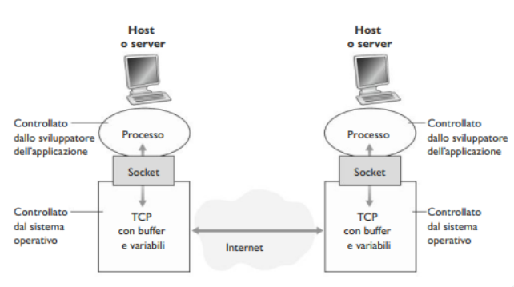
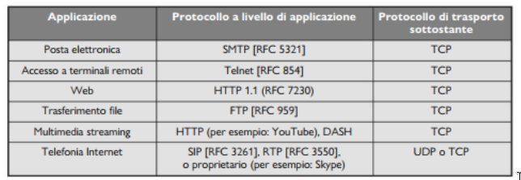
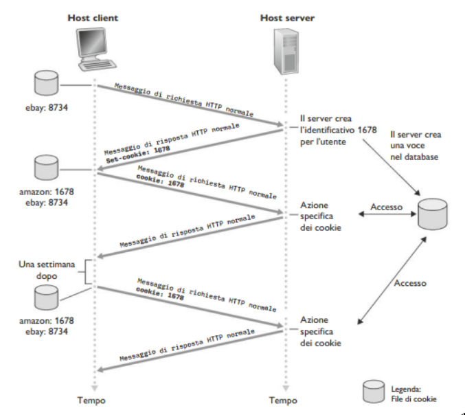
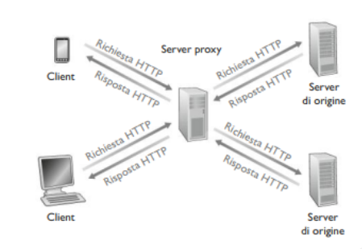
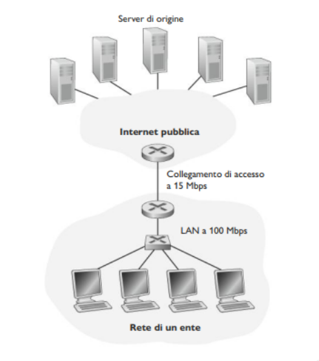
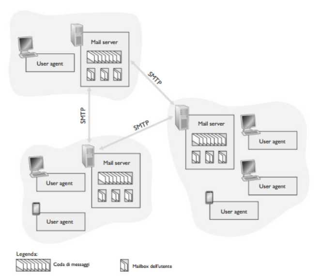
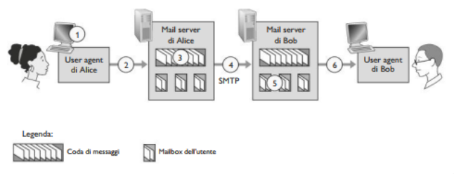
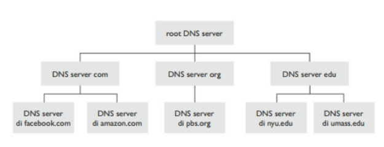
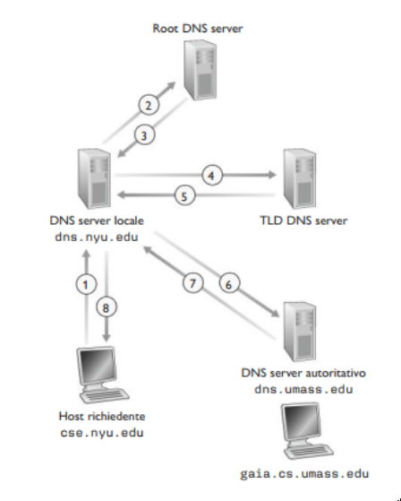
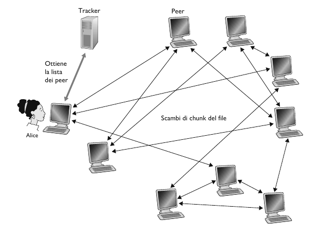

# Livello di Applicazione

## Introduzione

Il cuore dello sviluppo delle applicazioni di rete è costituito dalla creazione dei programmi che sono eseguiti dai sistemi periferici e che comunicano
tra loro via rete. Prima di inziare a scrivere codice, bisogna progettare l'**architettura dell'applicazione** e stabilire la sua organizzazione sui vari
sistemi periferici.
- **Architettura Client - Server**, nella quale vi è un host sempre attivo (*server*) che risposte alle richieste di servizio di altri host (*client*), 
per esempio un web server che risponde alle richieste dei browser.  
Spesso in un architettura client-server, un singolo host che esegue il server non basta, infatti si usano spesso **data-center** che, ospitando molti 
host, creano un potente server virtuale.
- **Architettura P2P (Peer-to-Peer)**, si sfrutta la comunicazione diretta tra coppie di host detti *peer*, ossia pari, collegate in modo intermittente.  
Uno dei punti di forza di quest'architettura è la sua intrinseca **scalabilità**, perché nuovi peer aggiungono capacità di servizio al sistema, sebbene 
generino anche nuovo carico di lavoro.

Adesso bisogna definire come processi su host diversi (client e server, o peer) comunicano tra di loro. Abbiamo visto come comunicano i processi 
all'interno dello stesso host a sistemi operativi, mediante pipe, file condivisi, etc... .  
Nel contesto delle reti, i processi comunicano scambiandosi 
**messaggi** attraverso la rete. Il processo mitttente crea messaggi e li invia attraverso la rete e il processo destinatario li riceve e, se richiesto, 
invia messaggi di risposta.

Quindi nell'architettura client-server, abbiamo un processo **client** che avvia la comunicazione, e un processo **server** che è in attesa di richieste.
Mentre nell'architettura P2P, un processo può essere sia client che server.

Un processo invia e riceve messaggi dalla rete attraverso un'interfaccia software detta **socket**. Un processo che vuole inviare un messaggio in rete, 
fa uscire il messaggio dalla propria "porta" (*socket*). Il processo presuppone l'esistenza di un'infrastruttura esterna che trasporterà il messaggio 
attraverso la rete fino alla porta del processo di destinazione. Quando il messaggio giunge al destinatario, attraversa la porta (*socket*) del processo
ricevente che infine opera sul messaggio.

Si parla anche di **API** (*Application Programming Interface)* tra l'applicazione e la rete, dato che la socket rappresenta l'interfaccia di 
programmazione con cui le applicazioni di rete vengono costruite.



Per poter inviare/ricevere messaggi, ciascun host deve avere un indirizzo. In Internet gli host vengono identificati attraverso l'**indirizzo IP**, 
un numero univoco a 32 bit. Oltre all'indirizzo IP, il mitttente deve anche verificare il processo destinatario, più specificamente la socket. Questo
avviene mediante un **numero di porta di destinazione**. Per esempio gli web server (HTTP) sono identificati dalla porta 80.

I dati durante il trasferimento possono andare perduti, causando gravi conseguenze magari in applicazioni web, messaggi di posta, etc...
- **Trasferimento dati affidabile**: Servizio importante che alcuni protocolli a livello di trasporto forniscono per le applicazioni. In questo modo il processo mittente può passare i propri dati alla socket e sapere con assoluta certezza che quei dati arriveranno senza errori.
- **Applicazioni che tollereno perdite**: Le applicazioni multimediali video/audio a uso personale possono tollerare una certa quantità di dati perduti.

- Le applicazioni che hanno requisiti di throughput vengono dette **applicazioni sensibili alla banda**, in particolare le applicazioni multimediali.
- Le **applicazioni elastiche** possono far uso di tanto o di poco throughput, a seconda di quanto ne sia necessario, in particolare web server, servizi 
di posta elettronica sono tutte applicazioni elastiche.

Osserviamo adesso quali servizi di trasporto mette a disposizione Internet:

1. **Servizi di TCP**
- *Servizio orientato alla connessione*. Crea una **connessione TCP** tra i socket dei due processi (fase di *Handshaking*). Questa connessione è di tipo 
full-duplex, ovvero i processi si possono scambiare contemporaneamente messaggi sulla connessione.
- *Servizio di trasferimento affidabile*. I processi hanno la garanzia che TCP trasporti i dati senza errori e nel ordine giusto.

2. **Servizi di UDP**
- UDP è senza connessione, e fornisce un servizio di trasferimento dati non affidabile. Il protocollo non garantisce che questo raggiunga a destinazione,
e non garantisce neanche l'ordine giusto di arrivo.



## Web e HTTP

> [!IMPORTANT]
> HTTP (*HyperText Transfer Protocol*), è un protocollo a livello di applicazione e costituisce il cuore del Web. Questo protocollo è implementato in 
> due programmi, client (Browser) e server in esecuzione su sistemi periferici diversi che comunicano tra loro scambiandosi messaggi HTTP.

HTTP utilizza TCP come protocollo di trasporto. Il client HTTP per prima cosa inizia una connessione TCP con il server sulla porta 80.
Il server accetta la connessione TCP del client, e i due processi possono inziare a scambiarsi messaggi.

Il server invia i file richiesti ai client senza memorizzare alcuna informazione di stato a proposito del client. Per cui, anche 
nel caso di un ulteriore richeista del client, il server provederà nuovamente all'invio non avendo mantenuto alcuna traccia di 
quello precedemente effettuato. Dato che i server HTTP non mantengono informazioni sui client, HTTP è classificato come **protocollo senza memoria di stato** (*stateless protocol*).

### Connessioni persistenti e non persistenti

#### HTTP con connessioni non persistenti

> [!NOTE]
> Ciascuna coppia richiesta/risposta deve essere inviata su una connessione TCP *separata*.

Seguiamo passo dopo passo il trasferimento di una pagina web dal server al client. Ipotizziamo che l'URL del file HTML sia:  
`http://www.someSchool.edu/someDepartment/home.index`

1. Il client HTTP inizializza una connessione TCP con il server sulla porta 80. 
2. Il client HTTP, tramite la propria socket, invia un messaggio di richiesta HTTP che include il percorso  
`/someDepartment/home.index`.
3. Il server HTTP riceve il messaggio di richiesta attraverso la propria socket, recupera l'oggeto  
`/someDepartment/home.index`, dalla memoria, lo incapsula in un messaggio di risposta HTTP che viene inviato al client attraverso la socket.
4. Il server HTTP comunica a TCP di chiudere la connessione, che la chiuderà soltanto quando sarà certo che il client abbia ricevuto la risposta. 
5. Il client HTTP riceve il messaggio di risposta. La connessione TCP termina. Il messaggio indica che l'oggetto incapsulato è un file HTML. Il client poi estrae il messaggio ed esamina la rispsota.

> [!IMPORTANT]
> **Round-Trip Time (RTT)**, rappresenta il tempo impiegato da un piccolo pacchetto per viaggiare dal client al server e poi 
> tornare al client. RTT include i ritardi di propagazione, di accodamento nei router e nei commutatori intermedi e di elaborazione
> di pacchetto.

Con connessioni non persistenti, il tempo di risposta è di due RTT $+$ il tempo di trasferimento di file

**Svantaggi**:
- Per ogni oggetto richiesto occorre stabilire e mantenere una nuova connessione.
- Per ciascuna conenssione bisogna mantenere buffer e nuove variabili TCP sia nel client che nel server.
- 2 RTT di ritardo per ciascun oggetto.

#### HTTP con connessioni persistenti

Con HTTP 1.1 nelle connessioni persistenti il server lascia la connessione TCP aperta dopo l'invio di una risposta, per cui le 
richieste e le risposte successive tra gli stessi client e server possono essere trasmesse  sulla stessa conenssione. Non solo 
il server può inviare un'intera pagina web su una sola connessione TCP permanente, ma può anche spedire allo stesso client più 
pagine web. In generale il server HTTP chiude la connessione quando essa rimane inattiva per un dato lasso di tempo (intervallo 
configurabile).

### Formato dei messaggi HTTP

#### Messaggio di richiesta

```
GET /somedir/page.html HTTP/1.1\r\n
Host: www.someschool.edu\r\n
Connection: close\r\n
User-Agent: Mozilla/5.0\r\n
Accept-Language: it\r\n
Accept: text/html, application/xhtml-xml\r\n
Accept-Encoding: gzip, deflate\r\n
Connection: keep-alive\r\n
\r\n
```

Si osserva che il messaggio è scritto in ASCII, in modo che l'utente sia in grado di leggerlo. Inoltre, ciascuna riga è seguita da un carattere di ritorno
a capo (*carriage return*) e un carattere di nuova linea (*line feed*).
- **Riga di richiesta**. Questa riga presenta 3 campi, il campo metodo, il campo URL e il campo versione di HTTP. Il campo metodo può assumere diversi 
valori, tra cui:
    - *GET*: E' usato per richiere una risorsa al server specificata nell'URL. Spesso è usato anche per inviare dati al server, immettendo i dati da inviare direttamente nell'URL, dopo una (`?`). La stringa creata si chiama *query string* ed è formata da coppie chiiave valore separati da `&`:  
`/someDir/index?nome=Francesco&cognome=Rossi`.
    - *POST*: E' uno dei metodi HTTP utilizzati per inviare dati al server. A differenza del metodo GET, i dati inviati con POST non sono visibili nell'URL, il che lo rende più sicuro per l'invio di informazioni sensibili, come password o dati di pagamento.
    - *HEAD*: Il metodo HEAD viene utilizzato per recuperare le informazioni di intestazione associate a una risorsa specifica, senza trasferire il corpo della risorsa stessa.
    - *PUT*:l metodo PUT viene utilizzato per aggiornare o creare una risorsa sul server.
    - *DELETE*: Il metodo DELETE viene utilizzato per eliminare una risorsa specifica dal server.
- **Righe di intestazione**. Queste righe contengono i cosidetti *hearders*, sono dei metadati che forniscono informazioni aggiuntive sia nella richiesta che nella risposta di una comunicazione HTTP. Sono composte da coppie chiave-valore e servono a specificare vari aspetti della comunicazione. Alcuni di questi campi sono:
    - *Host*: Hostname o numero di porta del server al quale sarà inviata la richiesta. Obbligatorio in HTTP/1.1; se assente il server può rispondere con un 400 Bad Request.
    - *User-Agent*: Identifica l'applicazione, il sistema operativo, il *vendor* e/o la versione dello *user agent* che sta effetuando la richiesta.
    - *Accept*: Tipo di contenuto, espressi come media type, compresi dal client.
    - *Accept-Language*: Linguaggi naturali  o locali preferiti dal client.
    - *Accept-Encoding*: Algoritmi di codifica compresi dal client.
    - *Connection*: Controlla se la connessione rimarrà aperta al termine dello scambio richiesta/risposta. Il valore *close* indica che la connessione sarà chiusa; altrimenti, una lista non vuota di nomi di header, in genere solo keep-alive, che saranno rimossi al primo proxy non trasparente o cache, indica che la connessione rimarrà aperta.

#### Messaggio di risposta

```
HTTP/1.1 200 OK
Date: Tue, 08 Sep 2020 15:44:04 GMT
Server: Apache/2.4.6 (CentOs)
Last-Modified: Tue, 01 Mar 2016 18:57:50 GMT
Accept-Ranges: bytes
Content-Lenght: 2651
Content-Type: text/html, charset=UTF-8
\r\n
(data data data data ...)
```

Osserviamo che il messaggio di risposta è formato da 3 sezioni:
- **Riga di stato**, presenta 3 campi: la versione del protocollo, un codice di stato e corrispettivo messaggio di stato.
    - *1xx Informational*, una risposta intermedia per comunicaro lo stato di connessione o l'avanzamento della richiesta prima di completare l'azione richiesta e inviare una risposta finale.
    - *2xx Successful*, la richiesta è stata ricevuta con successo, compresa è accettata.  
    Per esempio `200 OK` significa che la richiesta ha avuto successo, l'oggetto richiesto viene inviato nella rispsota.
    - *3xx Redirect*, il client deve eseguire ulteriori azioni per soddisfare la richiesta.  
    Per esempio `301 Moved Permanently`, significa che l'oggetto richiesto è stato trasferito, la nuova posizione è specificata nell'intestatazione `Location`.
    - *4xx Client Error*, la richiesta è sintatticamente scorretta o non può essere soddisfatta.  
    Per esempio `404 Not Found`, significa che il documento richiesto non si trova su questo server, oppure `406 Not Acceptable`, l'oggetto richiesto non esiste in una forma che soddisfa i vari `Accept-*`.
    - *5xx Server Error*, il server ha fallito nel soddisfare una richiesta appartemente valida.  
    Per esempio `505 HTTP Version Not Supported`, il server non ha la versione di protocollo HTTP.
- **Righe di intestatazione**:
    - *Date*, la data e l'ora in cui il messaggio è stato originato.
    - *Server*, descrive il software usato dal server di origine per gestire la richiesta (troppi dettagli possono aiutare i malintenzionati ad attaccare il server).
    - *Last-Modified*, la data è l'ora il cui il server di origine crede che l'oggetto sia stato modificato per l'ultima volta.
    - *Accept-Ranges*, indica il supporto del server ai download parziali: il valore, se diverso da none, indica l'unità che si può usare per esprimere l'intervallo richiesto.
    - *Content-Lenght*, lunghezza in byte del corpo dell'entità inviato al ricevente (o che sarebbe stato inviato nel caso di una richiesta HEAD).
    - *Content-Type*, media type nel corpo dell'entità inviato al ricevente (o che sarebbe stato inviato nel caso di una richiesta HEAD).
- **Corpo**, contiene l'oggetto richiesto.

## Cookie

Come abbiamo visto, il protocollo HTTP è un protocollo senza stato, ovvero il server non mantiene informazioni riguardo i client, rendendo il server il 
più ottimizzato possibile. Tuttavia, spesso i web server possano autenticare gli utenti, sia per limitare l'accesso da parte di questi ultimi sia per 
fornire contenuti in funzione della loro identità. A questo scopo, HTTP adotta i **cookie**, che consentono ai server di tener traccia degli utenti.



La tecnologia dei cookie presenta quattro componenti:
1. una riga di intestazione nel messaggio di *risposta* HTTP
2. una riga di intestazione nel messaggio di *richiesta* HTTP
3. un file cookie mantenuto sul sistema terminale dell'utente e gestito dal browser dell'utente
4. un database sul sito  

**Esempio**
- Susan usa il browser dal portatile, visita uno specifico sito di commercio elettronico per la prima volta
- quando la richiesta HTTP iniziale arriva al sito, il sito crea:
    - un identificativo univoco
    - una voce nel proprio database, indicizzata dal numero identificativo
- il server ritorna una risposta che include l'intestazione `Set-cookie`, che contiene l'identificativo unico e che sarà aggiunto al file dei cookie 
- le successive richieste del browser di Susan per questo sito conterranno l'identificativo in una intestazione cookie.

Quindi i cookie possono essere usati per:
- Identificare gli utenti. La prima volta che visita un sito, un utente può fornire un'identificazione. Successivamente il browser passa un'intestazione di cookie al server durante tute le successive visite al sito. 
- Creare un livello di sessione utente al di sopra di HTTP che è privo di stato.

I cookie sono oggetto di controversie, in quanto possono essere considerati una violazione della privacy dell'utente. Un web server può imparare molto sull'utente e potrebbe vender quanto sa a una terza parte. Infatti quando i cookie possono identificare un individuo, i cookie sono considerati dati 
personali, soggetti alla normativa GDPR sui dati personali.

## Web cache, proxy server

Una **web cache**, nota anche come **proxy server**, è un entità di rete che soddisfa richieste HTTP al psot del web server effettivo. Il proxy ha una 
propria memoria su disco (una cache) in cui conserva copie di oggetti recentemente richiesti.



Come mostrato nell'immagine, un browser può essere configurato in modo tale che ogni richiesta venga inizialmente diretta al proxy.
1. Il browser stabilisce una connessione TCP con il proxy server e invia una richiesta HTTP per l'oggetto specificato.
2. Il proxy controlla la presenza di una copia dell'oggetto memorizzata localmente. Se l'oggetto viene rilevato, il proxy lo inoltra all'interno di un messaggio di risposta HTTP al browser.
3. Se, invece la cache non dispone dell'oggetto, il proxy apre una connessione TCP verso il server di origine. Quindi il proxy invia al server una richiesta HTTP per l'oggetto. Una volta ricevuta tale richiesta, il server di origine invia al proxy l'oggetto all'interno di una risposta HTTP.
4. Quando il proxy riceve l'oggetto, ne salva una copia nella propria memoria locale e ne inoltra un'altra copia, all'interno di un messaggio di risposta HTTP, al browser.

> [!NOTE]
> Si noti che il proxy è contemporaneamente server e client: quando riceve richieste da un browser e gli invia risposte agisce da server, quando invia 
> richieste e riceve risposte da un server funziona da client.

Il web caching si è sviluppato in Internet per due ragioni:
1. Un proxy può ridurre in modo sostanziale i tempi di risposta alle richieste dei client, in particolare se l'ampiezza di banda che costituisce il collodi bottiglia tra il client e il server è molto inferiore rispetto all'ampiezza di banda minima tra client e proxy. Se esiste una connessione ad alta velocità tra il client e il proxy, e se l'oggetto è nella cache, questo sarà consegnato rapidamente al client.
2. I proxy possono ridurre sostanzialmente il traffico sul collegamento a Internet, con il vantaggio di non dover aumentare l'ampiezza di banda frequentemente e ottenere quindi una riduzione di costi.

**Esempio**



Una rete di un ente e la rete publica Internet. La rete dell'ente è una LAN ad alta velocità. Un collegamento a 15Mbps connette un router alla prima parte a uno della seconda. I server di origine sono collegati a Internet e situati in diverse parti del mondo. Supponiamo che:
- Dimensione media di un oggetto: 1 Mbit 
- Frequenza media browser: 15 richieste al secondo
- Messaggi HTTP trascurabilmente piccoli
- Velocità media di trasmissione dei dati (*Ritardo Internet*): 2 s

Quindi, abbiamo che:
- $\frac{15 (ric/s) \cdot (1 Mbit/ric)}{100 Mbps} = 0.15$: Intensità traffico rete LAN
- $\frac{15 (ric/s) \cdot (1 Mbit/ric)}{15 Mbps} = 1$: Intensità traffico sul collegamento di accesso

Un'intensità di traffico di 0.15 su una rete locale provoca generalmente alcune decine di millisecondi di ritardo, che può essere trascurato. Però quando 
l'intensità di traffico si avvicina a 1, il ritardo su un collegamento diventa notevole e cresce senza limiti, pertanto il tempo di risposta medio per soddisfare le richieste diventa dell'ordine dei minuti, se non superiore. Quindi abbiamo due possibili soluzioni:
1. Incrementare la banda sull'collegamento di accesso a Internet, da 15 Mbps a 100 Mbps. Ciò abbasserà l'intensità di traffico fino a 0.15, il che si trduce in ritardi trascurabili tra i due router. Puo però risultare costoso aggiornare l'infrastruttura.
2. Adozione di un proxy nella rete dell'ente. Le percentuali di successo, cioè la frazione di richieste soddisfatte dalla cache, variano tra il 0.2 e 0.7.
Supponiamo l'hit rate sia 0.4. Dato che i client e il proxy sono collegati alla stessa rete locale ad alta velocità, il 40% dell richieste verrà soddisfatto dalla cache quasi immediatamente, ossia entro 10 ms. Il restante 60% deve ancora essere soddisfatto dal server di origine. In questo modo l'intensità 
di traffico sul collegamento di accesso passa da 1.0 a 0.6, che risulta bassa per un collegamento a 15 Mbps. Quindi il ritardo medio è:
- $0.4 \cdot (0.01 s) + 0.6 \cdot (2.01 s) \leq 1.2 s$, che risulta perfino inferiore rispetto alla prima soluzione.

Cosa avviene quando la copia che risiede in cache potrebbe essere scaduta? In altre parole, l'oggetto ospitato nel web server potrebbe esser stato 
modificato rispetto alla copia nel client (sia esso un proxy o un browser). HTTP presenta un meccanismo che permette alla cache di verificare se i suoi 
oggetti sono aggiornati. Questo meccanismo è chiamato **GET condizionale**. Un messaggio di richiesta HTTP viene detto messaggio GET condizionale se:
1. Usa il metodo GET
2. Include una riga di interstazione `If-modified-since`.

**Esempio**

Il proxy effettua un controllo di aggiornamento inviando un GET condizionale:
```
GET /fruit/kiwi.gif HTTP/1.1
Host: www.exotiquecouisine.com 
If-modified-since: Wed, 9 Sep 2015 09:23:24
```

Questo GET condizionale sta comunicando al server di inviare l'oggetto solo se è stato modificato rispetto alla data specificata. Se non è stato modificato allora il server risponde con:
```
HTTP/1.1 304 Not Modified 
Date: Sat, 10 Oct 2015 15:39:29
Server: Apache/1.3.0 (Unix)
```

Il web server invia un messaggio di risposta, ma non include l'oggetto richiesto, in quanto ciò implicherebbe spreco di banda e incrementerebbe il tempo di risposta percepito dall'utente, in particolare se l'oggetto è grande.

### Da HTTP/1.1 a HTTP/2 a HTTP/3

**Obiettivo principale**: diminuzione del ritardo nelle richieste HTTP a più oggetti

- **HTTP/1.1**, ha introdotto **GET multiple in pipeline** su una singola connessione TCP
    - Il server risponde *in ordine* (FCFS: First-Come-First-Served scheduling) alle richieste GET
    - Con FCFS, oggetti piccoli possono dover aspettare per la trasmissione dietro a uno o più oggetti grandi (HOL: Head-Of-Line blocking)
    - Il recupero delle perdite (ritrasmissione dei segmenti TCP persi) blocca la trasmissione degli oggetti. 
- **HTTP/2**, maggiore flessibilità del server nell'invio di oggetti al client
    - Metodi, codice di stato, maggior parte dei campi di intestazione inalterati rispetto a HTTP/1.1
    - Ordine di trasmissione degli oggetti richiesti basata su una priorità degli oggetti specificata dal client
    - Invio *push* al client di oggetti aggiuntivi, senza che il client li abbia richiesti (notifiche)
    - Dividere gli oggetti in frame, intervallare i frame per mitigare il blocco HOL.
- **HTTP/3**, aggiunge sicurezza, controllo di errore e congestione per oggetto (più pipelining) su UDP.

## E-mail

E una delle applicazioni più diffuse ed elaborate e potente. Rappresenta un mezzo di comunicazione asincrono. La moderna posta elettronica è veloce , 
facile da distribuire e gratuita. Alcune caratteristiche importanti sono: gli allegati, collegamenti ipertestuali, testo con formattazione HTML e foto.

La posta elettronica è composta da 3 componenti principali:
- User agents (*agenti utente*), per esempio Outlook, Gmail, Yahoo, etc..., consentono agli utenti di leggere, rispondere, inoltrare, salvare e comporre messaggi. 
- Mail Servers (*server di posta*), costituiscono la parte centrale dell'infrastruttura del servizio di posta elettronica. Ciascun destinatario ha una **mail-box** (*casella postale*) collocata in un mail server. Se il server non può consegnare la posta, la trattiene in una **coda di messaggi** e cerca di trasferirla in un secondo momento, di solito avviene ogni 30 min.
- Protocollo SMTP (*Simple Mail Transfer Protocol*), rappresenta il principale protocollo a livello di applicazione per la posta elettronica. Fa uso di TCP per  il trasferimento della mail dal mittente al destinatario. SMTP presenta un lato client, in esecuzione sul mail server del mittente, e un lato server, in esecuzione sul server del destinatario. Entrambi i lati possono essere eseguiti su tti i server di posta. Quando un server invia posta a un altro,  
agisce come client SMTP; quando invece la riceve, funziona come un server SMTP.



### SMTP

SMTP costituisce il cuore della posta elettronica. SMTP trasferisce i messaggi dal mail server del mittente a quello del destinatario. Tratta il corpo 
di tutti i messaggi come semplice ASCII a 7 bit, il che nei giorni d'oggi questa restrizione è piuttosto penalizzante, in quanto richiede che i dati multimediali binari vengano codificati in ASCII prima di essere inviati e che il messaggio venga nuovamente decodificato in binario dopo il trasporto. 

**Esemio**

1. Alice invoca il proprio user agent per la posta elettronica, fornisce l'indirizzo di posta di Bob, compone il messaggio è dà l'istruzione allo user agent di inviarlo.
2. Lo user agent di Alice invia il messaggio al suo mail server, dove è collocato in una coda di messaggi. 
3. Il lato client di SMTP, eseguito sul server di Alice, vede il messaggio nella coda dei messaggio e apre una connessione TCP verso un server SMTP in esecuzione sul mail server di Bob.
4. Dopo un handshaking SMTP, il client SMTP invia il messaggio di Alice sulla connessione TCP.
5. Presso il mail server di Bob, il lato server di SMTP riceve il messaggio che viene posizionato nella casella di Bob.
6. Bob, quando lo ritiene opportuno, invoca il proprio user agent per leggere il messaggio.



**Formati di messaggi di posta**

```
From: alice@crepes.fr 
To: bob@hamburger.edu
Subject: Alla ricerca del significato della vita
(body)
```

Il corpo dei messaggi di posta elettronica è preceduto da un'intestazione contenete informazioni di servizio. Tale informazione periferica è contenuta in una serie di righe di intestazione, definite nell'RFC 5322. Queste righe sono separate dal corpo del messaggio mediante una riga senza contenuto.

## DNS

Gli host Internet possono essere identificati in vari modi, più precisamente da uno o più **hostname** e da un unico **indirizzo IP**. Le persono 
ovviamente preferiscono identificare gli host mediante l'hostname, mentre i router ovviamente l'indirizzo IP. Al fine di conciliare i due approcci è 
necessario un servizio in grado di tradurre gli indirizzi IP in hostname e viceversa. 

> [!IMPORTANT]
> **DNS (Domain Name System)**, è un protocollo a livello applicazione che si occupa della traduzione dei nomi. Consiste in un database distribuito 
> implementato in una gerarchia di **DNS server**. Consente quindi agli host, di interrogare questo database per **risolvere** i nomi.

I server DNS sono generalmente macchine UNIX che eseguono il software **BIND (Barkeley Internet Name Domain)**. DNS utilizza UDP e la porta 53.

Oltre alla traduzione degli hostname, in indirizzi IP, DNS mette a disposizione altri importanti servizi:
- **Host aliasing**. Un host dal nome complicato può avere più sinonimi o *alias*. Per esempio `relay1.west-coast.enterprise.com` potrebbe avere due sinonimi, `enterprise.com` e `www.enterprise.com`. In questo caso, il nome originale si dice che è un **hostname canonico**.
- **Mail sever aliasing**. Per esempio un utente, diciamo Bob, potrebbe avere un indirizzo di posta elettronica `bob@yahoo.com`. Tuttavia l'hostname del mail server di Bob potrebbe essere assai più complicato. Un'applicazione di posta può invocare il DNS per ottenere il nome canonico di un sinonimo fornito,così come l'indirizzo IP dell'host.
- **Load distribution**. Il DNS viene utilizzato anche per distribuire il carico tra server replicati, per esempio dei web server. I siti con molto traffico vengono replicati su più server, ognuno eseguito su un host diverso con un IP diverso. Nel caso di web server replicati, va associato a ogni hostname canonico un insieme di indirizzi IP.

### Funzionamento DNS

Supponiamo che una certa applicazione in esecuzione sull'host di un utente abbia necessità di tradurre un hostname in un indirizzo IP. L'applicazione 
invocherà il lato client DNS specificando l'hostname da tradurre. Il DNS poi prende il controllo, inviando un messaggio di richiesta sulla rete. Dopo un 
ritardo di alcuni millisecondi/secondi, il client DNS riceve il messaggio di risposta contenente la corrispondenza desiderata, che viene poi passata 
all'applicazione. Pertanto dal punto di vista dell'applicazione, il DNS è una scatola nera che fornisce un servizio di traduzione semplice e diretto. 
Tuttavia la scatola nera è un insieme di server distribuiti per il mondo e da un protocollo a livello di applicazione che specifica la comunicazione tra 
DNS e server host richiedenti. Adesso la domanda che ci poniamo è: perchè non centralizzare il DNS:
- **Un solo point of failure**. Se il server DNS si guasta, ne soffre l'intera Internet.
- **Volume di traffico**. Un singolo DNS server potrebbe gestire tutte le richieste.
- **Database centralizzato distante**. Un singolo server DNS non può essere vicino a tutti gli i client, causando ritardi significativi.
- **Manutenzione**. Il singolo DNS dovrebbe contenere record relativi a tutti gli host di Internet. Questo database sarebbe vasto e dovrebbe essere sempre aggiornato.

In conclusione, centralizzare il DNS non è un'ottima soluzione da prendere in considerazione.

A questo punto possiamo parlare quindi di DNS come un sistema di **database distribuito e gerarchico**. In prima approssimazione, esistono tre classi di 
DNS server:



- **Root level**. In Internet esistono più di 1000 root server dislocati in tutto il mondo. Tali root server sono copie di 13 differenti root server gestiti da 12 diverse organizzazioni, coordinate attraverso lo IANA. I root server forniscono gli indirizzi IP dei TLD server.
- **Top-level domain (TLD) server**. Questi server si occupano dei domini di primo livello quali com, org, net, edu, gov, e di tutti i domini di primo livello relativi ai vari paesi, come it, uk, fr, ca, jp. I TLD server forniscono gli indirizzi IP dei server autoritativi.
- **Server autoritativi**. Ogni organizzazione dotata di host pubblicamente accessibili tramite Internet deve fornire record DNS pubblicamente accessibili che associno i nomi di tali host a indirizzi IP. La maggior parte delle università e delle università e delle grandi società implementa e gestisce dei propri server autoritativi primario e secondario (di backup)

Esiste un altro tipo di DNS, detto **DNS server locale**, che non appartiene alla  gerarchia di server, ma che è comunque centrale nell'architettura DNS.
Ciascun ISP ha un DNS server locale. Quando un host si connette a un ISP, quest'ultimo gli fornisce un indirizzo IP tratto da uno o più dei suoi DNS server locali. Quando un host effettua una richiesta DNS, la query viene inviata al DNS locale che opera da proxy e inoltra la query alla gerarchia dei DNS server.



L'esempio in figura fa uso sia di **query ricorsive** che di **query iterative**. La richiesta inviata da `cse.nyu.edu` a `dns.nyu.edu` è *ricorsiva* in quanto richiede a `dns.nyu.edu` di ottenere l'associazione per conto del richiedente. Le successive tre richieste sono invece iterative, dato che tutte le risposte sono restituite direttamente a `dns.nyu.edu`. Quindi:
- **Query iterative**. Il server contattato risponde con il nome del server da contattare.
- **Query ricorsive**. L'host affida il compito di tradurre il nome al server contattato.

**DNS Caching**

Il DNS sfrutta in modo estensivo il caching per migliorare le prestazioni di ritardo e per ridurre il numero di messaggi DNS che "rimbalzano" su Internet.
L'idea alla base del caching è molto semplice. Una volta che un qualsiasi server imapara la mappatura, la mette in cache, e restituisce immediatamente il 
mapping in caso di una query. Con il caching, il termpo di risposta ad una query è molto più veloce. Dopo un certo periodo di tempo (in genere dopo 2 giorni), le voci della cache vanno in timeout ovvero scompaiono. Inoltre i server TLD sono in genere memorizzati nella cache dei server DNS locali.

### Record e messaggi DNS

I server che implementano il database distribuito di DNS memorizzano i cosidetti **record di risorsa**. Ogni messaggio di risposta trasposta uno o più record di risorse. Un record di risorsa contiene i seguenti campi: `(Name, Value, Type, TTL)`.

`TTL` è il time to live, ossia il tempo residuo di vita di un record e determina quando una risorsa vada rimossa dalla cache.

Il significato di `Name` e `Value` dipende da `Type`:

- Se `Type = A`, allora `Name` è il nome dell'host e `Value` è il suo indirizzo IP. Pertanto un record di tipo `A` fornisce la corrispondenza tra hostname standard e il suo indirizzo IP. Per esempio, `(relay1.bar.foo.com, 145.37.93.126, A)`.
- Se `Type = NS`, allora `Name` è un dominio e `Value` è l'hostname del DNS server autoritativo che sa come ottenere gli indirizzi IP degli host del dominio. Questo record viene usato per instradare le richieste DNS successive alla prima nella concatenazione delle query. Per esempio `(foo.com, dns.foo.com, NS)`.
- Se `Type = CNAME`, allora `Value` rappresenta il nome canonico dell'host per il sinonimo `Name`. Questo record può fornire agli host richiedenti il nome canonico relativo a un hostname. Per esempio `(foo.com, relay1.bar.foo.com, CNAME)`.
- Se `Type = MX`, allora `Value` è il nome canonico di un mail server che ha il sinonimo `Name`. Per esempio `(foo.com, mail.bar.foo.com, MX)`.

**Messaggi DNS**

Ci sono due tipi di messaggi DNS: *query* e *risposte*. La semantica dei campi dei messaggi DNS è la seguente:

- I primi 12 byte rappresentano la *sezione di intestazione* (*header section*), che a sua volta contiene un certo numero di campi. Il primo è un numero di 16 bit che identifica la richiesta. Tale identificatore viene poi copiato nei messaggi di risposta, consentendo ai client di far corrispondere le risposte ricevute. Il campo *flag*, il primo bit indica se il messaggio è una richiesta (0) o una risposta (1). Un ulteriore bit, *bit di ricorsione*, viene impostato quando un client desidera che il DNS server effettui ricorsione quando non dispone del record.
- La *sezione delle domande* contiene informazioni sulle richieste che stanno per essere effetuare, include il campo nome con il nome che sta per essere richiesto, e un campo tipo che indica il tipo della domanda sul nome (A, MX).
- La *sezione delle risposte* contiene i record di risorsa relativi al nome originariamente richiesto. Una risposta può restituire più RR, dato che un hostname può avere piò indirizzi IP.
- La *sezione autoritativa* contiene i record di altri server autoritativi.
- La *sezione aggiuntiva* racchiude altri record utili.

**Inserimento di record nel database DNS**

Supponiamo di dover registrare il nome di dominio `networkutopia.com` presso un ente di registrazione (**DNS Registrar**). Un registrar è un azienda che si occupa di verificare l'unicità del nome di dominio, lo inserisce nel database DNS. Esistono molti registrar concorrenti, accredidati dalla *Internet Corporation for Assigned Names and Numbers (ICANN)*.
Al registrar dobbiamo fornire il nome e gli indirzzi IP degli DNS autoritativi primario e secondario. Il registrar inserisce poi dure record nel TLD server .com: `(networkutopia.com, dns1.networkutopia.com, NS)`, `(dns1.networkutopia.com, 212.212.212.1, A)`.
Nel server autoritativo bisogna poi inserire due record, uno di tipo A per `www.networkutopia.com` e uno di tipo MX per `networkutopia.com`.

## Architettura Peer-to-peer

Nell'architettura peer-to-peer ci sono coppie di host connessi in modo intermittente, chiamati peer, che comunicano direttamente 
l'uno con l'altro. I peer non appartengono ai fornitori dei servizi, ma sono computer fissi e portatili e smartphone controllati dagli utenti.

**Confronto tra paradigma client-server e P2P: distribuzione di un file**

Sia $F$ la dimensione del file. Sia $N$ il numero di copie che devono essere trasmesse. Siano $u_{s}$ la velocità di upload del server, $u_{i}$ la velocità di upload dell' $i-esimo$ peer, e $d_{i}$ la velocità di download dell' $i-esimo$ peer. 

1. Distribuzione file client-server
    - Il server deve inviare (caricare) in sequenza N copie di file. Per inviare $N$ copie, impiega $\frac{N\cdot F}{u_{s}}$.
    - Ogni client deve scaricare una copia del file. Sia $d_{min}$ la banda di donwload più bassa. Allora il tempo di download per il client con la banda minima è almeno $\frac{F}{d_{min}}$.
    - $D_{c-s} \geq max$ { $\frac{N \cdot F}{u_{s}}$, $\frac{F}{d_{min}}$ }.
2. Distribuzione file P2P
   - Il server deve trasmettere almeno un copia del file: $\frac{F}{u_{s}}$. 
   - Ogni client deve scaricare una copia del file: $\frac{F}{d_{min}}$. Come aggregato devono scaricare $N\cdot F$ bit. Capacità totale di upload è $u_{s} + \sum_{i}u_{i}$.
   - $D_{P2P} \geq max$ { $\frac{F}{u_{s}}$, $\frac{F}{d_{min}}$, $\frac{N\cdot F}{u_{s} + \sum_{i}u_{i}}$ }

**BitTorrent**

BitTorrent è un diffuso protocollo P2P per la distribuzione di file. L'insieme di tutti i peer che partecipano alla distribuzione di un file è chiamato **torrent**. I peer di un torrent scaricano **chunk** del file di uguale dimensione, con una dimensione tipica. Un peer, quando entra a far parte di un torrent per la prima volta, non ha un chunk del file. Col passare del tempo accumula sempre più parti, che, mentre scarica invia ad altri peer. Una volta che un peer ha acquisito un intero file puo decidere di lasciare il torrent o di rimanere, continuando a inviare chunk ad altri peer. Ciascun torrent ha un nodo detto **tracker**, che tiene traccia dei vari peer. Quando un peer entra a far parte di un torrent si deve registrare presso il tracker.



Alice entra a far parte di un torrent. Il tracker seleziona un sottoinsieme di peer e invia l'IP di questi peer ad Alice. Avendo la lista dei peer, cerca di stabilire una connessione TCP con ciascun peer. Periodicamente, Alice richiede ai peer vicini l'elenco di chunk in loro possesso. A un certo istante, Alice chiede ai peer i chunk mancanti, addottando la strategia del *rarest first*. 

Alice invia i chunk ai quattro peer vicini che attualmente le inviano i chunk alla velocità più alta. Questi quattro peer vengono detti **unchoked** mentre gli altri sono detti **choked**. Ogni 30 secondi sceglie casualmente un vicino in più e gli invia chunk. Questo peer è detto **optimistically unchoked**. Se la velocità di questo peer è abbastanza alta, può diventare a fare pare dei 4 peer **unchoked**. Questo meccanismo di scambio viene detto **tit-for-tat**.

## Streaming video e CDN 

**Video**

> [!IMPORTANT]
> Un video è una sequenza di immagini, visualizzate tipicamente a velocità costante di, 24 o 30 immagini al secondo. Un immagine non compressa è rappresentata mediante un array di pixel, ognuno dei quali codificato con un numero di bit per rappresentare lumininanza e crominananza.

I video possono essere compressi in modo da raggiungere un compromesso tra qualità video e bit rate. Gli algoritmi di compressione oggi disponibili sono in grado di comprimere un video a qualsiasi bit rate. Ovviamente più il bit rate è alto, migliore è la qualittà dell'immagine.
- CBR: (costant bit rate)
- VBR: (variable bit rate)

**Streaming multimediale: DASH**

Nello streaming HTTP il video viene semplicemente in un server HTTP come un file ordinario con URL specifico. Quando un utente vuole vedere un video, il client stabilisce una connessione TCP con il server e invia un richiesta GET HTTP per il suo URL. Il server invia il file in un messaggio di risposta HTTP, più velocemente possibile dati il traffico e i protocolli di rete. Sul lato i byte vengono memorizzati in un buffer dell'applicazione client. Quando il numero di byte nel buffer supera una soglia fissata, l'applicazione client inizia la riproduzione. Quindi l'applicazione di video streaming consiste nel visualizzare i frame mentre li riceve, memorizzando nel buffer gli ultimi.

Oltre allo streaming HTTP, è stato sviluppato un altro sistema di streaming basato su HTTTP, **Streaming Dinamico Adattivo su HTTP, DASH**. In DASH i video vengono codificati in diverse versioni, ognuna aventi bit rate differente e quindi un differente livello di qualità. Quando la banda è elevata il client seleziona in automatico i blocchi da una versione con alto bit rate, mentre quando la banda è poca seleziona i blocchi da una versione con basso bit rate.

Con DASH, i video nelle varie versioni sono memorizzate nel server HTTP, ognuno a un URL diverso. Il server HTTP ha anche un file descrizione, detto **manifest file** che per ogni versione fornisce il rispettivo URL insieme al bit rate. 
Il client innanzitutto richiede il manifest file al server per venire a conoscenza delle varie versioni disponibili. Mentre scarica i chunk, misura la velocità di banda, ed esegue un algoritmo per la selezione del prossimo chunk. 

**Reti per la distribuzione di contenuti**

> [!IMPORTANT]
> **CDN** (*Content Distribution Networks*): gestisce server distribuiti in molti posti diversi, memorizza copie dei video e di altri contenuti web nei server e cerca di dirigere le richieste degli utenti al punto della CDN in grado di offrire il servizio migliore. Possono essere **CDN privata**, cioè priprietaria del fornitore di contenuti, come la CDN di Google che distribuisce i contenuti di Youtube. Alternativamente ci sono **CDN di terze parti** che distribuisce contenuti per conto di molti fornitori di contenuti come Akamai.

Quindi le CDN sono utilizzate per trasmettere contenuti in streaming a centinaia di migliaia di utenti simultanei.  
Le CDN adottano una delle due politiche:
- **Enter deep**: installare cluster di server negli ISP di accesso sparsi in tutto il mondo. L'obiettivo è quello di essere vicini agli utenti finali in modo da migliorare il ritardo percepito dall'utente e il throughput.
- **Bring home**: costruire grandi cluster in pochi punti chiave e interconneterli usando una rete privata ad alta velocità. Questo CDN propongono i loro cluster negli IXP.

Vediamo ora il funzionamento di una CDN. Supponiamo che Bob richiede il video `https://video.netcinema.com/6Y7B23V`.
1. Bob visita la pagina web di NetCinema.
2. Bob risolve `video.netcinema.com` attraverso il DNS locale.
3. Il **DNS server locale** invia una richiesta al DNS autoritativo per NetCinema ritorna il CNAME per `KingCDN.com`. 
4. Il sistema DNS di `KingCDN.com` fornisce l'indirizzo IP del nodo CDN più vicino (di solito geograficamente) a Bob, ovvero al suo DNS locale.
5. Il DNS locale inoltra l'indirizzo IP del nodo CDN a Bob che fornirà il contenuto all'host dell'utente.
6. Bob, una volta ricevuto l'indirizzo IP del server di `KingCDN`, stabilisce una connessione TCP diretta con il server a quell'indirizzo IP e gli invia una richiesta GET HTTP per il video. Nel caso venga impiegato DASH, il server innanzitutto invierà al client un file manifesto con una lista di URL, uno per ogni versione del video, e il client selezionerà in modo dinamico i blocchi da versioni differenti.

