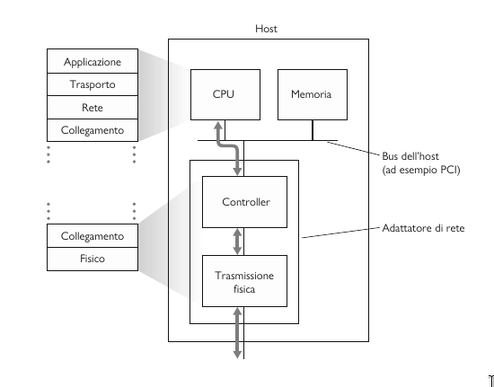
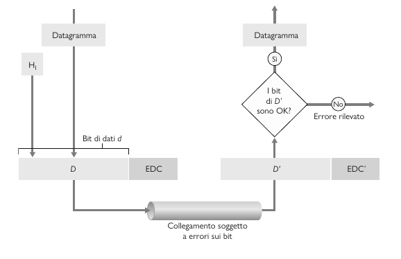
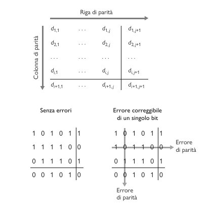

# Livello di collegamento

## Introduzione

Tutti i dispositivi di rete vengono chiamati **nodi**. I canali di comunicazione che collegano nodi adiacenti prendono il nome di **collegamenti (link)** che possono essere cablati o wireless. Mentre il pacchetto dati prende il nome di **frame** ed incapusula datagrammi.

Il livello di collegamento ha la responsabilità di trasferire i datagrammi da un nodo a quello fisicamente adiacente lungo un collegamento.

### Servizi offerti 

- Framing: Incapsula i datagrammi del livello di rete all’interno di un frame a livello di collegamento, prima di trasmetterlo. I frame sono costituiti da un campo dati, nel quale è inserito il datagramma, e da vari campi di intestazione.
- Accesso al collegamento: Un protocollo che controlla l’accesso al mezzo trasmissivo (MAC, medium access control) specifica le regole con cui immettere i frame nel collegamento. Inoltre, nell'intestazione vi è presente l'indirizzo MAC del mittente e del destinatario.
- Consegna affidabile: È usata nei canali con alto tasso di errore, per esempio nei canali wireless.
- Rilevazione e correzione dei errori: Gli errori sono causati da attenuazione del segnale e da rumore. Il nodo ricevente rileva gli errori.
  
### Dov'è implementato? 

Per un dato collegamento, il protocollo del livello di collegamento è sostanzialmente realizzato da un **adattatore di rete**, noto anche come **scheda di rete (NIC - Network Interface Controller)**.

- Lato mittene: Riceve il datagramma dal livello di rete e lo incapsula in un frame. Aggiunge bit di controllo degli errori, implementa il trasferimento di dati affidabile e il controllo di flusso.
- Lato ricevente: Verifica la presenza di errori e si occupa del trasferimento dati affidabile e del controllo di flusso. Estrae poi il datagramma e lo passa al livello superiore. 

## Rilevazione degli errori

Il scenario di riferimento è il seguente: Al nodo trasmittente, ai dati D che devono essere protetti da errori vengono aggiungi dei bit deti EDC (*Error-Detection and Correction*). I dati D e i bit EDC sono inviati in un frame al nodo ricevente che legge una sequenza di bit D' ed EDC' che può essere diversa dall'originale, come risultato della modifica dei bit in transito. Il nodo ricevente deve determinare se D’ coincida con D, potendo contare soltanto su D' e su EDC'. 

### Controllo di parità

La forma più semplice di rilevamento degli errori è quella che utilizza un unico bit di parità (parity bit). Supponiamo che le informazioni da inviare, D siano costituite da d bit. In uno schema di parità pari, il mittente include un bit addizionale e sceglie il suo valore in modo da rendere pari il numero totale di bit 1 nei $d + 1$ bit trasmessi

$$\overbrace{\text{0 1 1 1 0 0 0 1 1 0 1 0 1 0 1 1}}^\text{d bit di dati}\overbrace{1}^{\text{bit di parità}}$$

Con un solo bit di parità ciò che il ricevente deve fare è molto semplice: contare il numero di bit a 1 tra quelli ricevuti. Se trova un numero dispari di bit 1, sa che si è verificato almeno un errore in un bit.

Osserviamo nella figura una generalizzazione bidimensionale dello schema di parità con più bit. In questo caso, i $d$ bit del lato D sono suddivisi in $i$ righe e $j$ colonne per ognuna delle quali è stato calcolato un valore di parità. I risultanti $i + j + 1$ bit servono per la rivelazione dell'errore nei frame a livello di collegamento. 

### Checksum

### Controllo a ridondanza ciclica