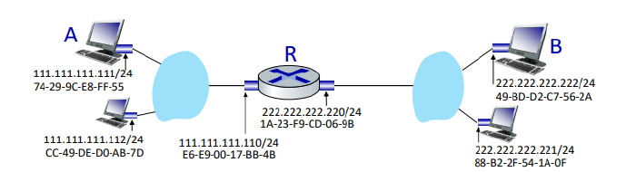

# LAN

LAN (Local Area Network) è una rete locale di dipositivi, per esempio la rete di casa, della scuola etc.

In base al livello in cui ci troviamo la LAN è vista come:

- A livello di rete la LAN è vista come una **sottorete**.
- A livello di collegamento la LAN è vista come una **rete**.

Le LAN sono sia Ethernet, quindi cablate e anche wireless, si pensi alla rete di casa propria in cui c'è il WI-FI.

A livello di rete abbiamo visto che ogni host possiede un indirizzo IP che sia a 32 o 128 bit.
A livello di collegamento ciascun interfaccia possiede un indirizzo MAC (Medium Access Control), che appunto è associato ad ogni interfaccia, ovvero ad ogni scheda di rete. L'indirizzo MAC è un numero a 48 bit espresso in esadecimale e a differenza dell'indirizzo IP che può cambiare, l'indirizzo MAC accompagna il dispositivo dalla nascita fino alla morte. Quindi è il produttore stesso del dispositivo che si occupa di assegnare l'indirizzo MAC in fase di produzione, indirizzo preso da un blocco assegnato dall' IEEE (l'ente che gestisce gli indirizzi MAC).

Per fare un'analogia con il mondo reale, l'indirizzo IP è come il codice postale mentre l'indirizzo MAC è come il codife fiscale.

Abbiamo visto che al livello di rete, quando si crea il datagramma IP viene aggiunto l'indirizzo IP del mittente e in particolare del destinatario. A livello di collegamento, quando si crea il frame viene aggiunto l'indirizzo MAC del  mittente e del destinatario, in quanto il livello di collegamento si occupa della comunicazione tra nodi adiacenti. Quindi ha bisogno di sapere con esattezza qual'è l'interfaccia fisica a cui deve arrivare il frame.

Dunque, ci viene adesso spontaneo chiederci come si passa di indirizzo IP a indirizzo MAC? La riposta è ARP.

## ARP (Address Resolution Protocol)

ARP è un protocollo a livello di collegamento che ha il compito di tradurre gli indirizzi IP in indirizzi MAC.

Ogni nodo possiede al suo interno una tabella, **ARP Table** in cui ogni record è la mappatura indirizzo IP - MAC address e un campo **TTL (Time To Live)** che rappresenta il tempo per cui vale tale mappatura.

Per popolare questa tabella ci pensa appunto il protocollo ARP. Supponiamo che un nodo A deve scoprire l'indirizzo MAC di un nodo B. A crea un frame contentente il suo indirizzo MAC e IP l' indirizzo IP di B. Come indirizzo MAC inserisce **l'indirizzo di broadcast a livello 2 (FF FF FF FF FF FF)**. Tutti i nodi della rete riceveranno questo frame che lo passeranno al livello di rete, ma solo il vero destinatario, ovvero B risponderà a questo messaggio mandando ad A il proprio MAC address. A questo punto A salva la corrispondeza indirizzo IP - MAC address di B nella propria tabella ARP.  

Il protocollo ARP viene inoltre utilizzato per attacchi alla rete. Parliamo dunque di ARP Spoofing o ARP Poisoning. 
Un attaccante invia in una LAN risposte ARP contraffatte, inducendo l'associazione di un indirizzo IP a un certo MAC address. 
Il protocollo ARP è senza stato, e un nodo aggiorna la propria ARP appena riceve una risposta a precindere chi sia una rispota legale o contraffatta.

È utilizzato in:

- DoS: associare diversi indirizzi IP allo stesso indirizzo MAC per sovraccaricarlo di traffico.
- Man In The Middle: l'attacante associa il proprio indirizzo MAC all'indirizzo IP di un altro nodo, in modo da intercettare (e magari modificare) il traffico destinato a quest'ultimo, per poi re-inoltraglielo.

### Invio di un datagramma a un nodo esterno della rete

Anzitutto il nodo A consce soltanto l'indirizzo IP del destinatario, non sa quanti bit stanno nel prefisso direttamente per identificare la sottrete. Tuttuvia A1 sa di appartenere a una sottorete /24, pertanto confronta i 24 bit più significativi del proprio indirizzo con quello dell'indirizzo di B, constatando che sono diversi e quindi capisce che B si trova in una sottorete differente.

Dunque A metterà nel campo destinato al MAC address destinatario l'indirizzo MAC della scheda del router, di cui conosce l'indirizzo IP grazie al DHCP. Per risolvere dunque l'indirizzo MAC del router si usa sempre ARP.

A questo punto il router riceve il frame e lo passa al livello di rete che capisce che non è lui il destinatario e procede all'inoltro. Dato che l'altra interfaccia del router è collegata direttamente con la sotterete di B, il router tramite ARP risolve l'indirizzo MAC di B e gli inoltra il frame.

## Ethernet

Ethernet è il protocollo più utilizzato ad oggi all'interno delle LAN. È un protocollo semplice ma che rimane al passo con le velocità di trasmissione richieste. 

Ci sono tre tipologie di rete LAN Ethernet:

1. LAN a BUS: un cavo coassiale che passava per tutte le schede di rete. Se si tagliava un cavo tutta la rete si rompeva.
2. LAN a stella con HUB: Tutti gli host erano collegati mediante hub. L'hub è un dispostivo a livello fisico il quale rigenera il segnale in entrata di un interfaccia e lo inoltra poi a tutte le interfacce tranne a quella da cui è entrato il sengale. (In pratica gli arriva un frame e lo invia in broadcast a tutti). Il problema della topologia a bus e hub è che tutti i nodi non nello stesso dominio di collisione, per cui se due nodi trasmettono in contemporanea, avrò di sicuro collisione. 
3. LAN a stella con SWITCH. I nodi sono collegati ad uno switch, in questo caso lo switch ha il ruolo di gestire il traffico dei pacchetti inoltrandoli ai destinatari. Gli switch sono dispostivi di secondo livello che operano in modalità store and forward (memorizza e inoltra).

> [!NOTE]  
>
> 

