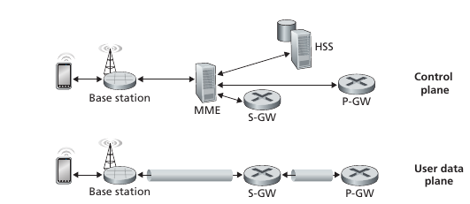
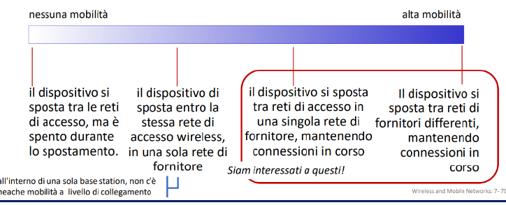

# Reti Cellulari

Si tratta della soluzione Internet Mobile wide-area. I tassi di trasmissione arrivano fino a centinaia di Mbps se il segnale è ottimale.

- **Similarità con Internet cablato**: Periferia e nucleo della rete appartengono allo stesso carrier (operatore telefonico). La rete cellulare è una rete di reti. Si usano molti protocolli già visti, HTTP, DNS, IP, e vi è la separazione tra piano di controllo e piano di dati. Inoltre, la rete cellulare e interconnessa anche con l'Internet cablato.
- **Differenze con Internet cablato**: Diversi protocolli a livello di collegamento. La mobilità assume un importanza primaria. L'identità dell'utente è data dalla SIM (attraverso una circuiteria interna, la rete è in grado di identificare l'utente) e non più dal MAC. Nelle reti cellulari c'è un forte modello di business per cui gli utenti devono sottoscriversi ad un abonamento con uno specifico operatore per usufruire dei vari servizi.

## Architettura 4G

- **Dispositivi mobili**: Sono gli smartphone, tablet, laptop e altri dispositivi IoT che si collegano alla rete celluare del carrier. Ciascun dispositivo presenta un identificativo univoco **International Mobile Subscriber Identity (IMSI)** a 64 bit memorizzato all'interno della SIM utilizzato dalla rete per autenticare il dispositivo.
- **Stazione base**: Rappresenta la nostra torre cellulare a cui possono associarsi vari dispositivi mobili, detti anche **User Equipment (UE)**. La stazione base è simile all’access point WiFi ma ha un ruolo molto più attivo in termini di mobilità e interconnessione con le altre stazioni per ottimizzare l’uso della banda radio. Ci si riferisce alla stazione base con il termine di **eNode-B**, dove $e$ sta per enhanced e $B$ sta per base.
- **Home Subscriber Server (HSS)**: È il database in cui sono memorizzate informazioni riguardo i dispositivi mobili degli abbonati. Questo coopera con il MME per l'autenticazione.
- **Server Gateway (S-GW), Packet Data Network Gateway (P-WG) e altri router**: Sono due router necessari per connettere il nucleo (quindi tutte le stazioni base) con il resto di Internet. Il loro ruolo è legato alla mobilità, infatti gestiscono l'indirizzamento nella rete cellulare, è un indirizzamento diverso però dalla classica rete in quanto spostandosi da una stazione base ad un altra, l'indirizzo IP cambia e dunque, l'indirizzamento classico non funziona più. L'idea è di utilizzare il meccanismo del **Tunnelling**, ovvero si crea un tunnel tra i due router, e un tunnel tra S-GW e la stazione base a cui è collegato il dispositivo. È molto simile al tunneling tra IPv4 e IPv6, e ha una grande importanza per la mobilità.
- **Mobile Management Entity (MME)**: Si occupa di:
  - Autenticare il dispositivo insieme al HSS.
  - Del setup del percorso (tunneling) tra dispositivo mibile e P-GW.
  - Di tener traccia della posizione dei device tramite un processo detto **paging**.

Quindi quando un dispositivo entra in una rete cellulare, dialoga con l'MME che lo autentifica e poi procederà alla creazione del tunnel.

## Mobilità (Roaming)

Il problema principale della mobilità risiede nella possibilità che un dispositivo si sposti da una rete all'altra. In tal caso come fa ala rete a sapere a quale indirizzo IP inoltrare un pacchetto? 

Esistono due approcci per risolvere questo problema:

1. Puramente teorico, l'idea sta nel lasciare che sia la rete (il router) a gestire la situazione. Il router assegna un indirizzo IP permanente al dispositivo, e ogni volta che un dispositivo cambia rete, il router deve aggiornare le tabelle di inoltro. Questo approccio non va bene in quanto non è **scalabile** per miliardi di dispositivi. Come nell'indirizzamento i prefisi non possono superare un tot limite sennò avremmo tabelle con miliardi e miliardi di voci, producendo grandi ritardi.

2. Il secondo approccio, è quello di lasciare che siano gli end-system a gestire la situazione. Esistono due approcci:
   - **Instradamento Indiretto**: La comunicazione tra corrispondente e dispositivo mobile è mediata dalla home network (la rete del carrier), la quale inoltra tramite un tunnel i pacchetti alla rete visitata dal dispositivo.
   - **Instradamento Diretto**: Il corrispondente ottiene l'indirizzo del dispositivo mobile nella rete visitata e invia i pacchetti direttamente al dispositivo usando il protocollo d'indirizzamento standard di Internet.

> [!NOTE]
>
> **Home Network**: Rappresenta la rete del carrier (operatore) a cui il dispositivo è abbonato.
>
> **Visited Network**: Rappresenta una rete diversa da quella home a cui mi collego (per esempio roaming).

Supponiamo che un host si sia spostato in **Roaming** in una visited network. Poiché si trova in un altra rete il proprio indirizzo IP è cambiato, ma con lui ha ancora l'IMSI memorizzato nella SIM. 

Allora, il dispositivo nella visited network si associa al Mobility Manager Entity (MME) della rete visitata, questo poi registra la posizione del dispositivo mobile nell'HSS della home network. In questo modo l'MME della rete visitata sa del dispositivo mobile mente l'HSS sa la posizione attuale del dispositivo.

Supponiamo adesso che l'host debba ricevere un frame, come avviene l'instradamento?

1. **Instraamento Indiretto**
2. **Instradamento Diretto**