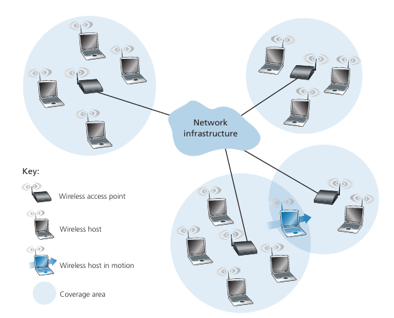
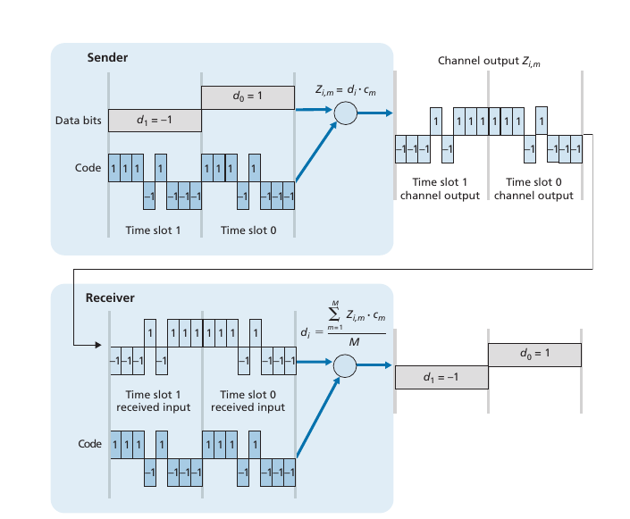
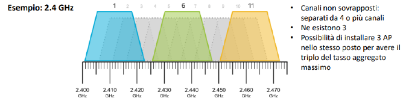
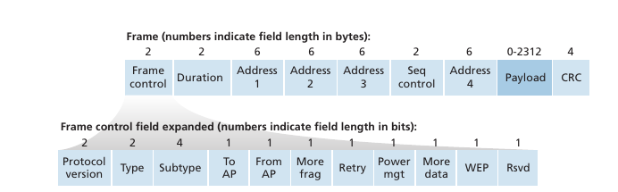
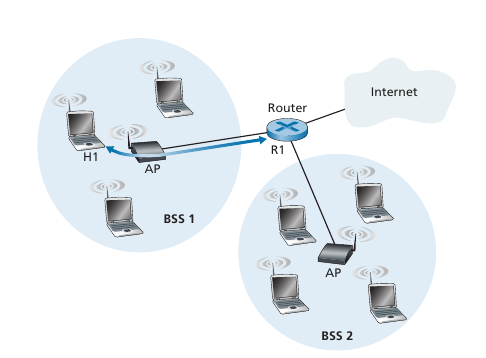
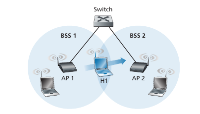

# Wireless

> [!NOTE]
>
> **Wireless**: Per wireless si intende il collegamento tra due nodi senza filo
>
> **Mobilità**: Per mobilitò si intende un dispositivo che si può spostare, (smartphone, laptop) collegato alla rete wireless.

Il problema principale non è tanto il collegamento wireless ma il fatto che l'utente spostandosi cambia il punto di aggancio alla rete.

## Componenti di una rete wireless

1. **Hosts Wireless**: Qualsiasi dispositivo terminale in grado di collegarsi alla rete in modalità wireless, per esempio smartphone e laptop.
2. **Collegamenti Wireless**: Collegamente senza filo per connettere gli host wireless alla stazione base o gli host tra di loro. Il mezzo trasimissivo wireless è chiaramente un canale broadcast, di conseguenza si pone il problema dell'accesso multiplo, quindi c'è la necessita di definire un protocollo MAC.
3. **Stazione Base**: Si tratta di un dipositivo che funge da ripetitore (relay) di segnale. Tali dispositivi sono l'access point o la torre della rete cellulare. Tipicamente le stazioni basi sono collegate ad una rete cablata.

Ci sono due modalità per costruire una rete cellulare:

- *Modalità Infrastruttura*: La rete wireless fa riferimento a un'infrastruttura di rete che contiene la stazione di base. Quando si parla di questo tipo di reti wireless non bisogna dimenticare il problema dell' **hand-coff**, ovvero un host spostandosi passa dal range di una stazione di base nell'range di un altra.
- *Modalità con reti ad hoc*: Non ci sono stazioni basi a cui gli host di devono collegare. Gli hosts wireless comunicano direttamente tra loro, dovendo propriamente pensare al routing, al DNS etc...

## Caratteristiche dei collegamenti Wireless

- **Attenuazione del segnale**
Questo fattore è anche presente nelle reti cablate, ma con il wireless il problema è maggiore. Bisogna tener conto degli ostacoli che assorbono parte delle radiazioni eletttromagnetiche o dell'attenuazione dello spazio libero.

In particolare l'attenuazione dello spazio libero è direttamente proporzionale a $(fd)^2$, dove $f$ è la frequenza e $d$ è la distanza. Dunque maggiore e la distanza e la frequenza, maggiore è l'attenuazione del segnale.

- **Propagazione su cammini multipli**
Avviene quando il segnale elettromagnetico si riflette su diversi oggetti, arrivando a destinazione passando però per diversi percorsi.  

- **Interferenza**
Avviene quando molteplici sorgenti radio trasmettono alla stessa frequenza. Per esempio cellulari wireless e LAN wireless trasmettono entrambe sulla frequenza 2.4GHz, portanto a interferenze del segnale. Per questo, moderni standard wireless hanno deciso di trasmettere a frequenze maggiori come 5GHz.

Legato alle inteferenze del segnale vi è il **Rapporto Segnale Rumore (SNR)**. Si tratta del rapporto tra segnale trasmesso che è stato ricevuto e rumore di fondo. Si ha un buon segnale se SNR alto permettendo di estrarre al meglio il segnale ovvero c'è un minor **Tasso di Errore sui Bit (BER)**.

Quindi, aumentare la potenza signigica aumentare il SRN e quindi il BER. Tuttavia non è così semplice, olte a questioni di salute, aumentare la potenza significa aumentare il consumo energetico.

## CDMA (Accesso Multiplo a Divisione di Codice)

È un altro protocollo ad accesso multiplo e rientra nella **divisione del canale**. 

Per questo protocollo facciamo le seguenti assunzioni: Il bit 0 vale -1, poi i segnali provenienti dai vari trasmittenti sono ricevuti tutti con la stessa intesità, e inoltre tutto è perfettamente sincronizzato.

Dunque, ad ogni utente viene assegnato un codice, ovvero un vettore composto da 1 e -1. I codici sono assegnati in modo che il prodotto scalare di codici di due utenti è pari 0, quindi sono ortogonali.

Immaginiamo adesso che l'utente $i$ debba inviare un certo bit $d_{i}$, come lo codifica? Moltiplica tale bit per il suo codice, quindi ottiene un vettore le cui componenti sono quelle del codice moltiplicato per il bit.

Se deve inviare 1 il vettore del codice rimane inalterato, se deve inviare -1 gli elementi del vettore cambiano segno.

Se due nodi trasmettono in contemporanea, assumendo che tutto è sincronizzato quando vi è una collisione i valori si sommano. Dal punto di vista del ricevente anche con valori sommati si ottiene il bit che intendeva inviare il mittente.

## WiFi - 802.11 wireless LAN

802.11 wireless LAN conosciuto meglio come Wifi è una delle tecnologia più usate ad oggi.

Gli standard "802.11n", "802.11ac" e "802.11ax" sono stati ribattezzati rispettivamente WiFi 4, 5 e 6 e ad oggi si sono spostati su frequenza 5GHz per evitare interferenze e dunque per ottenere più velocità.

Lo standard 802.11 può lavorare sia in modalità *infrastruttura* sia in modalità *ad hoc*.

Nella modalità infrastruttura troviamo di solito un **Access Point (AP)** che funge da stazione di base e denotiamo con **Basic Service Set (BSS)** il complesso degli access points e gli host collegati ad essi.

Lo standard WiFi lavora con varie bande di frequenza che a loro volta sono divise in canali. Quando viene configurato un AP è necessario indicare la banda che andremo a utilizzare in modo tale da ridurre le interferenze. 

Per esempio la banda 2.4GHz ha 11 canali, ciascuno con larghezza di 85MHz che si sovrappongono parzialmente tra di loro. 

Dall'immagine osserviamo che con la banda 2.4GHz possiamo configurare 3 AP vicini ognuno su un canale diverso tra 1, 6 e 11 in modo tale da non interferire l'uno con l'altro.

Come avviene **l'associazione** tra host e AP?

Due tipi di approcci:

- **Approccio passivo**: L'access point invia agli host periodicamente un **frame beacon** contenti il nome dell'AP (SSID) e il MAC address. Sta poi all'host se scegliere di collegarsi o meno al AP. Se decide di autenticarsi, una volta collegato tramite l'AP manda al DHCP una richiesta per ottenere indirizzo IP e altre informazioni. 
- **Approccio attivo**: In questo caso l'host invia un **frame sonda** in broadcast e i vari AP rispondono poi con un frame sonda di risposta. A questo punto l'host invierà un frame di richiesta all'AP per collegarsi e sta poi all'AP se accetare o meno la richiesta di connessione.

### Protocollo MAC - CSMA/CA (Collision Avoidance)

Abbiamo visto che per Ethernet si utilizza il protocollo CSMA/CD nel caso di accesso multiplo al canale di trasmissione. Con wireless non è possibile utilizzare lo stesso protocollo ma bisogna utilizzare CSMA/CA.

In quanto CSMA, effettua il rilevamento della portante e non trasmette se trova il canale occupato. Ma non tenta di rilevare eventuali collisioni, inviando sempre per intero il frame. Al limite, si può indirettamente rilevare la collisione come mancanza di riscontro da parte dell’AP (che invia degli ACK).

> [!IMPORTANT]
> (Possibile domanda d'esame)
>
> Quali sono i motivi per cui non si può con certezza fare rilevamento di collisione e della portante Wireless?
>
> 1. **Problema del terminale nascosto**: Si verifica quando due nodi sono fuori portata l'uno dell'altro ma entrambi possono comunicare con un nodo centrale o access point. Questo problema può causare collisioni di pacchetti e una riduzione dell'efficienza della rete.
> 2. **Problema di natura tecnologica/economica**: Posso sì rilevare il segnale, ma avrà un’intensità molto inferiore rispetto a quello che sto emettendo.
> In generale è difficile dal punto di vista hardware ed economico progettare un dispositivo che trasmettendo con una certa potenza riesce contemporaneamente a rilevare un segnale di potenza molto inferiore.

**Come funziona nel dettaglio il protocollo MAC CSMA/CA?**

Supponiamo che una stazione wireless deve inviare un frame allora:

1. 
   - Se il canaista del destinatario è molto semplice, quando gli arriva un frame fa controllo con CRC e in caso non rileva errori manda ACK dopo un tempo **Short Inter-Frame Spacing (SIFS)**.

Per quanto riguardo l'evitare delle collisione, esiste un altro meccanismo basato sul protocollo CSMA, questo meccanismo prende il nome di **prenotazione esplicita**.

Il nodo che vuole trasmettere manda all'AP un frame **RTS (Request To Send)** usando CSMA, chiedendo il permesso all'AP di poteri

## Struttura del frame 802.11

Il frame contiene delle **informazioni di controllo**, una **durata** usato quando si utilizza RTS E CTS. E poi si hanno 4 indirizzi, esatto hai letto bene porco il dio signore, si hanno 4 indirizzi che adesso, piano piano andremo a vedere cosa sono. Poi abbiamo un **numero di sequenza** che serve per il trasferimento affidabile (è meno spendioso implementare il trasferimento affidabile tra due nodi, che su tutto il percorso.) e un campo **payload** e **CRC**.

Dunque, perche porca la madonna il frame WiFi ha 4 indirizzi? WiFi distingue chi trasmette il frame dal mittente originale e allo stesso modo distingue il ricevente attuale da quello che è l'ultimo destinatario del frame. 

- **Indirizzo 1**: Indirizzo MAC dell’host wireless o AP che deve ricevere il frame (non è necessariamente il destinatario finale).
- **Indirizzo 2**: Indirizzo MAC dell’host wireless o AP che trasmette il frame (non è necessariamente il mittente iniziale).
- **Indirizzo 3**: Indirizzo MAC dell’interfaccia router a cui l’AP è collegato (per
accedere ad altre sottoreti).

Il quarto indirizzo viene utilizzato nella modalità ad hoc.

Supponiamo che il router debba inviare un datagramma ad H1, allora:

1. Il router, che conosce l'indirizzo Il di H1, tramite ARC determina il suo indirizzo MAC. L'interfaccia R1 del router crea il frame **Ethernet** incapsulando il datagramma. L'indirizzo sorgente di questo frame è il MAC address di R1, e quello di destinazione è il MAC address di H1.
2. Quando il frame **Ethernet** arriva all'AP, l'AP lo converte in un frame **802.11** prima di immetterlo nel canale wireless, riempiendo i campi degli indirizzi in questo modo:
    - Indirizzo 1: MAC address di H1
    - Indirizzo 2: MAC address di AP
    - Indirizzo 3: MAC address di R1
In questo modo, H1 potrà determinare l'indirizzo MAC del router.
1. H1 riceve il frame, estrae il datagramma e lo invia al livello di rete. Ora H1 crea un frame **802.11**, riempiendo i campi degli indirizzi in questo modo:
    - Indirizzo 1: MAC address di AP
    - Indirizzo 2: MAC address di H1
    - Indirizzo 3: MAC address di R1
2. Quando il frame **802.11** arriva all'AP, lo converte in un frame **Ethernet**. L'indirizzo della sorgente di questo frame è il MAC address di H1 e come indirizzo di destinazione il MAC address di R1. Quindi grazie all'indirizzo 3, l'AP riesce a determinare a chi deve inviare il frame **Ethernet**.

## Mobilità all'interno della stessa sottorete

Cosa succede quando mi sposto da un AP ad un altro, e questi due sono collegati da uno switch? Lo switch sa a quale porta inoltrare un frame per H1 poichè lo apprende la prima volta che riceve frame per da H1. Ma se H1 si sposta da un AP ad un altro, come fa adesso lo switch a sapere a quale porta inoltrarlo? 

Un modo per risolvere il problema può essere che il nuovo AP invia un frame Ethernet broadcast con mittente H1 affinché lo switch apprenda la nuova porta per raggiungere H1.

## Funzioni avanzate di 802.11

- Adattamento del tasso trasmissivo
- Gestione dell'energia

