# Livello di rete, piano di dati

## Servizi

Il livello di rete trasporta i segmenti dall'host mittente all'host destinatario. 

- **Mittente**: Incapsula i segmenti dentro ai datagrammi che passa al livello di collegamento.
- **Destinatario**: Scompone il datagramma e passa i segmenti al protocollo del livello di trasporto.

I protocolli di rete sono implementati da tutti i dispositivi in Internet, host e router.

> [!IMPORTANT]
>
> **DEF**: Un router è un dispositivo di rete che instrada il traffico dati tra reti diverse. È in grado di determinare il percorso ottimale per trasferire i dati da una sorgente a una destinazione attraverso una rete complessa. Inoltre, i router possono implementare funzionalità di sicurezza, come firewall e crittografia, e gestire le comunicazioni tra dispositivi all'interno di una rete locale. In sostanza, il router agisce come un ponte tra diverse reti, facilitando la comunicazione e il trasferimento di dati tra di esse.
>
> Quindi il router esamina i campi dell'intestazione di tutti i datagrammi IP che lo attraversano e sposta i datagrammi dalle porte di ingresso alle porte di uscita per trasferire il datagramma lungo il percorso dall'host di origine a quello di destinazione. 

## Inoltro e Instradamento

Il ruolo principale del livello di rete è quindi piuttosto semplice: trasferire pacchetti da un host a un altro. Per fare questo è possibile identificare due importanti funzioni.

- **Inoltro (forwarding)**. Trasferisce i pacchetti da un collegamento di ingresso di un router al collegamento di uscita appropriato  
    del router.
    
    Con inoltro faremo quindi riferimento all’azione locale con cui il router trasferisce i pacchetti da un’interfaccia di ingresso a quel-
    la di uscita. Poiché l’inoltro avviene su scala temporale molto piccola, dell’ordine di pochi nanosecondi, è usualmente implementato in hardware.
- **Instradamento (routing)**. Il livello di rete deve determinare il percorso che i pacchetti devono seguire tramite algoritmi di 
    instradamento (algoritmi di routing).
    
    Con instradamento indicheremo, invece, il processo globale di rete che determina i percorsi dei pacchetti nel loro viaggio dalla sorgente alla destinazione. Poiché l’instradamento avviene su scale temporali più grandi, dell’ordine dei secondi,
    è usualmente implementato in software.

Per inoltrare i pacchetti, i router estraggono da uno o più campi dell’intestazione (per esempio il campo Indirizzo di destinazione) i loro valori che utilizzano come indice nella **tabella di inoltro (tabella di forwarding o forwarding table)**, un elemento chiave di qualsiasi router.

## Piano dei dati e piano di controllo

- **Piano dei dati**. Funzione *locale*, a livello di singolo router. Determina come i pacchetti in arrivo a una porta di ingresso del router sono inoltrati verso una porta di uscita del router.
- **Piano di controllo**. Rappresenta la *logica della rete*. Determina come i pacchetti sono instradati tra i router lungo un percorso dall'host di orgine all'host di destinazione. Ci sono due approcci fondamentiali per il piano di controllo.


1. **Algoritmi di instradamento tradizionali**, implementati nei router.

    Come mostrato nella fdigura, l’algoritmo di instradamento determina i valori inseriti nelle tabelle di inoltro dei router. In questo esempio l’algoritmo di routing è implementato in ogni router, che quindi svolge sia la funzione di inoltro che quella di instradamento internamente. Vedremo più avanti che le funzioni di instradamento nei router comunicano tra di loro per determinare i valori da inserire nelle tabelle di inoltro. Ma come avvengono tali comunicazioni? Attraverso i messaggi di un protocollo di instradamento.

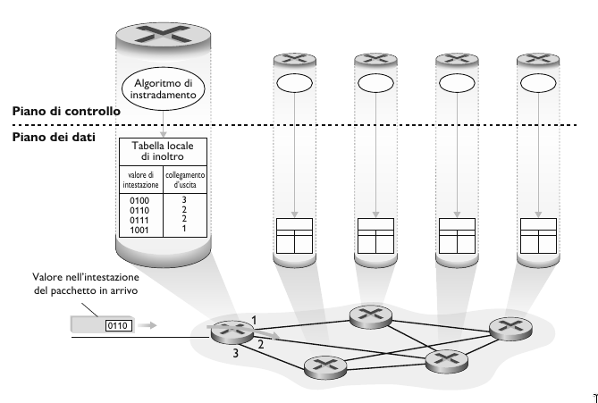

2. **Software-Defined Networking (SDN)**, implementato nei server.

    La digura mostra un approccio alternativo in cui un controller remoto, separato fisicamente dai router, calcola e distribuisce le tabelle di inoltro a tutti i router. La funzionalità di instradamento del piano di controllo è separata fisicamente dal router; il dispositivo di instradamento effettua solo l’inoltro, mentre il controller remoto calcola e distribuisce le tabelle di inoltro. Il controller remoto potrebbe essere implementato in un data center remoto con elevata affidabilità e ridondanza e potrebbe essere gestito da un ISP o da una terza parte.

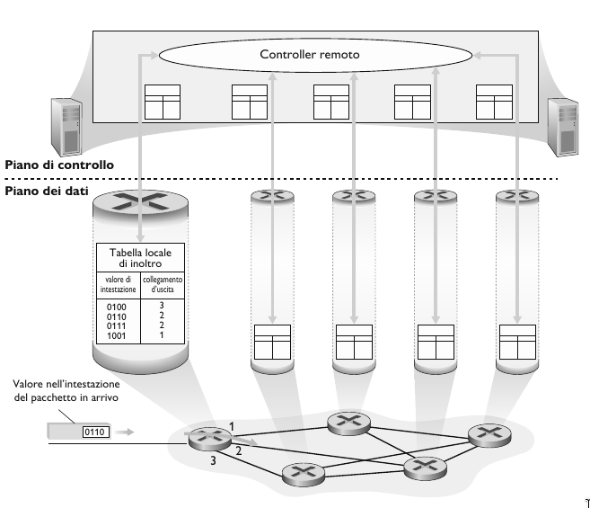

## Modello di servizio

Qual è il *modello di servizio* per il "canale" che trasporta i datagrammi dal mittente al destinatario, ovvero quali sono le carrateristiche principali del canale?

- **Consegna garantita**: Garantisce che prima o poi il pacchetto arriverà a destinazione.
- **Consegna garantita con ritardo limitato**: Garantisce che prima o poi il pacchetto arriverà a destinazione con un minimo di ritardo.
- **Consegna ordinata**: Garantisce che i pacchetti giungano a destinazione nell'ordine in cui sono stati inviati.
- **Banda minima garantita** 
- **Servizi di sicurezza**

Il livello di rete di Internet mette a disposizione un solo servizio, **best-effort**, *massimo impegno*. Con questo servizio, non c’è garanzia che i pacchetti vengano ricevuti nell’ordine in cui sono stati inviati, così come non è garantita la loro eventuale consegna. Non c’è garanzia sul ritardo end-to-end, così come non c’è garanzia su una larghezza di banda minima garantita.

Nonostante la "scarsità" di servizi che il livello di rete di Internet mette a disposizione, è il modello di servizio tutt'oggi usato.
La semplicità del meccanismo ha consentito l'ampia diffusione di Internet.

## Architettura del router

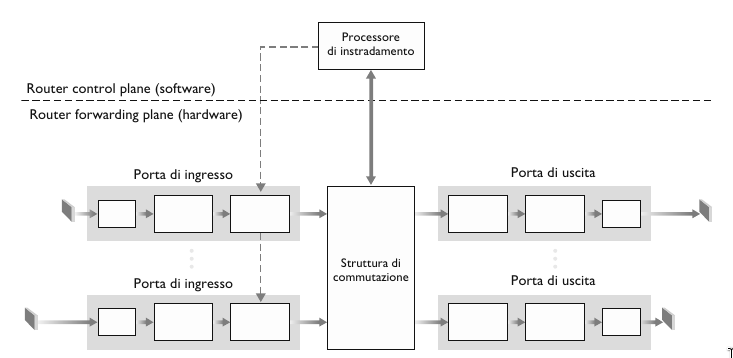

- **Porte di ingresso**.
    Svolgono le funzioni a livello fisico di terminazione di un collegamento in ingresso al router, svolgono funzioni a livello di collegamento necessarie per interoperare con le analoghe funzioni all'altro capo del collegamento di ingresso. Svolgono inoltre la cruciale funzione di ricerc, in modo che il pacchetto inoltrato nella struttura di commutazione del router esca sulla porta di uscita corretta.


    In un router, le porte di ingresso e uscita, e la struttura di commutazione sono implementate quasi sempre a livello hardware, ed operano sulla scala temporale dei nanosecondi mentre le funzioni di istradamento del router e altre funzioni di gestione operano sulla scala dei millisecondo/secondi. Le funzioni del piano di controllo sono solitamente implementate via software ed eseguite sul processore di instradamento.

    - *Inoltro basato sulla destinazione*: Inoltro basato esclusivamente sull'indirizzo IP di destinazione.
    - *Inoltro generalizzato*: Inoltro basato su più campi di intestazione.

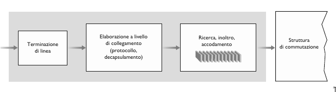

- **Struttura di commutazione**.
    La struttura di commutazione, che connette fisicamente le porte di ingresso a quelle di uscita, è interamente contenuta all'interno del router. Se i datagrammi arrivano più velocemente di quanto la struttura di commutazione possa trasferirili si verifica l'accodamento presso la porta di ingresso.

- **Porte di uscita**.
    Memorizzano i pacchetti che provengono dalla struttura di commutazione e li trasmettono sul collegamento in uscita, operando le funzionalità necessarie del livello di collegamento e fisico.

- **Processore di instradamento**.
    Esegue le funzioni del piano di controllo. Nei router tradizionali esegue i protocolli di instradamento, gestisce le tablle di inoltro e le informazioni sui collegamenti attivi. Nei router SDN, il processore di instradamento è responsabile della comunicazione con il controller remoto, in modo da ricevere le occorenze della tabella di inoltro e installarle alle porte di ingresso.

## Inoltro basato sull'indirizzo di destinazione

Abbiamo visto che le porte di ingresso si occupano di determinare la porta di uscita a cui dirigere un pacchetto attraverso la struttura di commutazione. Ma come avviene la ricerca di questa porta? In ciascuna porta di ingresso, viene memorizzata una copia della tabella di inoltro, che essendo locale, la porta di ingresso non deve fare affidamento sulla CPU per la ricerca della porta di uscita.

Prendiamo il caso più semplice, in cui l'inoltro è basato sull'indirizzo di destinazione. Prendiamo per esempio questa tabella di inoltro:

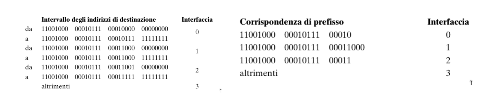

Nella prima tabella, a sinistra, il router decide la porta di uscita controllando l'intero indirizzo IP mentre nella seconda tabella, un pò più semplificata, il router deve soltanto andare a confrontare un **prefisso** dell'indirizzo con una riga della tabella.

Risulta però un problema. Cosa succede quando un indrizzo IP corrisponde a più di un prefisso? Per esempio:

```
A: 11001000 00010111 00010110 10100001

B: 11001000 00010111 00011000 10101010
```

Quando si verificano corrispondenze multiple, il router adotta la regola di **corrispondenza a prefisso più lungo** in altre parole, viene determinata la corrispondenza più lunga all’interno della tabella e i pacchetti vengono inoltrati all’interfaccia di collegamento associata.

Quindi nel nostro caso l'indirizzo $A$ verrà inoltrato alla porta di uscità 0 mentre l'indirizzo $B$ verrà inoltrato alla porta di uscita 1 per la regola di **corrispondeza a prefisso più lungo**.

La corrispondeza a prefisso più lungo spesso è eseguita con le ternary content addressable memories (TCAM). Con una TCAM, un indirizzo
IP a 32 bit è passato alla memoria che restituisce il contenuto della tupla nella tabella di inoltro corrispondente a quell’indirizzo in un tempo essenzialmente costante.

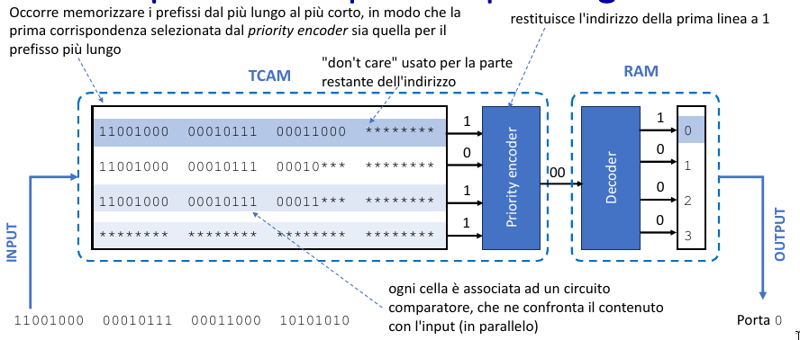

## Struttura di commutazione

La struttura di commutazione (switching fabric) rappresenta il vero e proprio cuore dei router, attraverso il quale i pacchetti vengono commutati (ossia inoltrati) dalla porta di ingresso alla porta di uscita. La commutazione può essere ottenuta in vari modi.

Il *tasso di trasferimento* è il tasso al quale i pacchetti vengono trasferiti dalla porta di input alla porta di output. Spesso misurato come multiplo del tasso di trasmissione delle linee di input/output. Si desidera avere un tasso di trasferimento della struttura di commutazione $N$ volte il tasso delle linee input/output.

- **Commutazione in memoria**

    I primi e più semplici router erano in genere calcolatori tradizionali, e la commutazione tra porte di ingresso e di uscita veniva effettuata sotto il controllo diretto della CPU. Le porte di ingresso e di uscita funzionavano come tradizionali dispositivi di I/O. Quando sopraggiungeva un pacchetto, la porta di ingresso segnalava l’arrivo tramite interrupt e quindi lo copiava nella memoria del processore di instradamento che procedeva a estrarre dall’intestazione l’indirizzo di destinazione. Quindi, individuava tramite la tabella di inoltro l’appropriata porta di uscita nel cui buffer copiava il pacchetto.

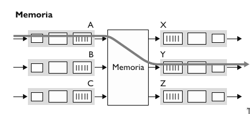

- **Commutazione tramite bus**

    In questo approccio le porte di ingresso trasferiscono un pacchetto direttamente alle porte di uscita tramite un bus condiviso e senza intervento da parte del processore di instradamento.

    **Bus Contention**: Se più pacchetti arrivano contemporaneamente al router, ognuno su una porta di input diversa, tutti tranne uno dovranno aspettare, dato che sul bus si può trasferire soltanto un pacchetto alla volta. Poiché ciascun pacchetto deve attraversare il bus, la larghezza di banda della commutazione è limitata da quella del bus. 

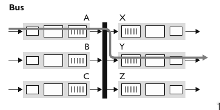

- **Coomutazione attraverso rete di interconnessione**

    Un modo per superare la limitazione di banda di un singolo bus condiviso è l’utilizzo di una rete di interconnessione più sofisticata, quale quella usata in passato nelle architettture multiprocessore. Una **matrice di commutazione (crossbar switch)** è una rete di interconnessione che consiste di $2n$ bus che collegano $n$ porte di ingresso a $n$ porte di uscita.

    Quando un pacchetto giunge a una porta di ingresso A e deve essere inoltrato alla porta Y, il controller chiude l’incrocio di A e Y e la porta A invia il pacchetto sul suo bus e solo il bus Y lo riceverà. Si noti che un pacchetto dalla porta B può essere inoltrato a X nello stesso tempo, perché i pacchetti A-Y e B-X usano bus di input e output diversi.

    Una matrice di commutazione è **non-blocking**: un pacchetto in via di inoltro verso una porta di uscita non viene bloccato a meno che esista un altro pacchetto in via di inoltro sulla stessa porta di uscita.

    Questo tipo di commutazione sfrutta il parralelismo perche frammenta il datagramma in celle di lunghezza fissa all'ingresso, commuta le celle attraverso la rete di commutazione, per poi riassemblare il datagramma in uscita.

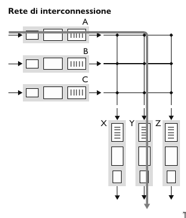

## Accodamento

Se la struttura di commutazione è più lenta della porte di ingresso e uscita, può verificarsi accodamento sulle porte di ingresso producendo **ritardi** e **perdite di pacchetti** dovute all'overflow dei buffer.

### Accodamento in ingresso

Avviene quando la struttura di commutazione è lenta nel trasferire tutti i pacchetti in arrivo. Se due pacchetti in testa a due code di ingresso sono destinati alla stessa coda di uscita, allora uno dei pacchetti sarà bloccato e dovrà attendere. Questo fenomeno è noto come **blocco in testa alla coda HOL (Head-Of-The-Line blocking)**: un pacchetto nella coda di ingresso deve attendere il trasferimento attraverso la struttura in quanto risulta bloccato da un altro pacchetto che lo precede.

### Accodamento in uscita

- **Buffering**: Richiesto quando i datagrammi arrivano dalla struttura di commutazione più velocemente del tasso di trasmissione del collegamento. Bisogna decidere quale datagramma scartare se il buffer è pieno.
- Quando vi sono più pacchetti accodati sulle porte di uscita, **schedulatore di pacchetti** deve stabilire in quale ordine trasmetterli.

### Memoria buffer

- **PRIMA**: $B = RTT\cdot\ C$ ovvero la grandezza del buffer $B$ deve essere uguale al tempo di round-trip medio $RTT$ moltiplicato per la capacità del link $C$.
- **ADESSO**: $B = \frac{RTT\cdot\ C}{\sqrt{N}}$ dove $N$ è il numero di flussi TCP.

Si è tentati di pensare che più buffering si ha, meglio è: buffer più grandi consentono a un router di assorbire fluttuazioni maggiori del tasso di arrivo dei pacchetti, riducendo così il tasso di perdita di pacchetti del router. Ma buffer più grandi significano anche, potenzialmente, ritardi di coda più lunghi. Per i giocatori e per gli utenti di teleconferenze interattive, decine di millisecondi
contano.

In assenza di sufficiente memoria per inserire nel buffer il nuovo pacchetto in ingresso, occorre stabilire se scartarlo (politica nota come **drop-tail**, eliminazione in coda) o se rimuoverne uno o più, fra quelli già in coda, per far posto al nuovo arrivato.

In alcuni casi può risultare vantaggioso eliminare un pacchetto (o **marcarne** l’intestazione) prima che il buffer sia pieno, al fine di fornire al mittente un segnale di congestione. Tale operazione potrebbe essere effettuata utilizzando i bit di Notifica Esplicita di Congestione.

## Schedulazione dei pacchetti

L'obiettivo è determinare quale pacchetto inviare successivamente sulla porta di uscita.

### First-In-First-Out (FIFO)

I pacchetti che arrivano alla coda di uscita del collegamento aspettano di essere trasmessi se quest’ultimo è occupato nella trasmissione di un altro pacchetto. Se non c’è sufficiente spazio nel buffer per contenere il pacchetto che arriva, bisogna determinare se il pacchetto va eliminato o se bisogna rimuovere dei pacchetti dalla coda per far spazio al pacchetto in arrivo.
I pacchetti vengono quindi trasmessi nello stesso ordine con cui sono arrivati in coda.

### Priority Queue

Nel modello di accodamento con priorità (priority queuing) i pacchetti sono classificati in base a classi di priorità. Qualsiasi campo di intestazione può essere usato per la classificazione. Ciascuna classe di priorità ha la propria coda. La modalità di accodamento con priorità decide quindi di trasmettere i pacchetti non più nell’ordine generale di arrivo, ma selezionando di volta in volta il pacchetto dalla coda non vuota con priorità più alta. La scelta fra i pacchetti di una classe è di solito effettuata seguendo la strategia FIFO.

### Round Robin

Anche nella modalità di accodamento round robin (round robin queuing), i pacchetti sono suddivisi in classi, senza una rigida priorità di servizio, ma con un’alternanza tra le classi. La forma più semplice di round robin prevede l’alternanza della trasmissione: prima viene inviato un pacchetto della classe 1 e poi uno della classe 2, quindi nuovamente un pacchetto di classe 1, e così via.

### Weighted Fair Queuing (WFQ)

Generalizza il Round-Robin, assegnando a ciascuna classe $i$ un peso $w_{i}$ e riceve una quantità di servizio in ogni ciclo: 
$$\frac{w_{i}}{\sum_{j}w_{j}}$$

## Il protocollo Internet, IPv4, IPv6

### Formato dei datagrammi IP

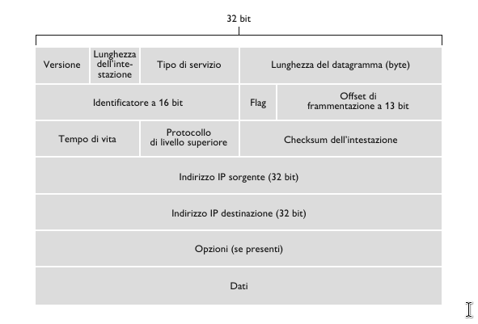

- **Numero di versione**. Quattro bit che specificano la versione del protocollo IP (IPv4 o IPv6).
- **Lunghezza dell'intestazione**. Quattro bit che indicano dove iniziano i dati nel datagramma. Multipli di 32 bit
- **Tipo di servizio**. Bit relativi al tipo di servizio. Diversi servizi da 0 a 5, mentre il sercizio ECN i bit 6 e 7.
- **Lunghezza dell'datagramma**. 16 bit che rappresentano la lunghezza totale del datagramma IP. $Max_{len} = 65535\ byte$, $Average_{len} = 1500\ byte$.
- **Identificatore, flag, offset di frammentazione**. Questi 3 campi servono per la frammentazione. Un datagramma IP grande viene frammentato in datagrammi IP più piccoli e inoltrati in modo indipendete che poi vengono riassemblati prima che i dati vengano passati al livello di trasporto.
- **Tempo di vita**. Il campo TTL è stato incluso per assicurare che i datagrammi non restino in circolazione per sempre nella rete. Questo campo viene decrementato ogni volta che viene elaborato da un router.
- **Protocollo**. Indica il protocollo a livello di trasporto a cui deve inviare i dati. 6 indica UDP mentre 17 indica TCP.
- **Checksum dell'intestazione**. Consente ai router di rilevare gli errori sui bit nei datagrammi ricevuti. È calcolato trattando ogni coppia di byte dell’intestazione come numeri che sono poi sommati in complemento a 1.
- **Indirizzi IP sorgente e destinazione**. Quando un host crea un datagramma, inserisce il proprio indirizzo IP nel campo indirizzo IP sorgente e quello della destinazione nel campo indirizzo IP destinazione. Entrambi gli indirizzi a 16 bit (4 byte). 
- **Opzioni**. Altre opzioni da inserire nel datagramma IP.
- **Dati**. Nella maggior parte dei casi, il campo dati contiene il segmento a livello di trasporto (TCP o UDP) da consegnare alla destinazione. Tuttavia, può trasportare anche altri tipi di dati, quali i messaggi ICMP.

### Indirizzamento IPv4

Generalmente un host ha un solo collegamento con la rete. Quando il livello IP dell'host vuole inviare un datagramma, lo fa su tale collegamento. Il confine tra host e collegamento fisico viene detto **interfeccia**. Un router, invece, dato che ha il compito di ricevere datagrammi da un collegamento e inoltrarli su un altro, deve nessariamente essere connesso ad almeno due collegamenti.

L'indirizzo IP è tecnicamente associato a un interfaccia, anziché all'host o al router che la contiene.

Gli indirizzi IP sono lunghi 32 bit (4 byte) e quindi ci sono in totale $2^{32} \approx 4$ miliardi di indirizzi IP. Tali indirizzi sono solitamente scritti nella cosidetta **notazione decimale puntata (dotted-decimal notation). Per esempio:

$$193.32.216.9 = 110000001.00100000.11011000.00001001$$

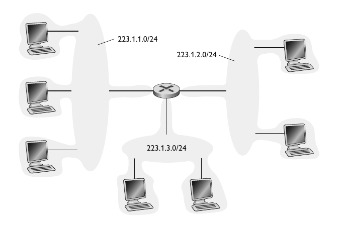

Tuttavia, tali indirizzi non possono essere scelti in modo arbitrario. Una parte dell'indirizzo di un'interfaccia è determinata dalla sottorete cui è collegata.

Una **sottorete** è un insieme di dispositivi che possono raggiungersi fisicamente *senza passare attraverso un router intermedio*. Nell'immagine osserviamo un router che collega 3 sottoreti

IP assegna a queste sottoreti gli indirizzi 223.1.1.0/24, 223.1.2.0/24, 223.1.3.0/24, dove la notazione /24, detta anche **maschera di sottorete** indica che i 24 bit più a sinistra dell'indirizzo definiscono l'indirizzo della sottorete.

Gli indirizzi IP di una sottorete hanno una struttura:

- Parte della sottorete: I dispositivi della stessa sottorete hanno in comune i bit di ordine superiore, definiti dalla subnet mask.
- Parte dell'host: i rimanenti bit di ordine inferione.

Per determinare le sottoreti si sgancino le interfacce da host e router in maniera tale da creare isole di reti isolate delimitate dalle interfacce. Ognuna di queste reti isolate viene detta sottorere (subnet).

La strategia di assegnazione degli indirizzi Internet è detta **Calssless Interdomain Routing CIDR** generalizza la nozione di indirizzamento di sottorete. L'indirizzo IP viene diviso in due parti e mantiene la forma decimale puntata $a.b.c.d/x$, dove $x$ indica il numero di bit nella prima parte dell'indizzo. Gli $x$ bit più a sinistra di un indirizzo della forma $a.b.c.d./x$ costituiscono la porzione di rete dell'indirizzo IP e sono spesso detti **prefisso** dell'indirizzo.

Prima dell'adozione di CIDR, le parti di rete di un indirizzo IP dovevano essere lunghe, 8, 16, 24 bit. Tale schema di indirizzamento era noto come **classful addressing**, dato che le sottoreti con indirizzi di sottorete da 8, 16, 24 bit erano note come reti di classe A, B, C.

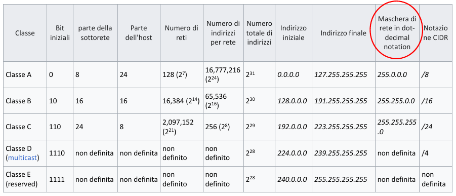

255.255.255.255 è il cosidetto indirizzo IP di broadcast. Quando un host emette un datagramma con questo indirizzo, il messaggio viene consegnato a tutti gli host sulla stessa sottorete.

### Come ottenere l'indirizzo di un host: DHCP

Quando si ottiene un blocco di indirizzi IP, l'amministratore della rete configura manualmente le interfacce dei router, mentre gli indirizzi degli host possono essere sia impostati manualmente sia dinamicamente. Questo compito è svolto utilizzando il **Dynamic Host Configuration Protocol (DHCP)**.

Il DHCP consente dunque ad un host di ottenere un indirizzo IP in modo automatico, ma anche di apprendere informazioni aggiuntive, quali la maschera di sottorete, l'indirizzo del router per uscire dalla sottorete (anche detto *indirizzo di gateway*) e l'indirizzo del suo DNS server locale. Il DHCP può essere configurato in modo tale da assegnare a ciascun host un indirizzo persistente, oppure di assegnare un indirizzo IP temporanea, ovvero ogni volta che si collega alla rete gli verrà assegnato un nuovo indirizzo IP.

DHCP viene spesso chiamato protocollo **plug-and-play** o **zero-conf** per la sua capacità di automatizzare la connessione degli host alla rete.

Per i nuovi host, il protocollo DHCP si articola in quattro punti:

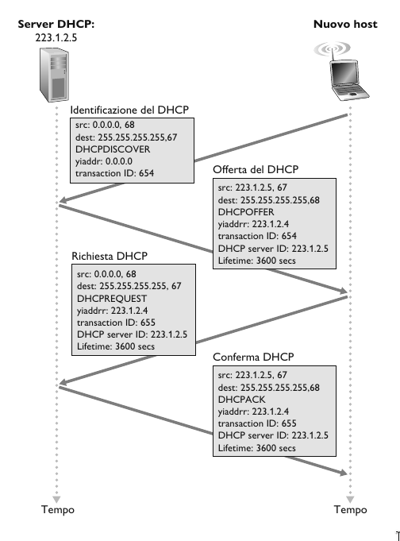

1. **Individuazione del server DHCP**. L'host appena collegato alla rete manda un messaggio **DHCP discover**, ovvero manda un pacchetto UDP sulla porta 67, incapsulato in un datagramma IP con indirizzo sorgente impostato a 0.0.0.0 e indirizzo di destinazione 255.255.255.255. 
2. **Offerta del server DHCP**. Un server DHCP, risponde al client con un messaggio **DHCP offer** che viene inviato di nuovo all'indirizzo 255.255.255.255. Il client a questo punto, può ritrovarsi nella posizione in cui deve scegliere tra più offerte DHCP, dato che possono esistere più di un server DHCP presente nella rete. Ciascun messaggio di offerta del server contiene l'ID della trasazione, l'indirizzo IP proposto al client, la maschera di sottorete, e la durata della connessione (**lease time**) ovvero il tempo di durata dell'indirizzo IP ricevuto.
3. **Richiesta DHCP**. Il client appena collegato, sceglie una delle offerte e risponderà con un messaggio **DHCP request**, che riporta i parametri di configurazione.
4. **Conferma DHCP**. Il server risponde al messaggio di richiesta con un messaggio **DHCP ACK**, che conferma i parametri richiesti.

> [!NOTE]
>
> In genere, il server DHCP è collocato nel router e serve tutte le sottoretia cui il router è collegato.

### NAT (Network Address Translation)

Dato che gli indirizzi IP sono limitati, ci sono **indirizzi IP publici** e **indirizzi IP privati**. Le interfacce che si collegano con la rete esterna dispongono di un indirizzo IP pubblico, mentre le sottoreti dispongono di un indirizzo IP privato.

Gli indirizzi privati hanno siglificato solo per i dispositivi interni, quindi due sottoreti distinte (collegate a router diversi), possono avere lo stesso indirizzo IP privato.

Quindi tutti i dispositivi della rete locale condividono **un solo** indirizzp IPv4 publico per il mondo esterno.

Ma se gli indirizzi privati hanno significato solo all’interno di una data rete, come viene gestito l’indirizzamento dei pacchetti relativi all’Internet globale, in cui gli indirizzi sono necessariamente univoci? La risposta è il **NAT**.

I router abilitati al NAT non appaiono come router al mondo esterno, ma si comportano come un *unico* dispositivo con un *unico* indirizzo IP.

Se tutti i datagrammi in arrivo al router NAT dalla rete geografica hanno lo stesso indirizzo IP di destinazione (nello specifico, quello dell’interfaccia sul lato WAN del router NAT), allora come apprende il router a quale host interno dovrebbe essere inoltrato un determinato datagramma? Il trucco consiste nell’utilizzare una **tabella di traduzione NAT (NAT translation table)** nel router NAT e
nell’includere nelle righe di tale tabella i numeri di porta oltre che gli indirizzi IP.

Tutti i dispositivi della rete locale hanno indirizzi a 32 bit in uno spazio di indirizzi IP *privato*, (prefissi 10/8, 172.16/12, 192.168/16) che possono essere utilizzati solo nella rete locale.

**Vantaggi del NAT**

- È necessario *un solo* indirizzo IP dal provider ISP per tutti i dispositivi.
- Può cambiare gli indirizzi degli host nella rete locale senza notificare il mondo esterno.
- Può cambiare ISP senza modificare gli indirizzi dei dispositivi nella rete locale.
- Sicurezza, ovvero i dispositivi all'intenro della rete locale non sono direttamente indirizzabili, quindi non sono visibiili dall'esterno.

**Come viene implementato il NAT e come funziona**

- Sostituire i datagrammi in uscita, ovvero quando al router NAT arriva un datagramma in uscita da un host locale, sostituisce l'indirizzo IP sorgente e la porta con l'indirizzo IP del NAT e una nuova porta.
- Ricordare nella tabella di traduzione NAT ogni coppia di traduzione da (indirizzo IP sorgente, porta) a (indirizzo IP NAT, nuova porta).  
- Sostituire i datagrammi in uscita, ovvero quando al router NAT arriva in ingresso un datagramma esterno, sostituisce l'indirizzo IP NAT con l'indirizzo IP del host all'interno della rete locale e la porta giusta.

Per velocizzare questo processo viene utilizzata una Hash Table.

**Esempio**

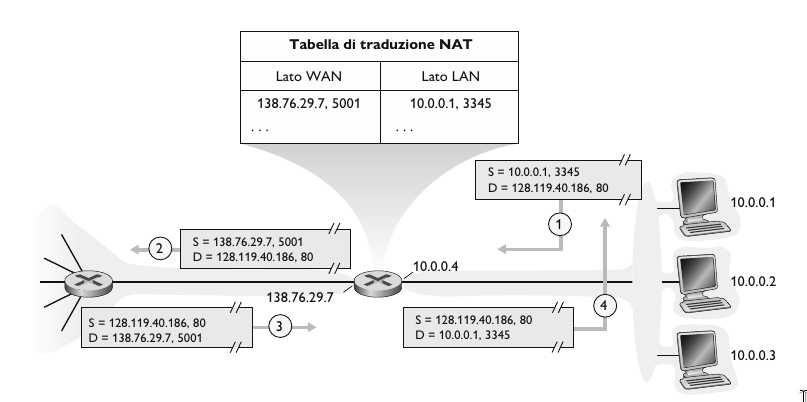

1. L'host 10.0.0.1 invia un datagramma al indirizzo IP 128.119.40.186, e alla porta 80.
2. Il router NAT cambia l'indirizzo di origine del datagramma da 10.0.0.1, 3345 a 138.76.29.7, 5001 e aggiorna la tabella.
3. La risposta arriva all'indirizzo di destinazione: 138.76.29.7, 5001.
4. Il router NAT cambia l'indirizzo di destinazione del datagramma da 38.76.29.7, 5001 a 10.0.0.1, 3345.

### IPv6

Una delle motivazioni iniziali per cui è stato creato IPv6 è la scarsità di indirizzi che IPv4 mette a disposizione.

- **Indirizzamento esteso**: Indirizzi IP da 32 bit a 128.
- **Intestazione ottimizata di 40 byte**: Intestazione a lunghezza fissa a 40 byte.
- **Etichettatura dei flussi**: IPv6 presenta una definizione di **flusso**. La trasimissione audio e video può essere trattata come un flusso, ma le applicazioni tradizionali non sono considerate come flusso.

#### Formato dei datagrammi IPv6

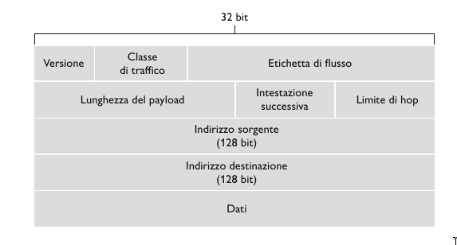

- **Versione**. Campo a 4 bit che identifica il numero di versione IP. Porre 4 in questo campo non è però sufficiente a creare un datagramma IPv4 valido.
- **Classe di traffico**. Attribuisce priorità a datagrammi all'interno di un flusso o proveniente da spefiche applicazioni.
- **Etichetta di flusso**. Identifica i datagrammi appartenenti allo stesso flusso.
- **Lunghezza del payload**. Campo a 16 bit che identifica la lunghezza del payload.
- **Intestazione successiva**. Campo che identifica il protocollo a cui verranno consegnati i contenuti, (TCP o UDP).
- **Limite di hop**. Cammpo TTL in IPv4.
- **Indirizzi sorgente e destinazione**. Indirizzi IPv6 della sorgente e della destinazione.
- **Dati**. Payload che viene passato al protocollo specificato nell'intestazione successiva.

Osserviamo che rispetto a IPv4, mancano i seguenti campi:

- Frammentazione e riassemblaggio.
- Checksum.
- Opzioni.

#### Passaggio da IPv4 a IPv6

L'approccio alla transizione da IPv4 a IPv6 più diffusamente adottato è noto come **tunneling**. L'idea alla base del tunneling è la seguente: Supponiamo che due nodi IPv6 vogliano utilizzare datagrammi IPv6 ma siano connessi da router intermedi IPv4, che chiameremo **tunnel**.

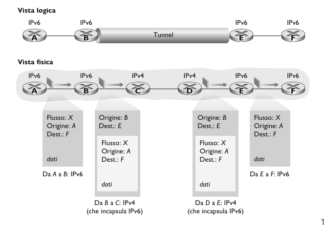

Il Nodo B, al lato di invio del tunnel, prende l’intero datagramma IPv6 pervenutogli da A e lo pone nel campo dati di un datagramma IPv4. Quest’ultimo viene quindi indirizzato al Nodo E, al lato di ricezione del tunnel e inviato al primo nodo nel tunnel (C). I router IPv4 intermedi instradano il datagramma IPv4, come farebbero per qualsiasi altro datagramma, ignari che questo contenga un datagramma IPv6 completo. Il nodo IPv6, sul lato di ricezione del tunnel, riceverà quindi il datagramma IPv4, determinerà che questo ne contiene uno IPv6 osservando che il valore del campo numero di protocollo nel pacchetto IPv4 è 41 corrispondente a payload IPv4, lo estrarrà e lo instraderà esattamente come se l’avesse ricevuto da un nodo IPv6 adiacente.

## Inoltro generalizzato e SDN

Nell'inoltro generalizzato, una tabella match-action generalizza il concetto di tabella di inoltro basata sulla destinazione. Poiché le decisioni di inoltro possono essere effettuate utilizzando indirizzi di sorgente e destinazione del livello di rete e/o livello di collegamento, i dispositivi di inoltro sono denominati più accuratamente "packed switch" piuttosto che "router" di livello 3 o "switch" di livello 2.

Ogni occorenza corrispondente a una riga in una tabella di inoltro match-action, nota come **tabella dei flussi** contiene:

- *Un insieme di valori dei campi dell'intestazione* con i quali il pacchetto entrante viene confrontato.
- *Un insieme di contatori* che vengono aggiornati quando i pacchetti vengono associati a un'occorenza nella tabella dei flussi.
- *Un insieme di azioni* che devono essere intraprese quando un pacchetto è associato a un'occorenza della tabella di flussi (inoltro, scarto, copia, invio broadcast, modifica).

### Match

Nella figura sotto vengono mostrati gli 11 campi dell'intestazione del pacchetto e l'ID della porta di ingresso che possono esere confrontati in un regola match-action. Possiamo osservare che il pacchetto che arriva ad un packet switch è formato da un *frame* a livello di collegamento che a suo interno contiene un *datagramma* IP che a sua volta contiene un *segmento* a livello di trasporto.

Quindi gli unici campi di cui non sappiamo nulla sono:

- **MAC Address**: rappresenta l'indirizzo a livello di collegamento della sorgente e destinatario associati alle interfacce di invio e di ricezione del frame.
- **Ethernet Type**: corrisponde al protocollo del livello sovrastante, per esempio IP al quale il carico del frame viene inviato tramite demultiplexing.
- **VLAN**: questi campi corrispondono invece alle cosiddette reti virtuali locali.

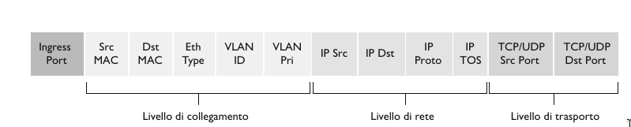

### Action

Di seguito sono mostrate alcune delle più importanti azioni possibili:

- **Inoltro**: Un pacchetto in entrata può essere inoltrato a una particolare porta in uscita, inviato in broadcast a tutte le porte tranne a quella da cui è entrato o inviato in multicast ad un insieme di porte.
- **Scarto**: Un'occorrenza della tabella dei flussi senza azioni indica che il pacchetto dovrebbe essere scartato.
- **Modifica dei Campi**: Tutti i campi trannte "Protocollo IP" possono essere riscritti.

### Esempi

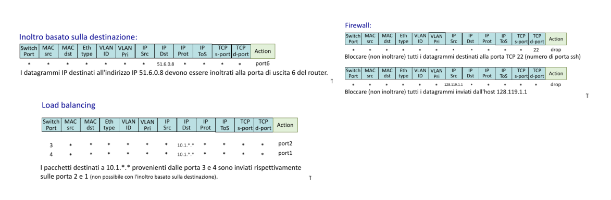

Quindi, questo tipo di inoltro, *match + action* astrae dispositivi differenti, come:

| Device   | Match                                  | Action                             |
| -------- | -------------------------------------- | ---------------------------------- |
| Router   | Prefisso IP di destinazione più lungo  | Inoltro attraverso un collegamento |
| Firewall | Indirizzi IP e numeri di porta TCP/UDP | Consentire o negare l'accesso      |
| Switch   | Indirizzo MAC di destinazione          | Inoltra o inonda                   |
| NAT      | Indirizzo IP e porta                   | Riscrive l'indirizzo e la porta    |

### I dispositivi Middlebox 

Un dispositivo "Middlebox" è un qualsiasi box intermedio che svolge funzioni diverse da quelle normali e standard di un router IP sul percorso dei dati tra gost di origine e destinazione.

Possiamo identificare tre tipi di servizi eseguiti dai middlebox:

- *Traduzione NAT*: I box NAT implementano un indirizzamento di rete privato, la riscrittura degli indirizzi IP e dei numeri di porta dell'intestazione del datagramma.
- *Servizi di sicurezza*: I firewall bloccano il traffico in base ai valori del campo di intestazione o reindirizzano i pacchetti per ulteriori elaborazioni. 
- *Miglioramento delle prestazioni*:  Questi middlebox eseguono servizi come la compressione, il caching dei contenuti e il bilanciamento del carico delle richieste di servizio.

