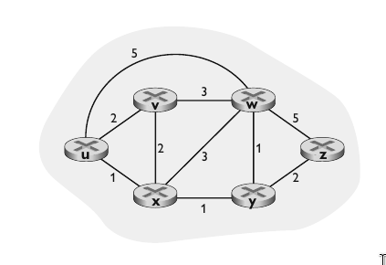
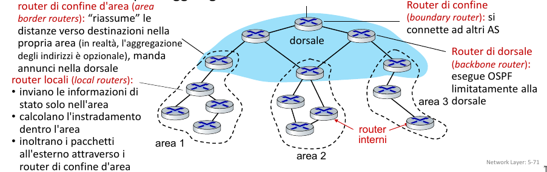
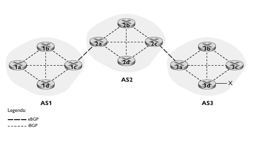
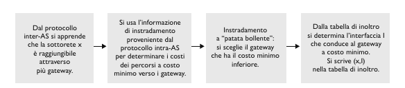
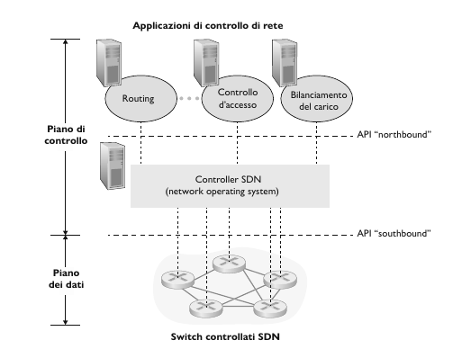
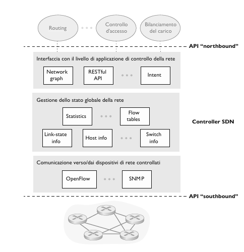
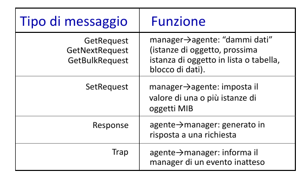

# Livello di rete, piano di controllo

## Introduzione

Nel piano di controllo, il router ha il ruolo di determinare il percoso seguito dai pacchetti dalla sorgente alla destinazione (**Instradamento**).

Ci sono due approcci per eseguire l'istradamento:

- *Controllo per router*: Ogni router ha una componente di instradamento che comunica con le componenti di instradamento degli altri router per calcolare la propria tabella di inoltro (protocolli OSFP e BGP).
- *Controllo logicamente centralizzato (SDN)*: Controller logicamente centralizzato calcola e distribuisce le tabelle di inoltro che devono essere utilizzate da ogni router.

## Algoritmi di instradamento

L'obiettivo di tali algoritmi è di determinare percorsi (sequenze di router) o cammini "buoni", di solito quelli di costo minimo tra le sorgenti e i destinatari attraverso la rete dei router.

Per analizzare il problema dell'instradamento, consideriamo un grafo $G = (V, E)$ non orientato dove $V$ è l'insieme dei nodi, che nel contesto dell'instradamento rappresentano i router e $E$ è l'insieme dei archi, ovvero i collegamenti fisici tra i router.

Per ogni arco $(x, y)$ tra i nodi $x, y$ denotiamo con $c(x, y)$ il costo di tale collegamento (arco). Poniamo $c(x, y) = +\infty$ se l'arco $(x, y) \notin E$. L'obiettivo è dunque quello di trovare il percorso di costo minimo tra due nodi.

- Un **algoritmo di instradamento centralizzato** calcola il percorso a costo minimo tra una sorgente e una destinazione avendo una conoscenza globale e completa della rete. In altre parole, l’algoritmo riceve in ingresso tutti i collegamenti tra i nodi e i loro costi. Questi algoritmi sono detti **algoritmi link-state**.
- In un **algoritmo di instradamento decentralizzato** il percorso a costo minimo viene calcolato in modo distribuito e iterativo. Nessun nodo possiede informazioni complete sul costo di tutti i collegamenti di rete. Inizialmente i nodi conoscono soltanto i costi dei collegamenti a loro incidenti. Questi algoritmi sono detti **algoritmi distance-vector**.

### Instradamento "link-state", algoritmo di Dijkstra

In un instradamento link-state la topologia di rete e tutti i costi dei collegamenti sono noti, ossia disponibili in input all’algoritmo. Ciò si ottiene facendo inviare a ciascun nodo pacchetti sullo stato dei suoi collegamenti a tutti gli altri nodi della rete. Questi pacchetti contengono identità e costi dei collegamenti connessi al nodo che li invia.

L’algoritmo di calcolo dei percorsi che presentiamo associato all’instradamento link-state è noto come **algoritmo di Dijkstra**. (Vedi lezione algoritmi!!!)

Patologia: Quando i costi dei collegamenti dipendono dal volume di traffico, sono possibili oscillazioni dei percorsi

### Instradamento "distance-vector", algortimo di Bellman-Ford

Distance-vector è iterativo, asincrono e distribuito.
- Distribuito nel senso che ciascun nodo riceve parte dell’informazione da uno o più dei suoi vicini direttamente connessi, a cui, dopo aver effettuato il calcolo, restituisce i risultati. 
- Iterativo nel senso che questo processo si ripete fino a quando non avviene ulteriore scambio informativo tra vicini. Aspetto interessante, l’algoritmo è anche auto-terminante: non vi è alcun segnale che il calcolo debba fermarsi, semplicemente si blocca. 
- Asincrono nel senso che non richiede che tutti i nodi operino al passo con gli altri.

Sia $d_{x}(y)$ il costo del percorso a costo minimo dal nodo $x$ al nodo $y$. Allora i costi minimi sono correlati dalla nota formula di Bellman-Ford:
$$d_{x}(y) = \min_{v}\{c(x, v) + d_{v}(y)\}$$

L'idea di base è la seguente: Ciascun nodo $x$ inizia con $D_{x}(y)$, una stima del costo del percorso a costo minimo da sè stesso a $y$, per tutti i nodi in $V$. Sia $D_{x} = [D_{x}(y) \in V]$ il vettore delle distanze del nodo $x$, che è il vettore delle stime dei costi da $x$ a tutti gli altri nodi, y, in $V$. Con l'algoritmo di Bellman-Ford, ciscun nodo mantiene le seguenti informazioni:

- Per ciascun vicino $v$, il costo $c(x, v)$.
- Il vettore delle distanze $D_{x} = [D_{x}(y) \in V]$.
- I vettori delle distanze di ciascun vicino $D_{v} = [D_{v}(y) \in V]$.

Dunque, di tanto in tanto, ogni nodo invia ai vicini il proprio vettore delle distanze stimate. Quando $x$ riceve un "distance vector" da un qualsiasi vicino, aggiorna il proprio "distance vector" utilizzando l'equazione di Bellman-Ford.
$$D_{x}(y) = \min_{v}\{c(x, v) + D_{v}(y)\}\ \forall y \in V$$
Di questo passo, sotto certi condizioni minori e natulari, la stima $D_{x}(y)$ converge verso l'effettivo costo minimi $d_{x}(y)$.

### Confronto tra "link state" e "distance vector"

|                   | Complessità                              | Convergenza                                                      | Robustezza                                                                                             |
| ----------------- | ---------------------------------------- | ---------------------------------------------------------------- | ------------------------------------------------------------------------------------------------------ |
| Link - State      | $O(n^2)$ messaggi inviati                | $O(n^2)$                                                         | Può comunicare in broadcast un costo sbagliato, propria tabella dei costi                              |
| Distance - Vector | scambio di messaggi tra router adiacenti | Puù convergere molto lentamente (cicli e conteggio all'infinito) | Può comunicare in broadcast percosi a costo minimi errati, la tabella di router è usata anche da altri |

## OSFP e BGP

Fino adesso abbiamo visto la rete come un insieme di router interconnessi tra loro. Ciascun router distinguibile dagli altri. Ora invece proviamo a ragrupparli come segue.

Possiamo organizzare i router in **sistemi autonomi (AS, Autonomous System)**, generalmente composti da gruppi di router posti sotto lo stesso controllo amministrativo. 

Un ISP può costituire un unico AS oppure essere partizionato in più AS.

- **Intra-AS protocol:** Algoritmo di instradamento in esecuzione in un AS. I router di un AS eseguono lo stesso algoritmo di instradamento e gli uni hanno informazioni sugli altri. Sul bordo dell'AS si trovao i router di **gateway**. Il protocollo più usato è OSFP.
- **Inter-AS protocol:** Algoritmo di instradamento tra AS. I router gateway effettuano l'instradamento inter-AS oltre a quello intra-AS. Uno dei più importanti protocolli di rete è BGP.

Ciò che comporta la suddivisione di Internet in vari AS e che risolve il problema della scalabilità è che negli algoritmi link-state e distance-vector l’invio delle informazioni sullo stato della rete o sulle distanze è limitato all’AS in questione!

Ciò comporta tabelle più piccole e maggiore velocità di convergenza.
Come detto ogni sistema autonomo può usare il proprio algoritmo di instradamento, e affinché non sia isolato dagli altri AS è necessaria la presenza del router gateway. I gateway partecipano sia all’instradamento inter-AS che a quello intra-AS.

### OSFP (Open Shortest Path First)

OSPF è un protocollo link-state che utilizza il flooding (inondazione) per inviare in broadcast le informazioni riguardo lo stato dei collegamenti e l’algoritmo di Dijkstra per la determinazione del percorso a costo minimo. In OSPF, un router costruisce una mappa topologica, cioè un grafo, dell’intero sistema autonomo e manda in esecuzione (locale) l’algoritmo di Dijkstra per determinare un albero dei cammini minimi verso tutte le sottoreti (albero in cui il router stesso rappresenta il nodo radice).

**Vantaggi**

- *Sicurezza*: Tutti i messaggi OSFP sono autenticati per preventire intrusioni dannose.
- *Percorsi con lo stesso costo*: Se ci sono più percorsi con lo stesso costo, OSPF consente di usarli senza dover sceglierne uno particolare.
- *Gerarchia a due livelli*: Una AS può essere stutturata in due aree, **locale** e **dorsale (backbone**).

### BGP

Il **border gateway protocol (BGP)**, rappresenta l’attuale standard de facto dei protocolli di instradamento tra sistemi autonomi in Internet.

BGP offre a ciascun router un modo per:

#### Ottenere informazioni sulla raggiungibilità dei prefissi di sottorete da parte dei sistemi confinanti.

Supponiamo ora di avere questa rete formata da 3 AS:

Una **Sessione BGP** consiste di due router BGP che si scambiano messaggi BGP attraverso una connessione TCP. Nel caso in
cui questa coinvolga due sistemi autonomi viene detta sessione BGP esterna (sessione eBGP), mentre quella tra router dello stesso sistema autonomo è chiamata sessione BGP interna (sessione iBGP).
I messaggi BGP sono:
- **OPEN**: apre una connessione TCP e autentica il mittente BGP
- **UPDATE**: annuncia un nuovo percorso
- **KEEPALIVE**: mantiene in vita la connessione
- **NOTIFICATION**: segnala gli errori nel messaggio precedente; usato anche per chiudere la connessione

#### Determinare i percorsi "ottimi" verso le sottoreti.

- **AS-PATH**: elenco degli AS attraverso i quali è passato l'annuncio del prefisso.
- **NEXT-HOP**: indirizzo IP dell'interfaccia del router che inzia l'AS-PATH. 
- **Instradamento a patata bollente**: L'algoritmo sceglie il gateway locale che ha il minimo costo INTRA-AS.

 
Il router inolte, può conoscere più di un percorso verso l'AS di destinazione, seleziona il percorso in base a:
- Valore dell'attributo di **prefernza locale**.
- AS-PATH più breve.
- Router NEXT-HOP più vicino.
- Indentificatori BGP

## SDN (Software-Defined Networking)

- Controller SDN

Mantiene le informazioni sullo stato della rete. Interagisce con le applicazioni di controllo della rete "in alto" tramite API "northbound". Interagisce con gli switch di rete "in basso" tramite AP "southbound". È implementato come sistema distribuito per garantire prestazioni, scalabilità, tolleranza ai guasti, robustenzza e sicurezza.

- Applicazzioni di controllo

Implementano le funzioni di controllo utilizzando servizi di livello inferiore attraverso API fornite dal controller SDN.

### OpenFlow

Il protocollo OpenFlow opera tra un controller SDN e uno switch o un altro dispositivo che implementi le API OpenFlow del piano di dati. Il protocollo opera su TCP con numero di porta 6653.
Alcuni dei principali messaggi del protocollo inviati dal controller allo switch controllato sono i seguenti:

- **Configuration**: Questo messaggio permette al controller di interrogare e im-
postare i parametri di configurazione di uno switch
- **Modify-State**: Aggiungere, eliminare,
modificare voci di flusso nelle tabelle
OpenFlow
- **Read-State**:  Il controllore interroga le
caratteristiche dello switch, lo switch
risponde
- **Send-Packet**: Questo messaggio è usato dal controller per inviare un pacchetto specifico fuori da una specifica porta dello switch.
- **Packed-in**: Trasferire il pacchetto (e il relativo controllo) al controllore. Vedere il messaggio packet-out dal controllore.
- **Flow-Removed**: Questo messaggio informa il controller che un’occorrenza della tabella dei flussi è stata cancellata.
- **Port-status**Questo messaggio è usato dallo switch per informare il controller di un cambiamento nello stato di una porta.

**Esempio di interazione tra piano dati e piano di controllo**

1. Lo switch s1 osserva la caduta del collegamento con s2 e notifica tale cambiamento nello stato del collegamento al controller SDN utilizzando un messaggio OpenFlow port-status.
2. Il controller SDN riceve il messaggio OpenFlow con il cambiamento dello stato del collegamento, lo notifica al gestore dello stato del collegamento che aggiorna il database degli stati dei collegamenti.
3. L’applicazione di controllo di rete che implementa l’algoritmo di Dijkstra riceve la notifica del cambiamento dello stato del collegamento.
4. L'algoritmo di routing di Dijkstra accede alle informazioni sul grafo della rete, alle informazioni sullo stato dei collegamenti nel controllore e calcola nuovi percorsi.
5. L’applicazione di instradamento interagisce quindi con il gestore della tabella
dei flussi che determina quali tabelle debbano essere aggiornate.
6. Il controllore utilizza OpenFlow per installare nuove tabelle negli switch che necessitano di un aggiornamento

## ICMP (Internet Message Control Protocol)

Il protocollo **ICMP (Internet Control Message Protocol)** viene usato da host e router per scambiarsi informazioni a livello di rete: il suo uso più tipico è la notifica degli errori.

ICMP è spesso considerato parte di IP, ma dal punto di vista dell’architettura si trova esattamente sopra IP, dato che i suoi messaggi vengono trasportati nei datagrammi IP: ossia, i messaggi ICMP vengono trasportati come payload di IP, esattamente come i segmenti TCP o UDP. Allo stesso modo, se un host riceve un datagramma IP, che specifica ICMP come protocollo di livello superiore, allora effettua il demultiplexing dei contenuti del datagramma a ICMP, esattamente come farebbe per contenuti TCP o UDP.

## Gestione della rete

- **Sistema autonomo (rete)**: migliaia di componenti hardware e software che interagiscono tra loro.

- **Gestione della rete**: comprende il funzionamento, l'integrazione e il coordinamento di hardware, software e personale tecnico per monitorare, verificare, configurare, analizzare, valutare e controllare le risorse della rete affiché soddisfino le funzionalità in tempo reale e i requisiti di qualità del servizio a un costo accettabile.
In poche parole si occupa di gestire e coordinare tutte le componenti hardware e software della rete.

Componenti nella gestione di rete:

- Server di gestione: Raccolta, gestione, elaborazione e analisi delle informazioni. Si occupa dell'invio di informazioni e comandi.
- Dispositivo di rete gestito: Dipositivi hardware e software configurabili.
- Protocollo di gestione: Utilizzato dal server di gestione per interrogare i dispositivi sul loro stato e agire su di essi.
- Dati: Sono gli stati dei dispostivi, come i dati di configurazione (indirizzi IP) e dati operativi e statistiche.

Metodi di approcci del operatore alla rete:

- CLI (Command Line Interface): L'operatore scrive comandi sulla linea di comando o s script da remoto in `ssh`.
- Protocollo SNMP/MIB: L'operatore interroga/imposta i dati contenuti negli oggetti MIB utilizzando il Simple Network Management Protocol.
- NETCONF/YANG: È simile a SNMP ma con enfasi maggiore sul definire la configurazione di rete piuttosto che definire la configurazione dei singoli dispositivi. NETCONF è il protocollo e YANG è il linguaggio.

### SNMP

SNMP è un protocollo a livello di applicazione e utilizza UDP. Ha due modalità di funzionamento:

1. **Richiesta/Risposta**: Il server di gestione, detto **client SNMP**, manda una richiesta all'agente SNMP che poi invia la risposta.
2. **Modalità trap**: L'agente manda un messaggio al server di gestione per notificarlo di un evento imprevisto.

Nel formato di questi messaggi (PDU) deve essere presente un ID che associ la richiesta alla risposta. SNMP accede ai dati dal dispostivo, dati modellati nella MIB che può essere visto come un database gerarchico (root, nodi, etc...).
Quindi la struttura del MIB rircorda molto la struttura di un file system gerarchico, dunque possiamo identificare un oggetto tramite un *percorso definito dai vari componenti separati da un separatore. I componenti in questo caso sono numeri ed il separatore un punto.*

- **OID**: rappresenta un cammino nella base dati MIB, che permette di identificare l'oggetto MIB specifico che potrò leggere o scrivere.

### NETCONF

Per NETCONF il discorso è simile a SNMP, si tratta semplicemente di un'alternativa più moderna. L'obiettivo è quello di gestire ma anche di configurare i dispositivi della rete. In NETCONF troviamo le notifiche che hanno lo stesso ruolo dei messaggi trap in SNMP.

- **Differenza tra NETCONF E SNMP**: NETCONF supporta la manipolazione simultanea nella configurazioni di molteplici dipositivi. (Domnda d'esame).

Due estremi nel protocollo NETCONF comunicano tramite una chiamata di procedura remota `rpc` fatta stabilendo una sessione con un protocollo di trasferimento dati affidabile e sicuro, inviando messaggi `xml` atti a codificare sia la richiesta che la risposta.

#### YANG

YANG è il linguaggio di modellazione dei dati utilizzato per specificare la struttura, la sintassi e la semantica dei dati di gestione della rete NETCONF. Dal codice YANG viene generato un file `xml` che descrive il dipositivo.
 