# Livello di Trasporto

## Introduzione

Un protocollo a livello di trasporto mette a disposizione una **comunicazione logica** tra processi applicativi di host diversi.
Per comunicazione logica si intente, dal punto di vista dell'applicazione, che tutto proceda come se gli host che eseguono i processi fossero direttamente connessi, anche se geograficamente si trovano in posti totalmente diversi.

Come i protocolli a livello di applicazione, anche i protocolli a livello di trasporto sono implementanti nei sistemi periferici.
- Lato mittente: il livello di trasporto converte i messaggi che riceve dal livello applicazione in pacchetti a livello di trasporto, noti come **segmenti**. Questo avviene spezzando (se necessario) i messaggi in parti più piccole aggiungendo a ciascuna un intestazione di trasporto per creare il segmento. Il livello di trasporto passa poi il segmento al livello di rete, dove viene incapsulato in un datagramma e inviato al destinatario. 
- Lato ricevente: elabora i segmenti ricevuti dal livello di rete, crea il messaggio assemblando i segmenti e li passa al livello applicazione.

Internet possiede due protocolli di trasporto:
- UDP (User Datagram Protocol), inaffidabile.
- TCP (Transmission Control Protocol), comunicazione tra processi affidabile, con vari controlli.

Quindi:
- Livello di trasporto: comunicazione logica tra **processi**
- Livello di rete: comunicazione logica tra **host**

## Multiplexing e Demultiplexing

Un processo, gestisce più di una **socket**, attraverso i quali i dati fluiscono dalla rete al processo e viceversa. Di conseguenza, il livello di trasporto non trasferisce i dati direttamente al processo, bensì ad un socket che fa da intermediario. Inoltre, ogni socket avrà un identificatore univoco il cui formato dipende dal fatto che si tratti di socket UDP o TCP.

- Lato ricevente, il livello di trasporto esamina i campi del segmento per identificare la socket di ricezione e quindi vi dirige il segmento. Il compito di trasportare i dati dei segmenti a livello di trasporto verso la socket giusta viene detto **demultiplexing**.
- Lato mittente, il livello di trasporto raduna i frammenti di dati da diverse socket sull'host di origine e incapsulare ognuno con intestazione a livello di trasporto per creare dei segmenti e passarli al livello di rete. Quest'operazione viene detta **multiplexing**.

Il multiplexing a livello di trasporto richiede:
1. Le socket abbiano identificatori unici
2. Ciascun segmento presenti campi che indichino la socket cui va consegnato il segmento.

Questi sono il **campo del numero di porta di origine** e il **campo del numero di porta di destinazione**. I numeri di porta sono di 16 bit e vanno da 0 a 65535, quelli che vanno da 0 a 1023 sono chiamati **numeri di porta noti** e sono riservati per essere usati da protocolli applicativi noti come HTTP, FTP, DNS etc... .Quindi ogni socket nell'host deve avere un numero di porta e, quando un segmento arriva all'host, il livello di trasporto esamina il numero della porta di destinazione e dirige il segmento verso la socket corrispondente. I dati del segmento passano quindi dalla socket al processo assegnato.

**Multiplexing e Demultiplexing non orientati alla connessione**

In Python, `client_socket = socket(AF_INET, SOCK_DGRAM)` permette di creare una socket UDP. Quando una socket viene creata in questo modo, il sistema operativo assegna in modo automatico un numero di porta compreso tra 1024 e 65535 che non sia ancora utilizzato. In alternativa, `client_socket.bind(('', 19157))` crea una socket associata ad una particolare porta.

Una volta create le socket, quando si deve creare il datagramma si deve specificare l'indirizzo IP di destinazione e il numero di porta di destinazione, il segmento viene poi passato al livello di rete che effettua un tentativo best-effort di consegna del segmento all'host di destinazione. Se il segmento arriva all'host di destinazione, il suo livello di trasporto esamina il numero di porta di destinazione nel segmento, e invia il segmento UDP alla socket con quel numero di porta.

E' importante notare che una socket UDP viene identificata completamente da una coppia che consiste di un indirizzo IP e di un numero di porta di destinazione. Due segmenti UDP con lo stesso indirizzo IP e numero di porta di destinazione saranno indirizzati allo stesso processo sul computer di destinazione, anche se gli indirizzi IP e i numeri di porta di origine sono diversi. 
Esempio:
- Il computer A invia un segmento UDP al computer C con l'indirizzo IP 192.168.1.100 e la porta 5000.
- Il computer B invia un segmento UDP al computer C con l'indirizzo IP 192.168.1.100 e la porta 5000.
Entrambi i segmenti UDP saranno indirizzati allo stesso processo sul computer C, perché hanno lo stesso indirizzo IP e numero di porta di destinazione 192.168.1.100:5000.

**Multiplexing e Demultiplexing orientati alla connessione**

La differenza tra una socket TCP e una socket UDP è che una socket TCP è identificata da 4 parametri: **indirizzo IP di origine**, **numero di porta di origine**, **indirizzo IP di destinazione**, **numero di porta di destinazione**.

- L'applicazione server TCP presenta una "socket di benvenuto" che si pone in attesa di richieste di connessione da parte dei client TCP sula porta 12000.
- Il client TCP crea una socket e genera un segmento per stabilire la connessione tramite le seguenti linee di codice: 
```python
client_socket = socket(AF_INET, SOCK_STREAM)
client_socket.connect(server_name, 12000)
```
- Una richiesta di connessione non è nient'altro che un segmento TCP con un numero di porta di destinazione 12000 e uno speciale bit di richiesta di connessione post a 1 nell'intestazione. Il segmento include anche un numero di porta di origine, scelto dal client.
- Il sistema operativo dell'host che esegue il processo server, quando riceve il segmento con la richiesta di connessione con porta di destinazione 12000, localizza il processo server in attesa di accettare connessioni sulla porta 12000. Il processo server crea quindi una nuova connessione `connection_socket, addr = server_socket.accept()` 
- Inoltre il livello di trasporto sul server prende nota dei seguenti valori nel segmento con la richiesta di connessione:
    1.  Numero di porta di origine nel segmento
    2.  Indirizzo IP dell'host di origine
    3.  Numero di porta di destinazione nel segmento
    4.  Il proprio indirizzo IP 

Tutti i segmenti successivi la cui porta di origine, indirizzo IP di origine, porta di destinazione e indirizzo IP di destinazione coincidono con tali valori verranno diretti verso questa socket.

## Trasporto non orientato alla connessione: UDP

UPD fa il minimo che un protocollo di trasporto debba fare. A parte la funzione di multiplexing/demultiplexing e una forma di controllo semplice, non aggiunge nulla a IP. UDP prende i messaggi dal processo applicativo, aggiunge il numero di porta di origine e di destinazione per il multiplexing/demultiplexing, aggiunge altri due piccoli campi e passa il segmento al livello di rete.
In UDP non esiste handshaking tra le entità di invio e di ricezione a livello di trasporto. Per questo motivo, si dice che UDP è **non orientato alla connessione**.

**Perche esiste UDP?**

- Controllo più preciso a livello di applicazione su quali dato sono inviati e quando, dimunendo il ritardo di trasmissione, dato che non deve effettuare controlli.
- Nessuna connessione stabilita, che potrebbe aggiungere ritardo.
- Nessun stato di connessione.
- Minor spazio usato per l'intestazione del pacchetto, UDP aggiunge 8 byte mentre TCP ne aggiunge 20.

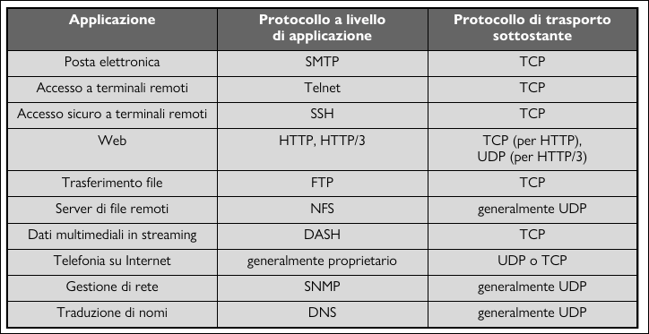

- Lato mittente: Gli viene passato un messaggio applicativo, determina i valori dei campi di intestazione del segmento UDP, poi crea il segmento e lo invia al livello di rete.
- Lato ricevente: Riceve il segmento dal livello di rete, controlla il valore del campo di intestazione UDP checksum, estrare il messaggio applicativo e lo consegna alla socket appropriata.

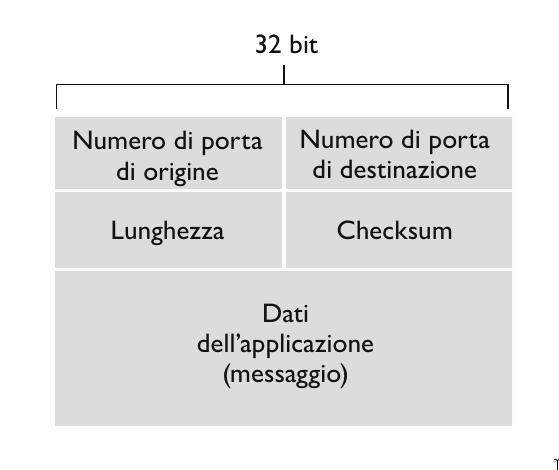

**Checksum UDP**

Il checksum UDP server per il rilevamento degli errori. In altre parole, viene utilizzato per determinare se i bit del segmento UDP sono stati alterati durante il loro trasferimento da sorgente a destinazione. Il mittente UDP effettua il complemento a 1 della somma di tutte le parole da 16 bit nel segmento, e l'eventuale riporto viene sommato al primo bit. Tale risulato viene posto nel campo *Checksum* del segmento UDP.
Ipotizziamo di avere 3 parole a 16 bit:
- Questa è la somma delle prime 2
$$0110 0110 0110 0000 + 
  0101 0101 0101 0101 =
  1011 1011 1011 0101$$
- Adesso sommiamo il risulato della somma, con la terza parola
$$1011 1011 1011 0101 +
  1000 1111 0000 1100 =
  0100 1010 1100 0010$$
- Effettuando il complemento a 1, che consiste in invertire i bit, otteniamo: $1011 0101 0011 1101$. In ricezione si sommano le tre parole inziali e il checksum. Se non ci sono errori nel pacchetto, l'adizione farà $1111 1111 1111 1111$, altrimenti se un bit vale 0 sappiamo che è stato introdotto almeno un errore nel pacchetto.

## Principi del trasferimento dati affidabile

L'astrazione del servizio offerta alle entità dei livelli superiori è quella di un canale affidabile tramite il quale si possono trasferire dati. Con un canale affidabile a disposizione nessun bit dei dati trasferiti è corrotto o va perduto e tutti i bit sono consegnati nell'ordine di invio.
Il compito di un **protocollo di trasferimento affidabile** è l'implementazione di questa astrazione di servizio.

Per esempio TCP è un protocollo di trasferimento dati affidabile implementato appogiandosi a un livello di rete (IP) che non è affidabile end-to-end.


Assumiamo che i pacchetti vengano consegnati nell'ordine con cui sono stati inviati, ma che alcuni possono andare persi. L'interfacce che useremo per descrivere il protocollo affidabile sono:
- `rdt_send()`: trasferirà i dati da consegnare al livello superiore sul lato ricevente. `rdt` sta per *reliable data transfer*.
- `rdt_rcv()`: chiatama usata per ricevere i dati dal lato del ricevente.
- `rdt_deliver()`: invia i dati al livello superiore.
- `udt_send()`: invio di pacchetti di controllo. `udt` sta per *unreliable data transfer*.

Inoltre, consideriamo solo il caso di **trasferimento dati unidirezionale**. Quindi passiamo adesso a definire man mano il nostro protocollo `rdt`, mediante una macchina a stati finiti. Lo stato successivo è determinato unicamente dall'evento successivo.

### rdt 1.0, canale affidabile

Consideriamo il caso più semplice, in cui il canale sottostante è completamente affidabile.

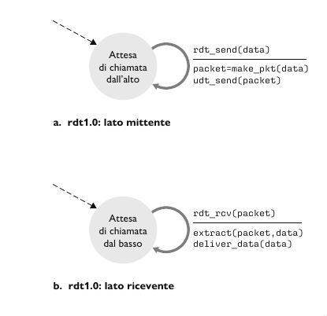

- Mittente: accetta i dati dal livello superiore `rdt_send(data)`, crea il pacchetto `make_pkt(data)` e lo invia sul canale `udt_send(data)`.
- Ricevente: riceve i dati dal canale sottostante `rdt_rcv(packet)`, rimuove i dati dal pacchetto `extract(packet, data)` e li passa al livello superiore `deliver_data(data)`.

### rdt 2.0, canale con errori su bit

Un modello più realistico del canale sottostante è quello in cui i bit in un pacchetto possono essere corrotti.
Dopo ogni invio di un pacchetto, il mittente si mette in attesa di un feedback da parte del ricevente, che può essere:
- **Positiva, acknowledgements (ACKs)**: il ricevente comunica espressamente al mittente che il pacchetto ricevuto è corretto.
- **Negativa, negative acknowledgements (NAKs)**: il ricevente comunica espressamente al mittente che il pacchetto contiene errori. In questo caso il mittente *ritrasmette* il pacchetto.

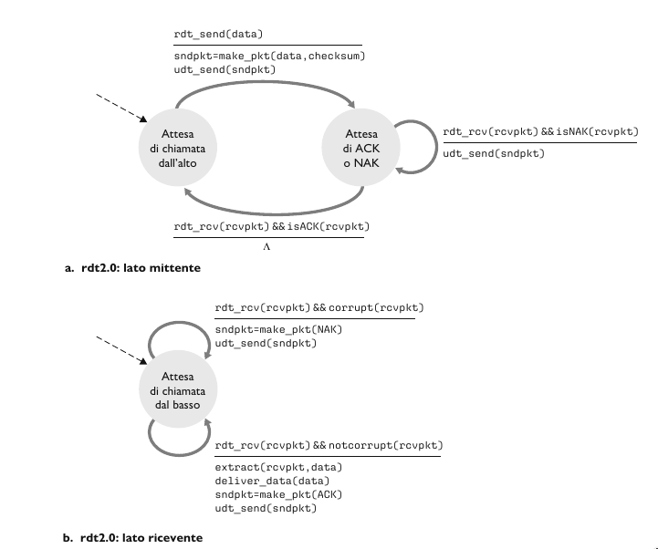

- Mittente: Nello stato di sinistra, attende e raccoglie i dati dal livello superiore `rdt_send(data)`, crea il pachetto contenente i dati da inviare e il checksum e infine spedisce il pacchetto `rdt_send(sndpkt)`. Nello stato di destra, è in attesa di un pacchetto ACK o NAK dal destinatario. Se riceve un  ACK `rdt_rcv(rcvpkt) && isACK(rcvpkt)`, il mittente sa che il pacchetto trasmesso più di recente è stato ricevuto correttamente e torna nello stato di attesa dei dati proveniente dal livello superiore. Se riceve un NAK, il protocollo ritrasmette l'ultimo pacchetto e attende una risposta alla ritrasmissione.
Da notare che quando è in attesa di ACK o NAK, non può riceve altri dati dal livello superiore, perciò non puo inviare nuovi dati finchè non è certo che il destinatario abbia ricevuto correttamente il pacchetto corrente. Questo tipo di protocolli sono noti come **protocolli stop-and-wait**.  
- Ricevente: All'arrivo del pacchetto, il destinatario risponde o con un ACK `rdt(rcvpkt) && notcorrupt(rcvpkt)` o con NAK `rdt(rcvpkt) && corrpt(rcvpkt)`, a seconda che il pacchetto sia corrotto o meno. 

Anche se sembra funzionare questo protocollo, nella realtà presenta un grave difetto; infatti non abbiamo tenuto conto della possibilità che i pacchetti ACK e NAK possano a loro volta essere dannegiati. Infatti se un ACK o un NAK è corrotto, il mittente non ha modo di sapere se il destinatario abbia ricevuto correttamente l'ultimo blocco di dati trasmesso.

### rdt 2.1, gestione di ACK o NAK alterati

Un approccio a questo problema prevede semplicemente che il mittente rinvii il pacchetto di dati corrente a seguito della ricezione di un pacchetto ACK o NAK alterato. Questo approccio introduce **pacchetti duplicati** nel canale. La fondamentale difficoltà insita nella duplicazione di pacchetti che il destinatario non sa se l'ultimo ACK o NAK inviato sia stato ricevuto correttamente dal mittente. Una soluzione a questo nuovo problema consiste nell'aggiungere un campo al pacchetto dati, obbligando il mittente a numerare i propri pacchetti dati con un **numero di sequenza**. Al destinatario sarà sufficiente controllare questo numero per sapere se il pacchetto ricevuto rappresenti un ritrasmissione o meno. 
Per questo semplice protocollo, un numero di sequenza da 1 bit sarà sufficiente, dato che consentirà al destinatario di sapere se il mittente stia ritrasmettendo un pacchetto o inviandone un già trasmesso. Nel primo caso il numero di sequenza del pacchetto ha lo stesso numero di sequenza del pacchetto appena ricevuto, nel secondo caso il numero di sequenza sarà diverso. Dato che stiamo ipotizzando che il canale non perda pacchetti, i pacchetti ACK e NAK non devono indicare il numero di sequenza del pacchetto di cui rappresentano la notifica. Il mittente sa che un pacchetto ricevuto di tipo ACK o NAK (alterato o meno) è stato generato come risposta al pacchetto dati trasmesso più di recente.

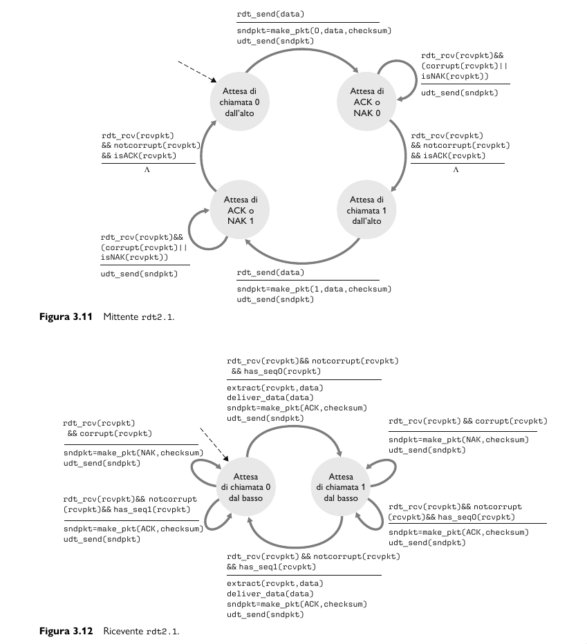

Adesso, gli automi del mittente e del destinatario hanno il doppo degli stati, questo perche il protocollo deve riflettere il fatto che il pacchetto attualmente in invio o in ricezione abbia numero di sequenza 0 o 1.

### rdt2.2, un protocollo senza NAK

- Ha la stessa funzionalità di rdt2.1, utilizzando soltanto gli ACK. Al posto di NAK, il destinatario invia un ACK per l'ultimo pacchetto ricevuto correttamente. Il destinatario deve includere esplicitamente il numero di sequenza del pacchetto con l'ACK.
- Un ACK duplicato presso il mittente determina la stessa azione del NAK, ovvero sa che il destinatario non ha ricevuto correttamente il pacchetto, e dovrà ritrasmettere il pacchetto corrente.

### rdt3.0, canali con errori e perdite

Supponiamo ora che il canale di trasmissione, oltre a dannegiare i bit, possa anche *smarrire* i pacchetti, un evento non raro sulle odierne reti di calcolatori. Supponiamo che il mittente spedisca una pacchetto dati e che questo o l'ACK corrispondente del ricevente venga smarrito. In entrambi i casi, il mittente non otterrà alcuna risposta dal destinatario. Se il mittente è disposto ad attendere un tempo per essere certo dello smarrimento del pacchetto, può semplicemente ritrasmettere il pacchetto.

Adesso si pone il problema di scegliere adeguatamente il tempo di attesa, quindi l'approccio adottato nella pratica è scegliere in modo assennato un valore di tempo tale per cui la perdita di pacchetti risulti probabile, anche se non garantita. Se non riceve un ACK in questo lasso di tempo, il pacchetto viene ritrasmesso.
Ci può essere il caso in cui un pacchetto sperimenta um ritardo particolarmente lungo, anche se nè il pacchetto dati nè il pacchetto ACK sono smarriti, in questo caso c'è la possibilità di **pacchetti di dati duplicati**, ma questo problema è già stato risolto in rdt2.0.

Il mittente non sa se un pacchetto dati sia andato perduto, se sia stato smarrito un ACK o se il pacchetto o l’ACK abbiano semplicemente subìto un notevole ritardo.
In tutti questi casi, l’azione intrapresa è la stessa: ritrasmettere. Implementare un meccanismo di ritrasmissione basato sul tempo richiede un contatore 
(count-down timer) in grado di segnalare al mittente l’avvenuta scadenza di un dato lasso di tempo.

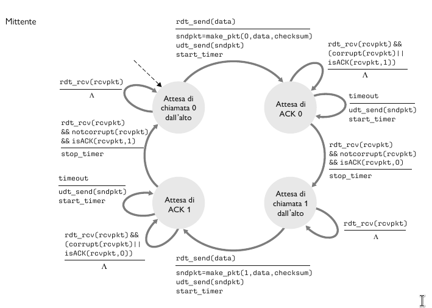

Dato che i numeri di sequenza dei pacchetti si alternano tra 0 e 1, il protocollo rdt3.0 viene talvolta detto **protocollo ad alternanza di bit**.

### Protocolli per il trasferimento dati affidabile con pipeline

Il protocollo rdt3.0 è corretto dal punto di vista funzionale, ma è molto lento rispetto alle reti odierne. Il problema delle prestazioni risiede nel fatto che si tratta di un protocollo stop-and-wait.

**Funzionamento rdt3.0 con protocollo stop-and-wait**

Per analizzare la velocita di trasferimento di un protocollo stop-and-wait consideriamo questo caso: due host, ciascuno su una costa degli Stati Uniti. Il ritardo di propagazione (RTT) alla velocità della luce è approssimativamente 30 ms. Supponiamo un collegamento a 1 Gbps con pacchetti di dimensione $L$ di 100 byte.

$$
d_{t} = \frac{L}{R} = \frac{8000}{10^9} \frac{bit}{bit / s} = 8\mu s
$$

Se definiamo l'**utilizzo** del mittente come la frazione di tempo in cui il mittente è stato effettivamente occupato nell'invio di bit sul canale, il protocollo stop-and-wait presenta un triste utilizzo del mittente $U_{mittente}$ pari a:

$$
U_{mittente} = \frac{L / R}{RTT + L / R} = \frac{0.008}{30.008} = 0.0027
$$

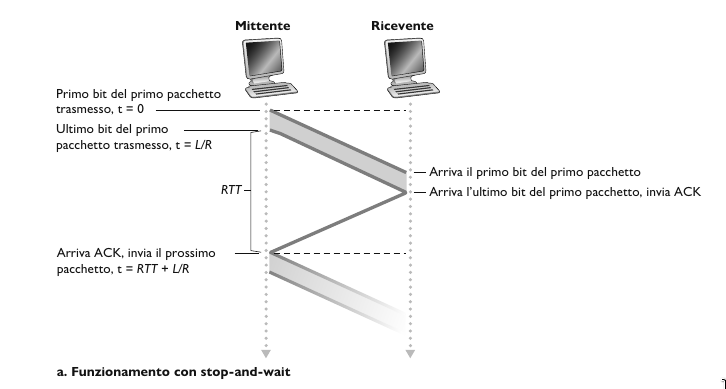

Di conseguenza, il throughput è al massimo 267 kbps!

**Funzionamento rdt3.0 con pipeline**

La soluzione a questo problema è semplice. Anziché operare in modalità stop-and-wait, si consente al mittente di inviare più pacchetti senza attendere gli acknowledgement. Questa tecnica è nota come **pipelining**. Di conseguenza il protocollo di trasferimento affidabile cambia un po:
- L'intervallo di numeri di sequenza disponibili deve essere incrementato dato che ogni pacchetto in transito deve presentare un numero di sequenza univoco e che ci potrebbero essere più pacchetti in transito ancora in attesa di acknowledgment.
- Ci dovrà essere un buffer sia nel mittente che nel destinatario. Il mittente dovrà memorizzare i pacchetti trasmessi, ma il cui acknowledgment non è ancora ricevuto.
- Due soluzioni ai errori con pipeline: **Go-Back-N** e **ripetizione selettiva**.

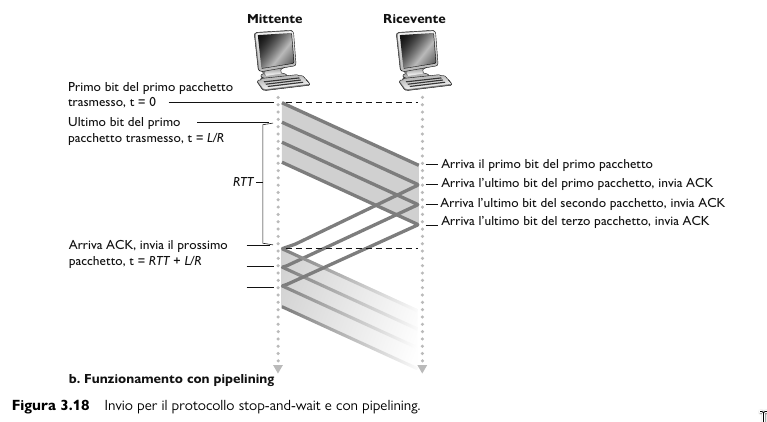

### Go-Back-N (GBN)

In un protocollo **Go-Back-N** il mittente può trasmettere più pacchetti senza dover attendere alcun acknowledgment, ma non può avere più di un dato numero massimo consentito N di pacchetti in attesa di acknowledgment nella pipeline. 

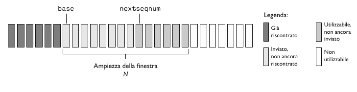

- L'intervallo `[0, base - 1]` corrisponde ai pacchetti già trasmessi e che hanno ricevuto acknowledgment.
- L'intervollo `[base, nextseqnum - 1]` corrisponde ai pacchetti inviati, ma che non hanno ancora ricevuto alcun acknowledgment.
- L'intervallo `[nextseqnum, base + N - 1]` può essere utilizzato per i pacchetti da inviare immediatamente, nel caso arrivassero dati dal livello superiore.
- Infine, i numeri di sequenza maggiore o uguali a $base + N$ non posson essere utilizzati finché il mittente non riceva un acknowledgment relativo a un pacchetto che si trova nella pipeline ed è ancora privo di acknowledgement.

L'intervallo di numeri di sequenza ammisibili per i pacchetti trasmessi, ma che non hanno ancora ricevuto alcun acknowledgment, può essere visto come una finestra di dimensione $N$ sull'intervallo di numeri di sequenza. Quando il protocollo è in funzione, questa finestra trasla lungo lo spazio dei numeri di sequenza. Per questo motivo, $N$ viene spesso chiamato **ampiezza della finestra** e il protocollo GBN viene detto **protocollo a finestra scorrevole**.

**Il mittente GBN deve rispondere a tre tipi di evento.**

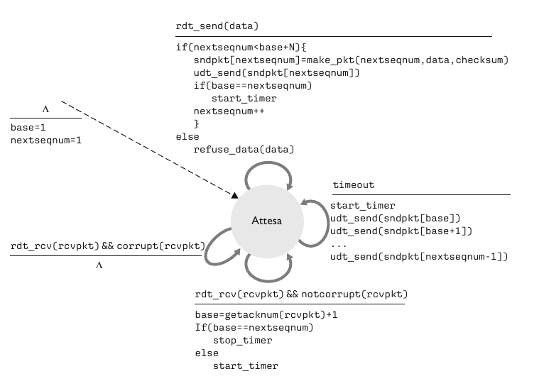

1. *Invocazione dall'alto*. Quando viene chaiamata `rdt_send()`, come prima cosa il mittente controlla se la finestra sia piena, ossia se vi siano $N$ pacchetti in sospeso senza acknowledgment. Se la finistra non è piena, crea e invia un pacchetto e le variabili vengono aggiornate di conseguenza. Se la finistra è piena, il mittente restituisce i dati al livello. A livello implementativo, i dati vengono memoriazzati in un buffer oppure viene utilizzato un meccanismo di sincronizzazione che consenta al livello superiore di invocare `rdt_send()` solo quando la finestra non è piena.
2. *Ricezione di un ACK*. Nel protocollo GBN, l'acknowledgment del pacchetto con il numero di sequenza $n$ verrà considerato un **acknowledgment cumulativo**, che indica che tutti i pacchetti con un numero di sequenza $\leq n$ sono stati correttamente ricevuti.
3. *Evento di Timeout*. Come nei protocolli stop-and-wait, si usa ancora un contatore per risolvere il problema di pacchetti dati o acknowledgment persi. Quando si verifica un timeout, il mittente invia nuovamente **tutti** i pacchetti spediti che ancora non hanno ricevuto un acknowledgment.  

**Anche le azioni del destinatario GBN sono semplici**

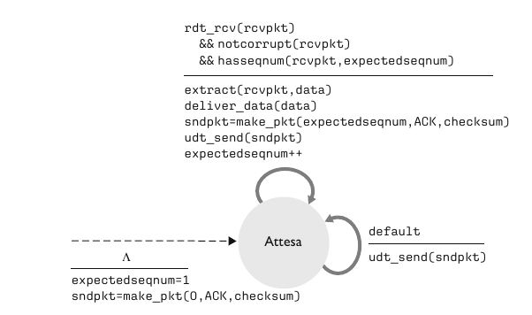

Se un pacchetto con numero di sequenza $n$ viene ricevuto correttamente ed è in ordine (ossia, gli ultimi dati consegnati al livello superiore provengono da un pacchetto con numero di sequenza $n - 1$), il destinatario manda un ACK per quel pacchetto e consegna i suoi dati al livello superiore. In tutti gli altri casi, il destinatario scarta i pacchetti e rimanda un ACK per il pacchetto in ordine ricevuto più di recente.

### Ripetizione selettiva

I **protocolli a ripetizione selettiva** evitano le ritrasmissioni non necessarie facendo ritrasmettere al mittente solo quei pacchetti sui cui esistono sospetti di errore (ossia, smarrimento o alterazione). 

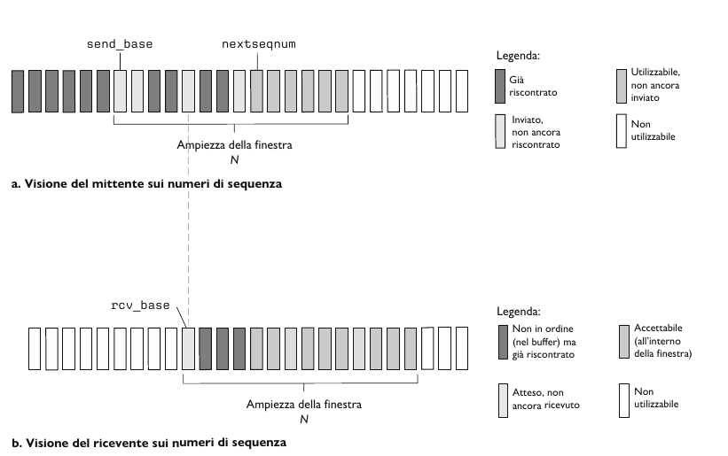

**Mittente**

1. *Dati ricevuti dall'alto*. Quando si ricevono dati dall'alto, il mittente SR controlla il successivo numero di sequenza disponibile per il pacchetto. Se è all'interno della finestra del mittente, i dati vengono impacchettati e inviati. Altrimenti sono salvati nei buffer o restituiti al livello superiore per una successiva ritrasmissione, come in GBN.
2. *Timeout*. Vengono usati ancora i contatori per cautelarsi contro la perdita di pacchetti. Ora però ogni pacchetto deve avere un proprio timer logico, dato che al timeout sarà ritrasmesso un solo pacchetto.
3. *ACK ricevuto*. Se riceve un ACK, il ricevente etichetta tale pacchetto come ricevuto, ammesso che sia nella finestra. Se $n$ è il numero di sequenza di più piccolo, la base della finestra avanza al successivo numero di sequenza del pacchetto non riscontrato.

**Ricevente**

1. *Il pacchetto con numero di sequenza nell'intervallo `[rcv_base, rcv_base + N + 1]` viene ricevuto correttamente*. Il pacchetto ricevuto ricade all'interno della finestra del ricevente e al mittente viene restituito un pacchetto ACK. Se il pacchetto non era già stato ricevuto viene inserito nel buffer. Se presenta un numero di sequenza uguale alla base della finestra di ricezione, allora questo pacchetto e tutti i pacchetti nel buffer aventi numeri consevutivi vengono consegnati al livello superiore.
2. *Viene ricevuto il pacchetto con numero di sequenza nell' intervallo `[rcv_base - N, rcv_base - 1]`*. In questo caso si deve generare un ACK, anche se si tratta di un pacchetto che il ricevente ha già riscontrato.
3. *Altrimenti*, si ignora il pacchetto.   

## Trasporto orientato alla connessione: TCP

### Connessione TCP

> [!IMPORTANT]
>
> **TCP** viene detto **orientato alla connessione** in quanto, prima di effettuare lo scambio dei dati, i processi devono effettuare l'handshake, ossia devono inviarsi reciprocamente alcuni segmenti preliminari per stabilire i parametri del successivo trasferimento dati. Come parte dell'instaurazione della connessione TCP, entrambe le parti inizializzano molte variabili di stato associate alla connessione.

Una connessione TCP offre un **servizio full-duplex**, ovvero data una connessione tra due applicazioni, A e B su due host differenti,  i dati a livello di applicazione possono fluire dal processo A al processo B e in contemporanea dal processo B al processo A. (A <-> B).

Una connessione TCP è anche **punto a punto**, ossia ha luogo tra un singolo mittente e un singolo destinatario.
Una volta instaurata una connessione TCP, i due processi applicativi si possono scambiare dati. Consideriamo l'invio di dati dal processo client al processo server. Il primo manda un flusso di dati attraverso la socket. Questi quando hanno attraversato il punto di uscita, sono nelle mani di TCP in esecuzione sul client. TCP dirige i dati al **buffer di invio** della connessione, uno dei buffer riservato durante l'handshake a tre vie, da cui, di tanto in tanto, preleverà blocchi di dati e li passerà al livello di rete.

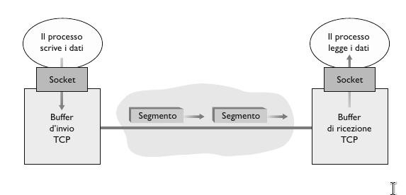

La massima quantità di dati prelevabili e posizionabili in un segmento viene limitata dalla **dimensione massima del segmento (MSS)**. Questo valore viene generalmente impostato determinando prima la lunghezza del frame più grande che può essere inviato a livello di collegamento dall'host mittente locale, la cosidetta **unità trasmissiva massima (MTU)** e poi scegliendo un MSS tale che il segmentto TCP stia all'interno di un singolo frame a livello di collegamento, considerando anche la lunghezza dell'intestazione TCP/IP normalmente di 40 byte. I protocolli Ethernet e PPP hanno un MTU di 1500 byte, quindi un valore tipico di MSS è di 1460 byte.

### Segmenti TCP

TCP accoppia ogni blocco di dati del client a una intestazione TCP, andando a formare **segmenti TCP**. Questi vengono passati al sottostanze livello di rete, dove sono incapsulati separatamente in datagrammi IP che vengono poi immessi in rete. Dall'altro capo TCP riceve un segmento, i dati del segmento vengono memorizzati nel buffer di ricezione della connessione TCP. L'applicazione legge il flusso di dati da questo buffer, che è proprio per ogni lato della connessione.


Come in UDP, l'intestazione include **numeri di porta di origine e di destinazione**, utilizzati per il multiplexing e il demultiplexing dei dati da e verso le applicazioni del livello superiore, e un campo **Checksum**. Inoltre TCP comprende anche i seguenti campi d'intestazione:

- **Numero di sequenza** e **Numero di acknowledgment**, entrambi di 32 bit, vengono utilizzati dal mittente e dal destinatario TCP per implementare il trasferimento dati affidabile.
- **Finestra di ricezione**, di 16 bit, viene utilizzato per il controllo di flusso.
- **Lunghezza dell'intestazione**, di 4 bit, specifica la lunghezza dell'intestazione TCP in multipli di 32 bit. L'intestazione TCP ha lunghezza dell'intestazione TCP in multipli di 32 bit.L'intestazione TCP ha lunghezza variabile a causa del campo delle opzioni TCP. Generalmente, il campo delle opzioni è vuoto e, pertanto la lunghezza consueta è di 20 byte.
- **Opzioni**, facoltativo e di lunghezza variabile, viene utilizzato quando mittente e destinatario negoziano la dimensione massima del segmento (MSS) o come fattore di scala per la finestra nelle reti ad alta velocità.
- **Flag**, campo di 6 bit. Il bit **ACK** viene usato per indicare che il valore trasportato nel campo di acknowledgment è valido. I bit **RST**, **SYN**, **FYN** vengono utilizzati per impostare e chiudere la connessione. I bit **CWR** ed **ECE** sono usati nel controllo di congestione. Se il bit **PSH** ha valore 1 il destinatario dovrebbe inviare immediatamente i dati al livello superiore. Il bit **URG** per indicare nel segmento la presenza di dati che l'entità mittente a livello superiore ha marcato come "urgenti".

**Numeri di sequenza e numeri di acknowledgment**

TCP vede i dati come un flusso di byte non strutturati, ma ordinati. Dato che i numeri di sequenza si applicano al flusso di byte trasmessi e non alla serie di segmenti trasmessi, pertanto, il **numero di sequenza del segmento** è il numero nel flusso di byte del primo byte del segmento.

Siano due host, A e B in comuncazione su un canale TCP.
Il **numero di acknowledgment** che l'host A scrive nei propri segmenti e il numero di sequenza del byte successivo che l'host A attende dall'host B.

Supponiamo che l’Host A abbia ricevuto un segmento dall’Host B contenente i byte da 0 a 535 e un altro segmento contenente i byte da 900 a 1000. Per qualche motivo l’Host A non ha ancora ricevuto i byte da 536 a 899. In questo esempio, l’Host A sta ancora attendendo il byte 536 (e i successivi) per ricreare il flusso di dati di B. Perciò il prossimo segmento di A destinato a B conterrà 536 nel campo del numero di acknowledgment. Dato che TCP effettua l’acknowledgment solo dei byte fino al primo byte mancante nel flusso, si dice che tale protocollo offre **acknowledgment cumulativi (cumulative acknowledgment)**.

### Timeout e stima del tempo di andata e ritorno (RTT)

TCP, utilizza un meccanismo di timeout e ritrasmissione per recupere i segmenti persi. Il timeout deve essere più grande del tempo di andata e ritorno sulla connessione (**RTT, Round-Trip Time**), ossia del tempo trascorso da quando si invia un segmento a quando se ne riceve l'acknowledgment, altrimenti ci sarebbero delle ritrasmissioni inutili.

**Stima RTT**

- `SampleRTT`: RTT misurato di un segmento, è la quantità di tempo che intercorre tra l'istante di invio del segmento (quando viene passato a IP) e quello di ricezione dell'acknowledgment del segmento.

I campioni variano da segmento a segmento in base alla congestione nei router e al diverso carico sui sistemi periferici. A causa di tale fluttuazione, ogni valore di `SampleRTT` può essere atipico. Per effettuare una stima più natuale, TCP effettua una media di `SampleRTT` chiamata `EstimatedRTT`, calcolato secondo questa formula:

$$EstimatedRTT = (1 - \alpha)\cdot EstimatedRTT + \alpha\cdot SampleRTT$$

Si noti che `EstimatedRTT` è una media ponderata dei valori `SampleRTT`. Tale media attribuisce maggiore importanza ai campioni recenti rispetto a quelli vecchi. In statistica una media costruita in questo modo è detta **media mobile esponenziale ponderata (EWMA)**.

$$EstimatedRTT_{n} = (1 - \alpha)^{n}\cdot EstimatedRTT_{n - 1} + \alpha\cdot SampleRTT_{n}$$

Oltre ad avere una stima di RTT è anche importante possedere la misura della sua variabilità. `DevRTT` è una stima di quanto `SampleRTT` generalmente si discosta da `EstimatedRTT`.

$$DevRTT = (1 - \beta)\cdot DevRTT + \beta\ \cdot \mid SampleRTT - EstimatedRTT \mid$$

Tipicamente il valore di $\beta$ è 0.25.

Dati i valori di `EstimatedRTT` e `DevRTT`, dobbiamo trovare il valore del timeout. L'intervallo non può essere minore di `EstimatedRTT` ma neanche troppo maggiore, altrimenti TCP non ritrasmetterebbe rapidamente il segmento perduto, il che comporterebbe gravi ritardi sul trasferimento dei dati. È pertanto necessario impostare il timeout a `EstimatedRTT` più un certo margine che dovrebbe essere grande quando c'è molta fluttuazione nei valori di `SampleRTT` e piccolo in caso contrario.
$$TimeoutInterval = EstimatedRTT + 4\cdot\ DevRTT$$

### Trasferimento dati affidabile

TCP crea un **servizo di trasporto dati affidabile** al di sopra del servizio inaffidabile e best-effort IP, assicurando che il flusso di byte che i processi leggono dal buffer di ricezione TCP non sia alterato, non abbia buchi, non presenti duplicazioni e rispetti la sequenza originaria, in altre parole il flusso di dati in arrivo è esattamente quello spedito.

**Mittente TCP**

Osserviamo ora come le azioni del mittente dipendano dal tipo di evento che avviene.

- **Evento** - *Dati ricevuti dall'applicazione*. Viene creato il segmento TCP con numero di sequenza `NextSeqNum` che inizialemente è il numero del primo byte del segmento nel flusso di byte. Successivamente avvia il timer se non già in funzione e passa il segmento a IP e aggiorna `NextSeqNum = NextSeqNum + len(dati)`.
- **Evento** - *Timeout*. Ritrasmette il segmento che ha causato il timeout, ovvero il segmento che non ha ricevuto ACK con il più piccolo numero di sequenza e riavvia il timer.
- **Evento** - *ACK rivevuto*. Sia $y$ il ACK ricevuto. Se $y\ > SendBase$ aggiorna $y = SendBase$ e inoltre, se esistono segmenti senza ACK avvia il timer.

**Ricevente TCP**

Osserviamo ora come le azioni del ricevente dipendano dal tipo di evento che avviene.

- **Evento** - Arrivo ordinato di segmento con numero di sequenza atteso. Tutti i dati fino al numero di sequnza atteso sono già stati riscontrati
    - **Azione** - ACK ritardato. Attende fino a 500 ms per l'arrivo ordinato di un altro segmento. Se in questo intervallo non arriva il successivo, invia un ACK.
- **Evento** - Arrivo ordinato di segmento con numero di sequenza atteso. Un altro segmento ordinato è in attesa di trasmissione dell'ACK.
    - **Azione** - Invia immediatamente un singolo ACK cumulativo, riscontrando entrambi i segmenti ordinati.
- **Evento** - Arrivo non ordinato di segmento con numero di sequenza superiore a quello atteso. Viene rilevato un buco.
    - **Azione** - Invia immediatamente un *ACK duplicato*, indicando il numero di sequenza del prossimo byte attso (che è l'estremità inferiore del buco).
- **Evento** - Arrivo di un segmento che colma parzialmente o completamente il buco nei dati ricevuti.
    - **Azione** - Invia immediatamente un ACK, ammesso che il segmento cominci dall'estremità inferiore del buco.

**Ritrasmissione rapida**

Uno dei problemi legati alle ritrasmissioni è che il periodo di timeout puù rivelarsi relativamente lungo. Quando si smarrisce un segmento, il lungo periodo di timeout impone al mittente di ritardare il nuovo invio del pacchetto in perso, incrementando di conseguenza il ritardo end-to-end. Fortunatamente, il mittente può in molti casi rilevare la perdita dei pacchetti ben prima che si verifichi l'evento di timeout grazie agli **ACK duplicati** relativi a un segmento il cui ACK è già stato ricevuto dal mittente.

Dato che in molti casi il mittente invia un gran numero di segmenti, se uno di questi viene smarrito ci saranno probabilmente molti ACK duplicati. Se il mittente TCP riceve **3 ACK** duplicati con lo stesso data, considera questo evento come indice che il successivo segmento sia andato perduto. Nel caso in cui siano stati ricevuti 3 ACK duplicati, il mittente TCP effettua una **ritrasmissione rapida** rispedendo il segmento mancante prima che scada il timer.

### Controllo di flusso

Gli host riservano dei buffer di ricezione per la connessione TCP. Quando la connessione TCP riceve dei byte corretti e in sequenza, li posiziona nel buffer di ricezione. Il processo applicativo associato legge i dati da questo buffer, anche in un secondo istante, non necessariamente nell'istante in cui arrivano. Se l'applicazione è relativamente lenta nella lettura dei dati può accadere che il mittente mandi in overflow il buffer di ricezione inviando molti dati troppo rapidamente.

TCP offre un **servzio di controllo di flusso** alle proprie applicazioni per evitare che il mittente saturi il buffer ricevente. Il controllo di flusso è pertanto un servizio di confronto sulla velocità, dato che paragona la frequenza di invio del mittente con quella di lettura dell'applicazione ricevente.

Inoltre i mittenti TCP possono essere ralentati anche dalla congestione della rete IP, che prende il nome di **controllo di congestione**.

TCP offre il controllo di flusso facendo mantenere al mittente una variabile chiamata **finestra di ricezione** che, in sostanza, fornisce al mittente un'indicazione dello spazio libero disponibile nel buffer del destinatario.

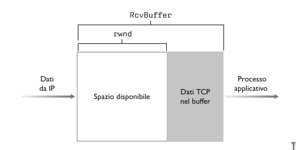

Supponiamo che un host A stia inviando un file di grandi dimensioni ad un host B su una connessione TCP. Questo'ultimo alloca un buffer di ricezione per la connessione, la cui dimensione è denotata come `RcvBuffer`. Definiamo le seguenti variabile:

- `LastByteRead`: numero dell'ultimo byte nel flusso di dati che il processo applicativo in B ha letto dal buffer.
- `LastByteRcvd`: numero dell'ultimo byte, nel flusso di dati, che proviene dalla rete e che è stato nell buffer di ricezione di B.

Dato che TCP non può mandare in overflow il buffer allocato, dovremo avere per forza:
$$LastByteRcvd - LastByteRead \leq RvcBuffer$$

La finestra di ricezione, indicata con `rwnd`, viene impostata alla quantità di spazio disponibile nel buffer.
$$rwnd = RcvBuffer - [LastByteRcvd - LastByteRead]$$

Dato che lo spazio disponibile varia con il tempo, `rwnd` è dinamica.

L'host B comunica all'host A quanto spazio disponibile sia presente nel buffer della connessione, scrivendo il valore corrente di `rwnd` nel campo apposito dei segmenti che manda ad A. L'host B inizializza `rwnd` con il valore di `RcvBuffer`.

A sua volta, l'host A tiene traccia di:

- `LastByteSent`: ultimo byte mandato.
- `LastbyteAcked`: ultimo byte per cui si è ricevuto un acknowledgment

La differenza di queste due variabili esprime la quantità di dati spediti da A per cui non si è ancora ricevuto un acknowledgment. Mantenendo questa quantità sotto il valore di `rwnd`, si garantisce che l'host A non mandi in overflow il buffer di B.
$$LastByteSent - LastByteAcked \leq rwnd$$

### Gestione della connessione TCP

Supponiamo che un processo client debba stabilire una connessione TCP con un processo server. La connessione avviene nel seguente modo:

1. Il client invia uno speciale pacchetto TCP al server. Questo pacchetto contiene il bit di intestazione **SYN** posto a 1. Inoltre il client sceglie a caso un numero di sequenza (`client_isn`) iniziale e lo pone nel campo numero di sequenza del segmento SYN iniziale. Questo segmento viene poi inviato al livello IP che lo spedisce.
2. Quando il datagramma IP contenente il segmento SYN arriva al server, ammesso che arrivi, il server alloca i buffer e le variabili TCP alla connessione e invia un segmento di connessione approvata al client. Questo segmento contiene tre informazioni importanti.
    - Il bit **SYN** posto a 1.
    - Il campo **ACK** assume il valore `client_isn + 1`.
    - Genera il proprio numero di sequenza `server_isn` e lo pone nel campo numero di sequenza.

    Il segmento di connessione approvato viene detto **segmento SYNACK**. 
3. Alla ricezione del segmento SYNACK anche il client alloca il buffer e le variabili alla connessione. L'host client invia poi al server un altro segmento in risposta al segmento di connessione approvata. Il client pone i valore `server_isn + 1` nel campo ACK dell'intestazione TCP e il bit SYN posto a 0 dato che la connessione è stabilita. 

Notiamo per i due host si scambiano 3 pacchetti per stabilire la connessione, infatti questo procedimento prende il nome di **handshake a 3 vie**.

Per chiudere la connessione TCP client e server chiudono ciascuno il proprio lato della connessione, inviando il segmento TCP con i bit **FIN** posto a 1. 

## Controllo della congestione TCP

**Congestione**: Tentativo da parte di troppe sorgenti di inviare dati a ritmi troppo elevati. La ritrassmissione dei pacchetti e lunghi ritardi sono sintomi della congestione della rete.

### Cause e costi della congestione

Per cominciare a studiare le cause e i costidella congestione andiamo a considerare 3 scenari:

1. Due mittenti e un router con buffer illimitati.
    Consideriamo 2 host A e B, con una connessione e un unico router tra di loro. Supponiamo che l'applicazione sull'host A stia inviando dati sulla connessione ad un frequenza $\lambda_{in}\ byte/s$. Tali dati sono originali, ovvero è la prima volta che sono stati inviati. Supponiamo inoltre che il protocollo di trasporto sia semplici, senza controllo degli errori, flusso e congestione.

    L'host B opera in modo simile, e assumeremo per semplicità che anch'esso stia trasmettendo a $\lambda_{in}\ byte/s$. I pacchetti passanno attraverso un router e un collegamento condiviso di capacità $R$. Il router possiede buffer illimitati e consentono di memorizzare i pacchetti entranti quando il tasso di arrivo è superiore al tasso di uscita.


    - Nel grafico a sinistra osserviamo il **throughput per connessione** in funzione del tasso di invio. Finché non supera il valore di $\frac{R}{2}$, il throughput del ricevente equivale al tasso di invio del mittente, in pratica tutto quello che viene trasmesso dal mittente viene ricevuto dal destinatario con un ritardo finito. Ma se il tasso di invio supera $\frac{R}{2}$ il throughput rimane $\frac{R}{2}$.
    - Si potrebbe pensare che ottenere un throughput pari a $\frac{R}{2}$ sia ottimo, dato che il collegamento viene completamente utilizzato, ma il grafico a destra ci mostra che se il tasso di invio si avvicina a $\frac{R}{2}$, il ritardo medio cresce sempre di più, e quando supera $\frac{R}{2}$, il numero di pacchetti in coda al router cresce senza limite, e il ritardo medio tra mittente e destinatario tende a infinito.

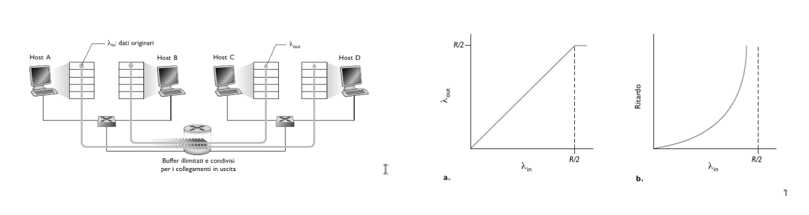

2. Due mittenti e un router con buffer limitati.
    Assumiamo ora che il router abbia buffer limitato e che le connessioni sono affidabili. Dato che il buffer è limitato, i pacchetti in più verranno scartati, quindi di conseguenza dovrà essere prima o poi ritrasmesso. Denotiamo il tasso di trasmissione con $\lambda_{in}\ byte/s$ e indichiamo con $\lambda_{in}^{'}\ byte/s$ il tasso al quale il livello di trasporto invia segmenti contente dati originali e ritrasmessi, detta anche **carico offerto** alla rete.
    $$\lambda_{in}^{'}\ \geq \lambda_{in}$$


    - Supponiamo che il mittente sia a conoscenza dello spazio libero all'interno del buffer del destinatario. In questo caso, il mittente trasmette un pacchetto solo quando il buffer è libero e di conseguenza non si verificherebbe alcun smarrimento, e avremmo $\lambda_{in}^{'}\ = \lambda_{in}$ e il throughput della connessione sarebbe $\lambda_{in} (caso a)$.
    - Consideriamo ora il caso, un pò più realistico, in cui il mittente ritrasmette solo quando è certo che un pacchetto sia andato perduto. In questo caso le prestazioni potrebbero avere l'aspetto del grafico (b). Supponiamo che il carico offerto $\lambda_{in}^{'} = \frac{R}{2}$. Secondo (b), il tasso con cui i dati vengono consegnati all'applicazione destinataria è $\frac{R}{3}$. Quindi su $0.5\ R$ unità di dati trasmessi, $0.333\ R\ byte/s$ sono quelli originli e $0.166\ R\ byte/s$ sono ritrasmessi.
    - Consideriamo l'ultimo caso in cui il mittente possa andare in timeout prematuramente e ritrasmettere un pacchetto che abbia subìto ritardi in coda, ma non sia stato perduto, in questo caso il mittente invia due copie, che vengono entrambe consegnate, costituendo un ulteriore costo legato alla congestione di rete.
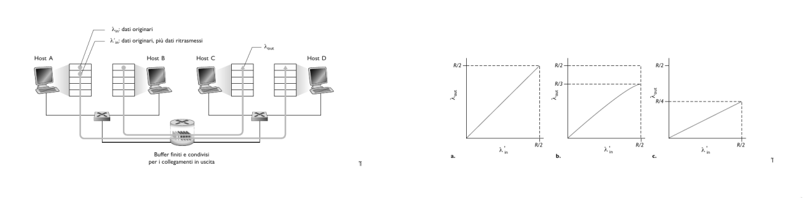
  
3. Quattro mittenti, router con buffer finiti e percorsi composti da più collegamenti.
    In questo caso supponiamo che i pacchetti siano trasmessi da quattro host, ciascuno su percorsi composti da due collegamenti sovrapposti tra loro. Ciascun host, inoltre, utilizza un meccanismo di timeout e ritrassmissione per implementare un servizio affidabile e tutti e quattro hanno lo stesso valore $\lambda_{in}$. La capacità dei collegamenti dei router è $R\ byte/s$.
    Quando $\lambda_{in}^{'}$ e $\lambda_{in}$ aumentano, dato che sul router R2 il traffico da A a C e quello da B a D sono in competizione per il limitato spazio nei buffer, la quantità di traffico A - C che passa con successo attraverso R2 diventa sempre più piccola al crescere del traffico trasportato da B - D. Al limite, quando questo tende a infinito, un buffer vuoto presso R2 viene immediatamente colmato da un pacchetto B - D e il throughput della connessione A - C presso R2 tende a 0. Ne segue il throughput end-to-end di A - C si annulla in caso di traffico pesante.
    
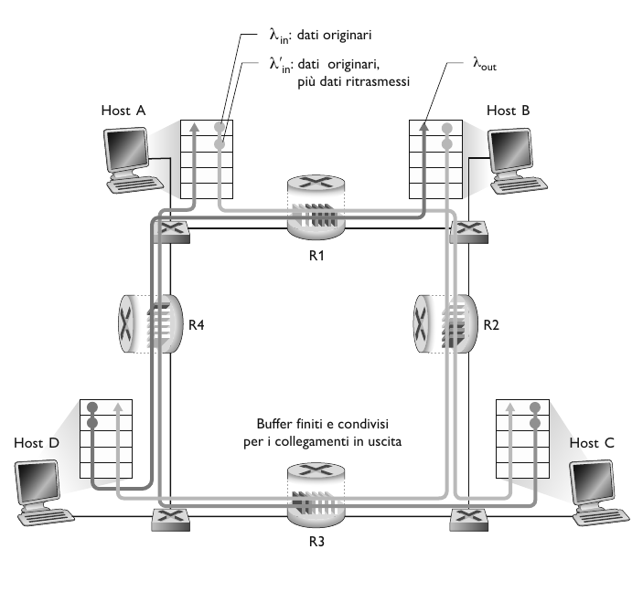

### Approcci al controllo della congestione

- *Controllo di congestione end-to-end*. Il livello di rete non fornisce supporto esplicito al livello di trasporto per il controllo di congestione la cui presenza deve essere dedotta dai sistemi periferici sulla base dell'osservazione delle loro perdite e ritardi. TCP utilizza questo metodo dato che IP non fornisce alcuna informazione relativa alla congestione della rete.
- *Controllo di congestione assistito dalla rete*. I router forniscono un feedback **diretto** all'host mittente tramite un *chokepacket* che lo avvisa dello stato di congestione. Oppure si può usare una forma di **controllo di congestione ATM ABR (Available Bit Rate)**, che consente a un router di informare il mittente in modo esplicito sulla frequenza trasmissiva che il router puù supportare su un collegamento uscente.

### Controllo di congestione TCP classico

TCP implementa il controllo di congestione end-to-end, che consiste nel imporre a ciascun mittene un  limite al tasso di invio sulla propria connessione in funzione della congestione di rete percepita.

Il meccanismo di controllo di congestione TCP fa tener traccia agli estremi della connessione di una variabile aggiuntiva: la **finestra di congestione**, indicata con $cwnd$ che impone un vincolo alla velocità di immissione dei dati sulla rete.
$$LastByteSent - LastByteAcked\ \leq \min\{cwnd, rwnd\}$$
Assumeremo che il buffer di ricezione sia sufficiente grande, possiamo trascurare il vincolo della finestra di ricezione (che assumiamo sempre maggiore della finestra di congestione)

Tasso di invio: $\approx\ \frac{cwnd}{RTT}\ byte/s$.

#### Slow Start

Quando si stabilisce una connessione TCP, il valore di $cwnd$ viene in genere inizializzato a $1\ MSS$. Quindi durante la fase inziale detta **slow start**, il valore di $cwnd$ parte da $1\ MSS$ e incrementa di $1\ MSS$ ogni volta che un segmento trasmesso riceve un acknowledgment, inoltre invia due segmenti di dimensione massina. Quidi, la velocità di trasmissione parte lentamente, me cresce in modo esponenziale fino a quando non si verifica un evento di perdita.

**Quando dovrebbe terminare questa crescita esponenziale?**

1. Se c'è un evento di perdita indicato da un evento di timeout, il mittente TCP pone $cwnd = 1$ e inzia di nuovo il processo di slow start. Inoltre imposta una variabile $ssthresh = \frac{cwnd}{2}$.
2. Poiché $ssthresh$ è impostato a metà del valore di $cwnd$ all'ultimo rilievo dela congestione, potrebbe essere un pò temerario continuare a raddoppiare il valore di $cwnd$ quando raggiunge o sorpassa il valore $ssthresh$. Quindi, quando il valore di $cwnd$ è pari a $ssthresh$ la fase di slow start termina e TCP entra in modalità di *congestion avoidance*.

#### Congestion avoidance

Quando TCP entra nello stato di congestion avoidance (*prevenzione della congestione*), il valore di $cwnd$ è circa al metà di quello che aveva l'ultima volta in cui era stata rilevata la congestione. Quindi, invece di raddoppiare il valore di $cwnd$ ogni $RTT$, TCP addotta un approccio più conservativo, incrementando $cwnd$ di $1\ MSS$ ogni $RTT$.

**Quando finisce l'incremento lineare?**

L'algoritmo di congestion avoidance, quando si verifica un timeout, si comporta nello stesso modo di slow start: il valore di $cwnd$ è posto uguale a $1\ MSS$ e il valore di $ssthresh$ viene impostato alla metà del valore di $cwnd$ al momento del timeout. Infine, TCP entra nello stato di *fast recovery*.

#### Fast Recovery

Durante la fase di fast recovery (*recupero veloce*) il valore di $cwnd$ è incrementato di $1\ MSS$ per ogni ACK duplicato ricevuto relativamente al segmento perso che ha causato l'entrata TCP in fast recovery. Infine quando arriva un ACK per il segmento perso, TCP entra nello stato di congestion avoidance dopo aver ridotto il valore di $cwnd$. Se si verifica un timeout, vi è invece una transizione dallo stato di fast recovery a quello di slow start. 

La prima versione di TCP, nota come **TCP Tahoe** portava in modo incondizionato la finestra di congestione a $1\ MSS$ ed entrava nello stato di slow start dopo qualsiasi evento di perdita.

La versione più recente, **TCP Reno**, adotta invece fast recovery.

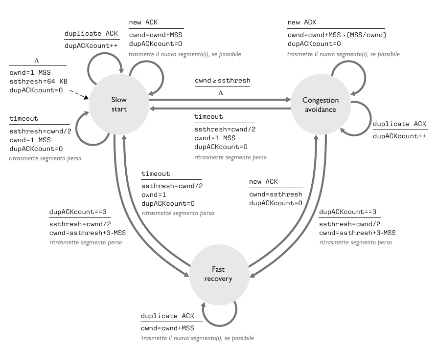

#### AIMD

Il controllo di congestione di TCP è spesso indicato come una forma di controllo di congestione **incremento additivo, decrementato moltiplicativo (AIMD)**. AIMD dà luogo al comportamento a dente di sega. TCP incrementa linearmente l'ampiezza della propria finestra di gestione e quindi della velocità di trasmissione, finché si verifica un evento di triplice ACK duplicato. Quindi decrementa la propria finestra di congestione di un fattore due, ma riprende ancora a crescere linearmente per capire se ci sia ulteriore ampiezza di banda disponibile.

#### TCP CUBIC

Ci viene spontaneo chiederci se esite un modo migliore per "sondare" ovvero per determinare una velocità di trasmissione dei pacchetti appena inferiore alla soglia di attivazione della perdita dei pacchetti.

TCP CUBIC differisce solo leggermente da TCP Reno. La finestra di congestione viene aumentata solo alla ricezione di un ACK e nelle fasi di slow start e fast recovery rimane la stessa. CUBIC modifica solo la fase di congestion avoidance in questo modo:

- $W_{max}$: la dimensione della finestra del controllo di congestione TCP nell'istante in cui viene rivelata l'ultima perdita.
- $K$: istante nel fututo in cui la finestra TCP raggiungerà nuovamente $W_{max}$.
- CUBIC aumenta la finestra di congestione ($W$) in funzione del **cubo** della distanza tra l'istante corrente $t$ e $K$.
  - Aumenti maggiori quando ci si allontana maggiormente da $K$.
  - Aumenti minori quando ci si avvicina a $K$.

TCP CUBIC predefinito in Linux è il TCP più diffuso per i web server più comuni.

#### Throughput di TCP

Qual è il valore medio di throughput di TCP Reno? Ignorando la fase di slow start abbiamo che:

- $W$: Dimensione (ampiezza) in $byte$ della finestra quando si verifica una perdità. La dimesione media è $0.75\cdot W$
- Il throughput medio è quindi $\frac{0.75\cdot W}{RTT}$

#### Explicit Congestion notification (ECN)

Le implementazioni di TCP spesso implementano un controllo della congestione **assistito dalla rete**. 

**Come funziona?**

A livello di rete vengono utilizzati due bit (quindi 4 possibili valori) nel campo *ToS (Type of Service)* nell'intestazione IP. Se un router è congestionato imposta tali bit e invia il pacchetto IP contrassegnato al destinatario, che quindi informa il mittente.

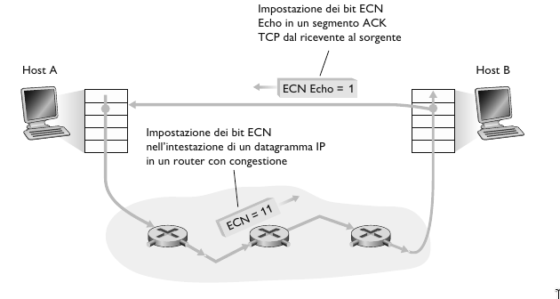

I bit ECN vengono inolte utilizzati dal mittente per segnalare che mittente e destinatario sono abilitati all'uso di ECN. Quando il destinario TCP riceve un'indicazione di congestione ECN, ne informa il mittente TCP impostando il bit ECE (Explicit Congestion Notification Echo) all'interno di un segmento ACK. Il mittente TCP reagisce dimezzando la finestra di congestione, esattamente come farebbe in caso di perdita di un segmento usando il meccanismo di ritrasmissione rapida, e imposta il bit CWR (Congestion Window Reduced) nell'intestazione del successivo segmento che invia al ricevente.

#### Controllo di congestione basato sul ritardo

Se ECN notifica in anticipo il destinatario prima che i buffer sono pieni per evitare la congestione, il secondo approccio basato sul ritardo rileva l'insorgenza della congestione in modo proattivo, prima che si verifichi la perdita di pacchetti.

Questo approccio si basa su TCP Vegas, dove il mittente misura l'RTT del percoso dalla sorgente alla destinazione per tutti i pacchetti riscontrati. 
- $RTT_{min}$: il valore minimo di tali misurazione per tutti i pacchetti riscontrati.
- $\frac{cwnd}{RTT_{min}}$: throughput non congestionato con finestra di congestione $cwnd$.

- Se il throughput misurato è "molto vicino" al throughput non congestionato allora bisogna aumentare linearmente $cwnd$.
- Se il throughput misurato è "molto inferiore" al throughput non congestionato allora bisogna diminuire linearmente $cwnd$.

Quindi, TCP Vegas opera con l'idea "keep the pipe just full, not fuller", ovvero massimizzare il throughput mantendo il ritardo basso.

Il protocollo BBR è utilzzato da Google e si basa su TCP Vegas.

#### TCP Fairness e collegamento "collo di bottiglia" congestionato

TCP aumenta la velocità di invio finché non si verifica una perdita di pacchetti all'uscita di un router, tale collegamento è detto **collegamento "collo di bottiglia" (bottleneck)**.

**TCP Fairness**: Se $K$ sessioni TCP condividono lo stesso collegamento a collo di bottiglia con larghezza di banda $R$, ciascuna dovrebbe avere una velocità media $\frac{R}{K}$.

TCP è fair se le connessioni TCP hanno tutte lo stesso $RTT$ e se il numero di sessioni in congestion avoidance è fisso.

**UDP è fair?**

Abbiamo appena visto come il meccanismo della finestra di congestione consenta al controllo di congestione TCP di regolare il tasso di trasmissione (transmission rate) delle applicazioni. Questo è il motivo per cui molte applicazioni multimediali, quali la fonia e la videoconferenza, non fanno uso di TCP: non vogliono che il loro tasso di trasmissione venga ridotto, anche se la rete è molto congestionata. Piuttosto, queste applicazioni preferiscono utilizzare UDP, che non incorpora il controllo di congestione, in modo da poter immettere il proprio audio e video sulla rete a frequenza costante e occasionalmente perdere pacchetti, piuttosto che non perderli, ma dover ridurre il loro tasso di trasmissione a livelli “equi” nei momenti di traffico. Dal punto di vista di TCP, le applicazioni multimediali che fanno uso di UDP non sono fair.

### Evoluzione dei protocolli di trasporto

Abbiamo visto che i principali protolli di trasporto sono UDP e TCP, ma nel corso degli anni sono state sviluppate diverse versioni di TCP, in base alle esigenze e per scenari specifici.

| Scenario                                   | Sfide                                                        |
| ------------------------------------------ | ------------------------------------------------------------ |
| Trasferimenti di dati di grandi dimensioni | Molti pacchetti in "volo"; la perdita interrompe la pipeline |
| Reti wireless                              | Perdita dovuta a collegamenti wireless rumorosi              |
| Long-delay links                           | RTT estremamente elevato                                     |
| Reti di data center                        | Sensibilità alla lateza                                      |
| Background traffic flows                   | Flussi TCP a bassa priorità (in background)                  |

#### QUIC: Quick UDP Internet Connections

QUIC è un nuovo protocollo a livello di applicazione, progettato da zero, per migliorare le prestazioni del livello di trasporto per
HTTP sicuro. QUIC utilizza UDP come protocollo del livello di trasporto sottostante ed è progettato per interfacciarsi in modo specifico a una versione semplificata, ma evoluta, di HTTP/2. Prossimamente, HTTP/3 incorporerà nativamente QUIC.

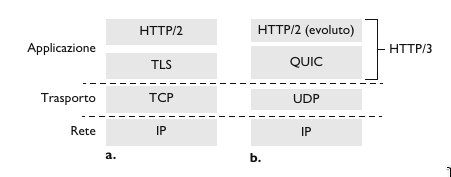

**Caratteristiche di QUIC**

- *Orientato alla connessione*. Come TCP, QUIC richiede una fase di handshaking tra gli endpoint per impostare lo stato della connessione. Tutti i pacchetti QUIC sono crittografati e, QUIC combina l'handshaking necessario per stabilire la connessione con quelli per l'autenticazione e la cifratura.
- *Flussi (Streams)*. QUIC consente il multiplexing di diversi “flussi” a livello di applicazione attraverso una singola connessione QUIC; inoltre, una volta stabilita una connessione QUIC, nuovi flussi possono essere aggiunti rapidamente. Un flusso è un’astrazione per la consegna bidirezionale affidabile e in ordine dei dati tra due endpoint QUIC.
- *Trasferimento dati affidabile e con controllo della congestione*. QUIC fornisce un trasferimento dati affidabile a ogni
flusso QUIC separatamente. Gli algoritmi di trasferimento dati affidabile e di controllo della congestione sono molto simili a quelli usati da TCP.

