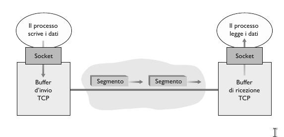
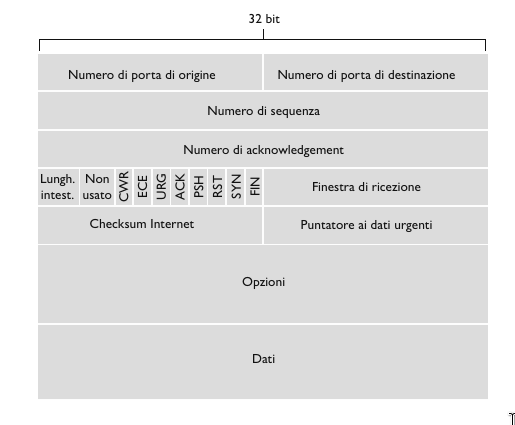
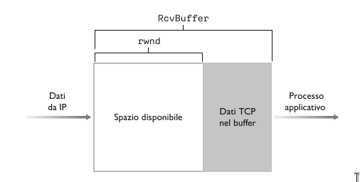

# Trasporto orientato alla connessione: TCP

## Connessione TCP

> [!IMPORTANT]
>
> **TCP** viene detto **orientato alla connessione** in quanto, prima di effettuare lo scambio dei dati, i processi devono effettuare l'handshake, ossia devono inviarsi reciprocamente alcuni segmenti preliminari per stabilire i parametri del successivo trasferimento dati. Come parte dell'instaurazione della connessione TCP, entrambe le parti inizializzano molte variabili di stato associate alla connessione.

Una connessione TCP offre un **servizio full-duplex**, ovvero data una connessione tra due applicazioni, A e B su due host differenti,  i dati a livello di applicazione possono fluire dal processo A al processo B e in contemporanea dal processo B al processo A. (A <-> B).

Una connessione TCP è anche **punto a punto**, ossia ha luogo tra un singolo mittente e un singolo destinatario.
Una volta instaurata una connessione TCP, i due processi applicativi si possono scambiare dati. Consideriamo l'invio di dati dal processo client al processo server. Il primo manda un flusso di dati attraverso la socket. Questi quando hanno attraversato il punto di uscita, sono nelle mani di TCP in esecuzione sul client. TCP dirige i dati al **buffer di invio** della connessione, uno dei buffer riservato durante l'handshake a tre vie, da cui, di tanto in tanto, preleverà blocchi di dati e li passerà al livello di rete.

La massima quantità di dati prelevabili e posizionabili in un segmento viene limitata dalla **dimensione massima del segmento (MSS)**. Questo valore viene generalmente impostato determinando prima la lunghezza del frame più grande che può essere inviato a livello di collegamento dall'host mittente locale, la cosidetta **unità trasmissiva massima (MTU)** e poi scegliendo un MSS tale che il segmentto TCP stia all'interno di un singolo frame a livello di collegamento, considerando anche la lunghezza dell'intestazione TCP/IP normalmente di 40 byte. I protocolli Ethernet e PPP hanno un MTU di 1500 byte, quindi un valore tipico di MSS è di 1460 byte.

## Segmenti TCP

TCP accoppia ogni blocco di dati del client a una intestazione TCP, andando a formare **segmenti TCP**. Questi vengono passati al sottostanze livello di rete, dove sono incapsulati separatamente in datagrammi IP che vengono poi immessi in rete. Dall'altro capo TCP riceve un segmento, i dati del segmento vengono memorizzati nel buffer di ricezione della connessione TCP. L'applicazione legge il flusso di dati da questo buffer, che è proprio per ogni lato della connessione.

Come in UDP, l'intestazione include **numeri di porta di origine e di destinazione**, utilizzati per il multiplexing e il demultiplexing dei dati da e verso le applicazioni del livello superiore, e un campo **Checksum**. Inoltre TCP comprende anche i seguenti campi d'intestazione:

- **Numero di sequenza** e **Numero di acknowledgment**, entrambi di 32 bit, vengono utilizzati dal mittente e dal destinatario TCP per implementare il trasferimento dati affidabile.
- **Finestra di ricezione**, di 16 bit, viene utilizzato per il controllo di flusso.
- **Lunghezza dell'intestazione**, di 4 bit, specifica la lunghezza dell'intestazione TCP in multipli di 32 bit. L'intestazione TCP ha lunghezza dell'intestazione TCP in multipli di 32 bit.L'intestazione TCP ha lunghezza variabile a causa del campo delle opzioni TCP. Generalmente, il campo delle opzioni è vuoto e, pertanto la lunghezza consueta è di 20 byte.
- **Opzioni**, facoltativo e di lunghezza variabile, viene utilizzato quando mittente e destinatario negoziano la dimensione massima del segmento (MSS) o come fattore di scala per la finestra nelle reti ad alta velocità.
- **Flag**, campo di 6 bit. Il bit **ACK** viene usato per indicare che il valore trasportato nel campo di acknowledgment è valido. I bit **RST**, **SYN**, **FYN** vengono utilizzati per impostare e chiudere la connessione. I bit **CWR** ed **ECE** sono usati nel controllo di congestione. Se il bit **PSH** ha valore 1 il destinatario dovrebbe inviare immediatamente i dati al livello superiore. Il bit **URG** per indicare nel segmento la presenza di dati che l'entità mittente a livello superiore ha marcato come "urgenti".

**Numeri di sequenza e numeri di acknowledgment**

TCP vede i dati come un flusso di byte non strutturati, ma ordinati. Dato che i numeri di sequenza si applicano al flusso di byte trasmessi e non alla serie di segmenti trasmessi, pertanto, il **numero di sequenza del segmento** è il numero nel flusso di byte del primo byte del segmento.

Siano due host, A e B in comuncazione su un canale TCP.
Il **numero di acknowledgment** che l'host A scrive nei propri segmenti e il numero di sequenza del byte successivo che l'host A attende dall'host B.

Supponiamo che l’Host A abbia ricevuto un segmento dall’Host B contenente i byte da 0 a 535 e un altro segmento contenente i byte da 900 a 1000. Per qualche motivo l’Host A non ha ancora ricevuto i byte da 536 a 899. In questo esempio, l’Host A sta ancora attendendo il byte 536 (e i successivi) per ricreare il flusso di dati di B. Perciò il prossimo segmento di A destinato a B conterrà 536 nel campo del numero di acknowledgment. Dato che TCP effettua l’acknowledgment solo dei byte fino al primo byte mancante nel flusso, si dice che tale protocollo offre **acknowledgment cumulativi (cumulative acknowledgment)**.

## Timeout e stima del tempo di andata e ritorno (RTT)

TCP, utilizza un meccanismo di timeout e ritrasmissione per recupere i segmenti persi. Il timeout deve essere più grande del tempo di andata e ritorno sulla connessione (**RTT, Round-Trip Time**), ossia del tempo trascorso da quando si invia un segmento a quando se ne riceve l'acknowledgment, altrimenti ci sarebbero delle ritrasmissioni inutili.

**Stima RTT**

- `SampleRTT`: RTT misurato di un segmento, è la quantità di tempo che intercorre tra l'istante di invio del segmento (quando viene passato a IP) e quello di ricezione dell'acknowledgment del segmento.

I campioni variano da segmento a segmento in base alla congestione nei router e al diverso carico sui sistemi periferici. A causa di tale fluttuazione, ogni valore di `SampleRTT` può essere atipico. Per effettuare una stima più natuale, TCP effettua una media di `SampleRTT` chiamata `EstimatedRTT`, calcolato secondo questa formula:

$$EstimatedRTT = (1 - \alpha)\cdot EstimatedRTT + \alpha\cdot SampleRTT$$

Si noti che `EstimatedRTT` è una media ponderata dei valori `SampleRTT`. Tale media attribuisce maggiore importanza ai campioni recenti rispetto a quelli vecchi. In statistica una media costruita in questo modo è detta **media mobile esponenziale ponderata (EWMA)**.

$$EstimatedRTT_{n} = (1 - \alpha)^{n}\cdot EstimatedRTT_{n - 1} + \alpha\cdot SampleRTT_{n}$$

Oltre ad avere una stima di RTT è anche importante possedere la misura della sua variabilità. `DevRTT` è una stima di quanto `SampleRTT` generalmente si discosta da `EstimatedRTT`.

$$DevRTT = (1 - \beta)\cdot DevRTT + \beta\ \cdot \mid SampleRTT - EstimatedRTT \mid$$

Tipicamente il valore di $\beta$ è 0.25.

Dati i valori di `EstimatedRTT` e `DevRTT`, dobbiamo trovare il valore del timeout. L'intervallo non può essere minore di `EstimatedRTT` ma neanche troppo maggiore, altrimenti TCP non ritrasmetterebbe rapidamente il segmento perduto, il che comporterebbe gravi ritardi sul trasferimento dei dati. È pertanto necessario impostare il timeout a `EstimatedRTT` più un certo margine che dovrebbe essere grande quando c'è molta fluttuazione nei valori di `SampleRTT` e piccolo in caso contrario.
$$TimeoutInterval = EstimatedRTT + 4\cdot\ DevRTT$$

## Trasferimento dati affidabile

TCP crea un **servizo di trasporto dati affidabile** al di sopra del servizio inaffidabile e best-effort IP, assicurando che il flusso di byte che i processi leggono dal buffer di ricezione TCP non sia alterato, non abbia buchi, non presenti duplicazioni e rispetti la sequenza originaria, in altre parole il flusso di dati in arrivo è esattamente quello spedito.

**Mittente TCP**

Osserviamo ora come le azioni del mittente dipendano dal tipo di evento che avviene.

- **Evento** - *Dati ricevuti dall'applicazione*. Viene creato il segmento TCP con numero di sequenza `NextSeqNum` che inizialemente è il numero del primo byte del segmento nel flusso di byte. Successivamente avvia il timer se non già in funzione e passa il segmento a IP e aggiorna `NextSeqNum = NextSeqNum + len(dati)`.
- **Evento** - *Timeout*. Ritrasmette il segmento che ha causato il timeout, ovvero il segmento che non ha ricevuto ACK con il più piccolo numero di sequenza e riavvia il timer.
- **Evento** - *ACK rivevuto*. Sia $y$ il ACK ricevuto. Se $y\ > SendBase$ aggiorna $y = SendBase$ e inoltre, se esistono segmenti senza ACK avvia il timer.

**Ricevente TCP**

Osserviamo ora come le azioni del ricevente dipendano dal tipo di evento che avviene.

- **Evento** - Arrivo ordinato di segmento con numero di sequenza atteso. Tutti i dati fino al numero di sequnza atteso sono già stati riscontrati
    - **Azione** - ACK ritardato. Attende fino a 500 ms per l'arrivo ordinato di un altro segmento. Se in questo intervallo non arriva il successivo, invia un ACK.
- **Evento** - Arrivo ordinato di segmento con numero di sequenza atteso. Un altro segmento ordinato è in attesa di trasmissione dell'ACK.
    - **Azione** - Invia immediatamente un singolo ACK cumulativo, riscontrando entrambi i segmenti ordinati.
- **Evento** - Arrivo non ordinato di segmento con numero di sequenza superiore a quello atteso. Viene rilevato un buco.
    - **Azione** - Invia immediatamente un *ACK duplicato*, indicando il numero di sequenza del prossimo byte attso (che è l'estremità inferiore del buco).
- **Evento** - Arrivo di un segmento che colma parzialmente o completamente il buco nei dati ricevuti.
    - **Azione** - Invia immediatamente un ACK, ammesso che il segmento cominci dall'estremità inferiore del buco.

**Ritrasmissione rapida**

Uno dei problemi legati alle ritrasmissioni è che il periodo di timeout puù rivelarsi relativamente lungo. Quando si smarrisce un segmento, il lungo periodo di timeout impone al mittente di ritardare il nuovo invio del pacchetto in perso, incrementando di conseguenza il ritardo end-to-end. Fortunatamente, il mittente può in molti casi rilevare la perdita dei pacchetti ben prima che si verifichi l'evento di timeout grazie agli **ACK duplicati** relativi a un segmento il cui ACK è già stato ricevuto dal mittente.

Dato che in molti casi il mittente invia un gran numero di segmenti, se uno di questi viene smarrito ci saranno probabilmente molti ACK duplicati. Se il mittente TCP riceve **3 ACK** duplicati con lo stesso data, considera questo evento come indice che il successivo segmento sia andato perduto. Nel caso in cui siano stati ricevuti 3 ACK duplicati, il mittente TCP effettua una **ritrasmissione rapida** rispedendo il segmento mancante prima che scada il timer.

## Controllo di flusso

Gli host riservano dei buffer di ricezione per la connessione TCP. Quando la connessione TCP riceve dei byte corretti e in sequenza, li posiziona nel buffer di ricezione. Il processo applicativo associato legge i dati da questo buffer, anche in un secondo istante, non necessariamente nell'istante in cui arrivano. Se l'applicazione è relativamente lenta nella lettura dei dati può accadere che il mittente mandi in overflow il buffer di ricezione inviando molti dati troppo rapidamente.

TCP offre un **servzio di controllo di flusso** alle proprie applicazioni per evitare che il mittente saturi il buffer ricevente. Il controllo di flusso è pertanto un servizio di confronto sulla velocità, dato che paragona la frequenza di invio del mittente con quella di lettura dell'applicazione ricevente.

Inoltre i mittenti TCP possono essere ralentati anche dalla congestione della rete IP, che prende il nome di **controllo di congestione**.

TCP offre il controllo di flusso facendo mantenere al mittente una variabile chiamata **finestra di ricezione** che, in sostanza, fornisce al mittente un'indicazione dello spazio libero disponibile nel buffer del destinatario.

Supponiamo che un host A stia inviando un file di grandi dimensioni ad un host B su una connessione TCP. Questo'ultimo alloca un buffer di ricezione per la connessione, la cui dimensione è denotata come `RcvBuffer`. Definiamo le seguenti variabile:

- `LastByteRead`: numero dell'ultimo byte nel flusso di dati che il processo applicativo in B ha letto dal buffer.
- `LastByteRcvd`: numero dell'ultimo byte, nel flusso di dati, che proviene dalla rete e che è stato nell buffer di ricezione di B.

Dato che TCP non può mandare in overflow il buffer allocato, dovremo avere per forza:
$$LastByteRcvd - LastByteRead \leq RvcBuffer$$

La finestra di ricezione, indicata con `rwnd`, viene impostata alla quantità di spazio disponibile nel buffer.
$$rwnd = RcvBuffer - [LastByteRcvd - LastByteRead]$$

Dato che lo spazio disponibile varia con il tempo, `rwnd` è dinamica.

L'host B comunica all'host A quanto spazio disponibile sia presente nel buffer della connessione, scrivendo il valore corrente di `rwnd` nel campo apposito dei segmenti che manda ad A. L'host B inizializza `rwnd` con il valore di `RcvBuffer`.

A sua volta, l'host A tiene traccia di:

- `LastByteSent`: ultimo byte mandato.
- `LastbyteAcked`: ultimo byte per cui si è ricevuto un acknowledgment

La differenza di queste due variabili esprime la quantità di dati spediti da A per cui non si è ancora ricevuto un acknowledgment. Mantenendo questa quantità sotto il valore di `rwnd`, si garantisce che l'host A non mandi in overflow il buffer di B.
$$LastByteSent - LastByteAcked \leq rwnd$$

## Gestione della connessione TCP

Supponiamo che un processo client debba stabilire una connessione TCP con un processo server. La connessione avviene nel seguente modo:

1. Il client invia uno speciale pacchetto TCP al server. Questo pacchetto contiene il bit di intestazione **SYN** posto a 1. Inoltre il client sceglie a caso un numero di sequenza (`client_isn`) iniziale e lo pone nel campo numero di sequenza del segmento SYN iniziale. Questo segmento viene poi inviato al livello IP che lo spedisce.
2. Quando il datagramma IP contenente il segmento SYN arriva al server, ammesso che arrivi, il server alloca i buffer e le variabili TCP alla connessione e invia un segmento di connessione approvata al client. Questo segmento contiene tre informazioni importanti.
    - Il bit **SYN** posto a 1.
    - Il campo **ACK** assume il valore `client_isn + 1`.
    - Genera il proprio numero di sequenza `server_isn` e lo pone nel campo numero di sequenza.

    Il segmento di connessione approvato viene detto **segmento SYNACK**. 
3. Alla ricezione del segmento SYNACK anche il client alloca il buffer e le variabili alla connessione. L'host client invia poi al server un altro segmento in risposta al segmento di connessione approvata. Il client pone i valore `server_isn + 1` nel campo ACK dell'intestazione TCP e il bit SYN posto a 0 dato che la connessione è stabilita. 

Notiamo per i due host si scambiano 3 pacchetti per stabilire la connessione, infatti questo procedimento prende il nome di **handshake a 3 vie**.

Per chiudere la connessione TCP client e server chiudono ciascuno il proprio lato della connessione, inviando il segmento TCP con i bit **FIN** posto a 1. 
