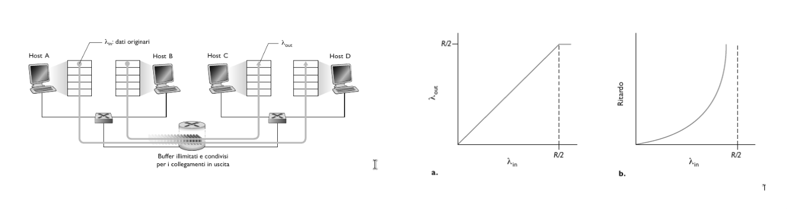

# Controllo della congestione TCP

**Congestione**: Tentativo da parte di troppe sorgenti di inviare dati a ritmi troppo elevati. La ritrassmissione dei pacchetti e lunghi ritardi sono sintomi della congestione della rete.

## Cause e costi della congestione

Per cominciare a studiare le cause e i costidella congestione andiamo a considerare 3 scenari:

1. Due mittenti e un router con buffer illimitati.
    Consideriamo 2 host A e B, con una connessione e un unico router tra di loro. Supponiamo che l'applicazione sull'host A stia inviando dati sulla connessione ad un frequenza $\lambda_{in}\ byte/s$. Tali dati sono originali, ovvero è la prima volta che sono stati inviati. Supponiamo inoltre che il protocollo di trasporto sia semplici, senza controllo degli errori, flusso e congestione.

    L'host B opera in modo simile, e assumeremo per semplicità che anch'esso stia trasmettendo a $\lambda_{in}\ byte/s$. I pacchetti passanno attraverso un router e un collegamento condiviso di capacità $R$. Il router possiede buffer illimitati e consentono di memorizzare i pacchetti entranti quando il tasso di arrivo è superiore al tasso di uscita.

    

    - Nel grafico a sinistra osserviamo il **throughput per connessione** in funzione del tasso di invio. Finché non supera il valore di $\frac{R}{2}$, il throughput del ricevente equivale al tasso di invio del mittente, in pratica tutto quello che viene trasmesso dal mittente viene ricevuto dal destinatario con un ritardo finito. Ma se il tasso di invio supera $\frac{R}{2}$ il throughput rimane $\frac{R}{2}$.
    - Si potrebbe pensare che ottenere un throughput pari a $\frac{R}{2}$ sia ottimo, dato che il collegamento viene completamente utilizzato, ma il grafico a destra ci mostra che se il tasso di invio si avvicina a $\frac{R}{2}$, il ritardo medio cresce sempre di più, e quando supera $\frac{R}{2}$, il numero di pacchetti in coda al router cresce senza limite, e il ritardo medio tra mittente e destinatario tende a infinito.

2. Due mittenti e un router con buffer limitati.
    Assumiamo ora che il router abbia buffer limitato e che le connessioni sono affidabili. Dato che il buffer è limitato, i pacchetti in più verranno scartati, quindi di conseguenza dovrà essere prima o poi ritrasmesso. Denotiamo il tasso di trasmissione con $\lambda_{in}\ byte/s$ e indichiamo con $\lambda_{in}^{'}\ byte/s$ il tasso al quale il livello di trasporto invia segmenti contente dati originali e ritrasmessi, detta anche **carico offerto** alla rete.
    $$\lambda_{in}^{'}\ \geq \lambda_{in}$$

    

    - Supponiamo che il mittente sia a conoscenza dello spazio libero all'interno del buffer del destinatario. In questo caso, il mittente trasmette un pacchetto solo quando il buffer è libero e di conseguenza non si verificherebbe alcun smarrimento, e avremmo $\lambda_{in}^{'}\ = \lambda_{in}$ e il throughput della connessione sarebbe $\lambda_{in} (caso a)$.
    - Consideriamo ora il caso, un pò più realistico, in cui il mittente ritrasmette solo quando è certo che un pacchetto sia andato perduto. In questo caso le prestazioni potrebbero avere l'aspetto del grafico (b). Supponiamo che il carico offerto $\lambda_{in}^{'} = \frac{R}{2}$. Secondo (b), il tasso con cui i dati vengono consegnati all'applicazione destinataria è $\frac{R}{3}$. Quindi su $0.5\ R$ unità di dati trasmessi, $0.333\ R\ byte/s$ sono quelli originli e $0.166\ R\ byte/s$ sono ritrasmessi.
    - Consideriamo l'ultimo caso in cui il mittente possa andare in timeout prematuramente e ritrasmettere un pacchetto che abbia subìto ritardi in coda, ma non sia stato perduto, in questo caso il mittente invia due copie, che vengono entrambe consegnate, costituendo un ulteriore costo legato alla congestione di rete.
  
3. Quattro mittenti, router con buffer finiti e percorsi composti da più collegamenti.
    In questo caso supponiamo che i pacchetti siano trasmessi da quattro host, ciascuno su percorsi composti da due collegamenti sovrapposti tra loro. Ciascun host, inoltre, utilizza un meccanismo di timeout e ritrassmissione per implementare un servizio affidabile e tutti e quattro hanno lo stesso valore $\lambda_{in}$. La capacità dei collegamenti dei router è $R\ byte/s$.
    Quando $\lambda_{in}^{'}$ e $\lambda_{in}$ aumentano, dato che sul router R2 il traffico da A a C e quello da B a D sono in competizione per il limitato spazio nei buffer, la quantità di traffico A - C che passa con successo attraverso R2 diventa sempre più piccola al crescere del traffico trasportato da B - D. Al limite, quando questo tende a infinito, un buffer vuoto presso R2 viene immediatamente colmato da un pacchetto B - D e il throughput della connessione A - C presso R2 tende a 0. Ne segue il throughput end-to-end di A - C si annulla in caso di traffico pesante.
    
    

## Approcci al controllo della congestione

- *Controllo di congestione end-to-end*. Il livello di rete non fornisce supporto esplicito al livello di trasporto per il controllo di congestione la cui presenza deve essere dedotta dai sistemi periferici sulla base dell'osservazione delle loro perdite e ritardi. TCP utilizza questo metodo dato che IP non fornisce alcuna informazione relativa alla congestione della rete.
- *Controllo di congestione assistito dalla rete*. I router forniscono un feedback **diretto** all'host mittente tramite un *chokepacket* che lo avvisa dello stato di congestione. Oppure si può usare una forma di **controllo di congestione ATM ABR (Available Bit Rate)**, che consente a un router di informare il mittente in modo esplicito sulla frequenza trasmissiva che il router puù supportare su un collegamento uscente.

## Controllo di congestione TCP classico

TCP implementa il controllo di congestione end-to-end, che consiste nel imporre a ciascun mittene un  limite al tasso di invio sulla propria connessione in funzione della congestione di rete percepita.

Il meccanismo di controllo di congestione TCP fa tener traccia agli estremi della connessione di una variabile aggiuntiva: la **finestra di congestione**, indicata con $cwnd$ che impone un vincolo alla velocità di immissione dei dati sulla rete.
$$LastByteSent - LastByteAcked\ \leq \min\{cwnd, rwnd\}$$
Assumeremo che il buffer di ricezione sia sufficiente grande, possiamo trascurare il vincolo della finestra di ricezione (che assumiamo sempre maggiore della finestra di congestione)

Tasso di invio: $\approx\ \frac{cwnd}{RTT}\ byte/S$.

### Slow Start

Quando si stabilisce una connessione TCP, il valore di $cwnd$ viene in genere inizializzato a $1\ MSS$. Quindi durante la fase inziale detta **slow start**, il valore di $cwnd$ parte da $1\ MSS$ e incrementa di $1\ MSS$ ogni volta che un segmento trasmesso riceve un acknowledgment, inoltre invia due segmenti di dimensione massina. Quidi, la velocità di trasmissione parte lentamente, me cresce in modo esponenziale fino a quando non si verifica un evento di perdita.

**Quando dovrebbe terminare questa crescita esponenziale?**

1. Se c'è un evento di perdita indicato da un evento di timeout, il mittente TCP pone $cwnd = 1$ e inzia di nuovo il processo di slow start. Inoltre imposta una variabile $ssthresh = \frac{cwnd}{2}$.
2. Poiché $ssthresh$ è impostato a metà del valore di $cwnd$ all'ultimo rilievo dela congestione, potrebbe essere un pò temerario continuare a raddoppiare il valore di $cwnd$ quando raggiunge o sorpassa il valore $ssthresh$. Quindi, quando il valore di $cwnd$ è pari a $ssthresh$ la fase di slow start termina e TCP entra in modalità di *congestion avoidance*.

### Congestion avoidance

Quando TCP entra nello stato di congestion avoidance (*prevenzione della congestione*), il valore di $cwnd$ è circa al metà di quello che aveva l'ultima volta in cui era stata rilevata la congestione. Quindi, invece di raddoppiare il valore di $cwnd$ ogni $RTT$, TCP addotta un approccio più conservativo, incrementando $cwnd$ di $1\ MSS$ ogni $RTT$.

**Quando finisce l'incremento lineare?**

L'algoritmo di congestion avoidance, quando si verifica un timeout, si comporta nello stesso modo di slow start: il valore di $cwnd$ è posto uguale a $1\ MSS$ e il valore di $ssthresh$ viene impostato alla metà del valore di $cwnd$ al momento del timeout. Infine, TCP entra nello stato di *fast recovery*.

### Fast Recovery

Durante la fase di fast recovery (*recupero veloce*) il valore di $cwnd$ è incrementato di $1\ MSS$ per ogni ACK duplicato ricevuto relativamente al segmento perso che ha causato l'entrata TCP in fast recovery. Infine quando arriva un ACK per il segmento perso, TCP entra nello stato di congestion avoidance dopo aver ridotto il valore di $cwnd$. Se si verifica un timeout, vi è invece una transizione dallo stato di fast recovery a quello di slow start. 

La prima versione di TCP, nota come **TCP Tahoe** portava in modo incondizionato la finestra di congestione a $1\ MSS$ ed entrava nello stato di slow start dopo qualsiasi evento di perdita.

La versione più recente, **TCP Reno**, adotta invece fast recovery.

### AIMD

Il controllo di congestione di TCP è spesso indicato come una forma di controllo di congestione **incremento additivo, decrementato moltiplicativo (AIMD)**. AIMD dà luogo al comportamento a dente di sega. TCP incrementa linearmente l'ampiezza della propria finestra di gestione e quindi della velocità di trasmissione, finché si verifica un evento di triplice ACK duplicato. Quindi decrementa la propria finestra di congestione di un fattore due, ma riprende ancora a crescere linearmente per capire se ci sia ulteriore ampiezza di banda disponibile.

### TCP CUBIC

Ci viene spontaneo chiederci se esite un modo migliore per "sondare" ovvero per determinare una velocità di trasmissione dei pacchetti appena inferiore alla soglia di attivazione della perdita dei pacchetti.

TCP CUBIC differisce solo leggermente da TCP Reno. La finestra di congestione viene aumentata solo alla ricezione di un ACK e nelle fasi di slow start e fast recovery rimane la stessa. CUBIC modifica solo la fase di congestion avoidance in questo modo:

- $W_{max}$: la dimensione della finestra del controllo di congestione TCP nell'istante in cui viene rivelata l'ultima perdita.
- $K$: istante nel fututo in cui la finestra TCP raggiungerà nuovamente $W_{max}$.
- CUBIC aumenta la finestra di congestione ($W$) in funzione del **cubo** della distanza tra l'istante corrente $t$ e $K$.
  - Aumenti maggiori quando ci si allontana maggiormente da $K$.
  - Aumenti minori quando ci si avvicina a $K$.
TCP CUBIC predefinito in Linux è il TCP più diffuso per i web server più comuni.

