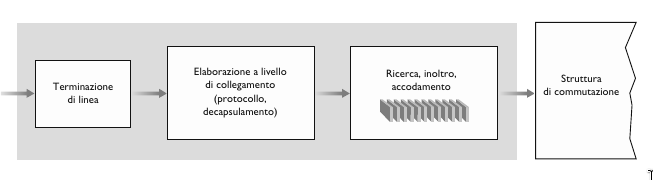
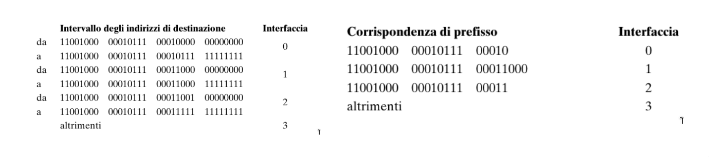
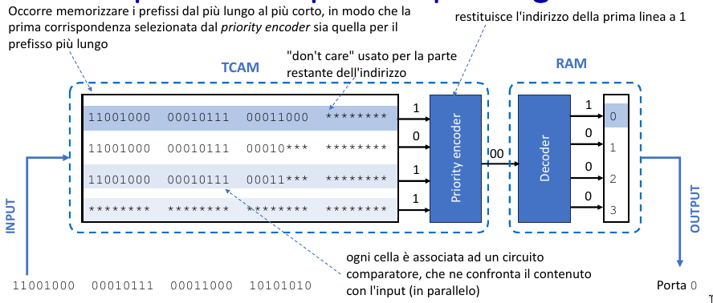
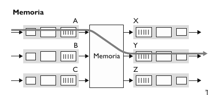
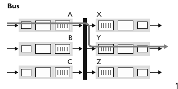
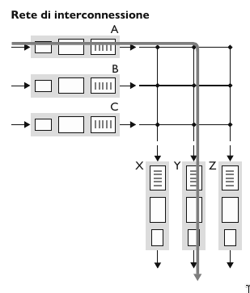

# Livello di rete, piano di dati

## Servizi

Il livello di rete trasporta i segmenti dall'host mittente all'host destinatario. 

- **Mittente**: Incapsula i segmenti dentro ai datagrammi che passa al livello di collegamento.
- **Destinatario**: Scompone il datagramma e passa i segmenti al protocollo del livello di trasporto.

I protocolli di rete sono implementati da tutti i dispositivi in Internet, host e router.

> [!IMPORTANT]
>
> **DEF**: Un router è un dispositivo di rete che instrada il traffico dati tra reti diverse. È in grado di determinare il percorso ottimale per trasferire i dati da una sorgente a una destinazione attraverso una rete complessa. Inoltre, i router possono implementare funzionalità di sicurezza, come firewall e crittografia, e gestire le comunicazioni tra dispositivi all'interno di una rete locale. In sostanza, il router agisce come un ponte tra diverse reti, facilitando la comunicazione e il trasferimento di dati tra di esse.
>
> Quindi il router esamina i campi dell'intestazione di tutti i datagrammi IP che lo attraversano e sposta i datagrammi dalle porte di ingresso alle porte di uscita per trasferire il datagramma lungo il percorso dall'host di origine a quello di destinazione. 

## Inoltro e Instradamento

Il ruolo principale del livello di rete è quindi piuttosto semplice: trasferire pacchetti da un host a un altro. Per fare questo è possibile identificare due importanti funzioni.

- **Inoltro (forwarding)**. Trasferisce i pacchetti da un collegamento di ingresso di un router al collegamento di uscita appropriato  
    del router.
    
    Con inoltro faremo quindi riferimento all’azione locale con cui il router trasferisce i pacchetti da un’interfaccia di ingresso a quel-
    la di uscita. Poiché l’inoltro avviene su scala temporale molto piccola, dell’ordine di pochi nanosecondi, è usualmente implementato in hardware.
- **Instradamento (routing)**. Il livello di rete deve determinare il percorso che i pacchetti devono seguire tramite algoritmi di 
    instradamento (algoritmi di routing).
    
    Con instradamento indicheremo, invece, il processo globale di rete che determina i percorsi dei pacchetti nel loro viaggio dalla sorgente alla destinazione. Poiché l’instradamento avviene su scale temporali più grandi, dell’ordine dei secondi,
    è usualmente implementato in software.

Per inoltrare i pacchetti, i router estraggono da uno o più campi dell’intestazione (per esempio il campo Indirizzo di destinazione) i loro valori che utilizzano come indice nella **tabella di inoltro (tabella di forwarding o forwarding table)**, un elemento chiave di qualsiasi router.

## Piano dei dati e piano di controllo

- **Piano dei dati**. Funzione *locale*, a livello di singolo router. Determina come i pacchetti in arrivo a una porta di ingresso del router sono inoltrati verso una porta di uscita del router.
- **Piano di controllo**. Rappresenta la *logica della rete*. Determina come i pacchetti sono instradati tra i router lungo un percorso dall'host di orgine all'host di destinazione. Ci sono due approcci fondamentiali per il piano di controllo.


1. **Algoritmi di instradamento tradizionali**, implementati nei router.

    Come mostrato nella fdigura, l’algoritmo di instradamento determina i valori inseriti nelle tabelle di inoltro dei router. In questo esempio l’algoritmo di routing è implementato in ogni router, che quindi svolge sia la funzione di inoltro che quella di instradamento internamente. Vedremo più avanti che le funzioni di instradamento nei router comunicano tra di loro per determinare i valori da inserire nelle tabelle di inoltro. Ma come avvengono tali comunicazioni? Attraverso i messaggi di un protocollo di instradamento.


2. **Software-Defined Networking (SDN)**, implementato nei server.

    La digura mostra un approccio alternativo in cui un controller remoto, separato fisicamente dai router, calcola e distribuisce le tabelle di inoltro a tutti i router. La funzionalità di instradamento del piano di controllo è separata fisicamente dal router; il dispositivo di instradamento effettua solo l’inoltro, mentre il controller remoto calcola e distribuisce le tabelle di inoltro. Il controller remoto potrebbe essere implementato in un data center remoto con elevata affidabilità e ridondanza e potrebbe essere gestito da un ISP o da una terza parte.


## Modello di servizio

Qual è il *modello di servizio* per il "canale" che trasporta i datagrammi dal mittente al destinatario, ovvero quali sono le carrateristiche principali del canale?

- **Consegna garantita**: Garantisce che prima o poi il pacchetto arriverà a destinazione.
- **Consegna garantita con ritardo limitato**: Garantisce che prima o poi il pacchetto arriverà a destinazione con un minimo di ritardo.
- **Consegna ordinata**: Garantisce che i pacchetti giungano a destinazione nell'ordine in cui sono stati inviati.
- **Banda minima garantita** 
- **Servizi di sicurezza**

Il livello di rete di Internet mette a disposizione un solo servizio, **best-effort**, *massimo impegno*. Con questo servizio, non c’è garanzia che i pacchetti vengano ricevuti nell’ordine in cui sono stati inviati, così come non è garantita la loro eventuale consegna. Non c’è garanzia sul ritardo end-to-end, così come non c’è garanzia su una larghezza di banda minima garantita.

Nonostante la "scarsità" di servizi che il livello di rete di Internet mette a disposizione, è il modello di servizio tutt'oggi usato.
La semplicità del meccanismo ha consentito l'ampia diffusione di Internet.

## Architettura del router


- **Porte di ingresso**.
    Svolgono le funzioni a livello fisico di terminazione di un collegamento in ingresso al router, svolgono funzioni a livello di collegamento necessarie per interoperare con le analoghe funzioni all'altro capo del collegamento di ingresso. Svolgono inoltre la cruciale funzione di ricerc, in modo che il pacchetto inoltrato nella struttura di commutazione del router esca sulla porta di uscita corretta.


    In un router, le porte di ingresso e uscita, e la struttura di commutazione sono implementate quasi sempre a livello hardware, ed operano sulla scala temporale dei nanosecondi mentre le funzioni di istradamento del router e altre funzioni di gestione operano sulla scala dei millisecondo/secondi. Le funzioni del piano di controllo sono solitamente implementate via software ed eseguite sul processore di instradamento.

    - *Inoltro basato sulla destinazione*: Inoltro basato esclusivamente sull'indirizzo IP di destinazione.
    - *Inoltro generalizzato*: Inoltro basato su più campi di intestazione.



- **Struttura di commutazione**.
    La struttura di commutazione, che connette fisicamente le porte di ingresso a quelle di uscita, è interamente contenuta all'interno del router. Se i datagrammi arrivano più velocemente di quanto la struttura di commutazione possa trasferirili si verifica l'accodamento presso la porta di ingresso.

- **Porte di uscita**.
    Memorizzano i pacchetti che provengono dalla struttura di commutazione e li trasmettono sul collegamento in uscita, operando le funzionalità necessarie del livello di collegamento e fisico.

- **Processore di instradamento**.
    Esegue le funzioni del piano di controllo. Nei router tradizionali esegue i protocolli di instradamento, gestisce le tablle di inoltro e le informazioni sui collegamenti attivi. Nei router SDN, il processore di instradamento è responsabile della comunicazione con il controller remoto, in modo da ricevere le occorenze della tabella di inoltro e installarle alle porte di ingresso.

## Inoltro basato sull'indirizzo di destinazione

Abbiamo visto che le porte di ingresso si occupano di determinare la porta di uscita a cui dirigere un pacchetto attraverso la struttura di commutazione. Ma come avviene la ricerca di questa porta? In ciascuna porta di ingresso, viene memorizzata una copia della tabella di inoltro, che essendo locale, la porta di ingresso non deve fare affidamento sulla CPU per la ricerca della porta di uscita.

Prendiamo il caso più semplice, in cui l'inoltro è basato sull'indirizzo di destinazione. Prendiamo per esempio questa tabella di inoltro:



Nella prima tabella, a sinistra, il router decide la porta di uscita controllando l'intero indirizzo IP mentre nella seconda tabella, un pò più semplificata, il router deve soltanto andare a confrontare un **prefisso** dell'indirizzo con una riga della tabella.

Risulta però un problema. Cosa succede quando un indrizzo IP corrisponde a più di un prefisso? Per esempio:

```
A: 11001000 00010111 00010110 10100001

B: 11001000 00010111 00011000 10101010
```

Quando si verificano corrispondenze multiple, il router adotta la regola di **corrispondenza a prefisso più lungo** in altre parole, viene determinata la corrispondenza più lunga all’interno della tabella e i pacchetti vengono inoltrati all’interfaccia di collegamento associata.

Quindi nel nostro caso l'indirizzo $A$ verrà inoltrato alla porta di uscità 0 mentre l'indirizzo $B$ verrà inoltrato alla porta di uscita 1 per la regola di **corrispondeza a prefisso più lungo**.

La corrispondeza a prefisso più lungo spesso è eseguita con le ternary content addressable memories (TCAM). Con una TCAM, un indirizzo
IP a 32 bit è passato alla memoria che restituisce il contenuto della tupla nella tabella di inoltro corrispondente a quell’indirizzo in un tempo essenzialmente costante.



## Struttura di commutazione

La struttura di commutazione (switching fabric) rappresenta il vero e proprio cuore dei router, attraverso il quale i pacchetti vengono commutati (ossia inoltrati) dalla porta di ingresso alla porta di uscita. La commutazione può essere ottenuta in vari modi.

Il *tasso di trasferimento* è il tasso al quale i pacchetti vengono trasferiti dalla porta di input alla porta di output. Spesso misurato come multiplo del tasso di trasmissione delle linee di input/output. Si desidera avere un tasso di trasferimento della struttura di commutazione $N$ volte il tasso delle linee input/output.

- **Commutazione in memoria**

    I primi e più semplici router erano in genere calcolatori tradizionali, e la commutazione tra porte di ingresso e di uscita veniva effettuata sotto il controllo diretto della CPU. Le porte di ingresso e di uscita funzionavano come tradizionali dispositivi di I/O. Quando sopraggiungeva un pacchetto, la porta di ingresso segnalava l’arrivo tramite interrupt e quindi lo copiava nella memoria del processore di instradamento che procedeva a estrarre dall’intestazione l’indirizzo di destinazione. Quindi, individuava tramite la tabella di inoltro l’appropriata porta di uscita nel cui buffer copiava il pacchetto.



- **Commutazione tramite bus**

    In questo approccio le porte di ingresso trasferiscono un pacchetto direttamente alle porte di uscita tramite un bus condiviso e senza intervento da parte del processore di instradamento.

    **Bus Contention**: Se più pacchetti arrivano contemporaneamente al router, ognuno su una porta di input diversa, tutti tranne uno dovranno aspettare, dato che sul bus si può trasferire soltanto un pacchetto alla volta. Poiché ciascun pacchetto deve attraversare il bus, la larghezza di banda della commutazione è limitata da quella del bus. 



- **Coomutazione attraverso rete di interconnessione**

    Un modo per superare la limitazione di banda di un singolo bus condiviso è l’utilizzo di una rete di interconnessione più sofisticata, quale quella usata in passato nelle architettture multiprocessore. Una **matrice di commutazione (crossbar switch)** è una rete di interconnessione che consiste di $2n$ bus che collegano $n$ porte di ingresso a $n$ porte di uscita.

    Quando un pacchetto giunge a una porta di ingresso A e deve essere inoltrato alla porta Y, il controller chiude l’incrocio di A e Y e la porta A invia il pacchetto sul suo bus e solo il bus Y lo riceverà. Si noti che un pacchetto dalla porta B può essere inoltrato a X nello stesso tempo, perché i pacchetti A-Y e B-X usano bus di input e output diversi.

    Una matrice di commutazione è **non-blocking**: un pacchetto in via di inoltro verso una porta di uscita non viene bloccato a meno che esista un altro pacchetto in via di inoltro sulla stessa porta di uscita.

    Questo tipo di commutazione sfrutta il parralelismo perche frammenta il datagramma in celle di lunghezza fissa all'ingresso, commuta le celle attraverso la rete di commutazione, per poi riassemblare il datagramma in uscita.



## Accodamento

Se la struttura di commutazione è più lenta della porte di ingresso e uscita, può verificarsi accodamento sulle porte di ingresso producendo **ritardi** e **perdite di pacchetti** dovute all'overflow dei buffer.

### Accodamento in ingresso

Avviene quando la struttura di commutazione è lenta nel trasferire tutti i pacchetti in arrivo. Se due pacchetti in testa a due code di ingresso sono destinati alla stessa coda di uscita, allora uno dei pacchetti sarà bloccato e dovrà attendere. Questo fenomeno è noto come **blocco in testa alla coda HOL (Head-Of-The-Line blocking)**: un pacchetto nella coda di ingresso deve attendere il trasferimento attraverso la struttura in quanto risulta bloccato da un altro pacchetto che lo precede.

### Accodamento in uscita

- **Buffering**: Richiesto quando i datagrammi arrivano dalla struttura di commutazione più velocemente del tasso di trasmissione del collegamento. Bisogna decidere quale datagramma scartare se il buffer è pieno.
- Quando vi sono più pacchetti accodati sulle porte di uscita, **schedulatore di pacchetti** deve stabilire in quale ordine trasmetterli.

### Memoria buffer

- **PRIMA**: $B = RTT\cdot\ C$ ovvero la grandezza del buffer $B$ deve essere uguale al tempo di round-trip medio $RTT$ moltiplicato per la capacità del link $C$.
- **ADESSO**: $B = \frac{RTT\cdot\ C}{\sqrt{N}}$ dove $N$ è il numero di flussi TCP.

Si è tentati di pensare che più buffering si ha, meglio è: buffer più grandi consentono a un router di assorbire fluttuazioni maggiori del tasso di arrivo dei pacchetti, riducendo così il tasso di perdita di pacchetti del router. Ma buffer più grandi significano anche, potenzialmente, ritardi di coda più lunghi. Per i giocatori e per gli utenti di teleconferenze interattive, decine di millisecondi
contano.

In assenza di sufficiente memoria per inserire nel buffer il nuovo pacchetto in ingresso, occorre stabilire se scartarlo (politica nota come **drop-tail**, eliminazione in coda) o se rimuoverne uno o più, fra quelli già in coda, per far posto al nuovo arrivato.

In alcuni casi può risultare vantaggioso eliminare un pacchetto (o **marcarne** l’intestazione) prima che il buffer sia pieno, al fine di fornire al mittente un segnale di congestione. Tale operazione potrebbe essere effettuata utilizzando i bit di Notifica Esplicita di Congestione.

## Schedulazione dei pacchetti

L'obiettivo è determinare quale pacchetto inviare successivamente sulla porta di uscita.

### First-In-First-Out (FIFO)

I pacchetti che arrivano alla coda di uscita del collegamento aspettano di essere trasmessi se quest’ultimo è occupato nella trasmissione di un altro pacchetto. Se non c’è sufficiente spazio nel buffer per contenere il pacchetto che arriva, bisogna determinare se il pacchetto va eliminato o se bisogna rimuovere dei pacchetti dalla coda per far spazio al pacchetto in arrivo.
I pacchetti vengono quindi trasmessi nello stesso ordine con cui sono arrivati in coda.

### Priority Queue

Nel modello di accodamento con priorità (priority queuing) i pacchetti sono classificati in base a classi di priorità. Qualsiasi campo di intestazione può essere usato per la classificazione. Ciascuna classe di priorità ha la propria coda. La modalità di accodamento con priorità decide quindi di trasmettere i pacchetti non più nell’ordine generale di arrivo, ma selezionando di volta in volta il pacchetto dalla coda non vuota con priorità più alta. La scelta fra i pacchetti di una classe è di solito effettuata seguendo la strategia FIFO.

### Round Robin

Anche nella modalità di accodamento round robin (round robin queuing), i pacchetti sono suddivisi in classi, senza una rigida priorità di servizio, ma con un’alternanza tra le classi. La forma più semplice di round robin prevede l’alternanza della trasmissione: prima viene inviato un pacchetto della classe 1 e poi uno della classe 2, quindi nuovamente un pacchetto di classe 1, e così via.

### Weighted Fair Queuing (WFQ)

Generalizza il Round-Robin, assegnando a ciascuna classe $i$ un peso $w_{i}$ e riceve una quantità di servizio in ogni ciclo: 
$$\frac{w_{i}}{\sum_{j}w_{j}}$$

