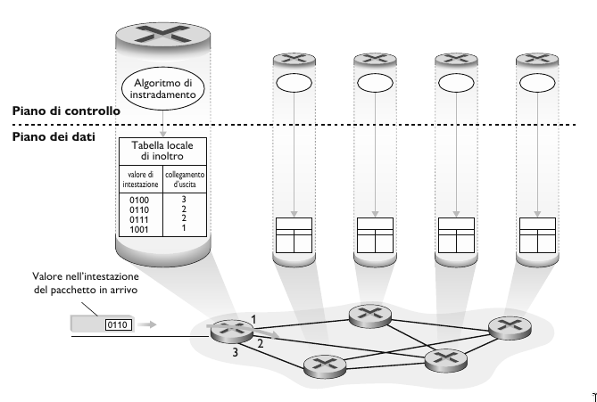
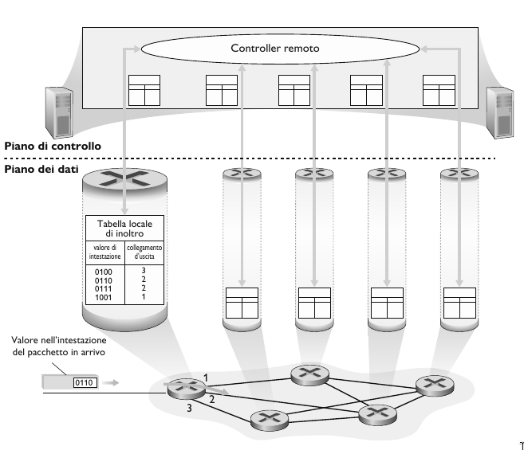
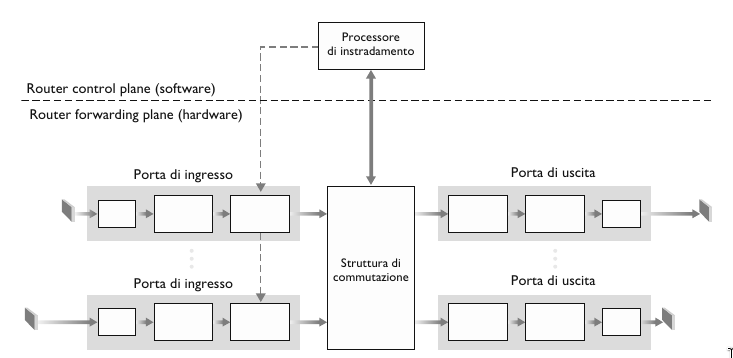

# Livello di rete

## Servizi

Il livello di rete trasporta i segmenti dall'host mittente all'host destinatario. 

- **Mittente**: Incapsula i segmenti dentro ai datagrammi che passa al livello di collegamento.
- **Destinatario**: Scompone il datagramma e passa i segmenti al protocollo del livello di trasporto.

I protocolli di rete sono implementati da tutti i dispositivi in Internet, host e router.

> [!IMPORTANT]
>
> **DEF**: Un router è un dispositivo di rete che instrada il traffico dati tra reti diverse. È in grado di determinare il percorso ottimale per trasferire i dati da una sorgente a una destinazione attraverso una rete complessa. Inoltre, i router possono implementare funzionalità di sicurezza, come firewall e crittografia, e gestire le comunicazioni tra dispositivi all'interno di una rete locale. In sostanza, il router agisce come un ponte tra diverse reti, facilitando la comunicazione e il trasferimento di dati tra di esse.
>
> Quindi il router esamina i campi dell'intestazione di tutti i datagrammi IP che lo attraversano e sposta i datagrammi dalle porte di ingresso alle porte di uscita per trasferire il datagramma lungo il percorso dall'host di origine a quello di destinazione. 

## Inoltro e Instradamento

Il ruolo principale del livello di rete è quindi piuttosto semplice: trasferire pacchetti da un host a un altro. Per fare questo è possibile identificare due importanti funzioni.

- **Inoltro (forwarding)**. Trasferisce i pacchetti da un collegamento di ingresso di un router al collegamento di uscita appropriato  
    del router.
    
    Con inoltro faremo quindi riferimento all’azione locale con cui il router trasferisce i pacchetti da un’interfaccia di ingresso a quel-
    la di uscita. Poiché l’inoltro avviene su scala temporale molto piccola, dell’ordine di pochi nanosecondi, è usualmente implementato in hardware.
- **Instradamento (routing)**. Il livello di rete deve determinare il percorso che i pacchetti devono seguire tramite algoritmi di 
    instradamento (algoritmi di routing).
    
    Con instradamento indicheremo, invece, il processo globale di rete che determina i percorsi dei pacchetti nel loro viaggio dalla sorgente alla destinazione. Poiché l’instradamento avviene su scale temporali più grandi, dell’ordine dei secondi,
    è usualmente implementato in software.

Per inoltrare i pacchetti, i router estraggono da uno o più campi dell’intestazione (per esempio il campo Indirizzo di destinazione) i loro valori che utilizzano come indice nella **tabella di inoltro (tabella di forwarding o forwarding table)**, un elemento chiave di qualsiasi router.

## Piano dei dati e piano di controllo

- **Piano dei dati**. Funzione *locale*, a livello di singolo router. Determina come i pacchetti in arrivo a una porta di ingresso del router sono inoltrati verso una porta di uscita del router.
- **Piano di controllo**. Rappresenta la *logica della rete*. Determina come i pacchetti sono instradati tra i router lungo un percorso dall'host di orgine all'host di destinazione. Ci sono due approcci fondamentiali per il piano di controllo.

1. **Algoritmi di instradamento tradizionali**, implementati nei router.

    Come mostrato nella fdigura, l’algoritmo di instradamento determina i valori inseriti nelle tabelle di inoltro dei router. In questo esempio l’algoritmo di routing è implementato in ogni router, che quindi svolge sia la funzione di inoltro che quella di instradamento internamente. Vedremo più avanti che le funzioni di instradamento nei router comunicano tra di loro per determinare i valori da inserire nelle tabelle di inoltro. Ma come avvengono tali comunicazioni? Attraverso i messaggi di un protocollo di instradamento.

2. **Software-Defined Networking (SDN)**, implementato nei server.

    La digura mostra un approccio alternativo in cui un controller remoto, separato fisicamente dai router, calcola e distribuisce le tabelle di inoltro a tutti i router. La funzionalità di instradamento del piano di controllo è separata fisicamente dal router; il dispositivo di instradamento effettua solo l’inoltro, mentre il controller remoto calcola e distribuisce le tabelle di inoltro. Il controller remoto potrebbe essere implementato in un data center remoto con elevata affidabilità e ridondanza e potrebbe essere gestito da un ISP o da una terza parte.

## Modello di servizio

Qual è il *modello di servizio* per il "canale" che trasporta i datagrammi dal mittente al destinatario, ovvero quali sono le carrateristiche principali del canale?

- **Consegna garantita**: Garantisce che prima o poi il pacchetto arriverà a destinazione.
- **Consegna garantita con ritardo limitato**: Garantisce che prima o poi il pacchetto arriverà a destinazione con un minimo di ritardo.
- **Consegna ordinata**: Garantisce che i pacchetti giungano a destinazione nell'ordine in cui sono stati inviati.
- **Banda minima garantita** 
- **Servizi di sicurezza**

Il livello di rete di Internet mette a disposizione un solo servizio, **best-effort**, *massimo impegno*. Con questo servizio, non c’è garanzia che i pacchetti vengano ricevuti nell’ordine in cui sono stati inviati, così come non è garantita la loro eventuale consegna. Non c’è garanzia sul ritardo end-to-end, così come non c’è garanzia su una larghezza di banda minima garantita.

Nonostante la "scarsità" di servizi che il livello di rete di Internet mette a disposizione, è il modello di servizio tutt'oggi usato.
La semplicità del meccanismo ha consentito l'ampia diffusione di Internet.

## Architettura del router

- **Porte di ingresso**
- **Struttura di commutazione**
- **Porte di uscita**
- **Processore di instradamento**