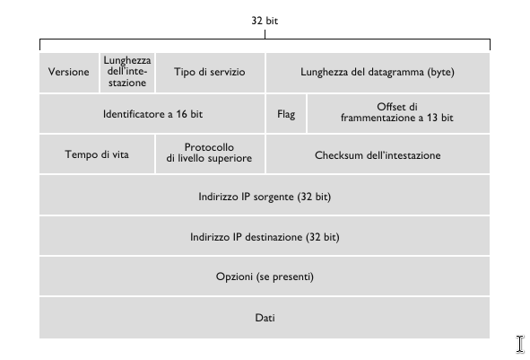
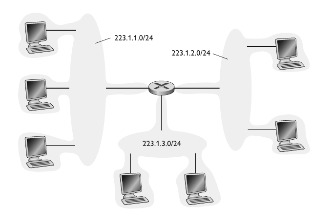

# Il protocollo Internet, IPv4, IPv6

## Formato dei datagrammi IP

- **Numero di versione**. Quattro bit che specificano la versione del protocollo IP (IPv4 o IPv6).
- **Lunghezza dell'intestazione**. Quattro bit che indicano dove iniziano i dati nel datagramma. Multipli di 32 bit
- **Tipo di servizio**. Bit relativi al tipo di servizio. Diversi servizi da 0 a 5, mentre il sercizio ECN i bit 6 e 7.
- **Lunghezza dell'datagramma**. 16 bit che rappresentano la lunghezza totale del datagramma IP. $Max_{len} = 65535\ byte$, $Average_{len} = 1500\ byte$.
- **Identificatore, flag, offset di frammentazione**. Questi 3 campi servono per la frammentazione. Un datagramma IP grande viene frammentato in datagrammi IP più piccoli e inoltrati in modo indipendete che poi vengono riassemblati prima che i dati vengano passati al livello di trasporto.
- **Tempo di vita**. Il campo TTL è stato incluso per assicurare che i datagrammi non restino in circolazione per sempre nella rete. Questo campo viene decrementato ogni volta che viene elaborato da un router.
- **Protocollo**. Indica il protocollo a livello di trasporto a cui deve inviare i dati. 6 indica UDP mentre 17 indica TCP.
- **Checksum dell'intestazione**. Consente ai router di rilevare gli errori sui bit nei datagrammi ricevuti. È calcolato trattando ogni coppia di byte dell’intestazione come numeri che sono poi sommati in complemento a 1.
- **Indirizzi IP sorgente e destinazione**. Quando un host crea un datagramma, inserisce il proprio indirizzo IP nel campo indirizzo IP sorgente e quello della destinazione nel campo indirizzo IP destinazione. Entrambi gli indirizzi a 16 bit (4 byte). 
- **Opzioni**. Altre opzioni da inserire nel datagramma IP.
- **Dati**. Nella maggior parte dei casi, il campo dati contiene il segmento a livello di trasporto (TCP o UDP) da consegnare alla destinazione. Tuttavia, può trasportare anche altri tipi di dati, quali i messaggi ICMP.

## Indirizzamento IPv4

Generalmente un host ha un solo collegamento con la rete. Quando il livello IP dell'host vuole inviare un datagramma, lo fa su tale collegamento. Il confine tra host e collegamento fisico viene detto **interfeccia**. Un router, invece, dato che ha il compito di ricevere datagrammi da un collegamento e inoltrarli su un altro, deve nessariamente essere connesso ad almeno due collegamenti.

L'indirizzo IP è tecnicamente associato a un interfaccia, anziché all'host o al router che la contiene.

Gli indirizzi IP sono lunghi 32 bit (4 byte) e quindi ci sono in totale $2^{32} \approx 4$ miliardi di indirizzi IP. Tali indirizzi sono solitamente scritti nella cosidetta **notazione decimale puntata (dotted-decimal notation). Per esempio:

$$193.32.216.9 = 110000001.00100000.11011000.00001001$$

Tuttavia, tali indirizzi non possono essere scelti in modo arbitrario. Una parte dell'indirizzo di un'interfaccia è determinata dalla sottorete cui è collegata.

Una **sottorete** è un insieme di dispositivi che possono raggiungersi fisicamente *senza passare attraverso un router intermedio*. Nell'immagine osserviamo un router che collega 3 sottoreti

