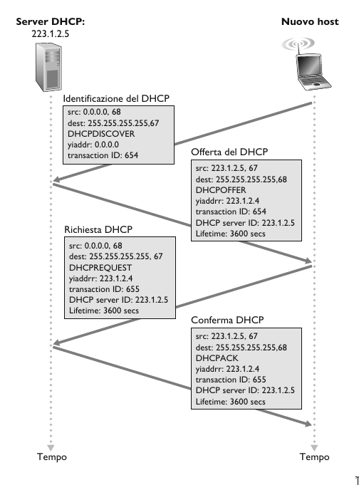

# Il protocollo Internet, IPv4, IPv6

## Formato dei datagrammi IP

- **Numero di versione**. Quattro bit che specificano la versione del protocollo IP (IPv4 o IPv6).
- **Lunghezza dell'intestazione**. Quattro bit che indicano dove iniziano i dati nel datagramma. Multipli di 32 bit
- **Tipo di servizio**. Bit relativi al tipo di servizio. Diversi servizi da 0 a 5, mentre il sercizio ECN i bit 6 e 7.
- **Lunghezza dell'datagramma**. 16 bit che rappresentano la lunghezza totale del datagramma IP. $Max_{len} = 65535\ byte$, $Average_{len} = 1500\ byte$.
- **Identificatore, flag, offset di frammentazione**. Questi 3 campi servono per la frammentazione. Un datagramma IP grande viene frammentato in datagrammi IP più piccoli e inoltrati in modo indipendete che poi vengono riassemblati prima che i dati vengano passati al livello di trasporto.
- **Tempo di vita**. Il campo TTL è stato incluso per assicurare che i datagrammi non restino in circolazione per sempre nella rete. Questo campo viene decrementato ogni volta che viene elaborato da un router.
- **Protocollo**. Indica il protocollo a livello di trasporto a cui deve inviare i dati. 6 indica UDP mentre 17 indica TCP.
- **Checksum dell'intestazione**. Consente ai router di rilevare gli errori sui bit nei datagrammi ricevuti. È calcolato trattando ogni coppia di byte dell’intestazione come numeri che sono poi sommati in complemento a 1.
- **Indirizzi IP sorgente e destinazione**. Quando un host crea un datagramma, inserisce il proprio indirizzo IP nel campo indirizzo IP sorgente e quello della destinazione nel campo indirizzo IP destinazione. Entrambi gli indirizzi a 16 bit (4 byte). 
- **Opzioni**. Altre opzioni da inserire nel datagramma IP.
- **Dati**. Nella maggior parte dei casi, il campo dati contiene il segmento a livello di trasporto (TCP o UDP) da consegnare alla destinazione. Tuttavia, può trasportare anche altri tipi di dati, quali i messaggi ICMP.

## Indirizzamento IPv4

Generalmente un host ha un solo collegamento con la rete. Quando il livello IP dell'host vuole inviare un datagramma, lo fa su tale collegamento. Il confine tra host e collegamento fisico viene detto **interfeccia**. Un router, invece, dato che ha il compito di ricevere datagrammi da un collegamento e inoltrarli su un altro, deve nessariamente essere connesso ad almeno due collegamenti.

L'indirizzo IP è tecnicamente associato a un interfaccia, anziché all'host o al router che la contiene.

Gli indirizzi IP sono lunghi 32 bit (4 byte) e quindi ci sono in totale $2^{32} \approx 4$ miliardi di indirizzi IP. Tali indirizzi sono solitamente scritti nella cosidetta **notazione decimale puntata (dotted-decimal notation). Per esempio:

$$193.32.216.9 = 110000001.00100000.11011000.00001001$$

Tuttavia, tali indirizzi non possono essere scelti in modo arbitrario. Una parte dell'indirizzo di un'interfaccia è determinata dalla sottorete cui è collegata.

Una **sottorete** è un insieme di dispositivi che possono raggiungersi fisicamente *senza passare attraverso un router intermedio*. Nell'immagine osserviamo un router che collega 3 sottoreti

IP assegna a queste sottoreti gli indirizzi 223.1.1.0/24, 223.1.2.0/24, 223.1.3.0/24, dove la notazione /24, detta anche **maschera di sottorete** indica che i 24 bit più a sinistra dell'indirizzo definiscono l'indirizzo della sottorete.

Gli indirizzi IP di una sottorete hanno una struttura:

- Parte della sottorete: I dispositivi della stessa sottorete hanno in comune i bit di ordine superiore, definiti dalla subnet mask.
- Parte dell'host: i rimanenti bit di ordine inferione.

Per determinare le sottoreti si sgancino le interfacce da host e router in maniera tale da creare isole di reti isolate delimitate dalle interfacce. Ognuna di queste reti isolate viene detta sottorere (subnet).

La strategia di assegnazione degli indirizzi Internet è detta **Calssless Interdomain Routing CIDR** generalizza la nozione di indirizzamento di sottorete. L'indirizzo IP viene diviso in due parti e mantiene la forma decimale puntata $a.b.c.d/x$, dove $x$ indica il numero di bit nella prima parte dell'indizzo. Gli $x$ bit più a sinistra di un indirizzo della forma $a.b.c.d./x$ costituiscono la porzione di rete dell'indirizzo IP e sono spesso detti **prefisso** dell'indirizzo.

Prima dell'adozione di CIDR, le parti di rete di un indirizzo IP dovevano essere lunghe, 8, 16, 24 bit. Tale schema di indirizzamento era noto come **classful addressing**, dato che le sottoreti con indirizzi di sottorete da 8, 16, 24 bit erano note come reti di classe A, B, C.

255.255.255.255 è il cosidetto indirizzo IP di broadcast. Quando un host emette un datagramma con questo indirizzo, il messaggio viene consegnato a tutti gli host sulla stessa sottorete.

### Come ottenere l'indirizzo di un host: DHCP

Quando si ottiene un blocco di indirizzi IP, l'amministratore della rete configura manualmente le interfacce dei router, mentre gli indirizzi degli host possono essere sia impostati manualmente sia dinamicamente. Questo compito è svolto utilizzando il **Dynamic Host Configuration Protocol (DHCP)**.

Il DHCP consente dunque ad un host di ottenere un indirizzo IP in modo automatico, ma anche di apprendere informazioni aggiuntive, quali la maschera di sottorete, l'indirizzo del router per uscire dalla sottorete (anche detto *indirizzo di gateway*) e l'indirizzo del suo DNS server locale. Il DHCP può essere configurato in modo tale da assegnare a ciascun host un indirizzo persistente, oppure di assegnare un indirizzo IP temporanea, ovvero ogni volta che si collega alla rete gli verrà assegnato un nuovo indirizzo IP.

DHCP viene spesso chiamato protocollo **plug-and-play** o **zero-conf** per la sua capacità di automatizzare la connessione degli host alla rete.

Per i nuovi host, il protocollo DHCP si articola in quattro punti:

1. **Individuazione del server DHCP**. L'host appena collegato alla rete manda un messaggio **DHCP discover**, ovvero manda un pacchetto UDP sulla porta 67, incapsulato in un datagramma IP con indirizzo sorgente impostato a 0.0.0.0 e indirizzo di destinazione 255.255.255.255. 
2. **Offerta del server DHCP**. Un server DHCP, risponde al client con un messaggio **DHCP offer** che viene inviato di nuovo all'indirizzo 255.255.255.255. Il client a questo punto, può ritrovarsi nella posizione in cui deve scegliere tra più offerte DHCP, dato che possono esistere più di un server DHCP presente nella rete. Ciascun messaggio di offerta del server contiene l'ID della trasazione, l'indirizzo IP proposto al client, la maschera di sottorete, e la durata della connessione (**lease time**) ovvero il tempo di durata dell'indirizzo IP ricevuto.
3. **Richiesta DHCP**. Il client appena collegato, sceglie una delle offerte e risponderà con un messaggio **DHCP request**, che riporta i parametri di configurazione.
4. **Conferma DHCP**. Il server risponde al messaggio di richiesta con un messaggio **DHCP ACK**, che conferma i parametri richiesti.

> [!NOTE]
>
> In genere, il server DHCP è collocato nel router e serve tutte le sottoretia cui il router è collegato.

