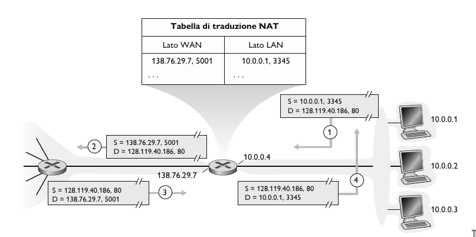
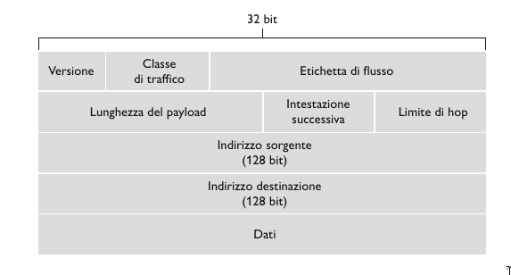
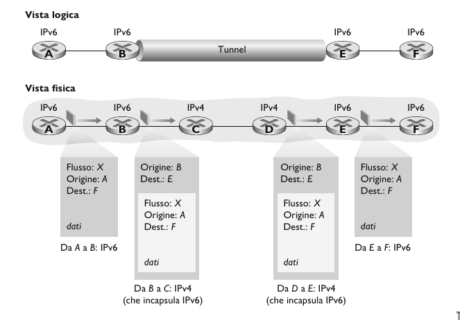
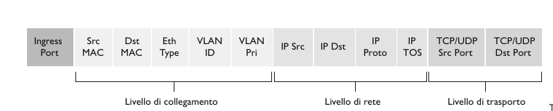

## NAT (Network Address Translation)

Dato che gli indirizzi IP sono limitati, ci sono **indirizzi IP publici** e **indirizzi IP privati**. Le interfacce che si collegano con la rete esterna dispongono di un indirizzo IP pubblico, mentre le sottoreti dispongono di un indirizzo IP privato.

Gli indirizzi privati hanno siglificato solo per i dispositivi interni, quindi due sottoreti distinte (collegate a router diversi), possono avere lo stesso indirizzo IP privato.

Quindi tutti i dispositivi della rete locale condividono **un solo** indirizzp IPv4 publico per il mondo esterno.

Ma se gli indirizzi privati hanno significato solo all’interno di una data rete, come viene gestito l’indirizzamento dei pacchetti relativi all’Internet globale, in cui gli indirizzi sono necessariamente univoci? La risposta è il **NAT**.

I router abilitati al NAT non appaiono come router al mondo esterno, ma si comportano come un *unico* dispositivo con un *unico* indirizzo IP.

Se tutti i datagrammi in arrivo al router NAT dalla rete geografica hanno lo stesso indirizzo IP di destinazione (nello specifico, quello dell’interfaccia sul lato WAN del router NAT), allora come apprende il router a quale host interno dovrebbe essere inoltrato un determinato datagramma? Il trucco consiste nell’utilizzare una **tabella di traduzione NAT (NAT translation table)** nel router NAT e
nell’includere nelle righe di tale tabella i numeri di porta oltre che gli indirizzi IP.

Tutti i dispositivi della rete locale hanno indirizzi a 32 bit in uno spazio di indirizzi IP *privato*, (prefissi 10/8, 172.16/12, 192.168/16) che possono essere utilizzati solo nella rete locale.

**Vantaggi del NAT**

- È necessario *un solo* indirizzo IP dal provider ISP per tutti i dispositivi.
- Può cambiare gli indirizzi degli host nella rete locale senza notificare il mondo esterno.
- Può cambiare ISP senza modificare gli indirizzi dei dispositivi nella rete locale.
- Sicurezza, ovvero i dispositivi all'intenro della rete locale non sono direttamente indirizzabili, quindi non sono visibiili dall'esterno.

**Come viene implementato il NAT e come funziona**

- Sostituire i datagrammi in uscita, ovvero quando al router NAT arriva un datagramma in uscita da un host locale, sostituisce l'indirizzo IP sorgente e la porta con l'indirizzo IP del NAT e una nuova porta.
- Ricordare nella tabella di traduzione NAT ogni coppia di traduzione da (indirizzo IP sorgente, porta) a (indirizzo IP NAT, nuova porta).  
- Sostituire i datagrammi in uscita, ovvero quando al router NAT arriva in ingresso un datagramma esterno, sostituisce l'indirizzo IP NAT con l'indirizzo IP del host all'interno della rete locale e la porta giusta.

Per velocizzare questo processo viene utilizzata una Hash Table.

**Esempio**

1. L'host 10.0.0.1 invia un datagramma al indirizzo IP 128.119.40.186, e alla porta 80.
2. Il router NAT cambia l'indirizzo di origine del datagramma da 10.0.0.1, 3345 a 138.76.29.7, 5001 e aggiorna la tabella.
3. La risposta arriva all'indirizzo di destinazione: 138.76.29.7, 5001.
4. Il router NAT cambia l'indirizzo di destinazione del datagramma da 38.76.29.7, 5001 a 10.0.0.1, 3345.

## IPv6

Una delle motivazioni iniziali per cui è stato creato IPv6 è la scarsità di indirizzi che IPv4 mette a disposizione.

- **Indirizzamento esteso**: Indirizzi IP da 32 bit a 128.
- **Intestazione ottimizata di 40 byte**: Intestazione a lunghezza fissa a 40 byte.
- **Etichettatura dei flussi**: IPv6 presenta una definizione di **flusso**. La trasimissione audio e video può essere trattata come un flusso, ma le applicazioni tradizionali non sono considerate come flusso.

### Formato dei datagrammi IPv6

- **Versione**. Campo a 4 bit che identifica il numero di versione IP. Porre 4 in questo campo non è però sufficiente a creare un datagramma IPv4 valido.
- **Classe di traffico**. Attribuisce priorità a datagrammi all'interno di un flusso o proveniente da spefiche applicazioni.
- **Etichetta di flusso**. Identifica i datagrammi appartenenti allo stesso flusso.
- **Lunghezza del payload**. Campo a 16 bit che identifica la lunghezza del payload.
- **Intestazione successiva**. Campo che identifica il protocollo a cui verranno consegnati i contenuti, (TCP o UDP).
- **Limite di hop**. Cammpo TTL in IPv4.
- **Indirizzi sorgente e destinazione**. Indirizzi IPv6 della sorgente e della destinazione.
- **Dati**. Payload che viene passato al protocollo specificato nell'intestazione successiva.

Osserviamo che rispetto a IPv4, mancano i seguenti campi:

- Frammentazione e riassemblaggio.
- Checksum.
- Opzioni.

### Passaggio da IPv4 a IPv6

L'approccio alla transizione da IPv4 a IPv6 più diffusamente adottato è noto come **tunneling**. L'idea alla base del tunneling è la seguente: Supponiamo che due nodi IPv6 vogliano utilizzare datagrammi IPv6 ma siano connessi da router intermedi IPv4, che chiameremo **tunnel**.

Il Nodo B, al lato di invio del tunnel, prende l’intero datagramma IPv6 pervenutogli da A e lo pone nel campo dati di un datagramma IPv4. Quest’ultimo viene quindi indirizzato al Nodo E, al lato di ricezione del tunnel e inviato al primo nodo nel tunnel (C). I router IPv4 intermedi instradano il datagramma IPv4, come farebbero per qualsiasi altro datagramma, ignari che questo contenga un datagramma IPv6 completo. Il nodo IPv6, sul lato di ricezione del tunnel, riceverà quindi il datagramma IPv4, determinerà che questo ne contiene uno IPv6 osservando che il valore del campo numero di protocollo nel pacchetto IPv4 è 41 corrispondente a payload IPv4, lo estrarrà e lo instraderà esattamente come se l’avesse ricevuto da un nodo IPv6 adiacente.

**Inoltro generalizzato e SDN**

Nell'inoltro generalizzato, una tabella match-action generalizza il concetto di tabella di inoltro basata sulla destinazione. Poiché le decisioni di inoltro possono essere effettuate utilizzando indirizzi di sorgente e destinazione del livello di rete e/o livello di collegamento, i dispositivi di inoltro sono denominati più accuratamente "packed switch" piuttosto che "router" di livello 3 o "switch" di livello 2.

Ogni occorenza corrispondente a una riga in una tabella di inoltro match-action, nota come **tabella dei flussi** contiene:

- *Un insieme di valori dei campi dell'intestazione* con i quali il pacchetto entrante viene confrontato.
- *Un insieme di contatori* che vengono aggiornati quando i pacchetti vengono associati a un'occorenza nella tabella dei flussi.
- *Un insieme di azioni* che devono essere intraprese quando un pacchetto è associato a un'occorenza della tabella di flussi (inoltro, scarto, copia, invio broadcast, modifica).

