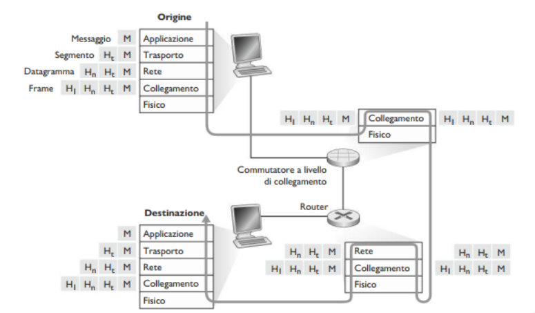

## Sicurezza di rete

Abbiamo diverse tipologie di minacce alla sicurezza di un rete:

#### - Analisi dei pacchetti (packet sniffing)

Un ricevitore passivo in prossimità di un ripetitore wireless può ottenere una copia di ogni pacchetto trasmesso, pacchetti che possono contenere 
informazioni molto sensibili, come password, codici fiscali, carte di credito. Un ricevitore passivo, che memorizza una copia di ciascun pacchetto 
che transita, è detto anche **packet sniffer**.

Dato che i *packet sniffer* sono passivi, cioè non immettono pacchetti sul canale, sono difficili da individuare, dobbiamo quindi accettare la possibilità
che qualche malintenzionato possa farne una copia. Una tra le migliori difese contro gli *packet sniffer* è costituita dalla crittografia.

#### - Mascheramento (IP spoofing)

E' sorprendetemente facile creare un pacchetto con un indirizzo sorgente, contenuto e indirizzo del destinatario qualsiasi e poi trasmettere questo 
pacchetto "fatto a mano" su Internet, che doverosamente inoltrerà il pacchetto a destinazione. La capacità di immettere pacchetti in Internet con un 
indirizzo sorgente falso è nota come **IP spoofing**, ed è un modo attraverso il quale un utente può spacciarsi per un altro.

Per risolvere tale problema abbiamo bisogno di autenticare il punto terminale della comunicazione (*end-point authentication*), cioè di un meccanismo 
che ci permetta di determinare con certezza se il messaggio ha avuto origine da dove supponiamo l'abbia avuta.

#### - Negazione del servizio (Denial-Of-Service, DoS)

Un'ampia classe di minacce alla sicurezza può essere classificata come attacchi di **negazione del servizio (DoS)**. Un attacco DoS rende inutilizzabile
dagli utenti leggitimi una rete, un host, per esempio, web server, DNS o reti istituzionali. Molti attacchi DoS ricadono all'interno di queste categorie:
- *Attacchi alla vulnerabilità dei sistemi*: Invio di pochi messaggi, ben costruiti, a un'applicazione vulnerabile o a un sistema operativo in esecuzione sull'host target. Se eseguito corretamente, il servizio può fermarsioppure l'host può spegnersi.
- *Brandwidth flooding*: Invio massivo di pacchetti all'host target, cosi tanti che il suo collegamento di accesso viene ostruito, impedendo ai pacchetti leggitimi di raggiungere il server.  
E' evidente che se il server ha una velocità di accesso di $R$ bps, l'attacante avrà bisnogno di mandare pacchetti ad una velocità simile o pari ad $R$.
Se $R$ è molto grande, una sola sorgente non basta per danneggiare il server, oppure con una sola sorgente, un router a monte può identificare l'attacco 
e bloccarlo. Di conseguenza vengono effettuati attacchi DoS distribuiti (*DDoS*) dove l'attacante controlla più sorgenti, e ciascuna sorgente attacca 
l'host target.
- *Connection flooding*: Stabilire un gran numero di connessioni TCP con l'host target, impedendogli di accettare nuove connessioni valide.

## Architettura a livelli

I protocolli di rete sono organizzati e implmentati in **livelli** o **strati**. Siamo interessati ai **servizi** offerti da un livello a quello 
superiore, si tratta del cosidetto **modello di servizi** di un livello. Ogni livello fornisce il suo servizio effetuando determinate azioni all'interno
del livello stesso e utilizzando i servizi del livello immediatamente inferiore.

Un livello di protocolli può essere implementato interamente via software, hardware o una combinazione dei due. I protocolli a livello applicazione, 
quali HTTP, FTP, etc... sono implementato completamente via software nei sistemi periferici. Protocolli di livelli come collegamento o fisico, sono 
implmentati a livello hardware direttamente nelle schede di rete, mentre protocolli a livello di rete sono un ibrido.

| Pila Protocollare |
| :---------------: |
| Applicazione      |
| Trasporto         |
| Rete              |
| Collegamento      |
| Fisico            |

Considerati assieme, i protocolli dei vari servizi sono detti **pila di protocolli**.

1. **Livello Applicativo**, è la sede delle applicazioni di rete e dei relativi protocolli, come HTTP (richiesta e trasferimento di documenti web), 
SMTP (trasferimento dei messaggi di posta elettronica), FTP (trasferimento di file tra due sistemi remoti).  
I pacchetti di informazione a livello applicativo si chiamano **messaggi**.
2. **Livello di Trasporto**, trasferisce i messaggi del livello di applicazione tra punti periferici gestiti dalle applicazioni. Abbiamo due protocolli:
   - TCP: servizio orientato alla connessione, ovvero si crea una connessione affidabile tra i due host, garantendo la consegna di dati e l'ordine.
   - UDP: servizio non orientato alla connesssione, inffatti non è un servizio affidabile, e non garantisce la consegna dei dati.
I pacchetti di informazione a livello di trasporto si chiamano **segmenti**.
3. **Livello di Rete**, si occupa di trasferire i pacchetti a livello di rete, detti **datagrammi**. Il protocollo di trasporto passa al livello 
sottostante un indirizzo di destinazione, ovvero un indirizzo IP (Internet Protocol), che definisce i campi dei datagrammi. 
4. **Livello di Collegamento**, si occupa di trasferire un pacchetto da un nodo a quello successivo sul percorso. Alcuni protocoli sono Ethernet, Wi-Fi, 
PPP. I pacchetti di informazione vengono chiamati **frame**.
5. **Livello Fisico**, ha il ruolo di trasferire i singoli bit del frame da un nodo a quello successivo.

> [!IMPORTANT]
> **Incapsulamento**, un **messaggio a livello applicativo** $M$ viene passato a livello di trasporto. Ad esso vengono concatenate informazioni aggiuntive
> $H_{t}$, che saranno utilizzate dalla parte ricevente del livello di trasporto, costituendo il **segmento a livello di trasporto**.  
> Il livello di trasporto, passa il segmento al livello di rete, che concatena le proprie informazioni aggiuntive $H_{n}$, andando a creare il 
> **datagramma a livello di rete**.  
> A questo punto il datagramma viene passato a livello di collegamento, che anch'esso aggiunge le proprie informazioni $H_{l}$, creando il **frame a 
> livello di collegamento**.  
> Quindi a ciascun livello, il pacchetto ha due tipi di campi: **Header** e **Payload**.

