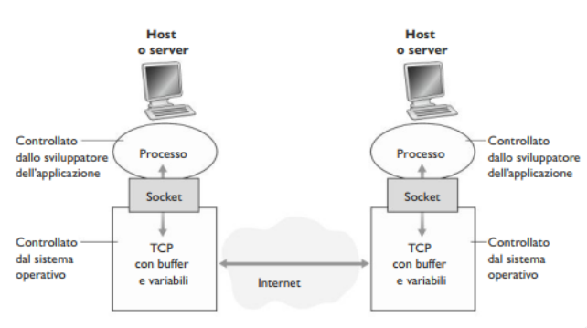
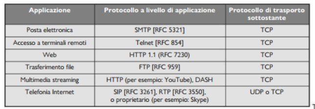

# Livello di Applicazione

Il cuore dello sviluppo delle applicazioni di rete è costituito dalla creazione dei programmi che sono eseguiti dai sistemi periferici e che comunicano
tra loro via rete. Prima di inziare a scrivere codice, bisogna progettare l'**architettura dell'applicazione** e stabilire la sua organizzazione sui vari
sistemi periferici.
- **Architettura Client - Server**, nella quale vi è un host sempre attivo (*server*) che risposte alle richieste di servizio di altri host (*client*), 
per esempio un web server che risponde alle richieste dei browser.  
Spesso in un architettura client-server, un singolo host che esegue il server non basta, infatti si usano spesso **data-center** che, ospitando molti 
host, creano un potente server virtuale.
- **Architettura P2P (Peer-to-Peer)**, si sfrutta la comunicazione diretta tra coppie di host detti *peer*, ossia pari, collegate in modo intermittente.  
Uno dei punti di forza di quest'architettura è la sua intrinseca **scalabilità**, perché nuovi peer aggiungono capacità di servizio al sistema, sebbene 
generino anche nuovo carico di lavoro.

Adesso bisogna definire come processi su host diversi (client e server, o peer) comunicano tra di loro. Abbiamo visto come comunicano i processi 
all'interno dello stesso host a sistemi operativi, mediante pipe, file condivisi, etc... .  
Nel contesto delle reti, i processi comunicano scambiandosi 
**messaggi** attraverso la rete. Il processo mitttente crea messaggi e li invia attraverso la rete e il processo destinatario li riceve e, se richiesto, 
invia messaggi di risposta.

Quindi nell'architettura client-server, abbiamo un processo **client** che avvia la comunicazione, e un processo **server** che è in attesa di richieste.
Mentre nell'architettura P2P, un processo può essere sia client che server.

Un processo invia e riceve messaggi dalla rete attraverso un'interfaccia software detta **socket**. Un processo che vuole inviare un messaggio in rete, 
fa uscire il messaggio dalla propria "porta" (*socket*). Il processo presuppone l'esistenza di un'infrastruttura esterna che trasporterà il messaggio 
attraverso la rete fino alla porta del processo di destinazione. Quando il messaggio giunge al destinatario, attraversa la porta (*socket*) del processo
ricevente che infine opera sul messaggio.

Si parla anche di **API** (*Application Programming Interface)* tra l'applicazione e la rete, dato che la socket rappresenta l'interfaccia di 
programmazione con cui le applicazioni di rete vengono costruite.



Per poter inviare/ricevere messaggi, ciascun host deve avere un indirizzo. In Internet gli host vengono identificati attraverso l'**indirizzo IP**, 
un numero univoco a 32 bit. Oltre all'indirizzo IP, il mitttente deve anche verificare il processo destinatario, più specificamente la socket. Questo
avviene mediante un **numero di porta di destinazione**. Per esempio gli web server (HTTP) sono identificati dalla porta 80.

I dati durante il trasferimento possono andare perduti, causando gravi conseguenze magari in applicazioni web, messaggi di posta, etc...
- **Trasferimento dati affidabile**: Servizio importante che alcuni protocolli a livello di trasporto forniscono per le applicazioni. In questo modo il processo mittente può passare i propri dati alla socket e sapere con assoluta certezza che quei dati arriveranno senza errori.
- **Applicazioni che tollereno perdite**: Le applicazioni multimediali video/audio a uso personale possono tollerare una certa quantità di dati perduti.

- Le applicazioni che hanno requisiti di throughput vengono dette **applicazioni sensibili alla banda**, in particolare le applicazioni multimediali.
- Le **applicazioni elastiche** possono far uso di tanto o di poco throughput, a seconda di quanto ne sia necessario, in particolare web server, servizi 
di posta elettronica sono tutte applicazioni elastiche.

Osserviamo adesso quali servizi di trasporto mette a disposizione Internet:

1. **Servizi di TCP**
- *Servizio orientato alla connessione*. Crea una **connessione TCP** tra i socket dei due processi (fase di *Handshaking*). Questa connessione è di tipo 
full-duplex, ovvero i processi si possono scambiare contemporaneamente messaggi sulla connessione.
- *Servizio di trasferimento affidabile*. I processi hanno la garanzia che TCP trasporti i dati senza errori e nel ordine giusto.

2. **Servizi di UDP**
- UDP è senza connessione, e fornisce un servizio di trasferimento dati non affidabile. Il protocollo non garantisce che questo raggiunga a destinazione,
e non garantisce neanche l'ordine giusto di arrivo.



## Web e HTTP

> [!IMPORTANT]
> HTTP (*HyperText Transfer Protocol*), è un protocollo a livello di applicazione e costituisce il cuore del Web. Questo protocollo è implementato in 
> due programmi, client (Browser) e server in esecuzione su sistemi periferici diversi che comunicano tra loro scambiandosi messaggi HTTP.

HTTP utilizza TCP come protocollo di trasporto. Il client HTTP per prima cosa inizia una connessione TCP con il server sulla porta 80.
Il server accetta la connessione TCP del client, e i due processi possono inziare a scambiarsi messaggi.

Il server invia i file richiesti ai client senza memorizzare alcuna informazione di stato a proposito del client. Per cui, anche 
nel caso di un ulteriore richeista del client, il server provederà nuovamente all'invio non avendo mantenuto alcuna traccia di 
quello precedemente effettuato. Dato che i server HTTP non mantengono informazioni sui client, HTTP è classificato come **protocollo senza memoria di stato** (*stateless protocol*).

### Connessioni persistenti e non persistenti

#### HTTP con connessioni non persistenti

> [!NOTE]
> Ciascuna coppia richiesta/risposta deve essere inviata su una connessione TCP *separata*.

Seguiamo passo dopo passo il trasferimento di una pagina web dal server al client. Ipotizziamo che l'URL del file HTML sia:  
`http://www.someSchool.edu/someDepartment/home.index`

1. Il client HTTP inizializza una connessione TCP con il server sulla porta 80. 
2. Il client HTTP, tramite la propria socket, invia un messaggio di richiesta HTTP che include il percorso  
`/someDepartment/home.index`.
3. Il server HTTP riceve il messaggio di richiesta attraverso la propria socket, recupera l'oggeto  
`/someDepartment/home.index`, dalla memoria, lo incapsula in un messaggio di risposta HTTP che viene inviato al client attraverso la socket.
4. Il server HTTP comunica a TCP di chiudere la connessione, che la chiuderà soltanto quando sarà certo che il client abbia ricevuto la risposta. 
5. Il client HTTP riceve il messaggio di risposta. La connessione TCP termina. Il messaggio indica che l'oggetto incapsulato è un file HTML. Il client poi estrae il messaggio ed esamina la rispsota.

> [!IMPORTANT]
> **Round-Trip Time (RTT)**, rappresenta il tempo impiegato da un piccolo pacchetto per viaggiare dal client al server e poi 
> tornare al client. RTT include i ritardi di propagazione, di accodamento nei router e nei commutatori intermedi e di elaborazione
> di pacchetto.

Con connessioni non persistenti, il tempo di risposta è di due RTT $+$ il tempo di trasferimento di file

**Svantaggi**:
- Per ogni oggetto richiesto occorre stabilire e mantenere una nuova connessione.
- Per ciascuna conenssione bisogna mantenere buffer e nuove variabili TCP sia nel client che nel server.
- 2 RTT di ritardo per ciascun oggetto.

#### HTTP con connessioni persistenti

Con HTTP 1.1 nelle connessioni persistenti il server lascia la connessione TCP aperta dopo l'invio di una risposta, per cui le 
richieste e le risposte successive tra gli stessi client e server possono essere trasmesse  sulla stessa conenssione. Non solo 
il server può inviare un'intera pagina web su una sola connessione TCP permanente, ma può anche spedire allo stesso client più 
pagine web. In generale il server HTTP chiude la connessione quando essa rimane inattiva per un dato lasso di tempo (intervallo 
configurabile).

### Formato dei messaggi HTTP

#### Messaggio di richiesta

```
GET /somedir/page.html HTTP/1.1
Host: www.someschool.edu
Connection: close
User-agent: Mozilla/5.0

```

