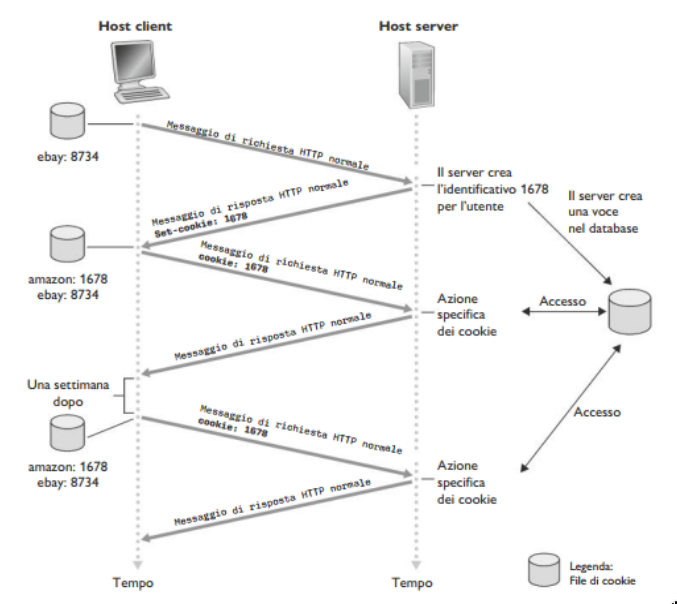
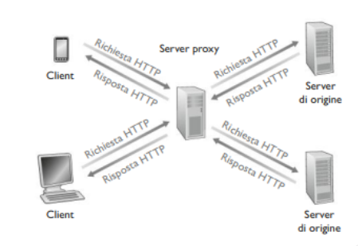
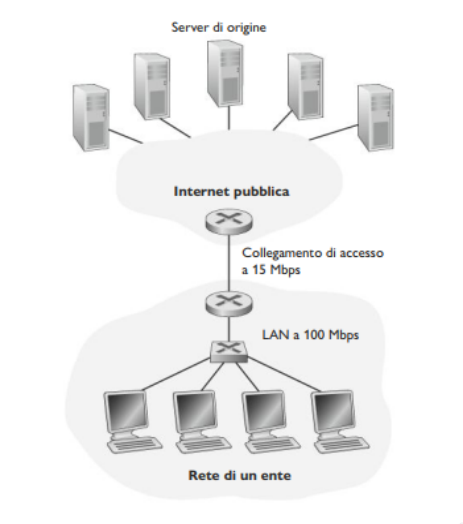
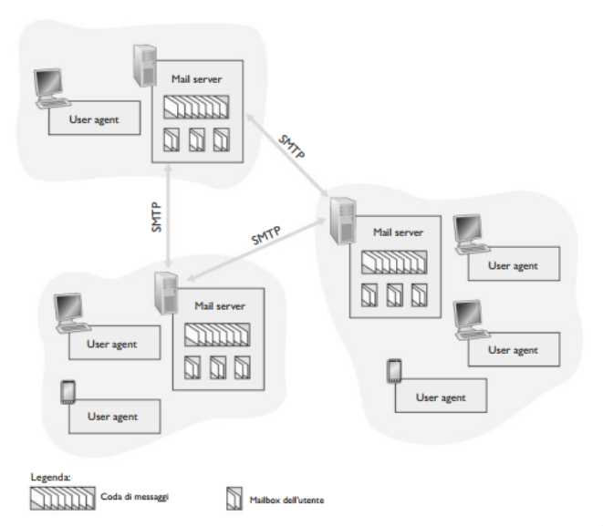
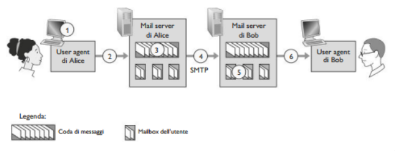

## Cookie

Come abbiamo visto, il protocollo HTTP è un protocollo senza stato, ovvero il server non mantiene informazioni riguardo i client, rendendo il server il 
più ottimizzato possibile. Tuttavia, spesso i web server possano autenticare gli utenti, sia per limitare l'accesso da parte di questi ultimi sia per 
fornire contenuti in funzione della loro identità. A questo scopo, HTTP adotta i **cookie**, che consentono ai server di tener traccia degli utenti.



La tecnologia dei cookie presenta quattro componenti:
1. una riga di intestazione nel messaggio di *risposta* HTTP
2. una riga di intestazione nel messaggio di *richiesta* HTTP
3. un file cookie mantenuto sul sistema terminale dell'utente e gestito dal browser dell'utente
4. un database sul sito  

**Esempio**
- Susan usa il browser dal portatile, visita uno specifico sito di commercio elettronico per la prima volta
- quando la richiesta HTTP iniziale arriva al sito, il sito crea:
    - un identificativo univoco
    - una voce nel proprio database, indicizzata dal numero identificativo
- il server ritorna una risposta che include l'intestazione `Set-cookie`, che contiene l'identificativo unico e che sarà aggiunto al file dei cookie 
- le successive richieste del browser di Susan per questo sito conterranno l'identificativo in una intestazione cookie.

Quindi i cookie possono essere usati per:
- Identificare gli utenti. La prima volta che visita un sito, un utente può fornire un'identificazione. Successivamente il browser passa un'intestazione di cookie al server durante tute le successive visite al sito. 
- Creare un livello di sessione utente al di sopra di HTTP che è privo di stato.

I cookie sono oggetto di controversie, in quanto possono essere considerati una violazione della privacy dell'utente. Un web server può imparare molto sull'utente e potrebbe vender quanto sa a una terza parte. Infatti quando i cookie possono identificare un individuo, i cookie sono considerati dati 
personali, soggetti alla normativa GDPR sui dati personali.

## Web cache

Una **web cache**, nota anche come **proxy server**, è un entità di rete che soddisfa richieste HTTP al psot del web server effettivo. Il proxy ha una 
propria memoria su disco (una cache) in cui conserva copie di oggetti recentemente richiesti.



Come mostrato nell'immagine, un browser può essere configurato in modo tale che ogni richiesta venga inizialmente diretta al proxy.
1. Il browser stabilisce una connessione TCP con il proxy server e invia una richiesta HTTP per l'oggetto specificato.
2. Il proxy controlla la presenza di una copia dell'oggetto memorizzata localmente. Se l'oggetto viene rilevato, il proxy lo inoltra all'interno di un messaggio di risposta HTTP al browser.
3. Se, invece la cache non dispone dell'oggetto, il proxy apre una connessione TCP verso il server di origine. Quindi il proxy invia al server una richiesta HTTP per l'oggetto. Una volta ricevuta tale richiesta, il server di origine invia al proxy l'oggetto all'interno di una risposta HTTP.
4. Quando il proxy riceve l'oggetto, ne salva una copia nella propria memoria locale e ne inoltra un'altra copia, all'interno di un messaggio di risposta HTTP, al browser.

> [!NOTE]
> Si noti che il proxy è contemporaneamente server e client: quando riceve richieste da un browser e gli invia risposte agisce da server, quando invia 
> richieste e riceve risposte da un server funziona da client.

Il web caching si è sviluppato in Internet per due ragioni:
1. Un proxy può ridurre in modo sostanziale i tempi di risposta alle richieste dei client, in particolare se l'ampiezza di banda che costituisce il collodi bottiglia tra il client e il server è molto inferiore rispetto all'ampiezza di banda minima tra client e proxy. Se esiste una connessione ad alta velocità tra il client e il proxy, e se l'oggetto è nella cache, questo sarà consegnato rapidamente al client.
2. I proxy possono ridurre sostanzialmente il traffico sul collegamento a Internet, con il vantaggio di non dover aumentare l'ampiezza di banda frequentemente e ottenere quindi una riduzione di costi.

**Esempio**



Una rete di un ente e la rete publica Internet. La rete dell'ente è una LAN ad alta velocità. Un collegamento a 15Mbps connette un router alla prima parte a uno della seconda. I server di origine sono collegati a Internet e situati in diverse parti del mondo. Supponiamo che:
- Dimensione media di un oggetto: 1 Mbit 
- Frequenza media browser: 15 richieste al secondo
- Messaggi HTTP trascurabilmente piccoli
- Velocità media di trasmissione dei dati (*Ritardo Internet*): 2 s

Quindi, abbiamo che:
- $\frac{15 (ric/s) \cdot (1 Mbit/ric)}{100 Mbps} = 0.15$: Intensità traffico rete LAN
- $\frac{15 (ric/s) \cdot (1 Mbit/ric)}{15 Mbps} = 1$: Intensità traffico sul collegamento di accesso

Un'intensità di traffico di 0.15 su una rete locale provoca generalmente alcune decine di millisecondi di ritardo, che può essere trascurato. Però quando 
l'intensità di traffico si avvicina a 1, il ritardo su un collegamento diventa notevole e cresce senza limiti, pertanto il tempo di risposta medio per soddisfare le richieste diventa dell'ordine dei minuti, se non superiore. Quindi abbiamo due possibili soluzioni:
1. Incrementare la banda sull'collegamento di accesso a Internet, da 15 Mbps a 100 Mbps. Ciò abbasserà l'intensità di traffico fino a 0.15, il che si trduce in ritardi trascurabili tra i due router. Puo però risultare costoso aggiornare l'infrastruttura.
2. Adozione di un proxy nella rete dell'ente. Le percentuali di successo, cioè la frazione di richieste soddisfatte dalla cache, variano tra il 0.2 e 0.7.
Supponiamo l'hit rate sia 0.4. Dato che i client e il proxy sono collegati alla stessa rete locale ad alta velocità, il 40% dell richieste verrà soddisfatto dalla cache quasi immediatamente, ossia entro 10 ms. Il restante 60% deve ancora essere soddisfatto dal server di origine. In questo modo l'intensità 
di traffico sul collegamento di accesso passa da 1.0 a 0.6, che risulta bassa per un collegamento a 15 Mbps. Quindi il ritardo medio è:
- $0.4 \cdot (0.01 s) + 0.6 \cdot (2.01 s) \leq 1.2 s$, che risulta perfino inferiore rispetto alla prima soluzione.

Cosa avviene quando la copia che risiede in cache potrebbe essere scaduta? In altre parole, l'oggetto ospitato nel web server potrebbe esser stato 
modificato rispetto alla copia nel client (sia esso un proxy o un browser). HTTP presenta un meccanismo che permette alla cache di verificare se i suoi 
oggetti sono aggiornati. Questo meccanismo è chiamato **GET condizionale**. Un messaggio di richiesta HTTP viene detto messaggio GET condizionale se:
1. Usa il metodo GET
2. Include una riga di interstazione `If-modified-since`.

**Esempio**

Il proxy effettua un controllo di aggiornamento inviando un GET condizionale:
```
GET /fruit/kiwi.gif HTTP/1.1
Host: www.exotiquecouisine.com 
If-modified-since: Wed, 9 Sep 2015 09:23:24
```

Questo GET condizionale sta comunicando al server di inviare l'oggetto solo se è stato modificato rispetto alla data specificata. Se non è stato modificato allora il server risponde con:
```
HTTP/1.1 304 Not Modified 
Date: Sat, 10 Oct 2015 15:39:29
Server: Apache/1.3.0 (Unix)
```

Il web server invia un messaggio di risposta, ma non include l'oggetto richiesto, in quanto ciò implicherebbe spreco di banda e incrementerebbe il tempo di risposta percepito dall'utente, in particolare se l'oggetto è grande.

##### Da HTTP/1.1 a HTTP/2 a HTTP/3

**Obiettivo principale**: diminuzione del ritardo nelle richieste HTTP a più oggetti

- **HTTP/1.1**, ha introdotto **GET multiple in pipeline** su una singola connessione TCP
    - Il server risponde *in ordine* (FCFS: First-Come-First-Served scheduling) alle richieste GET
    - Con FCFS, oggetti piccoli possono dover aspettare per la trasmissione dietro a uno o più oggetti grandi (HOL: Head-Of-Line blocking)
    - Il recupero delle perdite (ritrasmissione dei segmenti TCP persi) blocca la trasmissione degli oggetti. 
- **HTTP/2**, maggiore flessibilità del server nell'invio di oggetti al client
    - Metodi, codice di stato, maggior parte dei campi di intestazione inalterati rispetto a HTTP/1.1
    - Ordine di trasmissione degli oggetti richiesti basata su una priorità degli oggetti specificata dal client
    - Invio *push* al client di oggetti aggiuntivi, senza che il client li abbia richiesti (notifiche)
    - Dividere gli oggetti in frame, intervallare i frame per mitigare il blocco HOL.
- **HTTP/3**, aggiunge sicurezza, controllo di errore e congestione per oggetto (più pipelining) su UDP.

## E-mail

E una delle applicazioni più diffuse ed elaborate e potente. Rappresenta un mezzo di comunicazione asincrono. La moderna posta elettronica è veloce , 
facile da distribuire e gratuita. Alcune caratteristiche importanti sono: gli allegati, collegamenti ipertestuali, testo con formattazione HTML e foto.

La posta elettronica è composta da 3 componenti principali:
- User agents (*agenti utente*), per esempio Outlook, Gmail, Yahoo, etc..., consentono agli utenti di leggere, rispondere, inoltrare, salvare e comporre messaggi. 
- Mail Servers (*server di posta*), costituiscono la parte centrale dell'infrastruttura del servizio di posta elettronica. Ciascun destinatario ha una **mail-box** (*casella postale*) collocata in un mail server. Se il server non può consegnare la posta, la trattiene in una **coda di messaggi** e cerca di trasferirla in un secondo momento, di solito avviene ogni 30 min.
- Protocollo SMTP (*Simple Mail Transfer Protocol*), rappresenta il principale protocollo a livello di applicazione per la posta elettronica. Fa uso di TCP per  il trasferimento della mail dal mittente al destinatario. SMTP presenta un lato client, in esecuzione sul mail server del mittente, e un lato server, in esecuzione sul server del destinatario. Entrambi i lati possono essere eseguiti su tti i server di posta. Quando un server invia posta a un altro,  
agisce come client SMTP; quando invece la riceve, funziona come un server SMTP.



### SMTP

SMTP costituisce il cuore della posta elettronica. SMTP trasferisce i messaggi dal mail server del mittente a quello del destinatario. Tratta il corpo 
di tutti i messaggi come semplice ASCII a 7 bit, il che nei giorni d'oggi questa restrizione è piuttosto penalizzante, in quanto richiede che i dati multimediali binari vengano codificati in ASCII prima di essere inviati e che il messaggio venga nuovamente decodificato in binario dopo il trasporto. 

**Esemio**

1. Alice invoca il proprio user agent per la posta elettronica, fornisce l'indirizzo di posta di Bob, compone il messaggio è dà l'istruzione allo user agent di inviarlo.
2. Lo user agent di Alice invia il messaggio al suo mail server, dove è collocato in una coda di messaggi. 
3. Il lato client di SMTP, eseguito sul server di Alice, vede il messaggio nella coda dei messaggio e apre una connessione TCP verso un server SMTP in esecuzione sul mail server di Bob.
4. Dopo un handshaking SMTP, il client SMTP invia il messaggio di Alice sulla connessione TCP.
5. Presso il mail server di Bob, il lato server di SMTP riceve il messaggio che viene posizionato nella casella di Bob.
6. Bob, quando lo ritiene opportuno, invoca il proprio user agent per leggere il messaggio.



**Formati di messaggi di posta**

```
From: alice@crepes.fr 
To: bob@hamburger.edu
Subject: Alla ricerca del significato della vita
(body)
```

Il corpo dei messaggi di posta elettronica è preceduto da un'intestazione contenete informazioni di servizio. Tale informazione periferica è contenuta in una serie di righe di intestazione, definite nell'RFC 5322. Queste righe sono separate dal corpo del messaggio mediante una riga senza contenuto.


