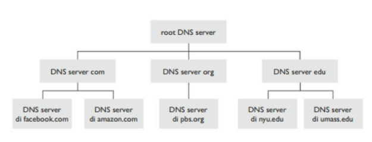
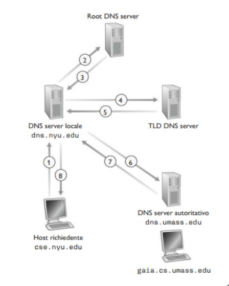
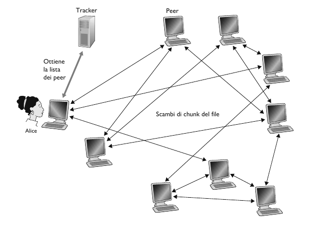

## DNS

Gli host Internet possono essere identificati in vari modi, più precisamente da uno o più **hostname** e da un unico **indirizzo IP**. Le persono 
ovviamente preferiscono identificare gli host mediante l'hostname, mentre i router ovviamente l'indirizzo IP. Al fine di conciliare i due approcci è 
necessario un servizio in grado di tradurre gli indirizzi IP in hostname e viceversa. 

> [!IMPORTANT]
> **DNS (Domain Name System)**, è un protocollo a livello applicazione che si occupa della traduzione dei nomi. Consiste in un database distribuito 
> implementato in una gerarchia di **DNS server**. Consente quindi agli host, di interrogare questo database per **risolvere** i nomi.

I server DNS sono generalmente macchine UNIX che eseguono il software **BIND (Barkeley Internet Name Domain)**. DNS utilizza UDP e la porta 53.

Oltre alla traduzione degli hostname, in indirizzi IP, DNS mette a disposizione altri importanti servizi:
- **Host aliasing**. Un host dal nome complicato può avere più sinonimi o *alias*. Per esempio `relay1.west-coast.enterprise.com` potrebbe avere due sinonimi, `enterprise.com` e `www.enterprise.com`. In questo caso, il nome originale si dice che è un **hostname canonico**.
- **Mail sever aliasing**. Per esempio un utente, diciamo Bob, potrebbe avere un indirizzo di posta elettronica `bob@yahoo.com`. Tuttavia l'hostname del mail server di Bob potrebbe essere assai più complicato. Un'applicazione di posta può invocare il DNS per ottenere il nome canonico di un sinonimo fornito,così come l'indirizzo IP dell'host.
- **Load distribution**. Il DNS viene utilizzato anche per distribuire il carico tra server replicati, per esempio dei web server. I siti con molto traffico vengono replicati su più server, ognuno eseguito su un host diverso con un IP diverso. Nel caso di web server replicati, va associato a ogni hostname canonico un insieme di indirizzi IP.

### Funzionamento DNS

Supponiamo che una certa applicazione in esecuzione sull'host di un utente abbia necessità di tradurre un hostname in un indirizzo IP. L'applicazione 
invocherà il lato client DNS specificando l'hostname da tradurre. Il DNS poi prende il controllo, inviando un messaggio di richiesta sulla rete. Dopo un 
ritardo di alcuni millisecondi/secondi, il client DNS riceve il messaggio di risposta contenente la corrispondenza desiderata, che viene poi passata 
all'applicazione. Pertanto dal punto di vista dell'applicazione, il DNS è una scatola nera che fornisce un servizio di traduzione semplice e diretto. 
Tuttavia la scatola nera è un insieme di server distribuiti per il mondo e da un protocollo a livello di applicazione che specifica la comunicazione tra 
DNS e server host richiedenti. Adesso la domanda che ci poniamo è: perchè non centralizzare il DNS:
- **Un solo point of failure**. Se il server DNS si guasta, ne soffre l'intera Internet.
- **Volume di traffico**. Un singolo DNS server potrebbe gestire tutte le richieste.
- **Database centralizzato distante**. Un singolo server DNS non può essere vicino a tutti gli i client, causando ritardi significativi.
- **Manutenzione**. Il singolo DNS dovrebbe contenere record relativi a tutti gli host di Internet. Questo database sarebbe vasto e dovrebbe essere sempre aggiornato.

In conclusione, centralizzare il DNS non è un'ottima soluzione da prendere in considerazione.

A questo punto possiamo parlare quindi di DNS come un sistema di **database distribuito e gerarchico**. In prima approssimazione, esistono tre classi di 
DNS server:

- **Root level**. In Internet esistono più di 1000 root server dislocati in tutto il mondo. Tali root server sono copie di 13 differenti root server gestiti da 12 diverse organizzazioni, coordinate attraverso lo IANA. I root server forniscono gli indirizzi IP dei TLD server.
- **Top-level domain (TLD) server**. Questi server si occupano dei domini di primo livello quali com, org, net, edu, gov, e di tutti i domini di primo livello relativi ai vari paesi, come it, uk, fr, ca, jp. I TLD server forniscono gli indirizzi IP dei server autoritativi.
- **Server autoritativi**. Ogni organizzazione dotata di host pubblicamente accessibili tramite Internet deve fornire record DNS pubblicamente accessibili che associno i nomi di tali host a indirizzi IP. La maggior parte delle università e delle università e delle grandi società implementa e gestisce dei propri server autoritativi primario e secondario (di backup)

Esiste un altro tipo di DNS, detto **DNS server locale**, che non appartiene alla  gerarchia di server, ma che è comunque centrale nell'architettura DNS.
Ciascun ISP ha un DNS server locale. Quando un host si connette a un ISP, quest'ultimo gli fornisce un indirizzo IP tratto da uno o più dei suoi DNS server locali. Quando un host effettua una richiesta DNS, la query viene inviata al DNS locale che opera da proxy e inoltra la query alla gerarchia dei DNS server.

L'esempio in figura fa uso sia di **query ricorsive** che di **query iterative**. La richiesta inviata da `cse.nyu.edu` a `dns.nyu.edu` è *ricorsiva* in quanto richiede a `dns.nyu.edu` di ottenere l'associazione per conto del richiedente. Le successive tre richieste sono invece iterative, dato che tutte le risposte sono restituite direttamente a `dns.nyu.edu`. Quindi:
- **Query iterative**. Il server contattato risponde con il nome del server da contattare.
- **Query ricorsive**. L'host affida il compito di tradurre il nome al server contattato.

**DNS Caching**

Il DNS sfrutta in modo estensivo il caching per migliorare le prestazioni di ritardo e per ridurre il numero di messaggi DNS che "rimbalzano" su Internet.
L'idea alla base del caching è molto semplice. Una volta che un qualsiasi server imapara la mappatura, la mette in cache, e restituisce immediatamente il 
mapping in caso di una query. Con il caching, il termpo di risposta ad una query è molto più veloce. Dopo un certo periodo di tempo (in genere dopo 2 giorni), le voci della cache vanno in timeout ovvero scompaiono. Inoltre i server TLD sono in genere memorizzati nella cache dei server DNS locali.

### Record e messaggi DNS

I server che implementano il database distribuito di DNS memorizzano i cosidetti **record di risorsa**. Ogni messaggio di risposta trasposta uno o più record di risorse. Un record di risorsa contiene i seguenti campi: `(Name, Value, Type, TTL)`.

`TTL` è il time to live, ossia il tempo residuo di vita di un record e determina quando una risorsa vada rimossa dalla cache.

Il significato di `Name` e `Value` dipende da `Type`:

- Se `Type = A`, allora `Name` è il nome dell'host e `Value` è il suo indirizzo IP. Pertanto un record di tipo `A` fornisce la corrispondenza tra hostname standard e il suo indirizzo IP. Per esempio, `(relay1.bar.foo.com, 145.37.93.126, A)`.
- Se `Type = NS`, allora `Name` è un dominio e `Value` è l'hostname del DNS server autoritativo che sa come ottenere gli indirizzi IP degli host del dominio. Questo record viene usato per instradare le richieste DNS successive alla prima nella concatenazione delle query. Per esempio `(foo.com, dns.foo.com, NS)`.
- Se `Type = CNAME`, allora `Value` rappresenta il nome canonico dell'host per il sinonimo `Name`. Questo record può fornire agli host richiedenti il nome canonico relativo a un hostname. Per esempio `(foo.com, relay1.bar.foo.com, CNAME)`.
- Se `Type = MX`, allora `Value` è il nome canonico di un mail server che ha il sinonimo `Name`. Per esempio `(foo.com, mail.bar.foo.com, MX)`.

**Messaggi DNS**

Ci sono due tipi di messaggi DNS: *query* e *risposte*. La semantica dei campi dei messaggi DNS è la seguente:

- I primi 12 byte rappresentano la *sezione di intestazione* (*header section*), che a sua volta contiene un certo numero di campi. Il primo è un numero di 16 bit che identifica la richiesta. Tale identificatore viene poi copiato nei messaggi di risposta, consentendo ai client di far corrispondere le risposte ricevute. Il campo *flag*, il primo bit indica se il messaggio è una richiesta (0) o una risposta (1). Un ulteriore bit, *bit di ricorsione*, viene impostato quando un client desidera che il DNS server effettui ricorsione quando non dispone del record.
- La *sezione delle domande* contiene informazioni sulle richieste che stanno per essere effetuare, include il campo nome con il nome che sta per essere richiesto, e un campo tipo che indica il tipo della domanda sul nome (A, MX).
- La *sezione delle risposte* contiene i record di risorsa relativi al nome originariamente richiesto. Una risposta può restituire più RR, dato che un hostname può avere piò indirizzi IP.
- La *sezione autoritativa* contiene i record di altri server autoritativi.
- La *sezione aggiuntiva* racchiude altri record utili.

**Inserimento di record nel database DNS**

Supponiamo di dover registrare il nome di dominio `networkutopia.com` presso un ente di registrazione (**DNS Registrar**). Un registrar è un azienda che si occupa di verificare l'unicità del nome di dominio, lo inserisce nel database DNS. Esistono molti registrar concorrenti, accredidati dalla *Internet Corporation for Assigned Names and Numbers (ICANN)*.
Al registrar dobbiamo fornire il nome e gli indirzzi IP degli DNS autoritativi primario e secondario. Il registrar inserisce poi dure record nel TLD server .com: `(networkutopia.com, dns1.networkutopia.com, NS)`, `(dns1.networkutopia.com, 212.212.212.1, A)`.
Nel server autoritativo bisogna poi inserire due record, uno di tipo A per `www.networkutopia.com` e uno di tipo MX per `networkutopia.com`.

## Architettura Peer-to-peer

Nell'architettura peer-to-peer ci sono coppie di host connessi in modo intermittente, chiamati peer, che comunicano direttamente 
l'uno con l'altro. I peer non appartengono ai fornitori dei servizi, ma sono computer fissi e portatili e smartphone controllati dagli utenti.

**Confronto tra paradigma client-server e P2P: distribuzione di un file**

Sia $F$ la dimensione del file. Sia $N$ il numero di copie che devono essere trasmesse. Siano $u_{s}$ la velocità di upload del server, $u_{i}$ la velocità di upload dell' $i-esimo$ peer, e $d_{i}$ la velocità di download dell' $i-esimo$ peer. 

1. Distribuzione file client-server
    - Il server deve inviare (caricare) in sequenza N copie di file. Per inviare $N$ copie, impiega $\frac{N\cdot F}{u_{s}}$.
    - Ogni client deve scaricare una copia del file. Sia $d_{min}$ la banda di donwload più bassa. Allora il tempo di download per il client con la banda minima è almeno $\frac{F}{d_{min}}$.
    - $D_{c-s} \geq max$ { $\frac{N \cdot F}{u_{s}}$, $\frac{F}{d_{min}}$ }.
2. Distribuzione file P2P
   - Il server deve trasmettere almeno un copia del file: $\frac{F}{u_{s}}$. 
   - Ogni client deve scaricare una copia del file: $\frac{F}{d_{min}}$. Come aggregato devono scaricare $N\cdot F$ bit. Capacità totale di upload è $u_{s} + \sum_{i}u_{i}$.
   - $D_{P2P} \geq max$ { $\frac{F}{u_{s}}$, $\frac{F}{d_{min}}$, $\frac{N\cdot F}{u_{s} + \sum_{i}u_{i}}$ }

**BitTorrent**

BitTorrent è un diffuso protocollo P2P per la distribuzione di file. L'insieme di tutti i peer che partecipano alla distribuzione di un file è chiamato **torrent**. I peer di un torrent scaricano **chunk** del file di uguale dimensione, con una dimensione tipica. Un peer, quando entra a far parte di un torrent per la prima volta, non ha un chunk del file. Col passare del tempo accumula sempre più parti, che, mentre scarica invia ad altri peer. Una volta che un peer ha acquisito un intero file puo decidere di lasciare il torrent o di rimanere, continuando a inviare chunk ad altri peer. Ciascun torrent ha un nodo detto **tracker**, che tiene traccia dei vari peer. Quando un peer entra a far parte di un torrent si deve registrare presso il tracker.

Alice entra a far parte di un torrent. Il tracker seleziona un sottoinsieme di peer e invia l'IP di questi peer ad Alice. Avendo la lista dei peer, cerca di stabilire una connessione TCP con ciascun peer. Periodicamente, Alice richiede ai peer vicini l'elenco di chunk in loro possesso. A un certo istante, Alice chiede ai peer i chunk mancanti, addottando la strategia del *rarest first*. 

Alice invia i chunk ai quattro peer vicini che attualmente le inviano i chunk alla velocità più alta. Questi quattro peer vengono detti **unchoked** mentre gli altri sono detti **choked**. Ogni 30 secondi sceglie casualmente un vicino in più e gli invia chunk. Questo peer è detto **optimistically unchoked**. Se la velocità di questo peer è abbastanza alta, può diventare a fare pare dei 4 peer **unchoked**. Questo meccanismo di scambio viene detto **tit-for-tat**.

## Streaming video e CDN 

**Video**

> [!IMPORTANT]
> Un video è una sequenza di immagini, visualizzate tipicamente a velocità costante di, 24 o 30 immagini al secondo. Un immagine non compressa è rappresentata mediante un array di pixel, ognuno dei quali codificato con un numero di bit per rappresentare lumininanza e crominananza.

I video possono essere compressi in modo da raggiungere un compromesso tra qualità video e bit rate. Gli algoritmi di compressione oggi disponibili sono in grado di comprimere un video a qualsiasi bit rate. Ovviamente più il bit rate è alto, migliore è la qualittà dell'immagine.
- CBR: (costant bit rate)
- VBR: (variable bit rate)

**Streaming multimediale: DASH**

Nello streaming HTTP il video viene semplicemente in un server HTTP come un file ordinario con URL specifico. Quando un utente vuole vedere un video, il client stabilisce una connessione TCP con il server e invia un richiesta GET HTTP per il suo URL. Il server invia il file in un messaggio di risposta HTTP, più velocemente possibile dati il traffico e i protocolli di rete. Sul lato i byte vengono memorizzati in un buffer dell'applicazione client. Quando il numero di byte nel buffer supera una soglia fissata, l'applicazione client inizia la riproduzione. Quindi l'applicazione di video streaming consiste nel visualizzare i frame mentre li riceve, memorizzando nel buffer gli ultimi.

Oltre allo streaming HTTP, è stato sviluppato un altro sistema di streaming basato su HTTTP, **Streaming Dinamico Adattivo su HTTP, DASH**. In DASH i video vengono codificati in diverse versioni, ognuna aventi bit rate differente e quindi un differente livello di qualità. Quando la banda è elevata il client seleziona in automatico i blocchi da una versione con alto bit rate, mentre quando la banda è poca seleziona i blocchi da una versione con basso bit rate.

Con DASH, i video nelle varie versioni sono memorizzate nel server HTTP, ognuno a un URL diverso. Il server HTTP ha anche un file descrizione, detto **manifest file** che per ogni versione fornisce il rispettivo URL insieme al bit rate. 
Il client innanzitutto richiede il manifest file al server per venire a conoscenza delle varie versioni disponibili. Mentre scarica i chunk, misura la velocità di banda, ed esegue un algoritmo per la selezione del prossimo chunk. 

**Reti per la distribuzione di contenuti**

> [!IMPORTANT]
> **CDN** (*Content Distribution Networks*): gestisce server distribuiti in molti posti diversi, memorizza copie dei video e di altri contenuti web nei server e cerca di dirigere le richieste degli utenti al punto della CDN in grado di offrire il servizio migliore. Possono essere **CDN privata**, cioè priprietaria del fornitore di contenuti, come la CDN di Google che distribuisce i contenuti di Youtube. Alternativamente ci sono **CDN di terze parti** che distribuisce contenuti per conto di molti fornitori di contenuti come Akamai.

Quindi le CDN sono utilizzate per trasmettere contenuti in streaming a centinaia di migliaia di utenti simultanei.  
Le CDN adottano una delle due politiche:
- **Enter deep**: installare cluster di server negli ISP di accesso sparsi in tutto il mondo. L'obiettivo è quello di essere vicini agli utenti finali in modo da migliorare il ritardo percepito dall'utente e il throughput.
- **Bring home**: costruire grandi cluster in pochi punti chiave e interconneterli usando una rete privata ad alta velocità. Questo CDN propongono i loro cluster negli IXP.

