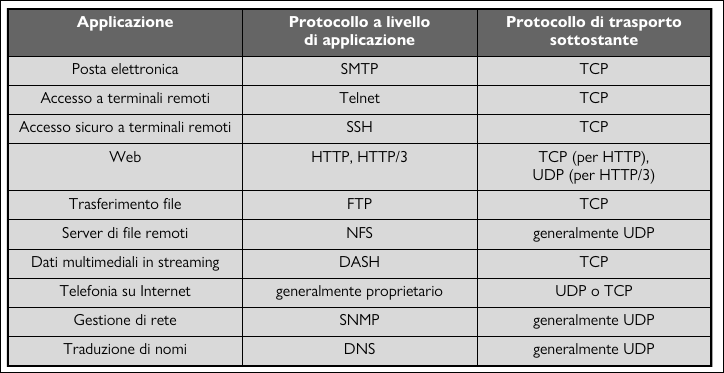
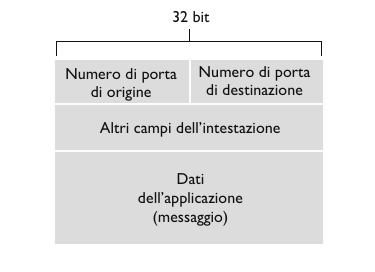

# Livello di Trasporto

## Introduzione

Un protocollo a livello di trasporto mette a disposizione una **comunicazione logica** tra processi applicativi di host diversi.
Per comunicazione logica si intente, dal punto di vista dell'applicazione, che tutto proceda come se gli host che eseguono i processi fossero direttamente connessi, anche se geograficamente si trovano in posti totalmente diversi.

Come i protocolli a livello di applicazione, anche i protocolli a livello di trasporto sono implementanti nei sistemi periferici.
- Lato mittente: il livello di trasporto converte i messaggi che riceve dal livello applicazione in pacchetti a livello di trasporto, noti come **segmenti**. Questo avviene spezzando (se necessario) i messaggi in parti più piccole aggiungendo a ciascuna un intestazione di trasporto per creare il segmento. Il livello di trasporto passa poi il segmento al livello di rete, dove viene incapsulato in un datagramma e inviato al destinatario. 
- Lato ricevente: elabora i segmenti ricevuti dal livello di rete, crea il messaggio assemblando i segmenti e li passa al livello applicazione.

Internet possiede due protocolli di trasporto:
- UDP (User Datagram Protocol), inaffidabile.
- TCP (Transmission Control Protocol), comunicazione tra processi affidabile, con vari controlli.

Quindi:
- Livello di trasporto: comunicazione logica tra **processi**
- Livello di rete: comunicazione logica tra **host**

## Multiplexing e Demultiplexing

Un processo, gestisce più di una **socket**, attraverso i quali i dati fluiscono dalla rete al processo e viceversa. Di conseguenza, il livello di trasporto non trasferisce i dati direttamente al processo, bensì ad un socket che fa da intermediario. Inoltre, ogni socket avrà un identificatore univoco il cui formato dipende dal fatto che si tratti di socket UDP o TCP.

- Lato ricevente, il livello di trasporto esamina i campi del segmento per identificare la socket di ricezione e quindi vi dirige il segmento. Il compito di trasportare i dati dei segmenti a livello di trasporto verso la socket giusta viene detto **demultiplexing**.
- Lato mittente, il livello di trasporto raduna i frammenti di dati da diverse socket sull'host di origine e incapsulare ognuno con intestazione a livello di trasporto per creare dei segmenti e passarli al livello di rete. Quest'operazione viene detta **multiplexing**.

Il multiplexing a livello di trasporto richiede:
1. Le socket abbiano identificatori unici
2. Ciascun segmento presenti campi che indichino la socket cui va consegnato il segmento.

Questi sono il **campo del numero di porta di origine** e il **campo del numero di porta di destinazione**. I numeri di porta sono di 16 bit e vanno da 0 a 65535, quelli che vanno da 0 a 1023 sono chiamati **numeri di porta noti** e sono riservati per essere usati da protocolli applicativi noti come HTTP, FTP, DNS etc... .Quindi ogni socket nell'host deve avere un numero di porta e, quando un segmento arriva all'host, il livello di trasporto esamina il numero della porta di destinazione e dirige il segmento verso la socket corrispondente. I dati del segmento passano quindi dalla socket al processo assegnato.

**Multiplexing e Demultiplexing non orientati alla connessione**

In Python, `client_socket = socket(AF_INET, SOCK_DGRAM)` permette di creare una socket UDP. Quando una socket viene creata in questo modo, il sistema operativo assegna in modo automatico un numero di porta compreso tra 1024 e 65535 che non sia ancora utilizzato. In alternativa, `client_socket.bind(('', 19157))` crea una socket associata ad una particolare porta.

Una volta create le socket, quando si deve creare il datagramma si deve specificare l'indirizzo IP di destinazione e il numero di porta di destinazione, il segmento viene poi passato al livello di rete che effettua un tentativo best-effort di consegna del segmento all'host di destinazione. Se il segmento arriva all'host di destinazione, il suo livello di trasporto esamina il numero di porta di destinazione nel segmento, e invia il segmento UDP alla socket con quel numero di porta.

E' importante notare che una socket UDP viene identificata completamente da una coppia che consiste di un indirizzo IP e di un numero di porta di destinazione. Due segmenti UDP con lo stesso indirizzo IP e numero di porta di destinazione saranno indirizzati allo stesso processo sul computer di destinazione, anche se gli indirizzi IP e i numeri di porta di origine sono diversi. 
Esempio:
- Il computer A invia un segmento UDP al computer C con l'indirizzo IP 192.168.1.100 e la porta 5000.
- Il computer B invia un segmento UDP al computer C con l'indirizzo IP 192.168.1.100 e la porta 5000.
Entrambi i segmenti UDP saranno indirizzati allo stesso processo sul computer C, perché hanno lo stesso indirizzo IP e numero di porta di destinazione 192.168.1.100:5000.

**Multiplexing e Demultiplexing orientati alla connessione**

La differenza tra una socket TCP e una socket UDP è che una socket TCP è identificata da 4 parametri: **indirizzo IP di origine**, **numero di porta di origine**, **indirizzo IP di destinazione**, **numero di porta di destinazione**.

- L'applicazione server TCP presenta una "socket di benvenuto" che si pone in attesa di richieste di connessione da parte dei client TCP sula porta 12000.
- Il client TCP crea una socket e genera un segmento per stabilire la connessione tramite le seguenti linee di codice: 
```python
client_socket = socket(AF_INET, SOCK_STREAM)
client_socket.connect(server_name, 12000)
```
- Una richiesta di connessione non è nient'altro che un segmento TCP con un numero di porta di destinazione 12000 e uno speciale bit di richiesta di connessione post a 1 nell'intestazione. Il segmento include anche un numero di porta di origine, scelto dal client.
- Il sistema operativo dell'host che esegue il processo server, quando riceve il segmento con la richiesta di connessione con porta di destinazione 12000, localizza il processo server in attesa di accettare connessioni sulla porta 12000. Il processo server crea quindi una nuova connessione `connection_socket, addr = server_socket.accept()` 
- Inoltre il livello di trasporto sul server prende nota dei seguenti valori nel segmento con la richiesta di connessione:
    1.  Numero di porta di origine nel segmento
    2.  Indirizzo IP dell'host di origine
    3.  Numero di porta di destinazione nel segmento
    4.  Il proprio indirizzo IP 

Tutti i segmenti successivi la cui porta di origine, indirizzo IP di origine, porta di destinazione e indirizzo IP di destinazione coincidono con tali valori verranno diretti verso questa socket.

## Trasporto non orientato alla connessione: UDP

UPD fa il minimo che un protocollo di trasporto debba fare. A parte la funzione di multiplexing/demultiplexing e una forma di controllo semplice, non aggiunge nulla a IP. UDP prende i messaggi dal processo applicativo, aggiunge il numero di porta di origine e di destinazione per il multiplexing/demultiplexing, aggiunge altri due piccoli campi e passa il segmento al livello di rete.
In UDP non esiste handshaking tra le entità di invio e di ricezione a livello di trasporto. Per questo motivo, si dice che UDP è **non orientato alla connessione**.

**Perche esiste UDP?**

- Controllo più preciso a livello di applicazione su quali dato sono inviati e quando, dimunendo il ritardo di trasmissione, dato che non deve effettuare controlli.
- Nessuna connessione stabilita, che potrebbe aggiungere ritardo.
- Nessun stato di connessione.
- Minor spazio usato per l'intestazione del pacchetto, UDP aggiunge 8 byte mentre TCP ne aggiunge 20.



- Lato mittente: Gli viene passato un messaggio applicativo, determina i valori dei campi di intestazione del segmento UDP, poi crea il segmento e lo invia al livello di rete.
- Lato ricevente: Riceve il segmento dal livello di rete, controlla il valore del campo di intestazione UDP checksum, estrare il messaggio applicativo e lo consegna alla socket appropriata.



**Checksum UDP**

Il checksum UDP server per il rilevamento degli errori. In altre parole, viene utilizzato per determinare se i bit del segmento UDP sono stati alterati durante il loro trasferimento da sorgente a destinazione. Il mittente UDP effettua il complemento a 1 della somma di tutte le parole da 16 bit nel segmento, e l'eventuale riporto viene sommato al primo bit. Tale risulato viene posto nel campo *Checksum* del segmento UDP.
Ipotizziamo di avere 3 parole a 16 bit:
- Questa è la somma delle prime 2
$$0110 0110 0110 0000 + 
  0101 0101 0101 0101 =
  1011 1011 1011 0101$$
- Adesso sommiamo il risulato della somma, con la terza parola
$$1011 1011 1011 0101 +
  1000 1111 0000 1100 =
  0100 1010 1100 0010$$
- Effettuando il complemento a 1, che consiste in invertire i bit, otteniamo: $1011 0101 0011 1101$. In ricezione si sommano le tre parole inziali e il checksum. Se non ci sono errori nel pacchetto, l'adizione farà $1111 1111 1111 1111$, altrimenti se un bit vale 0 sappiamo che è stato introdotto almeno un errore nel pacchetto.


