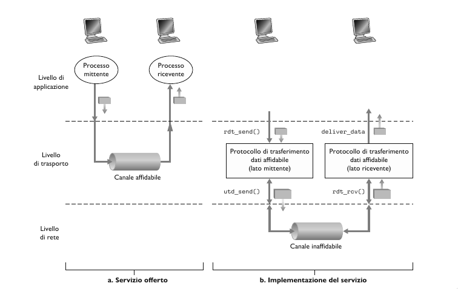
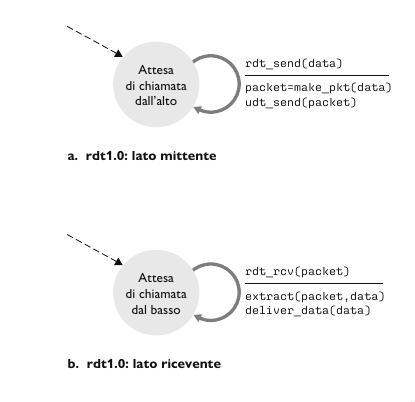
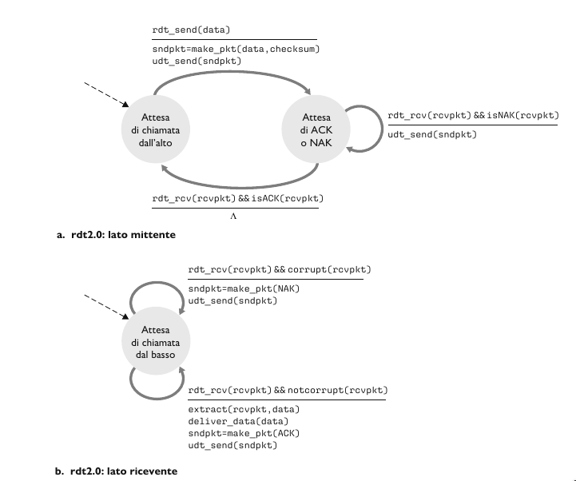
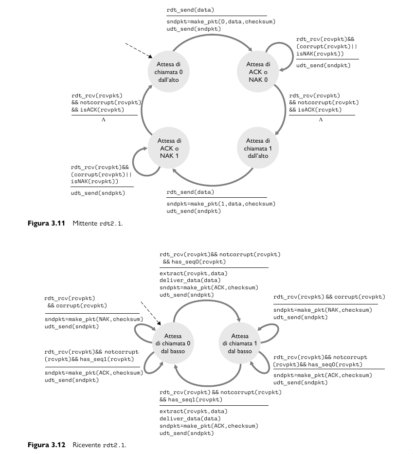

## Principi del trasferimento dati affidabile

L'astrazione del servizio offerta alle entità dei livelli superiori è quella di un canale affidabile tramite il quale si possono trasferire dati. Con un canale affidabile a disposizione nessun bit dei dati trasferiti è corrotto o va perduto e tutti i bit sono consegnati nell'ordine di invio.
Il compito di un **protocollo di trasferimento affidabile** è l'implementazione di questa astrazione di servizio.

Per esempio TCP è un protocollo di trasferimento dati affidabile implementato appogiandosi a un livello di rete (IP) che non è affidabile end-to-end.

Assumiamo che i pacchetti vengano consegnati nell'ordine con cui sono stati inviati, ma che alcuni possono andare persi. L'interfacce che useremo per descrivere il protocollo affidabile sono:
- `rdt_send()`: trasferirà i dati da consegnare al livello superiore sul lato ricevente. `rdt` sta per *reliable data transfer*.
- `rdt_rcv()`: chiatama usata per ricevere i dati dal lato del ricevente.
- `rdt_deliver()`: invia i dati al livello superiore.
- `udt_send()`: invio di pacchetti di controllo. `udt` sta per *unreliable data transfer*.

Inoltre, consideriamo solo il caso di **trasferimento dati unidirezionale**. Quindi passiamo adesso a definire man mano il nostro protocollo `rdt`, mediante una macchina a stati finiti. Lo stato successivo è determinato unicamente dall'evento successivo.

#### rdt 1.0, canale affidabile

Consideriamo il caso più semplice, in cui il canale sottostante è completamente affidabile.

- Mittente: accetta i dati dal livello superiore `rdt_send(data)`, crea il pacchetto `make_pkt(data)` e lo invia sul canale `udt_send(data)`.
- Ricevente: riceve i dati dal canale sottostante `rdt_rcv(packet)`, rimuove i dati dal pacchetto `extract(packet, data)` e li passa al livello superiore `deliver_data(data)`.

#### rdt 2.0, canale con errori su bit

Un modello più realistico del canale sottostante è quello in cui i bit in un pacchetto possono essere corrotti.
Dopo ogni invio di un pacchetto, il mittente si mette in attesa di un feedback da parte del ricevente, che può essere:
- **Positiva, acknowledgements (ACKs)**: il ricevente comunica espressamente al mittente che il pacchetto ricevuto è corretto.
- **Negativa, negative acknowledgements (NAKs)**: il ricevente comunica espressamente al mittente che il pacchetto contiene errori. In questo caso il mittente *ritrasmette* il pacchetto.

- Mittente: Nello stato di sinistra, attende e raccoglie i dati dal livello superiore `rdt_send(data)`, crea il pachetto contenente i dati da inviare e il checksum e infine spedisce il pacchetto `rdt_send(sndpkt)`. Nello stato di destra, è in attesa di un pacchetto ACK o NAK dal destinatario. Se riceve un  ACK `rdt_rcv(rcvpkt) && isACK(rcvpkt)`, il mittente sa che il pacchetto trasmesso più di recente è stato ricevuto correttamente e torna nello stato di attesa dei dati proveniente dal livello superiore. Se riceve un NAK, il protocollo ritrasmette l'ultimo pacchetto e attende una risposta alla ritrasmissione.
Da notare che quando è in attesa di ACK o NAK, non può riceve altri dati dal livello superiore, perciò non puo inviare nuovi dati finchè non è certo che il destinatario abbia ricevuto correttamente il pacchetto corrente. Questo tipo di protocolli sono noti come **protocolli stop-and-wait**.  
- Ricevente: All'arrivo del pacchetto, il destinatario risponde o con un ACK `rdt(rcvpkt) && notcorrupt(rcvpkt)` o con NAK `rdt(rcvpkt) && corrpt(rcvpkt)`, a seconda che il pacchetto sia corrotto o meno. 

Anche se sembra funzionare questo protocollo, nella realtà presenta un grave difetto; infatti non abbiamo tenuto conto della possibilità che i pacchetti ACK e NAK possano a loro volta essere dannegiati. Infatti se un ACK o un NAK è corrotto, il mittente non ha modo di sapere se il destinatario abbia ricevuto correttamente l'ultimo blocco di dati trasmesso.

#### rdt 2.1, gestione di ACK o NAK alterati

Un approccio a questo problema prevede semplicemente che il mittente rinvii il pacchetto di dati corrente a seguito della ricezione di un pacchetto ACK o NAK alterato. Questo approccio introduce **pacchetti duplicati** nel canale. La fondamentale difficoltà insita nella duplicazione di pacchetti che il destinatario non sa se l'ultimo ACK o NAK inviato sia stato ricevuto correttamente dal mittente. Una soluzione a questo nuovo problema consiste nell'aggiungere un campo al pacchetto dati, obbligando il mittente a numerare i propri pacchetti dati con un **numero di sequenza**. Al destinatario sarà sufficiente controllare questo numero per sapere se il pacchetto ricevuto rappresenti un ritrasmissione o meno. 
Per questo semplice protocollo, un numero di sequenza da 1 bit sarà sufficiente, dato che consentirà al destinatario di sapere se il mittente stia ritrasmettendo un pacchetto o inviandone un già trasmesso. Nel primo caso il numero di sequenza del pacchetto ha lo stesso numero di sequenza del pacchetto appena ricevuto, nel secondo caso il numero di sequenza sarà diverso. Dato che stiamo ipotizzando che il canale non perda pacchetti, i pacchetti ACK e NAK non devono indicare il numero di sequenza del pacchetto di cui rappresentano la notifica. Il mittente sa che un pacchetto ricevuto di tipo ACK o NAK (alterato o meno) è stato generato come risposta al pacchetto dati trasmesso più di recente.

