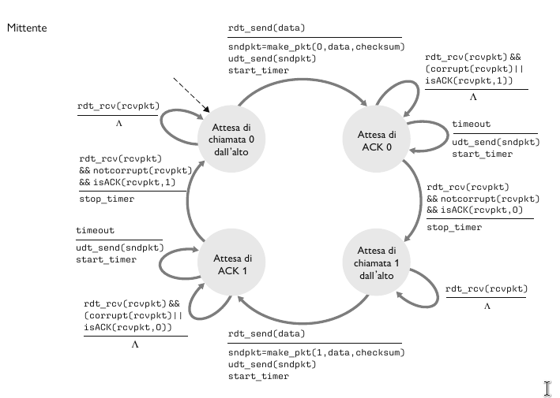
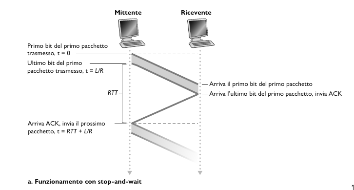
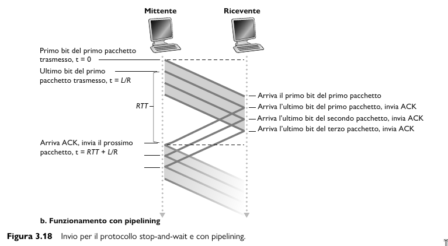
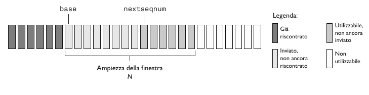
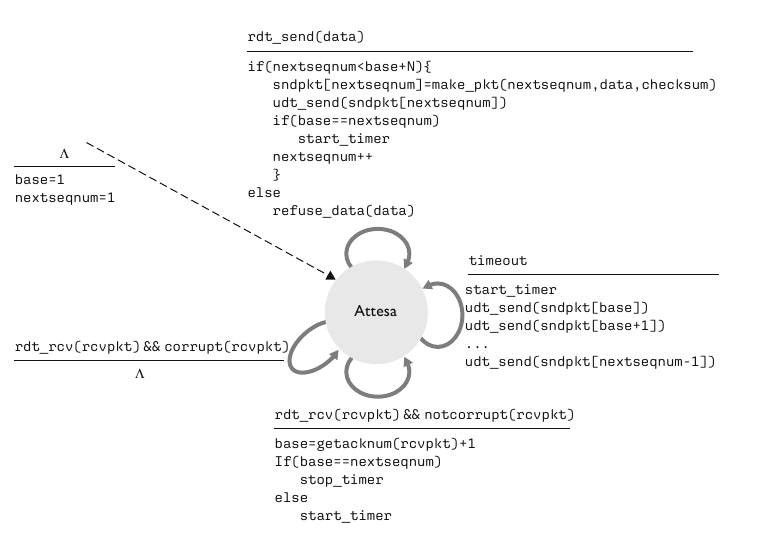
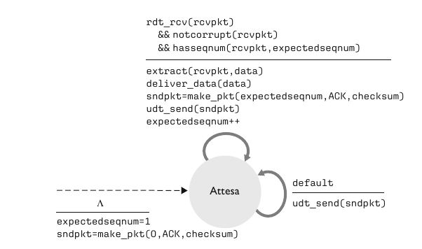
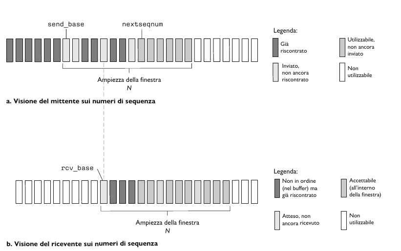

## Principi del trasferimento dati affidabile

L'astrazione del servizio offerta alle entità dei livelli superiori è quella di un canale affidabile tramite il quale si possono trasferire dati. Con un canale affidabile a disposizione nessun bit dei dati trasferiti è corrotto o va perduto e tutti i bit sono consegnati nell'ordine di invio.
Il compito di un **protocollo di trasferimento affidabile** è l'implementazione di questa astrazione di servizio.

Per esempio TCP è un protocollo di trasferimento dati affidabile implementato appogiandosi a un livello di rete (IP) che non è affidabile end-to-end.

Assumiamo che i pacchetti vengano consegnati nell'ordine con cui sono stati inviati, ma che alcuni possono andare persi. L'interfacce che useremo per descrivere il protocollo affidabile sono:
- `rdt_send()`: trasferirà i dati da consegnare al livello superiore sul lato ricevente. `rdt` sta per *reliable data transfer*.
- `rdt_rcv()`: chiatama usata per ricevere i dati dal lato del ricevente.
- `rdt_deliver()`: invia i dati al livello superiore.
- `udt_send()`: invio di pacchetti di controllo. `udt` sta per *unreliable data transfer*.

Inoltre, consideriamo solo il caso di **trasferimento dati unidirezionale**. Quindi passiamo adesso a definire man mano il nostro protocollo `rdt`, mediante una macchina a stati finiti. Lo stato successivo è determinato unicamente dall'evento successivo.

### rdt 1.0, canale affidabile

Consideriamo il caso più semplice, in cui il canale sottostante è completamente affidabile.

- Mittente: accetta i dati dal livello superiore `rdt_send(data)`, crea il pacchetto `make_pkt(data)` e lo invia sul canale `udt_send(data)`.
- Ricevente: riceve i dati dal canale sottostante `rdt_rcv(packet)`, rimuove i dati dal pacchetto `extract(packet, data)` e li passa al livello superiore `deliver_data(data)`.

### rdt 2.0, canale con errori su bit

Un modello più realistico del canale sottostante è quello in cui i bit in un pacchetto possono essere corrotti.
Dopo ogni invio di un pacchetto, il mittente si mette in attesa di un feedback da parte del ricevente, che può essere:
- **Positiva, acknowledgements (ACKs)**: il ricevente comunica espressamente al mittente che il pacchetto ricevuto è corretto.
- **Negativa, negative acknowledgements (NAKs)**: il ricevente comunica espressamente al mittente che il pacchetto contiene errori. In questo caso il mittente *ritrasmette* il pacchetto.

- Mittente: Nello stato di sinistra, attende e raccoglie i dati dal livello superiore `rdt_send(data)`, crea il pachetto contenente i dati da inviare e il checksum e infine spedisce il pacchetto `rdt_send(sndpkt)`. Nello stato di destra, è in attesa di un pacchetto ACK o NAK dal destinatario. Se riceve un  ACK `rdt_rcv(rcvpkt) && isACK(rcvpkt)`, il mittente sa che il pacchetto trasmesso più di recente è stato ricevuto correttamente e torna nello stato di attesa dei dati proveniente dal livello superiore. Se riceve un NAK, il protocollo ritrasmette l'ultimo pacchetto e attende una risposta alla ritrasmissione.
Da notare che quando è in attesa di ACK o NAK, non può riceve altri dati dal livello superiore, perciò non puo inviare nuovi dati finchè non è certo che il destinatario abbia ricevuto correttamente il pacchetto corrente. Questo tipo di protocolli sono noti come **protocolli stop-and-wait**.  
- Ricevente: All'arrivo del pacchetto, il destinatario risponde o con un ACK `rdt(rcvpkt) && notcorrupt(rcvpkt)` o con NAK `rdt(rcvpkt) && corrpt(rcvpkt)`, a seconda che il pacchetto sia corrotto o meno. 

Anche se sembra funzionare questo protocollo, nella realtà presenta un grave difetto; infatti non abbiamo tenuto conto della possibilità che i pacchetti ACK e NAK possano a loro volta essere dannegiati. Infatti se un ACK o un NAK è corrotto, il mittente non ha modo di sapere se il destinatario abbia ricevuto correttamente l'ultimo blocco di dati trasmesso.

### rdt 2.1, gestione di ACK o NAK alterati

Un approccio a questo problema prevede semplicemente che il mittente rinvii il pacchetto di dati corrente a seguito della ricezione di un pacchetto ACK o NAK alterato. Questo approccio introduce **pacchetti duplicati** nel canale. La fondamentale difficoltà insita nella duplicazione di pacchetti che il destinatario non sa se l'ultimo ACK o NAK inviato sia stato ricevuto correttamente dal mittente. Una soluzione a questo nuovo problema consiste nell'aggiungere un campo al pacchetto dati, obbligando il mittente a numerare i propri pacchetti dati con un **numero di sequenza**. Al destinatario sarà sufficiente controllare questo numero per sapere se il pacchetto ricevuto rappresenti un ritrasmissione o meno. 
Per questo semplice protocollo, un numero di sequenza da 1 bit sarà sufficiente, dato che consentirà al destinatario di sapere se il mittente stia ritrasmettendo un pacchetto o inviandone un già trasmesso. Nel primo caso il numero di sequenza del pacchetto ha lo stesso numero di sequenza del pacchetto appena ricevuto, nel secondo caso il numero di sequenza sarà diverso. Dato che stiamo ipotizzando che il canale non perda pacchetti, i pacchetti ACK e NAK non devono indicare il numero di sequenza del pacchetto di cui rappresentano la notifica. Il mittente sa che un pacchetto ricevuto di tipo ACK o NAK (alterato o meno) è stato generato come risposta al pacchetto dati trasmesso più di recente.

Adesso, gli automi del mittente e del destinatario hanno il doppo degli stati, questo perche il protocollo deve riflettere il fatto che il pacchetto attualmente in invio o in ricezione abbia numero di sequenza 0 o 1.

### rdt2.2, un protocollo senza NAK

- Ha la stessa funzionalità di rdt2.1, utilizzando soltanto gli ACK. Al posto di NAK, il destinatario invia un ACK per l'ultimo pacchetto ricevuto correttamente. Il destinatario deve includere esplicitamente il numero di sequenza del pacchetto con l'ACK.
- Un ACK duplicato presso il mittente determina la stessa azione del NAK, ovvero sa che il destinatario non ha ricevuto correttamente il pacchetto, e dovrà ritrasmettere il pacchetto corrente.

### rdt3.0, canali con errori e perdite

Supponiamo ora che il canale di trasmissione, oltre a dannegiare i bit, possa anche *smarrire* i pacchetti, un evento non raro sulle odierne reti di calcolatori. Supponiamo che il mittente spedisca una pacchetto dati e che questo o l'ACK corrispondente del ricevente venga smarrito. In entrambi i casi, il mittente non otterrà alcuna risposta dal destinatario. Se il mittente è disposto ad attendere un tempo per essere certo dello smarrimento del pacchetto, può semplicemente ritrasmettere il pacchetto.

Adesso si pone il problema di scegliere adeguatamente il tempo di attesa, quindi l'approccio adottato nella pratica è scegliere in modo assennato un valore di tempo tale per cui la perdita di pacchetti risulti probabile, anche se non garantita. Se non riceve un ACK in questo lasso di tempo, il pacchetto viene ritrasmesso.
Ci può essere il caso in cui un pacchetto sperimenta um ritardo particolarmente lungo, anche se nè il pacchetto dati nè il pacchetto ACK sono smarriti, in questo caso c'è la possibilità di **pacchetti di dati duplicati**, ma questo problema è già stato risolto in rdt2.0.

Il mittente non sa se un pacchetto dati sia andato perduto, se sia stato smarrito un ACK o se il pacchetto o l’ACK abbiano semplicemente subìto un notevole ritardo.
In tutti questi casi, l’azione intrapresa è la stessa: ritrasmettere. Implementare un meccanismo di ritrasmissione basato sul tempo richiede un contatore 
(count-down timer) in grado di segnalare al mittente l’avvenuta scadenza di un dato lasso di tempo.

Dato che i numeri di sequenza dei pacchetti si alternano tra 0 e 1, il protocollo rdt3.0 viene talvolta detto **protocollo ad alternanza di bit**.

### Protocolli per il trasferimento dati affidabile con pipeline

Il protocollo rdt3.0 è corretto dal punto di vista funzionale, ma è molto lento rispetto alle reti odierne. Il problema delle prestazioni risiede nel fatto che si tratta di un protocollo stop-and-wait.

**Funzionamento rdt3.0 con protocollo stop-and-wait**

Per analizzare la velocita di trasferimento di un protocollo stop-and-wait consideriamo questo caso: due host, ciascuno su una costa degli Stati Uniti. Il ritardo di propagazione (RTT) alla velocità della luce è approssimativamente 30 ms. Supponiamo un collegamento a 1 Gbps con pacchetti di dimensione $L$ di 100 byte.

$$
d_{t} = \frac{L}{R} = \frac{8000}{10^9} \frac{bit}{bit / s} = 8\mu s
$$

Se definiamo l'**utilizzo** del mittente come la frazione di tempo in cui il mittente è stato effettivamente occupato nell'invio di bit sul canale, il protocollo stop-and-wait presenta un triste utilizzo del mittente $U_{mittente}$ pari a:

$$
U_{mittente} = \frac{L / R}{RTT + L / R} = \frac{0.008}{30.008} = 0.0027
$$

Di conseguenza, il throughput è al massimo 267 kbps!

**Funzionamento rdt3.0 con pipeline**

La soluzione a questo problema è semplice. Anziché operare in modalità stop-and-wait, si consente al mittente di inviare più pacchetti senza attendere gli acknowledgement. Questa tecnica è nota come **pipelining**. Di conseguenza il protocollo di trasferimento affidabile cambia un po:
- L'intervallo di numeri di sequenza disponibili deve essere incrementato dato che ogni pacchetto in transito deve presentare un numero di sequenza univoco e che ci potrebbero essere più pacchetti in transito ancora in attesa di acknowledgment.
- Ci dovrà essere un buffer sia nel mittente che nel destinatario. Il mittente dovrà memorizzare i pacchetti trasmessi, ma il cui acknowledgment non è ancora ricevuto.
- Due soluzioni ai errori con pipeline: **Go-Back-N** e **ripetizione selettiva**.

### Go-Back-N (GBN)

In un protocollo **Go-Back-N** il mittente può trasmettere più pacchetti senza dover attendere alcun acknowledgment, ma non può avere più di un dato numero massimo consentito N di pacchetti in attesa di acknowledgment nella pipeline. 

- L'intervallo `[0, base - 1]` corrisponde ai pacchetti già trasmessi e che hanno ricevuto acknowledgment.
- L'intervollo `[base, nextseqnum - 1]` corrisponde ai pacchetti inviati, ma che non hanno ancora ricevuto alcun acknowledgment.
- L'intervallo `[nextseqnum, base + N - 1]` può essere utilizzato per i pacchetti da inviare immediatamente, nel caso arrivassero dati dal livello superiore.
- Infine, i numeri di sequenza maggiore o uguali a $base + N$ non posson essere utilizzati finché il mittente non riceva un acknowledgment relativo a un pacchetto che si trova nella pipeline ed è ancora privo di acknowledgement.

L'intervallo di numeri di sequenza ammisibili per i pacchetti trasmessi, ma che non hanno ancora ricevuto alcun acknowledgment, può essere visto come una finestra di dimensione $N$ sull'intervallo di numeri di sequenza. Quando il protocollo è in funzione, questa finestra trasla lungo lo spazio dei numeri di sequenza. Per questo motivo, $N$ viene spesso chiamato **ampiezza della finestra** e il protocollo GBN viene detto **protocollo a finestra scorrevole**.

**Il mittente GBN deve rispondere a tre tipi di evento.**

1. *Invocazione dall'alto*. Quando viene chaiamata `rdt_send()`, come prima cosa il mittente controlla se la finestra sia piena, ossia se vi siano $N$ pacchetti in sospeso senza acknowledgment. Se la finistra non è piena, crea e invia un pacchetto e le variabili vengono aggiornate di conseguenza. Se la finistra è piena, il mittente restituisce i dati al livello. A livello implementativo, i dati vengono memoriazzati in un buffer oppure viene utilizzato un meccanismo di sincronizzazione che consenta al livello superiore di invocare `rdt_send()` solo quando la finestra non è piena.
2. *Ricezione di un ACK*. Nel protocollo GBN, l'acknowledgment del pacchetto con il numero di sequenza $n$ verrà considerato un **acknowledgment cumulativo**, che indica che tutti i pacchetti con un numero di sequenza $\leq n$ sono stati correttamente ricevuti.
3. *Evento di Timeout*. Come nei protocolli stop-and-wait, si usa ancora un contatore per risolvere il problema di pacchetti dati o acknowledgment persi. Quando si verifica un timeout, il mittente invia nuovamente **tutti** i pacchetti spediti che ancora non hanno ricevuto un acknowledgment.  

**Anche le azioni del destinatario GBN sono semplici**

Se un pacchetto con numero di sequenza $n$ viene ricevuto correttamente ed è in ordine (ossia, gli ultimi dati consegnati al livello superiore provengono da un pacchetto con numero di sequenza $n - 1$), il destinatario manda un ACK per quel pacchetto e consegna i suoi dati al livello superiore. In tutti gli altri casi, il destinatario scarta i pacchetti e rimanda un ACK per il pacchetto in ordine ricevuto più di recente.

### Ripetizione selettiva

I **protocolli a ripetizione selettiva** evitano le ritrasmissioni non necessarie facendo ritrasmettere al mittente solo quei pacchetti sui cui esistono sospetti di errore (ossia, smarrimento o alterazione). 

**Mittente**

1. *Dati ricevuti dall'alto*. Quando si ricevono dati dall'alto, il mittente SR controlla il successivo numero di sequenza disponibile per il pacchetto. Se è all'interno della finestra del mittente, i dati vengono impacchettati e inviati. Altrimenti sono salvati nei buffer o restituiti al livello superiore per una successiva ritrasmissione, come in GBN.
2. *Timeout*. Vengono usati ancora i contatori per cautelarsi contro la perdita di pacchetti. Ora però ogni pacchetto deve avere un proprio timer logico, dato che al timeout sarà ritrasmesso un solo pacchetto.
3. *ACK ricevuto*. Se riceve un ACK, il ricevente etichetta tale pacchetto come ricevuto, ammesso che sia nella finestra. Se $n$ è il numero di sequenza di più piccolo, la base della finestra avanza al successivo numero di sequenza del pacchetto non riscontrato.

**Ricevente**

1. *Il pacchetto con numero di sequenza nell'intervallo `[rcv_base, rcv_base + N + 1]` viene ricevuto correttamente*. Il pacchetto ricevuto ricade all'interno della finestra del ricevente e al mittente viene restituito un pacchetto ACK. Se il pacchetto non era già stato ricevuto viene inserito nel buffer. Se presenta un numero di sequenza uguale alla base della finestra di ricezione, allora questo pacchetto e tutti i pacchetti nel buffer aventi numeri consevutivi vengono consegnati al livello superiore.
2. *Viene ricevuto il pacchetto con numero di sequenza nell' intervallo `[rcv_base - N, rcv_base - 1]`*. In questo caso si deve generare un ACK, anche se si tratta di un pacchetto che il ricevente ha già riscontrato.
3. *Altrimenti*, si ignora il pacchetto.   