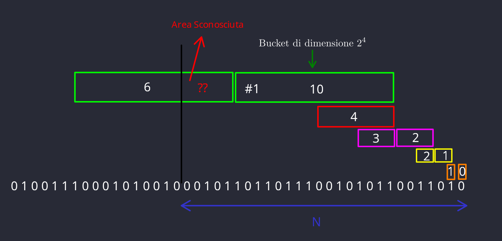
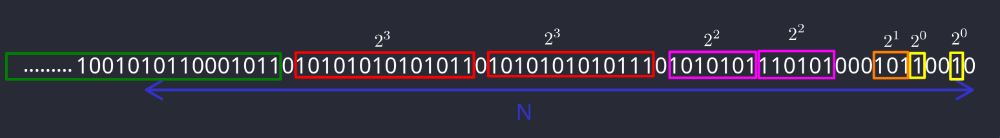

- [Mining Data Stream](#mining-data-stream)
  - [1. Pattern Matching](#1-pattern-matching)
    - [Cos'è uno sketch?](#cosè-uno-sketch)
    - [Funzione Hash di Rabin](#funzione-hash-di-rabin)
    - [Algoritmo di Karp-Rabin](#algoritmo-di-karp-rabin)
  - [2. Sampling in un datastream](#2-sampling-in-un-datastream)
    - [Sampling di una proporzione fissata](#sampling-di-una-proporzione-fissata)
      - [Algoritmo wrong](#algoritmo-wrong)
      - [Algoritmo corretto](#algoritmo-corretto)
    - [Sample di dimensione fissa](#sample-di-dimensione-fissa)
  - [3. Sliding Window - Contare Bit](#3-sliding-window---contare-bit)
    - [Problema](#problema)
    - [Soluzione Approssimata](#soluzione-approssimata)
    - [L'algoritmo di Datar-Gionis-Indyk-Motwani](#lalgoritmo-di-datar-gionis-indyk-motwani)
      - [Primo approccio (intuizione)](#primo-approccio-intuizione)
      - [Secondo approccio (giusto)](#secondo-approccio-giusto)
      - [Come mantenere le condizioni del DGIM](#come-mantenere-le-condizioni-del-dgim)
      - [Output dell'algoritmo](#output-dellalgoritmo)
      - [Contare gli interi](#contare-gli-interi)
  - [4. Filtering a data stream](#4-filtering-a-data-stream)
    - [First-Cut Algorithm](#first-cut-algorithm)
      - [Proprietà dell'algoritmo](#proprietà-dellalgoritmo)
      - [Analisi](#analisi)
    - [Bloom Filter](#bloom-filter)
      - [Analisi](#analisi-1)
  - [5. Contare elementi distinti](#5-contare-elementi-distinti)
    - [Approccio "Magico" di Flajolet-Martin](#approccio-magico-di-flajolet-martin)
      - [Anasili dell'algoritmo](#anasili-dellalgoritmo)
  - [6. Calcolare momenti](#6-calcolare-momenti)
    - [Metodo AMS (Alon, Matias, Szegedy)](#metodo-ams-alon-matias-szegedy)
      - [Analisi](#analisi-2)
    - [Momenti di ordine maggiore](#momenti-di-ordine-maggiore)
      - [Problema dei flussi illimitati](#problema-dei-flussi-illimitati)
      - [Soluzione: Campionamento a dimensione fissa (Fixed-Size Sampling)](#soluzione-campionamento-a-dimensione-fissa-fixed-size-sampling)

# Mining Data Stream

In molti contesti di analisi dei dati, si assume di lavorare con un database statico, in cui tutte le informazioni sono disponibili e accessibili in qualsiasi momento. Tuttavia, il mining di data streams introduce un paradigma diverso: i dati arrivano in flusso (stream) continuo e, se non vengono elaborati immediatamente o archiviati, vanno persi per sempre. Inoltre, il volume di dati può essere talmente elevato da rendere impossibile memorizzarli interamente in un database tradizionale.

Le tecniche per il mining di data streams si concentrano sulla sintetizzazione del flusso per ricavare informazioni utili utilizzando risorse limitate. Gli approcci principali includono:

1. **Campionamento e filtraggio (sampling):** estrarre campioni significativi dal flusso e rimuovere elementi indesiderati.
2. **Stima delle cardinalità:** calcolare approssimativamente il numero di elementi distinti nel flusso, utilizzando una quantità di memoria molto inferiore rispetto a quella necessaria per archiviare tutti i dati.
3. **Finestra scorrevole (sliding windows):** analizzare solo gli ultimi $n$ elementi del flusso (la cosiddetta finestra), come se fossero una relazione in un database. Anche in questo caso, se il numero di flussi o la dimensione della finestra sono troppo grandi, è necessario riassumere i dati della finestra stessa.

In molti scenari di **Data Mining**, non è possibile conoscere in anticipo l'intero insieme di dati. La gestione dei data streams diventa quindi cruciale, specialmente quando il tasso di ingresso dei dati è determinato da fonti esterne, come:

- Query dei motori di ricerca.
- Aggiornamenti di stato su piattaforme come Twitter o Facebook.

Questi flussi di dati possono essere considerati **infiniti** e **non stazionari**, poiché la loro distribuzione cambia nel tempo. Gli elementi (o tuple) arrivano rapidamente attraverso uno o più flussi di ingresso, rendendo impossibile memorizzare l'intero flusso in modo accessibile.
Di conseguenza, il sistema può mantenere solo sintesi ridotte (short **sketches**) del flusso, che devono essere costantemente aggiornate.

Descriviamo quindi, un elemento dello steam come una tupla:

$$X = \langle x_1, x_2, x_3, \dots, x_k \rangle$$

Di queste tuple, nella maggior parte dei casi consideriamo solo alcuni campi, detti **campi chiave**, come per esempio di un pacchetto IP, consideriamo per esempio gli indirizzi del mittente e di destinazione.

La sfida principale diventa quindi: **Come effettuare calcoli critici sui dati di un flusso utilizzando una quantità limitata di memoria secondaria?**

{width="400" style="display: block; margin: 0 auto"}

I flussi di dati possono essere archiviati in un archivio di grandi dimensioni per conservarli nel lungo termine. Tuttavia, non è possibile utilizzare tale archivio per rispondere a query in tempo reale, poiché il recupero dei dati richiederebbe processi lenti e specifici.

Per l'elaborazione operativa delle query, si utilizza invece una memoria di lavoro (cache), che può contenere sintesi o porzioni di dati del flusso, ovvero i nostri sketch e sample.

## 1. Pattern Matching

Un primo problema fondamentale di statistica sui flussi di dati è il **pattern matching**. Supponiamo che gli elementi del flusso $x_i$​ appartengano a un alfabeto $\Sigma$, rendendo il flusso una stringa di lunghezza $m$ su $\Sigma$.

Dati un pattern $y=y_1y_2 \dots y_n \in \Sigma^n$ e un flusso $x$, l'obiettivo è determinare quante volte $y$ compare come sottostringa all'interno del flusso $x$, ovvero trovare tutte le occorrenze in cui:
$$y = y_1y_2 \dots y_n = x_ix_{i+1} \dots x_{i + n - 1}$$

### Cos'è uno sketch?

Una soluzione banale a questo problema, è di confrontare uno ad uno ciascun elemento $x_ix_{i+1} \dots x_{i + n - 1}$ con $y_1y_2 \dots y_n$. Osserviamo però che questo richiede tempo $O(n)$, che in questo caso non va bene.

Bisogna dunque definire uno sketch per risolvere in modo efficiente il problema del pattern matching.

!!! info
    **Definizione:** Sia $x \in \Sigma^*$, allora un sketch di dati è una funzione random $f: x \in \Sigma^* \Rightarrow \{0,1\}^k$ aventi le seguenti proprietà:
    1. $k << \left|x\right|$, ovvero lo sketch deve essere molto più piccolo dell'input $x$.
    2. $f$ deve essere tale da poter essere **combinata** è **aggiornata** in tempo rapido, ovvero $f(xa) = F(f(x),f(a))$.
    3. $f$ deve mantenere le proprietà chiavi di $x$ con alta probabilità.

La proprietà chiave da mantenere nel problema del pattern matching è: date $x, y \in \Sigma^*$, vogliamo la nostra funzione $f$ tale che:
$$x = y \Leftrightarrow f(x) = f(y) \text{ con alta probabilità }\\
x \neq y \Leftrightarrow f(x) \neq f(y) \text{ con alta probabilità }$$

### Funzione Hash di Rabin

Studiamo adesso una funzione hash, che ci permette di creare uno sketch dei dati, con le proprietà menzionate sopra.

Sia $\Sigma = [s]$, ovvero $\Sigma = \{1, 2, 3, \dots, s\}$ e $s \in \mathbb{N^+}$. Si fissa ora un numero primo $q > s$ tale che $q = \theta(s)$ e si sceglie un numero $z \in \mathbb{Z_q} = [q]$.

Rappresentiamo il nostro flusso $x$ e il pattern da matchare $y$ in questo modo:
$$x = \langle x[0], x[1], ..., x[n - 1] \rangle \in [s]^n\\
y = \langle y[0], y[1], ..., y[n - 1] \rangle \in [s]^n$$

Allora la funzione hash che definiamo è:

$$K_{q,z}​(x) = \left( x[0]z^{n - 1} + x[1]z^{n - 2} + \dots + x[n - 1]z^0 \right) \mod\ q = \left( \sum_{i = 0}^{n - 1} ​x[n - i - 1]z^i \right)\mod\ q$$

Osserviamo che $K_{q,z}$ è un polinomio, ma una volta scelto random $z$, $K_{q, z}$ diventa un punto di questo polinomio in $\mathbb{Z_q}$ e non piu un polinomio. Questo rappresenta un efficienza in termini di spazio in quanto per rappresentare un numero in $\mathbb{Z_q}$ servono $log(q)$ bit che nei sistemi a registri è considerato costante. Quindi siamo riusciti a rappresentare una stringa di $n$ caratteri con $log(q)$ bit (prima proprietà delle funzioni di sketch).

!!! success
    **Lemma**: Sia $c \in \Sigma = [s]$, allora
    $$K_{q,z}​(xc) = \left( K_{q,z}(x)z + c\right) \mod q$$
    **Dimostrazione**: Supponiamo che la nuova stringa di cui dobbiamo fare lo sketch è la seguente:
    $$x = \langle x[0], x[1], ..., x[n - 1], c \rangle \in [s]^{n + 1}$$
    Allora
    $$K_{q,z}​(xc) = \left[\left( x[0]z^{n} + x[1]z^{n - 1} + \dots + x[n - 1]z \right) + cz^0\right] \mod\ q$$
    Raccogliendo $z$, otteniamo
    $$K_{q,z}​(xc) = \left( K_{q,z}(x)z + c\right) \mod\ q$$

Osserviamo però che $K_{q,z}(x)$ è lo sketch precedentemente computato, perciò queste 3 operazioni richiedono tempo $\theta(1)$, quindi l'aggornamento dello sketch è rapido (seconda proprietà).

Dati adesso due sketch, per $x$ e $y$, proviamo a calcolare $K_{z,q}(xy)$
$$K_{q,z}​(xy) = \left( K_{q, z}(x)z^n + K_{q,z}​(y) \right) \mod\ q$$
L'unico problema in questa formula che richiede tempo lineare è il calcolo di $z^n$, che può essere precomputato in tempo $O(log(n)log(q))$ usando la tecnica di esponenziazione rapida.

!!! note
    Calcolare direttamente $a^b$ può diventare inefficiente per $b$ molto grande, poiché il risultato cresce esponenzialmente. Invece, si utilizza un approccio chiamato **esponenziazione rapida** (o "exponentiation by squaring"), che riduce la complessità a $O(log⁡(b))$.
    L'idea chiave è utilizzare la decomposizione binaria dell'esponente $b$:
    - Scriviamo $b$ in binario.
    - Applichiamo una serie di moltiplicazioni e riduzioni modulo $q$ per calcolare solo i termini necessari.
    - Passaggi dell'algoritmo
        1. Caso base:
            - Se $b = 0$, allora $a^b \mod q = 1$.
            - Se $b = 1$, allora $a^b \mod q = a \mod\ q$.
        2. Esponente pari:
            - Riduciamo il problema sfruttando la proprietà:
                $$a^b \mod q = (a^{\frac{b}{2}} \mod q)^2 \mod q$$
            - Eseguiamo il calcolo in modo ricorsivo per $\frac{b}{2}$.
        3. Esponente dispari:
                $$a^b \mod q = (a a^{b-1} \mod q) \mod q$$
        4. Ripeti finché $b$ non si riduce a 0.
    L'algoritmo è molto più veloce di calcolare $a^b$ direttamente, perché riduce il numero di moltiplicazioni da $b$ a $log_2(b)$. Questo è cruciale in algoritmi come l'hash di Rabin, dove $b$ (es. $z^i$) può essere grande.

Dimostriamo ora che la funzione hash di Rabin può essere usata per creare un buon sketch per verificare l'identià di due stringhe.

!!! success
    **Lemma**: Siano $x = \langle x_1, x_2, \dots, x_n \rangle$ e $y = \langle y_1, y_2, \dots, y_n \rangle$ due stringhe tali che $x \neq y$ e $\left|x \right| = \left|y \right| = n$ e sia $z \in \mathbb{Z_q}$, allora
    $$Pr\left[K_{q,z}​(x) = K_{q,z}​(y) \mod q \right] \leq \frac{n}{q}​$$
    **Dimostrazione**: Abbiamo che
    $$Pr\left[K_{q,z}​(x) = K_{q,z}​(y) \mod q \right] = Pr\left[K_{q,z}​(x) − K_{q,z}​(y) \equiv 0 \mod q\right] \Leftrightarrow K_{q, z}(x - y) = 0 \mod q$$
    - La differenza $K_{q,z}(x) − K_{q,z}(y)$ è un polinomio in $z$, indicato come $K_{q,z}(x − y)$.
    - Definiamo $x − y$ come il vettore differenza tra $x$ e $y$, cioè: $x − y = \langle x_{n−1} − y_{n−1}, x_{n−2} − y_{n−2},\dots, x_0 − y_0\rangle$.
    - Il grado di $K_{q,z}(x − y)$ è al massimo $n$, dato che il vettore $x − y$ ha lunghezza $n$.
    - Un polinomio di grado al massimo $n$ ha al più $n$ radici modulo $q$.
    Adesso ci sono due possibilità che $K_{q,z}(x − y) = 0 \mod q$:
    1. Se è il polinomio identicamente nullo, ma questo è impossibile perché per ipotesi $x \neq y$, quindi esiste almeno un $j = 0,1,2, \dots, n$ tale che $x_j \neq y_j$.
    2. Che $z$ sia una radice di questo polinomio. Poiché $z$ è scelto uniformemente in $Z_q$, la probabilità che $K_{q,z}(x − y) \equiv 0 \mod q$ è al più $\frac{n}{q}$.
    Se scegliamo $q = \theta(n^b)$, allora la probabilità è $\leq \frac{1}{n^b}$ che ci va bene in quanto $\log(q) = \log(n^b) = b\log(n) = O(\log(n))$ spazio.

### Algoritmo di Karp-Rabin

Supponiamo di aver elaborato una sequenza di caratteri fino a $x[1],x[2], \dots ,x[i]​$ (dove $i \geq n$) e di conoscere due valori di hash:

- L'hash degli ultimi $n$ caratteri nella sequenza: $K_{q,z}(\langle x[i − n + 1], x[i − n + 2], \dots, x[i] \rangle)$.
- L'hash del pattern che stiamo cercando: $K_{q,z}(y)$.

Confrontando questi hash, possiamo verificare se il pattern $y$ appare negli ultimi $n$ caratteri della sequenza. Se appare alloara aggiorniamo un contatore.

Il passo cruciale è aggiornare l'hash quando un nuovo carattere $x[i+1]$​ arriva nel flusso di dati. Invece di ricalcolare l'hash per tutta la sottostringa di $n$ caratteri, lo aggiorniamo:

- Rimuovendo il contributo del carattere più vecchio $(x[i − n + 1]​)$.
- Aggiungendo il contributo del nuovo carattere $(x[i + 1]​)$.

Questo si ottiene con la formula:

$$
K_{q,z}(\langle x[i - n + 2], x[i - n + 3], \dots, x[i + 1]\rangle) =
$$

$$
\Big(
K_{q,z}(\langle x[i - n + 1], x[i - n + 2], \dots, x[i]\rangle) - x[i - n + 1] \cdot z^{n-1} \Big) \cdot z + x[i + 1] \bmod q
$$

Dove:
- $z^{n−1} \mod q$ viene precomputato per risparmiare tempo.
- La sottrazione rimuove il contributo del carattere più vecchio.
- L'addizione incorpora il nuovo carattere.

Questo metodo opera in tempo costante per gli aggiornamenti, ma l'algoritmo deve memorizzare gli ultimi $n$ caratteri del flusso per accedere a $x[i − n + 1]$​. Di conseguenza, richiede uno spazio $O(n)$.

## 2. Sampling in un datastream

Poiché non possiamo mantenere in memoria l'intero flusso di dati, un approccio naturale consiste nel memorizzare solo un campione del flusso, su cui poi eseguire le nostre query. Esistono due approcci comuni:

1. Eseguire il campionamento di una **proporzione fissa** di elementi dallo stream, ad esempio, un decimo dei dati.
2. Mantenere un campione casuale di **dimensione fissa**, anche su flussi potenzialmente infiniti.

Gli obiettivi che vogliamo perseguire sono i seguenti:
1. Ad ogni istante di tempo $t$, vogliamo che il campione $s$ contenga solo elementi che abbiano la stessa probabilità di essere selezionati dallo stream, indipendentemente dal momento in cui sono stati osservati.
2. Efficienza, aggiornameto veloce e poco spazio di memoria.

### Sampling di una proporzione fissata

Ci troviamo nel seguente scenario: **flusso di query in un motore di ricerca**
Si vuole selezionare un campione $S \subseteq U$ da un flusso di dati $U$, mantenendo una proporzione fissa dei dati originali (ad esempio, il 10%).
Il flusso di dati in ingresso ($U$) è costituito da tuple nella forma: `(userId, query, time)`, dove:

- `userId` identifica un utente.
- `query` è la query effettuata.
- `time` è il timestamp dell'operazione.

Una domanda tipica a cui si vuole rispondere è: *"Quanto spesso un utente effettua la stessa query in un solo giorno?"*. Questo è rilevante perché un motore di ricerca potrebbe voler monitorare il comportamento degli utenti senza archiviare l'intero flusso di query (per esempio, solo il 10% del flusso giornaliero può essere memorizzato per limiti di spazio).

Il problema algoritmico che si vuole risolvere è:
Trovare un sottoinsieme $S \subseteq U$ che approssimi bene, per ciascun utente medio ($u$) e per ogni query ($q$), la frazione di occorrenze di $q$ effettuate da $u$.

- $S$ deve garantire che, in aspettativa, la distribuzione delle query nel campione sia rappresentativa di quella originale.

Infine, definiamo **q-occorrenza** una tupla $t \in U$ che include la query $q$. Per esempio `(userId, q, time)` è una q-occorrenza se la query è $q$.

Questo tipo di campionamento è utile in contesti in cui:

- Lo spazio di memoria è limitato.
- È necessario rispondere a domande su statistiche aggregate (ad esempio, la frequenza delle query per utente) senza memorizzare ogni singolo dato.

#### Algoritmo wrong

Analizziamo ora un **algoritmo ingenuo (Naïve Algorithm)**, per il problema del campionamento a proporzione fissata.

Algoritmo ingenuo (N-Algo)

- Input: Un flusso di tuple $U$, dove ogni tupla ha la forma `(userId, query, time)`.
- Output: Un sottoinsieme $S \subseteq U$ campionato casualmente.

Si parte con $S = \emptyset$ (un insieme vuoto).
Per ogni tupla nel flusso $U$:
  - Passo 1: Associare casualmente ogni tupla a un numero intero $z \in [10] = \{0, 1, 2, 3, 4, 5, 6, 7, 8, 9\}$ (che rappresenta 10 "buckets"). Per fare questo scegliamo una **funzione hash universale** che mappa l'insieme delle tuple in $[10]$
  - Passo 2: Aggiungere la tupla `(userId, query, time)` a $S$ solo se $z = 0$. Altrimenti, la tupla viene scartata.

Alla fine, per ogni query $q$, calcolare le frazioni di occorrenze basandosi solo sul sottoinsieme $S$, ignorando il resto del flusso.

Questo algoritmo ha un enorme problema, ovvero **non garantisce un campionamento rappresentativo per ogni utente e query**
L'algoritmo assegna ogni tupla a un bucket casuale indipendentemente dal contesto (ad esempio, lo stesso utente o la stessa query). Ciò significa che le distribuzioni delle query (o degli utenti) non vengono rispettate nel campionamento. Alcuni utenti o query potrebbero essere rappresentati in modo sproporzionato o completamente esclusi.

L'analisi dell'algoritmo ingenuo si basa sul caso "simple homogeneous", dove considera un flusso di dati $U$ generato da un utente medio, che esegue due tipi di query:

- Alcune query (**singleton**) che vengono effettuate una sola volta, in numero $m$.
- Altre query (**duplicate**) che vengono effettuate due volte, in numero $d$.

In totale, l'utente ha $m + 2d$ occorrenze di query nel flusso.

L'obiettivo dell'algoritmo di campionamento è produrre un sottoinsieme $S$ che rappresenti in modo accurato le proporzioni di queste query. In particolare, vogliamo che $S$ rispecchi la frazione corretta delle query duplicate rispetto al totale, cioè:
$$\frac{d}{m + d}$$

L'algoritmo campiona casualmente le tuple del flusso $U$, mantenendo solo il 10% di esse. La probabilità di mantenere una singola tupla è quindi $\frac{1}{10}$. In media, la dimensione del campione $S$ è pari a $\frac{1}{10}\left| U \right|$, il che significa che $S$ contiene il 10% delle query totali, indipendentemente dal tipo.
Per quanto riguarda le query singleton (quelle emesse una sola volta), il campionamento è abbastanza semplice: il 10% di $m$ viene mantenuto, quindi nel campione ci aspettiamo circa $\frac{m}{10}$ query singleton. Questo è corretto e non crea problemi.

Le difficoltà emergono, invece, quando consideriamo le query duplicate. Queste sono emesse due volte nel flusso e possono comparire in $S$ in due modi:

- Una query duplicata può apparire una sola volta in $S$, se una delle due occorrenze è selezionata.
- Una query duplicata può apparire due volte in $S$, se entrambe le occorrenze vengono selezionate.

Per ciascuna query duplicata, la probabilità che entrambe le sue occorrenze siano incluse in $S$ è:
$$P[\text{entrambe le occorrenze in } S]= \frac{1}{10} \cdot \frac{1}{10} = \frac{1}{100}$$

Quindi, solo una frazione molto piccola $(\frac{1}{100})$ delle coppie duplicate verrà mantenuta completamente. Questo è un problema significativo, perché nel flusso originale ogni query duplicata compare due volte, e questa caratteristica dovrebbe essere rispettata anche nel campione.

D'altra parte, è più probabile che una query duplicata appaia solo una volta in $S$. La probabilità che almeno una delle sue due occorrenze sia inclusa è:
$$P[\text{almeno una occorrenza in } S] = 1 − P[\text{nessuna occorrenza in } S]= 1− (\frac{9}{10} \cdot \frac{9}{10}) = \frac{19}{100}$$

Quindi, in media, il 18% delle query duplicate sarà rappresentato almeno una volta nel campione.

Tuttavia, per riflettere accuratamente la proporzione delle query duplicate rispetto al totale, non basta che queste siano incluse almeno una volta. Dovremmo rappresentare correttamente il loro numero relativo di occorrenze rispetto alle query singleton.

L'N-Algo produce una frazione approssimativa di query duplicate nel campione pari a:
$$\frac{\text{duplicate nel campione}}{\text{totale nel campione}}$$

Questa frazione non corrisponde al valore corretto $(\frac{d}{m + d})$ calcolato sul flusso originale. Invece, si ottiene una frazione distorta a causa della bassa probabilità di includere entrambe le occorrenze delle query duplicate.
$$\frac{\frac{d}{100}}{\frac{m}{10} + \frac{d}{100} + \frac{18d}{100}} = \frac{d}{10m + 19d}$$
Tale valore è molto inferiore rispetto al valore corretto $\frac{d}{m + d}$.

#### Algoritmo corretto

L'N-Algo campionava ogni tupla nel flusso di dati $U$ in modo indipendente, il che causava una distorsione nei risultati, specialmente per le query duplicate. La soluzione qui proposta evita di campionare singole tuple; invece, si concentra sul campionare interamente gli utenti e tutte le loro query.

L'algoritmo parte dal set di tutti gli utenti $I$, rappresentati dai loro `userID`. Si sceglie una funzione universale di hash e si mappano tutti gli utenti in 10 buckets. Successivamente, si seleziona un bucket specifico (per esempio il bucket 0) per ogni utente nel bucket selezionato, vengono incluse tutte le sue query (q-occorrenze) nel campione $S$. Rispetto all'approccio banale, non si campionano le query in modo indipendente, ma si mantiene interamente il comportamento di ciascun utente selezionato. Una volta raccolto $S$, è possibile calcolare medie e altre statistiche relative alle query $q$. Poiché il campione preserva la struttura originale dei dati a livello di utente, le statisitche saranno rappresentative.

L'algoritmo presuppone di conoscere l'insieme completo degli `userId` $(I)$ in anticipo. Tuttavia, se $I$ non è noto, è possibile modificare l'approccio:

- Durante la fase di streaming dei dati, si può applicare l'hashing "on-the-fly" agli `userId` man mano che le tuple vengono osservate. Questo consente di costruire i buckets in tempo reale senza avere l'elenco completo degli utenti.

Analizziamo ora tale algoritmo e capiamo come esso riesca a creare un sample rappresentativo del flusso di dati. Iniziamo con alcune definizioni:

1. $Q$: L'insieme di tutte le query.
2. $I$: L'insieme di tutti gli ID degli utenti (`userId`).
3. $x(v,q)$: Numero di occorrenze della query $q$ effettuate dall'utente $v$ nel flusso di input (valore deterministico).
4. $X_S(V,q)$: Numero di occorrenze di $q$ per un utente $V$ selezionato casualmente nel campione $S$. Questo valore è una variabile casuale perché dipende dalla selezione casuale degli utenti in $S$ (variabile random).

L'obiettivo dell'algoritmo è stimare il valore medio delle q-occorrenze per tutti gli utenti del flusso ($AVG_{v\in I}(x(v,q))$) usando solo i dati nel campione $S$. In altre parole, si vuole che:
$$\text{Media nel campione} \rightarrow \text{Media vera}$$
ovvero vogliamo calcolare la media delle q-occorrenze per tutti gli utenti $v$ nel flusso originale $I$
$$\text{Media vera} = AVG_{v \in I}(x(v, q))$$
ma, tale media la dobbiamo stimare usando solo gli utenti del campione $S$
$$\text{Media stimata} = AVG_{V \in S}(X_S(V, q))$$

Ricordiamo che nell'algoritmo, gli ID degli utenti $(v)$ vengono scelti uniformemente random e per ogni utente selezionato si includono tutte le sue q-occorrenze nel campione $S$.
Poiché ogni utente ha la stessa probabilità di essere incluso in $S$, il valore medio delle $X_S(V,q)$ (calcolato sul campione $S$) è un **buon stimatore** del valore medio delle $x(v,q)$ sull'intero flusso.
$$E_{V\in S}​(X_S(V,q)) = AVG_{v\in I}​(x(v,q))$$

La media stimata usando il campione convergerà alla media vera man mano che il campione diventa sufficientemente grande ($\left| S \right| \rightarrow \left| I \right|$).

Quindi per il teorema del limite centrale (legge dei grandi numeri):
$$AVG_{V\in S}​(X_S​(v,q)) \rightarrow AVG_{v\in I}​(x(v,q)) \text{ quando } \left| S \right| \rightarrow \left| I \right|$$

Rimane da mostrare che la dimensione del campione $S$ è il 10% di $U$.

1. Definiamo una variabile aleatoria $C_j$ nel seguente modo
\[
    C_j =
    \begin{cases}
    1 & \text{se l'utente } j \text{ è selezionato nel campione } S \\
    0 & \text{altrimenti}
    \end{cases}
\]
2. Sia $x_j$ il numero di query nel flusso $U$ generate dal utente $j$

Dobbiamo adesso stimare la dimensione di $S$:
$$E[\left |S \right|] = Pr[C_j = 1] \cdot \sum_{j}x_j = \frac{1}{10} \cdot \sum_{j}x_j = \frac{\left| U \right|}{10}$$
Dunque, la dimensione attesa di $S$ è il 10% di $U$.

Nonostante la dimensione attesa di $S$ sia ben definita, la varianza può essere molto alta. Questo significa che il numero di elementi effettivamente inclusi in $S$ potrebbe variare notevolmente rispetto al valore atteso, specialmente in situazioni di distribuzione sbilanciata dei dati.
Supponiamo che ci siano solo due utenti nel flusso:

- L'utente $j_1$ genera il 90% degli elementi.
- L'utente $j_2$​ genera il 10% degli elementi.

Cosa succede con il campionamento casuale?

- Se $j_1$​ viene selezionato (hashato nel bucket campionato), allora il campione $S$ conterrà 90% degli elementi di $U$.
- Se invece $j_2$ viene selezionato, il campione $S$ conterrà solo il 10% degli elementi di $U$.

Questo porta a una varianza molto alta nella dimensione di $S$. In alcuni casi, $S$ sarà molto grande (se $j_1$ è selezionato), mentre in altri sarà molto piccolo (se $j_2$ è selezionato).
Di conseguenza, la rappresentatività del campione può variare significativamente a seconda degli utenti selezionati.

Il problema **generale del campionamento nei flussi** di dati riguarda la selezione di un sottoinsieme delle tuple in base a una chiave. Quindi una tupla $t$ è composta da $k$ campi, di cui uno rappresenta la chiave.

$$t_i = \langle X_{i1}, X_{i2}, \dots, X_{ik} \rangle$$

La chiave può essere una singola componente (es., "utente") o una combinazione di componenti (es., "utente-query").

Per creare un campione di proporzione $a/b$:

- Si applica una funzione di hashing alla chiave di ogni tupla che assegna valori in $b$ bucket.
- Si accettano solo le tuple il cui valore hash rientra in una certa soglia ($< a$).

Se la chiave è composta da più di una componente, la funzione di hashing deve combinare i valori di quelle componenti per generare un singolo valore hash.

Il risultato sarà un campione costituito da tutte le tuple con determinate chiavi. Le chiavi selezionate rappresenteranno approssimativamente $a/b$ di tutte le chiavi che appaiono nel flusso.

### Sample di dimensione fissa

Vogliamo mantenere un campione $S$ di dimensione fissa $s$ da un flusso di dati potenzialmente infinito. I vincoli da rispettare sono:

- La memoria disponibile è limitata, quindi $S$ deve contenere sempre e solo $s$ elementi.
- Supponendo che al tempo $n$ abbiamo visto $n$ elementi del flusso, ogni elemento visto nel flusso deve avere una **probabilità uniforme** $s/n$ di essere incluso nel campione, indipendentemente da quanto è stato osservato.

La soluzione a questo problema è il **Reservoir Sampling**, un algoritmo per mantenere un campione casuale di dimensione fissa $s$ da un flusso di dati infinito.

1. **Fase iniziale:**
    Quando il flusso di dati inizia, memorizza i primi $s$ elementi nel campione $S$, tali elementi costiutiscono il reservoir iniziale.
2. **Dopo i primi $s$ elementi ($n > s$):**
    Quando un nuovo elemento $n$-esimoa arriva dal flusso:
    1. Con probabilità $\frac{s}{n}$, **includi l'elemento $n$ nel campione $S$**, altrimenti scartalo.
    2. Se l'elemento $s$ viene incluso, **sostituiscilo con uno degli $s$ elementi già presenti in $S$**, scelto in modo uniforme random.

!!! success
    #### Claim
    Dopo aver osservato \( n \) elementi, ogni elemento visto finora ha una probabilità \( \frac{s}{n} \) di far parte del campione \( S \).

    ---

    #### Dimostrazione
    La dimostrazione avviene per **induzione** su \( n \).

    ##### 1. Caso base
    Quando \( n = s \), abbiamo visto solo \( s \) elementi. L'algoritmo memorizza tutti i primi \( s \) elementi nel campione \( S \). Pertanto:
    \[
    Pr[\text{ogni elemento è in } S] = \frac{s}{s} = 1
    \]
    La proprietà desiderata è quindi soddisfatta: ogni elemento visto finora è nel campione con probabilità 1.

    ---

    ##### 2. Passo induttivo
    Supponiamo che, dopo aver visto \( n \) elementi, ogni elemento visto finora abbia probabilità \( \frac{s}{n} \) di essere nel campione \( S \). Ora dimostriamo che, quando arriva l'elemento \( n + 1 \), la proprietà rimane valida.

    Quando arriva l'elemento \( n + 1 \), l'algoritmo esegue i seguenti passi:
    1. Decide di includere \( n + 1 \) in \( S \) con probabilità \( \frac{s}{n + 1} \).
    2. Se l'elemento \( n + 1 \) viene incluso, sostituisce uno degli \( s \) elementi esistenti nel campione, scelto uniformemente a caso.

    ---

    Analizziamo la probabilità che un elemento \( x \), già presente nel campione \( S \) dopo \( n \) passi, rimanga in \( S \) dopo il passo \( n + 1 \):

    1. **Caso 1: \( n + 1 \) non viene incluso nel campione.**  
    In questo caso, il campione non cambia, quindi \( x \) rimane in \( S \). La probabilità che ciò accada è:
    \[
    Pr[n + 1 \text{ non viene incluso}] = 1 - \frac{s}{n + 1}
    \]

    2. **Caso 2: \( n + 1 \) viene incluso nel campione.**  
    In questo caso, \( n + 1 \) sostituisce un elemento esistente nel campione, scelto uniformemente a caso.
    - La probabilità che \( x \) **non venga rimosso** (e quindi rimanga in \( S \)) è:
        \[
        Pr[x \text{ non viene rimosso}] = 1 - \frac{1}{s}
        \]
    - La probabilità che \( n + 1 \) venga incluso è:
        \[
        Pr[n + 1 \text{ incluso}] = \frac{s}{n + 1}
        \]
    - Combinando, la probabilità che \( x \) **non venga rimosso** in questo scenario è:
        \[
        \frac{s}{n + 1} \cdot \left(1 - \frac{1}{s} \right)
        \]

    ---

    ##### Probabilità totale che \( x \) rimanga in \( S \)
    Combinando i due scenari:
    \[
    Pr[x \text{ rimane in } S] = Pr[n + 1 \text{ non incluso}] + Pr[n + 1 \text{ incluso e } x \text{ non rimosso}]
    \]
    Sostituendo le probabilità:
    \[
    Pr[x \text{ rimane in } S] = \left(1 - \frac{s}{n + 1}\right) + \frac{s}{n + 1} \cdot \left(1 - \frac{1}{s}\right)
    \]

    ---

    ##### Semplificazione
    Semplificando:
    \[
    Pr[x \text{ rimane in } S] = \left(1 - \frac{s}{n + 1}\right) + \frac{s}{n + 1} \cdot \frac{s - 1}{s}
    \]
    \[
    Pr[x \text{ rimane in } S] = \frac{n}{n + 1}
    \]

    Pertanto, dopo il passo \( n + 1 \), la probabilità che \( x \) rimanga in \( S \) è:
    \[
    Pr[x \text{ in } S] = \frac{s}{n} \cdot \frac{n}{n + 1} = \frac{s}{n + 1}
    \]

    ---

    #### Conclusione
    Per induzione, abbiamo dimostrato che, dopo \( n + 1 \) passi, ogni elemento visto finora ha probabilità \( \frac{s}{n + 1} \) di essere incluso nel campione \( S \). L'algoritmo quindi garantisce un campionamento uniforme con memoria \( O(s) \) e tempo \( O(1) \) per elemento.

## 3. Sliding Window - Contare Bit

Le sliding window rappresentano un modello molto utile nel contesto dell'elaborazione di flussi di dati. L'idea è quella di analizzare i dati in arrivo considerando una "finestra" di lunghezza $N$, che include solo gli ultimi $N$ elementi ricevuti. In questo modo possiamo concentrarci sui dati più recenti trascurando quelli passati. Un caso particolarmente interessante è quello in cui $N$ è cosi grande da rendere impossibile memorizzare tutti i dati in memoria o sul disco.

Un’applicazione concreta di questo modello è rappresentata dall’analisi delle transazioni finanziarie di una grande azienda. Ogni elemento del flusso può essere visto come una transazione. Ad esempio, possiamo tenere traccia delle vendite di un determinato prodotto $x$, rappresentandole come un flusso binario (0/1): il valore 1 indica che il prodotto è stato venduto nella $j$-esima transazione, mentre il valore 0 indica che non lo è stato.

Una tipica query in questo contesto potrebbe essere: "Quante volte è stato venduto il prodotto $x$ nelle ultime $k$ transazioni?", dove $k$ è un valore minore o uguale a $N$. Questo tipo di interrogazione permette di ottenere informazioni immediate e utili sulle performance recenti di un prodotto o sull’andamento delle vendite in una finestra temporale specifica.

### Problema

Sia dato un flusso binario infinito $I = b_1, b_2, b_3, \dots$ dove ogni elemento $b_i \in \{0,1\}$ rappresenta un bit del flusso in arrivo in sequenza temporale.

**Input:**

- Una finestra temporale di lunghezza $N$, che considera solo gli ultimi $N$ bit del flusso $I$.
- Una variabile $k$, tale che $1 \leq k \leq N$, che definisce la sotto-finestra di lunghezza $k$ all’interno della finestra principale.

**Funzione da calcolare:**

La funzione $\#1(I, N, k)$ è definita come il numero di bit uguali a 1 presenti negli ultimi $k$ bit della finestra di lunghezza $N$. Formalmente:

$$\#1(I, N, k) = \sum_{i = N - k + 1}^{N} b_i$$

dove $b_i$ è il valore del bit $i$-esimo nella finestra corrente.

**Obiettivo:**

Calcolare $\#1(I, N, k)$ per un valore qualsiasi di $k$, con $k \leq N$, in modo efficiente, considerando i seguenti vincoli:

1. **Flusso infinito:** Non è possibile memorizzare tutti i bit del flusso $I$.
2. **Efficienza temporale:** La funzione $\#1(I, N, k)$ deve essere calcolata e aggiornata in tempo costante o sublineare rispetto a $N$.
3. **Efficienza spaziale:** L'algoritmo deve utilizzare uno spazio di memoria significativamente inferiore rispetto alla memorizzazione esplicita di tutti i bit della finestra $N$.

**Soluzione banale:**

Una soluzione semplice consiste nel memorizzare esplicitamente gli ultimi $N$ bit del flusso $I$. Ogni volta che un nuovo bit arriva, il bit più vecchio viene scartato, e il conteggio $\#1$ viene aggiornato sulla base del nuovo contenuto della finestra. Questa soluzione richiede $O(N)$ spazio di memoria e $O(k)$ tempo per calcolare $\#1$, ma non è scalabile per valori molto grandi di $N$.

!!! success
    ### Claim
    Per qualsiasi distribuzione arbitraria di input, calcolare esattamente la funzione \( \#1(\mathcal{I}, N, k) \) richiede uno **spazio di memoria** pari almeno a \( N \). Questo implica che non è possibile ottenere una rappresentazione compatta (\( |R(N,k)| < N \)) dei dati che sia in grado di fornire una soluzione esatta e **deterministica** per tutti i possibili flussi di input.

    ---

    ### Dimostrazione
    Supponiamo che esista uno sketch \( R(N, k) \) che codifica il contenuto di una finestra di lunghezza \( N \) in uno spazio minore di \( N \), cioè \( |R(N, k)| < N \).

    1. **Esistenza di finestre indistinguibili**:  
    Se \( |R(N, k)| < N \), allora esistono almeno due finestre \( x \) e \( w \), entrambe di lunghezza \( N \), che **condividono la stessa rappresentazione** \( R \), ma sono diverse tra loro.  
    Quindi:
    \[
    x = \dots, 1, x_{k-1}, x_{k-2}, \dots, x_1
    \]
    \[
    w = \dots, 0, w_{k-1}, w_{k-2}, \dots, w_1
    \]
    Dove esiste un indice \( k \) tale che \( x_k \neq w_k \) (ad esempio, \( x_k = 1 \) e \( w_k = 0 \)) e tutti gli altri bit coincidono.

    2. **Impossibilità di distinguere tra \( x \) e \( w \)**:  
    Poiché \( x \) e \( w \) condividono la stessa rappresentazione \( R \), qualsiasi algoritmo basato su \( R \) non può distinguere tra le due finestre. Di conseguenza, l'algoritmo **fallisce** nel calcolo di \( \#1(I, N, k) \), dato che:
    \[
    \sum_{i=1}^{k} x_i \neq \sum_{i=1}^{k} w_i
    \]
    Infatti, il numero di bit pari a 1 differisce tra \( x \) e \( w \).

    3. **Conclusione**:  
    Questa contraddizione dimostra che una rappresentazione \( R(N, k) \) di dimensione \( |R| < N \) non è sufficiente per calcolare \( \#1(I, N, k) \) in modo deterministico ed esatto.  
    Pertanto, è necessario uno spazio di memoria **almeno pari a \( N \)** per garantire una soluzione esatta.

### Soluzione Approssimata

Una semplice soluzione che non risolve il nostro problema si basa sull'assunzione che lo stream di bit in input abbia distribuzione uniforme, ovvero che i bit pari a 1 e quelli pari a 0 siano distribuiti uniformemente nella finestra di lunghezza $N$.

Siano:
- $S$: rappresenta il numero di bit pari a 1 presenti nella finestra di lunghezza $N$. Questo contatore richiede $O(log⁡N)$ spazio in quanto dobbiamo memorizzare un intero modulo $N$.
- $Z$: rappresenta il numero di bit pari a 0 nella finestra di lunghezza $Z$. Tuttavia, non è necessario mantenere un contatore separato per $Z$, perché $S + Z = N$, il che consente di calcolarlo implicitamente.

La funzione $\#1(I, N, k)$, ovvero il numero di bit pari a 1 nei più recenti $k$ bit, viene stimata come:
$$\#1(I, N, k) \approx k \cdot \frac{S}{S + Z}$$
La soluzione è corretta solo quando $k = N$, perché l'assunzione di uniformità si applica all'intera finestra $N$, ma potrebbe non essere valida per sotto-finestre di lunghezza $k < N$.

### L'algoritmo di Datar-Gionis-Indyk-Motwani

L'algoritmo **DGIM** utilizza $O(log^2(N))$ bit per rappresentare una finestra di $N$ bit e consente di stimare il numero di 1 nella finestra con un errore che non supera il 50%.

Ad ogni bit del flusso viene associato an un **timestamp**, ovvero la posizione in cui arriva. Il primo bit avrà timestamp 1, il secondo timestamp 2, e cosi via.

Poiché dobbiamo distinguere solo le posizioni all'interno della finestra di lunghezza $N$, rappresenteremo il timestamp in modulo $N$. In questo modo, i timestamp possono essere rappresentati con $log_2(N)$ bit.

#### Primo approccio (intuizione)

Dividiamo la finestra in **bucket**, ognuno dei quali comprende:

1. Il **timestamp** del suo estremo destro (cioè il bit più recente contenuto nel bucket)
2. Il numero di bit pari a 1.

I bucket rappresentano sotto-finistre di dimensione **esponenzialmente crescenti** (1, 2, 4, 8, potenze di 2). Guardando indietro lungo il flusso, ogni bucket rappresenta una parte crescente della finestra, con un bucket più grande che copre più dati rispetto ai bucket più piccoli. Se un bucket più piccolo inizia nello stesso punto di un bucket più grande, il bucket più piccolo viene scartato. Questo aiuta a ridurre il numero di bucket mantenuti in memoria.

{width="400" style="display: block; margin: 0 auto"}

**Analizziamo l'esempio in figura:**

- Una finestra di larghezza $N = 16$ è divisa in buckets.
- Ogni bucket tiene traccia del numero di 1 presenti al suo interno (ad esempio, un bucket di dimensione $2^4 = 16$ contiene 6 bit pari a 1).
- Tuttavia, c'è un’area ignota ("Area Sconosciuta") verso l’inizio della finestra. Questo accade perché l'approssimazione non riesce a determinare con precisione quanti 1 si trovano in quella zona. L'errore massimo dipende dalla distribuzione degli 1 nella finestra e dall'approssimazione usata per la zona "Sconosciuta".

- L'algoritmo utilizza $O(log^2(N))$ bit per rappresentare la finestra di lunghezza $N$.
Questo perché il numero di bucket è $O(log(⁡N))$, e ciascun bucket richiede $log_2(N)$ bit per memorizzare i dati.
- Quando nuovi bit entrano nel flusso, l'aggiornamento dello stato dei bucket è facile. Questo rende il metodo pratico per applicazioni in tempo reale, dove il flusso di dati è continuo.
- L'errore massimo nel calcolo di $\#1(I, N, k)$ non supera il numero di bit pari a 1 presenti nel'area sconosciuta.

!!! note
    - **Perché per una lunghezza fissata $2^t$, esistono solo 2 bucket?**
    - Questo avviene perché l'algoritmo raggruppa i dati in modo esponenziale. Quando due bucket più piccoli rappresentano una stessa lunghezza $2^t$, uno di essi viene eliminato per evitare ridondanze. Alla fine, ci saranno al massimo 2 bucket per ciascuna lunghezza $2^t$.

#### Secondo approccio (giusto)

Inizialmente, la dimensione del bucket era definita come la **lunghezza totale** in termini di numero di bit, considerando sia gli 0 che gli 1. L'informazione che veniva mantenuta per ciascun bucket era il numero di bit pari a 1 contenuti al suo interno. Tuttavia, questo approccio non garantiva un'ottima approssimazione, poiché i bucket più grandi potevano contenere molti 0, contribuendo a errori significativi.

Ora, modifichiamo il criterio di definizione della dimensione del bucket: la **dimensione** sarà rappresentata dal **numero di 1** contenuti nel bucket, e non più dalla lunghezza complessiva in termini di bit. Di conseguenza, la dimensione di ciascun bucket crescerà in modo esponenziale rispetto al numero di 1 che contiene. Questo significa che il bucket non memorizza più la lunghezza totale in bit, ma esclusivamente il conteggio degli 1, rendendo la rappresentazione più precisa e riducendo il margine di errore.
Infatti, se nella finestra ci sono pochi 1, i blocchi rimangono piccoli, garantendo che gli errori di approssimazione siano proporzionalmente ridotti.

{width="500" style="display: block; margin: 0 auto"}

Per rappresentare un bucket servono $O(log(N))$ bit perché:

1. **Timestamp dell’estremo destro del bucket (modulo $N$):**
Questo richiede $log_2(N)$ bit, poiché si tratta di un valore compreso tra 0 e $N − 1$.
2. **Numero di 1 contenuti nel bucket:**
Siccome il numero di 1 ($i$) è una potenza di 2 ($2^j$), possiamo rappresentare $i$ codificando $j$ in binario. Dato che $j \leq log_{⁡2}(N)$, servono $log_2(log_2(N))$ bit per rappresentare $j$.

!!! note
    **Regole per la creazione dei bucket**
    1. L'estremo destro del bucket deve essere un 1.
    Ogni bucket termina sempre in una posizione contenente un bit pari a 1.
    2. Ogni 1 appartiene a un bucket.
    Tutti i bit pari a 1 nel flusso devono essere inclusi in almeno un bucket.
    3. Un bit non può appartenere a più di un bucket.
    Ogni posizione con un 1 è assegnata esattamente a un unico bucket, senza sovrapposizioni.
    4. Massimo due bucket per ogni dimensione.
    Per ciascuna dimensione $2^j$ (numero di 1), ci possono essere al massimo due bucket.
    5. Le dimensioni dei bucket devono essere potenze di 2:
    Le dimensioni valide per i bucket sono $2^0, 2^1, 2^2, \dots$.
    6. Le dimensioni dei bucket non diminuiscono andando a sinistra.
    Procedendo indietro nel tempo (verso sinistra), le dimensioni dei bucket devono rimanere costanti o aumentare.

#### Come mantenere le condizioni del DGIM

Supponiamo di avere una finestra di lunghezza $N$ rappresentata correttamente dai bucket che soddisfano le condizioni dell'algoritmi **DGIM**. Cosa succede quando un nuovo bit entra nel flusso? Come aggiorniamo correttamente i bucket e quanto tempo impieghiamo?

1. **Verifica del bucket più vecchio:**
Quando un nuovo bit entra nel flusso, l'algoritmo deve assicurarsi che i bucket rappresentino solo i dati all'interno della finestra corrente di lunghezza $N$. Ciò significa che, se il timestamp del bucket più a sinistra (il più vecchio) è fuori dalla finestra, questo bucket deve essere rimosso.
2. **Gestione del nuovo bit:**
   - Se il nuovo bit è uno 0, non sono necessarie ulteriori modifiche ai bucket.
   - Se il nuovo bit è uno 1, invece, potrebbero essere necessari alcuni aggiustamenti:
    1. **Crea un nuovo bucket** con il timestamp corrente e dimensione pari a 1 ($2^0$).
    2. Se c'è **solo un bucket** di dimensione 1, non è necessario fare altro. Se ci **sono tre bucket** di dimensione 1, prendi i due più vecchi e combinali tra di loro. Per combinare due bucket adiacenti, sostituiscili con un nuovo bucket di dimensione doppia. Il **timestamp** del nuovo bucket sarà quello del bucket più a destra (più recente) tra i due.
    3. La combinazione di due bucket di dimensione 1 potrebbe creare un terzo bucket di dimensione 2. Se ciò accade, combina i due bucket più a sinistra di dimensione 2 in un bucket di dimensione 4. Questo processo può propagarsi attraverso le dimensioni dei bucket. Se tre bucket di dimensione 4 si formano, combinali in un bucket di dimensione 8, e così via.

In coclusione, poiché ci sono al massimo $log_2(N)$ diverse dimensioni di bucket, l'effetto a cascata è limitato e il tempo necessario per processare un nuovo bit è $O(log(N))$

!!! note
    Un **albero AVL** (o un qualsiasi albero di ricerca bilanciato come i Red-Black Trees) potrebbe essere una scelta migliore per l'implementazione di **Exp-Buckets**, soprattutto per garantire aggiornamenti efficienti e mantenere i bucket ordinati per timestamp.
    #### Pro degli AVL:
    1. **Accesso ordinato**: Mantiene un ordine totale sui bucket (ad esempio, in base ai timestamp). Puoi scorrere i bucket ordinati in \( O(\log N) \).
    2. **Aggiornamenti efficienti**: Le operazioni di inserimento, eliminazione e rotazione sono tutte \( O(\log N) \), garantendo che il sistema rimanga bilanciato anche con flussi di aggiornamenti frequenti.
    3. **Facilità di fusione**: Quando un bucket più piccolo deve essere eliminato o fuso con uno più grande, gli AVL ti permettono di accedere al bucket precedente o successivo in modo efficiente.
    4. **Memoria limitata**: Non ci sono overhead significativi oltre alla struttura bilanciata, il che è utile per un approccio come \( O(\log^2 N) \) richiesto dall'algoritmo.

#### Output dell'algoritmo

Supponiamo di voler calcolare quanti "1" sono presenti negli ultimi $k$ bit di una finestra, per un valore $1 \leq k \leq N$. Utilizzando l'algorimo **DGIM** otteniamo:

1. Si individua il bucket $b$ con il timestamp meno recente che include almeno una parte degli $k$ bit più recenti.
2. Si somma la dimensione di tutti i bucket attivi che hanno un timestamp inferiore o uguale a $k$.
3. Infine, si aggiunge **metà** della dimensione del bucket $b$ che ha un timestamp inferiore o uguale a $k$, poiché non si può determinare con precisione quanti degli 1 in quel bucket appartengano effettivamente alla sottofinestra obiettivo.

!!! success
    #### Teorema
    L'errore di approssimazione di **DGIM** per il calcolo di $\#1(I, N, k)$ è al massimo $1.5$ nel caso peggiore.
    #### Dimostrazione
    Si vuole dimostrare che, nel caso peggiore, il rapporto tra la stima $Y$ calcolata dall'algoritmo **DGIM** e il valore reale $\#1(I,N,k)$ non supera mai 1.5. Questo significa che **DGIM** garantisce un errore massimo del 50% rispetto al valore corretto.
    - Assumiamo che il bucket più vecchio nella finestra abbia una dimensione $2^r$.
    - Assumiamo inoltre che il numero di 1 nella finestra si **inferiore** al valore approssimato, cioé $\#1(I, N, k) < Y$.

    $$Y = \sum_{j = 0}^{r - 1} a_j \cdot 2^j + \frac{1}{2} \cdot 2^r = \Sigma + \frac{1}{2} \cdot 2^r = \Sigma + 2^{r - 1}$$

    dove $a_j \in \{1, 2\}$ è il numero di buckets aventi size $2^j$.

    Nel **caso peggiore**, il numero reale di 1 è: $\#1(I, N, k) \geq \Sigma + 1$, questo perché ci sono almeno i contributi di tutti i bucket completi ($\Sigma$) e almeno un 1 del bucket più vecchio.
    Il rapporto tra la stima $Y$ e il valore reale $\#1(I, N, k)$ è dato da:
    $$\frac{Y}{\#1(I, N, k)} \leq \frac{\Sigma + 2^{r - 1}}{\Sigma + 1}$$
    Poiché esiste almeno un bucket per ogni dimensione minore di $2^r$, allora: $\Sigma \geq 2^r - 1$, allora:
    $$\frac{Y}{\#1(I, N, k)} \leq \frac{(2^r - 1) + 2^{r - 1}}{(2^r - 1) + 1} \leq \frac{(2^r - 1) + 2^{r - 1}}{(2^r - 1)} \leq 1 + \frac{2^{r - 1}}{2^r - 1} \approx 1 + 0.5$$
    Poiché
    $$\lim_{r \to \infty} \frac{2^{-1+r}}{-1 + 2^r} = \lim_{r \to \infty} \frac{\frac{2^r}{2}}{-1 + 2^r} = \frac{\frac{2^r}{2} \cdot \frac{1}{2^r}}{\left(-1 + 2^r\right) \cdot \frac{1}{2^r}} = \frac{\frac{1}{2}}{-\frac{1}{2^r} + 1}$$
    Quando \( r \to \infty \), il termine \( \frac{1}{2^r} \) tende a 0, poiché \( 2^r \) cresce indefinitamente. Pertanto:
    $$-\frac{1}{2^r} + 1 \to 1 \Rightarrow \lim_{r \to \infty} \frac{2^{-1+r}}{-1 + 2^r} = \frac{1}{2}$$

!!! info
    #### Idea chiave per ridurre l'errore
    Invece di consentire 1 o 2 buckets per ciascuna dimensione, possiamo mantenere $b-1$ o $b$ buckets per ciascuna dimensione ($b > 2$). Per poter rappresentare qualsiasi numero possibile di "1", dobbiamo rilassare questa condizione per i buckets della dimensione 1 e per i buckets della dimensione più grande presente; in questi casi ci possono essere da 1 a $r$ buckets. La regola per combinare i buckets è essenzialmente la stessa, se ci troviamo con $r + 1$ bukcets della dimensione $2^j$, combiniamo i due buckets più a sinistra in un buckets della dimensione $2^{j+1}$. Questo, a sua volta, potrebbe causare la presenza di $r + 1$ buckets della dimensione $2^{j+1}$; in tal caso, continuiamo a combinare i buckets di dimensioni maggiori.

    In questo modo, l'errore si riduce ad al più $O(\frac{1}{r})$. Scegliendo opportunamente $b$, possiamo bilanciare il compromesso tra la complessità spaziale e l'errore di approssimazione.

#### Contare gli interi

Si vuole vedere come estendere l'algoritmo per sommare gli ultimi $k$ elementi di uno stream, nel caso in cui tale flusso non fosse composto unicamente da cifre binarie ma da interi. L'idea è quella che, partendo dall'ipotesi di avere all'interno del flusso interi positivi nel range che va da 1 a $2^m$, per i quali sono quindi necessari $m$ bit per rappresentare ciascuno di questi valori univocamente, si considerino gli $m$ bits di ciascun intero come un flusso separato. Così facendo, si può usare l'algoritmo **DGIM** per stimare il numero di 1 che costituiscono un intero. Si supponga che il contatore dell'i−esimo bit sia $c_i$. Si ha allora che la somma degli interi è:
$$\sum^{m - 1}_{i = 0} c_i 2^i$$

## 4. Filtering a data stream

Un processo comune nei flussi di dati è la selezione o il filtraggio. Questo consiste nell'accettare solo le tuple del flusso che soddisfano un determinato criterio. Le tuple accettate vengono inviate come un nuovo flusso a un altro processo, mentre le altre vengono scartate.

Se il criterio di selezione è calcolabile direttamente (ad esempio, "la prima componente è minore di 10"), la selezione è semplice.
Il problema diventa più complesso se il criterio implica verificare l'appartenenza della tupla a un insieme. Questo è particolarmente difficile quando l'insieme è troppo grande per essere memorizzato nella memoria principale.

Formalemente parlando abbiamo che:

- **Stream Model**: Ciascun elemento del flusso di dati $X$ è un tupla $x = \langle key_1, key_2, \dots, key_k \rangle$.
- **Input**: Una lista *buona* di elementi (coppie $(key, value)$) e un sottoinsieme $S$ di **valori buoni** per $key_1$.
- **Task**: Determinare e **filtrare** tutte quelle tuple $x \in X$ avente la chiave $key_1(x)$ in $S$.

Una soluzione banale consiste in memorizzare in una **Hash Table $T$** ogni elemento di $S$, e quando arriva un elemento $x$ del flusso, calcoliamo l'hash di $key_1(x)$ e verifichiamo se $x$ è presente in $T$. Questo approccio funziona bene per insiemi piccoli o moderati, ma si rompe quando $S$ è molto grande, come nel caso di Big Data.

### First-Cut Algorithm

**Fase 1: Pre-Prossessing**

**Input:** Insieme $S$ di *valori buoni* per $key_1$, $n$ la dimensione dell'array di bit
**Output:** Array di bit $B[1 \dots n]$ che rappresenta il filtro

1. Inizializza tutti gli elementi di $B[1 \dots n]$ a $0s$
2. Scegli una funzione hash $h: U \Rightarrow [1, n]$
3. For each element $s \in S$:
       - Calcola l'indice $i = h(s)$
       - Poni $B[i] = 1$

**Fase 2: Online**

**Input:** Elemento del flusso $x = \langle x_1, ..., x_k \rangle$, array di bit $B$, funzione hash $h$
**Output:** Decide se accettare o meno l'elemento $x$

1. Calcola l'indice $i = h(x_1)$
2. If $B[i] = 1$:
        - Accetta $x$
   Else:
        - Rigetta $x$

#### Proprietà dell'algoritmo

- **Falsi positivi:**
    - Un elemento $x$ potrebbe essere accettato anche se non appartiene realmente a $S$. Ciò avviene perché più elementi possono essere mappati allo stesso indice (collisioni) e un bit impostato a 1 può non corrispondere all'elemento giusto.
    - Esempio: Un elemento "non buono" mappa su un indice già impostato a 1 da un elemento buono.

- **Nessun falso negativo:**
    - Se un elemento appartiene effettivamente a $S$, viene sempre accettato, perché la fase di pre-elaborazione si assicura che i bit corrispondenti agli elementi di $S$ siano impostati a 1.
    - Questo garantisce che gli elementi validi non vengano mai scartati.

#### Analisi

L'analisi del problema viene tradotta nel seguente esperimento:

- **Palline:** Ogni elemento di $S$ (cioè gli hash dei buoni valori di $S$).
- **Contenitori:** I bucket $B[0], B[1], \dots, B[n−1]$, rappresentati da $n$ bit.
- **Distribuzione casuale:** Una funzione hash assegna casualmente ogni pallina a uno dei $n$ contenitori.
- **Obiettivo:** Stimare la probabilità che un contenitore riceva almeno una pallina.

- Per ogni pallina (elemento hashato), la probabilità che finisca in un contenitore specifico è $\frac{1}{n}$, dato che la funzione hash distribuisce uniformemente gli elementi tra gli $n$ contenitori.
- La probabilità che nessuna delle $m$ palline finisca in un contenitore specifico è $\left(1 − \frac{1}{n} \right)^m$, cioè tutte le $m$ palline mancano quel contenitore.
- Di conseguenza, la probabilità che almeno una pallina finisca in quel contenitore è:
$$Pr[\text{Un contenitore contiene almeno una pallina }] = 1 - \left(1 − \frac{1}{n} \right)^m$$
Per $m$ grande e $n$ sufficientemente grande, possiamo approssimare $\left(1 − \frac{1}{n} \right)^m$ con $e^{-m/n}$ utilizzando l'espansione $(1−x)^m \approx e^{−mx}$.
Quindi, la probabilità diventa:
$$Pr[\text{ Errore }] \approx 1 − e^{−m/n}$$
In conclusione, la probibilità che ci siano dei falsi positivi è: $1 − e^{−m/n}$.

### Bloom Filter

**Input:** Set $S$ di elementi buoni, dimensione del bit array $B = n$, $k$ funzioni hash indipendenti $h_1, \dots, h_k$
**Output:** Bit array $B$ inizializzato per rappresentare $S$

1. Inizializza $B[1 \dots n]$ a tutti 0
2. Per ogni elemento $s \in S$:
    - Per ogni funzione hash $h_i (i = 1, \dots, k)$:
        - Calcola indice: $index = h_i(s)$
        - Imposta $B[index] = 1$

**Input:** Elemento del flusso $x$, bit array $B$, $k$ funzioni hash indipendenti $h_1, \dots, h_k$
**Output:** Decidi se accettare o scartare $x$

1. Per ogni funzione hash $h_i (i = 1, \dots, k)$:
       - Calcola indice: $index = h_i(x)$
       - if $B[index] \neq 1$:
            - Scarta $x$ (non può essere in $S$)
            - Esci

2. if tutti $B[index] = 1$ per tutte le funzioni hash $h_1, \dots, h_k$:
       - Accetta $x$ (potrebbe essere in $S$) altrimenti scarta $x$

#### Analisi

Per analizzare il bloom filter supponiamo di trovarci nel seguente scenario: stiamo "lanciando $k \cdot m$" palline in $n$ contenitori (dove $k$ è il numero di funzioni hash, $m$ è il numero di elementi, e $n$ è la dimensione del array di bit $B$). La frazione dei bit impostati a 1 nel vettore $B$ può essere approssimata come:
$$(1 − e^{−km/n})$$
dove:
- $km$: Numero totale di hash calcolati (cioè "palline").
- $n$: Numero di contenitori (dimensione di $B$).
Un falso positivo si verifica quando un elemento $x$ non appartenente a $S$ viene erroneamente accettato perché tutti i bit corrispondenti alle sue $k$ hash sono 1. La probabilità di falso positivo è quindi:
$$(1 − e^{−km/n})^k$$
ovvero che per tutte le $k$ funzioni hash i bit siano impostati a 1.
Poiché dobbiamo minimizzare il numero di falsi positivi, il valore ottimale di $k$ per minimizzare i falsi positivi è dato da:
$$k_{opt} = \frac{n}{m}ln⁡(2)$$

!!! question
    #### Cosa succede aumentando $k$?

    - Per valori di $k$ troppo bassi, non ci sono abbastanza hash per separare gli elementi, e i falsi positivi aumentano.
    - Per valori di $k$ troppo alti, molti hash aggiuntivi finiscono per sovraccaricare i bit, causando collisioni e, di conseguenza, un aumento della probabilità di falsi positivi.
    - C'è quindi un equilibrio che viene raggiunto quando $k$ è vicino al valore ottimale $k_{opt} = \frac{n}{m}ln⁡(2)$.

## 5. Contare elementi distinti

Si considera un flusso di dati composto da una sequenza di elementi selezionati da un insieme universo $U$ di dimensione $N$.
Obiettivo: Mantenere un conteggio $d$ del numero di elementi distinti visti finora nel flusso.

Un approccio banale è il seguente: teniamo traccia degli elementi distinti che appaiono nel flusso utilizzando una **Hash Table** o una struttura simile. Ogni volta che arriva un elemento dal flusso, si verifica se è gia presente nell'insieme, se non lo è aggiorniamo il contatore $d$ e inseriamo l'elemento nuovo nell'insieme. Questo metodo funziona bene per insiemi piccoli o moderati, tuttavia, quando la dimensione dell'universo $\left | U \right |$ è molto grande, l' uso di una Hash Table può diventare inefficiente in temini di memoria.

La soluzione a questo problema è un algoritmo randomizzato probabilistico, infatti accettiamo un'approssimazione per $d$, cioè permettiamo un errore controllato nel calcolo, ma con la condizione che la probabilità di errore sia limitata.

### Approccio "Magico" di Flajolet-Martin

L'algoritmo **Flajolet-Martin** si basa su una proprietà probabilistica legata ai numeri binari e utilizza una semplice rappresentazione compatta (**sketch**).

1. **Pre-Processing**

Si sceglie una funzione hash $h$ che mappa ogni elemento dell'universo $U$ in una stringa binaria: $h: U \rightarrow \{0, 1\}^s$

- $s \geq log_2(N)$, dove $N$ è la dimensione dell'universo $U$.
- La funzione hash deve distribuire gli elementi in modo uniforme.

2. **Calcolo di $r(a)$**

Per ogni elemento del flusso $a$, si calcola $h(a)$, il valore hash.
Si definisce $r(a)$ come la posizione del primo 1 contando da destra nella rappresentazione binaria di $h(a)$.

- Esempio: Se $h(a) = 01100$, allora $r(a) = 3$.

3. **Sketch $R$**

Si mantiene uno sketch compatto $R$, che è semplicemente il massimo valore di $r(a)$ osservato finora:
$$R = \max \{ r(a) | a \text{ visto finora } \}$$

4. **Stima del numero di elementi distinti**

L'idea chiave dell'algoritmo è che il valore di $R$ è legato al numero di elementi distinti $d$ osservati. La formula per stimare $d$ è:
$$m = 2^R$$
Questo restituisce una stima approssimativa $(m)$ del numero di elementi distinti nel flusso.

**Esempio pratico**

1. Supponiamo di avere un flusso con elementi \( \{a, b, c, d\} \).
2. La funzione hash produce i seguenti valori binari:
   - \( h(a) = 01000 \) $\rightarrow$ \( r(a) = 4 \)
   - \( h(b) = 00010 \) $\rightarrow$ \( r(b) = 2 \)
   - \( h(c) = 00100 \) $\rightarrow$ \( r(c) = 3 \)
   - \( h(d) = 10000 \) $\rightarrow$ \( r(d) = 5 \)
3. Lo sketch \( R \) è il massimo: \( R = 5 \).
4. Stima del numero di elementi distinti: $m = 2^R = 2^5 = 32$

**Proprietà**

- Occorrenze ripetute dello stesso elemento non influiscono sul valore di $R$. Infatti un elemento $a$ sarà sempre mappato nello stesso hash $h(a)$, dunque avrà sempre lo stesso valore di $r(a)$.
- Se abbiamo una collezione di sketch $R_1, R_2, \dots, R_k$ da diversi stream, possiamo combinarli facilmente per calcolare il valore $d$ in questo modo: $\max \{R_1, R_2, \dots, R_k\}$.

#### Anasili dell'algoritmo

La funzione hash $h : [N] \rightarrow \{0, 1\}^s$ è una funzione perfetta che assegna un hash binario a ciascun elemento del dominio. La condizione $s \geq log(⁡N)$ garantisce che ci sia abbastanza spazio per rappresentare tutti i valori possibili.

- **Fatto 1:** Per ogni $a$, vale che $Pr[r(a) \geq r] = \frac{2^{s - r}}{2^s} = \frac{1}{2^r}$. Defianiamo dunque una variabile aleatoria $X_r = 1$ se e solo se esiste un elemento $a$ dello stream tale che $r(a) \geq r$.
- **Fatto 2:** $Pr[X_r = 1] = 1 - (1 - 2^{-r})^d$ e $Pr[X_r = 0] = (1 - 2^{-r})^d$ dove:
  - $(1 - 2^{-r})$ è la probabilità che dato un elemento $a$, $r(a) < r$.
  - $d$ è il numero reale di elementi distinti, ovvero il nostro numero target da stimare.

Sia $m = 2^R$ la nostra approssimazione per $d$, possiamo calcolare la probabilità di errore per ogni costante $c > 0$ nel seguente modo:

1. Caso $m > 2^c \cdot d$, ovvero in output diamo una sovrastima per $d$.

\[
\begin{aligned}
\Pr[m > 2^c \cdot d] &= \Pr[2^R > 2^c \cdot d] \\
&= \Pr[\log_2(2^R) > \log_2(2^c \cdot d)] \\
&= \Pr[R \cdot \log_2(2) > \log_2(2^c) + \log_2(d)] \\
&= \Pr[R > \log_2(d) + c] \\
&= \Pr[X_{\log_2(d) + c} = 1] \\
&= 1 - (1 - 2^{-(\log_2(d) + c)})^d \\
&\leq d \cdot 2^{-(\log_2(d) + c)} \\
&= \frac{d}{2^{\log_2(d) + c}} = \frac{d}{d \cdot 2^{-c}} \\
&= 2^{-c}
\end{aligned}
\]

È stata usata la seguente disuguaglianza: $(1 - x)^d \geq 1 - xd$ con $x = 2^{-(\log_2(d) + c)}$

2. Caso $m < 2^c \cdot d$, ovvero in output diamo una sottostima per $d$.

\[
\begin{aligned}
\Pr[m < 2^c \cdot d] &= \Pr[2^R < 2^c \cdot d] \\
&= \Pr[R < \log_2(d) - c] \\
&= \Pr[X_{\log_2(d) - c} = 0] \\
&= (1 - 2^{-(\log_2(d) - c)})^d \\
&\leq \exp(-2^{-(\log_2(d) - c)} \cdot d) \\
&= \exp(-2^{c - 1}),
\end{aligned}
\]

dove

\[
-2^{-(\log_2(d) - c)} \cdot d = -2^{-\log_2(d)} \cdot 2^c \cdot d = -\frac{2^c \cdot d}{2^{\log_2(d)}} = -2^c.
\]

È stata usata la seguente disuguaglianza: $(1 - x)^d \leq e^{-xd}$ con $x = 2^{-(\log_2(d) + c)}$

Dovendo mantenere un unico contatore, lo spazio richiesto è: $O(log(log(N)))$.

- \( E[2^R] \), l'aspettativa di \( 2^R \), risulta **infinita**. Questo accade perché, nonostante la probabilità di avere valori elevati di \( R \) diminuisca esponenzialmente, i valori di \( 2^R \) crescono ancora più rapidamente.
- In altre parole, quando \( R \) aumenta di 1, la probabilità di \( R \) si dimezza, ma il valore \( 2^R \) raddoppia, causando un'esplosione nell'aspettativa.
- Il problema viene mitigato utilizzando **molte funzioni hash** (\( h_i \)) per generare **molti sketch** (\( R_i \)) indipendenti tra loro.

Un primo aproccio è quello di calcolare la media o la mediana di questi sketch.
  - **Media** Può essere sensibile a valori estremamente grandi di \( 2^{R_i} \), che influenzano in modo eccessivo il risultato.
  - **Mediana** È più robusta, ma può ancora introdurre errori sistematici poiché tutte le stime sono potenze di 2.

**La soluzione pratica è**:
  - Si divide l'insieme dei campioni in **piccoli gruppi**.
  - Si calcola la **mediana** per ogni gruppo.
  - Si calcola infine la **media** delle mediane. Questo metodo bilancia la robustezza della mediana con l'accuratezza della media.

## 6. Calcolare momenti

Supponiamo che un flusso (stream) consista di elementi scelti da un insieme universale. Assumiamo che l'insieme universale sia ordinato, così da poter parlare del $i$-esimo elemento per qualsiasi $i$. Sia $m_i$​ il numero di occorrenze dell'elemento $i$-esimo per ogni $i$. Allora il $k$-esimo momento del flusso è dato da:
$$\sum_{i}(m_i)^k$$

1. **Momento di ordine 0**:
   - **\( 0^\text{th} \) moment = numero di elementi distinti**:
   - Questo rappresenta semplicemente il conteggio degli elementi distinti nel flusso. È spesso legato al problema di calcolare la diversità o la cardinalità di un insieme di dati.

2. **Momento di ordine 1**:
   - **\( 1^\text{st} \) moment = numero totale di elementi**:
   - È uguale alla cardinalità totale del flusso (\( |I| \)), ovvero il numero complessivo di elementi, contando tutte le occorrenze. È semplice da calcolare, poiché corrisponde alla somma di tutte le \( m_i \).

3. **Momento di ordine 2**:
   - **\( 2^\text{nd} \) moment = "surprise number" (\( S \))**:
   - Questo momento misura quanto è **irregolare** (o "non uniforme") la distribuzione degli elementi nel flusso. Valori più alti di \( S \) indicano una distribuzione più sbilanciata, dove alcuni elementi appaiono molto più frequentemente di altri.

### Metodo AMS (Alon, Matias, Szegedy)

Il metodo **AMS** funziona per tutti i momenti e fornisce una stima non distorta del momento. In questo contesto, ci concentriamo sul secondo momento $S$.

Viene selezionato e aggiornato un campione di $k$ variabili casuali indipendenti e identicamente distribuite $\{X_j: j = 1, \dots, k\}$, ciascuna definita da due attributi:

- $X.el$: rappresenta un elemento specifico $i$ del flusso.
- $X.val$: rappresenta il numero di occorrenze future dell’elemento $i$ nel sottostream successivo.

Il conteggio $X.val$ richiede memoria principale per monitorare le occorrenze, dunque il numero di variabili $k$ deve essere limitato per mantenere l’efficienza.

Formalmente abbiamo che:

1. **Input**:
   - Il flusso è rappresentato come \( I[1, \dots, L] \), di lunghezza \( L \).

2. **Definizione di \( X.el \) e \( X.val \)**:
   - Si sceglie un **tempo \( t \)** a caso (uniformemente) nell’intervallo \( [1, L] \).
   - Si imposta \( X.el = i \), dove \( i \) è l’elemento del flusso corrispondente alla posizione \( t \) (\( i = I[t] \)).
   - Si calcola \( X.val = c \), dove \( c \) è il numero di occorrenze future dell’elemento \( i \) nel sottostream \( I[t, \dots, L] \).

3. **Stima del secondo momento**:
   - L’algoritmo utilizza una funzione \( f(X) \) per stimare \( S \):
     \[
     S = f(X) = L \cdot (2 \cdot c - 1),
     \]
     dove \( c \) è il conteggio delle occorrenze future di \( X.e \).

4. **Risultato finale**:
   - L’algoritmo calcola più variabili \( X_1, X_2, \dots, X_k \) e combina i risultati.
   - La stima finale è ottenuta come la media:
     \[
     S = \frac{1}{k} \sum_{j=1}^k f(X_j).
     \]

#### Analisi

Possiamo dimostrare che il valore atteso di qualsiasi variabile costruita come mostrato sopra è il momento secondo del flusso da cui è costruita.

Sia $L$ la lunghezza dello stream, allora:
$$E[S] = E[L \cdot (2c - 1)] = \sum_{i = 1}^{L} L \cdot (2c(i) - 1) \cdot \frac{1}{L} = \sum_{i = 1}^{L} (2c(i) - 1)$$
dove $\frac{1}{L}$ rappresenta la probabilità uniforme di selezionare uno specifico istante $t$ nell flusso.

Per ogni elemento $a$ nel flusso, se l'elemento appare $m_a$ volte nel flusso, i suoi contributi sono calcolati considerando i punti in cui $a$ appare nel flusso.

{width="400" style="display: block; margin: 0 auto"}

Se l'elemento $a$ appare $m_a$ volte nel flusso, i suoi contributi sono calcolati considerando i punti in cui $a$ appare nel flusso:

- Per la prima occorrenza, $c(j(1)) = m_a$
- Per la seconda, $c(j(2)) = m_a − 1$,
- Fino all'ultima, $c(j(m_a)) = 1$.

In generale, per la $z - esima$ posizione
$$c(j(z)) = m_a - (z - 1)$$

Riscrivendo il risultato precendente, tenendo conto di questa ulteriore osservazione, abbiamo che:
$$E[S] = E[L \cdot (2c - 1)] = \sum_{a \in A} \sum_{z = 1}^{m_a} (2z - 1) = \sum_{a \in A} (m_a)^2$$
ricordando che $\sum_{i = 1}^l (2i - 1) = l^2$.

### Momenti di ordine maggiore

Il metodo **AMS** può essere generalizzato per stimare momenti di ordine $k \geq 2$, sostituendo il termine $2v − 1$ con $v^k − (v − 1)^k$ nella formula. Questa generalizzazione si basa sulle proprietà algebriche delle differenze tra potenze successive e consente di calcolare i momenti superiori con lo stesso principio fondamentale.

L’obiettivo è migliorare l’accuratezza delle stime aumentando la fiducia nel risultato. Il processo funziona così:

1. Calcolo della funzione $f(X)$:
    - Si calcola $f(X) = n(2c−1)$ dove:
    - $n$ è la lunghezza del flusso.
    - $c$ è il numero di occorrenze future di un elemento $i$ associato alla variabile $X$.
    - Questo calcolo viene ripetuto per più variabili indipendenti $(X_1, X_2, \dots ,X_k)$ fino al limite della memoria disponibile.

2. Media dei campioni:
    Per migliorare la stabilità della stima, si divide il set di variabili $X$ in gruppi e si calcola la media dei risultati $f(X)$ per ogni gruppo. La media di questi gruppi riflette il valore atteso $E(X)$, aiutando a ridurre il rumore casuale.
3. Mediana delle medie:
    Infine, si calcola la mediana delle medie dei gruppi. La mediana è robusta rispetto agli outlier, quindi questa strategia riduce l’impatto di campioni anomali, producendo una stima più stabile.

Questa diapositiva affronta il problema di gestire **flussi di dati infiniti** nel contesto del metodo AMS, dove la memoria è limitata e non si possono conservare tutte le informazioni relative al flusso.

#### Problema dei flussi illimitati

1. **La variabile \( X \) dipende dalla lunghezza del flusso \( L \):**
   - Quando si calcola \( f(X) = L \cdot (2c - 1) \), il valore \( L \) (lunghezza del flusso) cresce all'infinito nei flussi reali.
   - Una possibile soluzione è gestire \( L \) separatamente, mantenendo solo il conteggio \( c \) associato alla variabile \( X \), riducendo così la memoria necessaria.

2. **Memoria limitata (\( k \)):**
   - Se possiamo memorizzare solo \( k \) conteggi (\( X_1, X_2, \dots, X_k \)), dobbiamo **eliminare alcune variabili \( X \)** man mano che il flusso cresce.
   - Questo introduce la necessità di selezionare \( X \) in modo che il campione rimanga rappresentativo del flusso intero.

Per garantire che ogni **posizione \( t \)** nel flusso sia scelta con una probabilità uniforme \( k / L \), dove \( L \) è il numero totale di elementi osservati fino a quel momento.

#### Soluzione: Campionamento a dimensione fissa (Fixed-Size Sampling)

Questo problema viene risolto utilizzando una tecnica nota come **Reservoir Sampling**, che permette di mantenere un campione casuale di dimensione \( k \) da un flusso infinito. Il processo funziona così:

1. **Inizializzazione:**
   - Seleziona i primi \( k \) elementi del flusso in modo deterministico e memorizzali. Questo è semplice perché inizialmente il flusso è più corto di \( k \).

2. **Gestione degli elementi successivi (\( L > k \)):**
   - Quando il flusso raggiunge un elemento \( L \) (dove \( L > k \)), selezionalo con probabilità:
     \[
     \text{Probabilità} = \frac{k}{L}.
     \]
   - Questo assicura che ogni elemento del flusso, incluso quello corrente, abbia una probabilità uniforme di essere scelto nel campione.

3. **Sostituzione:**
   - Se l'elemento corrente viene selezionato, elimina uno dei \( k \) elementi esistenti dal campione, scelto **a caso**.
   - Questo mantiene il campione di dimensione fissa \( k \), garantendo che sia sempre rappresentativo.
