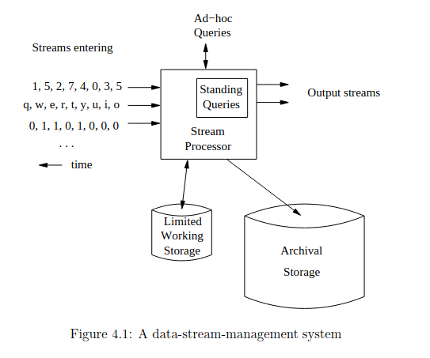

# Mining Data Stream

In molti contesti di analisi dei dati, si assume di lavorare con un database statico, in cui tutte le informazioni sono disponibili e accessibili in qualsiasi momento. Tuttavia, il mining di data streams introduce un paradigma diverso: i dati arrivano in flusso (stream) continuo e, se non vengono elaborati immediatamente o archiviati, vanno persi per sempre. Inoltre, il volume di dati può essere talmente elevato da rendere impossibile memorizzarli interamente in un database tradizionale.

Le tecniche per il mining di data streams si concentrano sulla sintetizzazione del flusso per ricavare informazioni utili utilizzando risorse limitate. Gli approcci principali includono:

1. **Campionamento e filtraggio (sampling):** estrarre campioni significativi dal flusso e rimuovere elementi indesiderati.
2. **Stima delle cardinalità:** calcolare approssimativamente il numero di elementi distinti nel flusso, utilizzando una quantità di memoria molto inferiore rispetto a quella necessaria per archiviare tutti i dati.
3. **Finestra scorrevole (sliding windows):** analizzare solo gli ultimi $n$ elementi del flusso (la cosiddetta finestra), come se fossero una relazione in un database. Anche in questo caso, se il numero di flussi o la dimensione della finestra sono troppo grandi, è necessario riassumere i dati della finestra stessa.

In molti scenari di **Data Mining**, non è possibile conoscere in anticipo l'intero insieme di dati. La gestione dei data streams diventa quindi cruciale, specialmente quando il tasso di ingresso dei dati è determinato da fonti esterne, come:

- Query dei motori di ricerca.
- Aggiornamenti di stato su piattaforme come Twitter o Facebook.

Questi flussi di dati possono essere considerati **infiniti** e **non stazionari**, poiché la loro distribuzione cambia nel tempo. Gli elementi (o tuple) arrivano rapidamente attraverso uno o più flussi di ingresso, rendendo impossibile memorizzare l'intero flusso in modo accessibile.
Di conseguenza, il sistema può mantenere solo sintesi ridotte (short **sketches**) del flusso, che devono essere costantemente aggiornate.

Descriviamo quindi, un elemento dello steam come una tupla:

$$X = \langle x_1, x_2, x_3, \dots, x_k \rangle$$

Di queste tuple, nella maggior parte dei casi consideriamo solo alcuni campi, detti **campi chiave**, come per esempio di un pacchetto IP, consideriamo per esempio gli indirizzi del mittente e di destinazione.

La sfida principale diventa quindi: **Come effettuare calcoli critici sui dati di un flusso utilizzando una quantità limitata di memoria secondaria?**

{width="300" style="display: block; margin: 0 auto"}

I flussi di dati possono essere archiviati in un archivio di grandi dimensioni per conservarli nel lungo termine. Tuttavia, non è possibile utilizzare tale archivio per rispondere a query in tempo reale, poiché il recupero dei dati richiederebbe processi lenti e specifici.

Per l'elaborazione operativa delle query, si utilizza invece una memoria di lavoro (cache), che può contenere sintesi o porzioni di dati del flusso, ovvero i nostri sketch e sample.

## Pattern Matching

Un primo problema fondamentale di statistica sui flussi di dati è il **pattern matching**. Supponiamo che gli elementi del flusso $x_i$​ appartengano a un alfabeto $\Sigma$, rendendo il flusso una stringa di lunghezza $m$ su $\Sigma$.

Dati un pattern $y=y_1y_2 \dots y_n \in \Sigma^n$ e un flusso $x$, l'obiettivo è determinare quante volte $y$ compare come sottostringa all'interno del flusso $x$, ovvero trovare tutte le occorrenze in cui:
$$y = y_1y_2 \dots y_n = x_ix_{i+1} \dots x_{i + n - 1}$$

### Cos'è uno sketch?

Una soluzione banale a questo problema, è di confrontare uno ad uno ciascun elemento $x_ix_{i+1} \dots x_{i + n - 1}$ con $y_1y_2 \dots y_n$. Osserviamo però che questo richiede tempo $O(n)$, che in questo caso non va bene.

Bisogna dunque definire uno sketch per risolvere in modo efficiente il problema del pattern matching.

!!! info
    **Definizione:** Sia $x \in \Sigma^*$, allora un sketch di dati è una funzione random $f: x \in \Sigma* \Rightarrow \{0,1\}^k$ aventi le seguenti proprietà:
    1. $k << \left|x\right|$, ovvero lo sketch deve essere molto più piccolo dell'input $x$.
    2. $f$ deve essere tale da poter essere **combinata** è **aggiornata** in tempo rapido, ovvero $f(xa) = F(f(x),f(a))$.
    3. $f$ deve mantenere le proprietà chiavi di $x$ con alta probabilità.

La proprietà chiave da mantenere nel problema del patter matching è: date $x, y \in \Sigma^*$, vogliamo la nostra funzione $f$ tale che:
$$x = y \Leftrightarrow f(x) = f(y) \text{ con alta probabilità }\\
x \neq y \Leftrightarrow f(x) \neq f(y) \text{ con alta probabilità }$$

### Funzione Hash di Rabin

Studiamo adesso una funzione hash, che ci permette creare uno sketch dei dati, con le proprietà menzionate sopra.

Sia $\Sigma = [s]$, ovvero $\Sigma = \{1, 2, 3, \dots, s\}$ e $s \in \mathbb{N^+}$. Si fissa ora un numero primo $q > s$ tale che $q = \theta(s)$ e si sceglie un numero $z \in \mathbb{Z_q} = [q]$.

Rappresentiamo il nostro flusso $x$ e il pattern da matchre $y$ in questo modo:
$$x = \langle x[0], x[1], ..., x[n - 1] \rangle \in [s]^n\\
y = \langle y[0], y[1], ..., y[n - 1] \rangle \in [s]^n$$

Allora la funzione hash che definiamo è:

$$K_{q,z}​(x) = \left( x[0]z^{n - 1} + x[1]z^{n - 2} + \dots + x[n - 1]z^0 \right) \mod\ q = \left( \sum_{i = 0}^{n - 1} ​x[n - i - 1]z^i \right)\mod\ q$$

Osserviamo che $K_{q,z}$ è un polinomio, ma una volta scelto random $z$, $K_{q, z}$ diventa un punto di questo polinomio in $\mathbb{Z_q}$ e non piu un polinomio. Questo rappresenta un efficienza in termini di spazio in quanto per rappresentare un numero in $\mathbb{Z_q}$ servono $log(q)$ bit che nei sistemi a registri è considerato costante. Quindi siamo riusciti a rappresentare una stringa di $n$ caratteri con $log(q)$ bit (prima proprietà delle funzioni di sketch).

!!! success
    **Lemma**: Sia $c \in \Sigma = [s]$, allora
    $$K_{q,z}​(xc) = \left( K_{q,z}(x)z + c\right) \mod q$$
    **Dimostrazione**: Supponiamo che la nuova stringa di cui dobbiamo fare lo sketch è la seguente:
    $$x = \langle x[0], x[1], ..., x[n - 1], c \rangle \in [s]^{n + 1}$$
    Allora
    $$K_{q,z}​(xc) = \left[\left( x[0]z^{n} + x[1]z^{n - 1} + \dots + x[n - 1]z \right) + cz^0\right] \mod\ q$$
    Raccogliendo $z$, otteniamo
    $$K_{q,z}​(xc) = \left( K_{q,z}(x)z + c\right) \mod\ q$$

Osserviamo però che $K_{q,z}(x)$ è lo sketch precedentemente computato, perciò queste 3 operzioni richiedono tempo $\theta(1)$, quindi l'aggornamento dello sketch è rapido (seconda proprietà).

Dati adesso due sketch, per $x$ e $y$, proviamo a calcolare $K_{z,q}(xy)$
$$K_{q,z}​(xy) = \left( K_{q, z}(x)z^n + K_{q,z}​(y) \right) \mod\ q$$
L'unico problema in questa formula che richiede tempo lineare è il calcolo di $z^n$, che può essere precomputato in tempo $O(log(n)log(q))$ usando la tecnica di esponenziazione rapida.

!!! note
    Calcolare direttamente $a^b$ può diventare inefficiente per $b$ molto grande, poiché il risultato cresce esponenzialmente. Invece, si utilizza un approccio chiamato **esponenziazione rapida** (o "exponentiation by squaring"), che riduce la complessità a $O(log⁡(b))$.
    L'idea chiave è utilizzare la decomposizione binaria dell'esponente $b$:
    - Scriviamo $b$ in binario.
    - Applichiamo una serie di moltiplicazioni e riduzioni modulo qq per calcolare solo i termini necessari.
    - Passaggi dell'algoritmo
        1. Caso base:
            - Se $b = 0$, allora $a^b \mod q = 1$.
            - Se $b = 1$, allora $a^b \mod q = a \mod\ q$.
        2. Esponente pari:
            - Riduciamo il problema sfruttando la proprietà:
                $$a^b \mod q = (a^{\frac{b}{2}} \mod q)^2 \mod q$$
            - Eseguiamo il calcolo in modo ricorsivo per $\frac{b}{2}$.
        3. Esponente dispari:
                $$a^b \mod q = (a a^{b-1} \mod q) \mod q$$
        4. Ripeti finché $b$ non si riduce a 0.
    L'algoritmo è molto più veloce di calcolare $a^b$ direttamente, perché riduce il numero di moltiplicazioni da $b$ a $log_2(b)$. Questo è cruciale in algoritmi come l'hash di Rabin, dove $b$ (es. $z^i$) può essere grande.

Dimostriamo ora che la funzione hash di Rabin può essere usata per creare un buon sketch per verificare l'identià di due stringhe.

!!! success
    **Lemma**: Siano $x = \langle x_1, x_2, \dots, x_n \rangle$ e $y = \langle y_1, y_2, \dots, y_n \rangle$ due stringhe tali che $x \neq y$ e $\left|x \right| = \left|y \right| = n$ e sia $z \in \mathbb{Z_q}$, allora
    $$Pr\left[K_{q,z}​(x) = K_{q,z}​(y) \mod q \right] \leq \frac{n}{q}​$$
    **Dimostrazione**: Abbiamo che
    $$Pr\left[K_{q,z}​(x) = K_{q,z}​(y) \mod q \right] = Pr\left[K_{q,z}​(x) − K_{q,z}​(y) \equiv 0 \mod q\right] \Leftrightarrow K_{q, z}(x - y) = 0 \mod q$$
    - La differenza $K_{q,z}(x) − K_{q,z}(y)$ è un polinomio in $z$, indicato come $K_{q,z}(x − y)$.
    - Definiamo $x − y$ come il vettore differenza tra $x$ e $y$, cioè: $x − y = \langle x_{n−1} − y_{n−1}, x_{n−2} − y_{n−2},\dots, x_0 − y_0\rangle$.
    - Il grado di $K_{q,z}(x − y)$ è al massimo $n$, dato che il vettore $x − y$ ha lunghezza $n$.
    - Un polinomio di grado al massimo $n$ ha al più $n$ radici modulo $q$.
    Adesso ci sono due possibilità che $K_{q,z}(x − y) = 0 \mod q$:
    1. Se è il polinomio identicamente nullo, ma questo è impossibile perché per ipotesi $x \neq y$, quindi esiste almeno un $j = 0,1,2, \dots, n$ tale che $x_j \neq y_j$.
    2. Che $z$ sia una radice di questo polinomio. Poiché $z$ è scelto uniformemente in $Z_q$, la probabilità che $K_{q,z}(x − y) \equiv 0 \mod q$ è al più $\frac{n}{q}$.
    Se scegliamo $q = \theta(n^b)$, allora la probabilità è $\leq \frac{1}{n^b}$ che ci va bene in quanto $\log(q) = \log(n^b) = b\log(n) = O(\log(n))$ spazio.

### Algoritmo di Karp-Rabin

Supponiamo di aver elaborato una sequenza di caratteri fino a $x[1],x[2], \dots ,x[i]​$ (dove $i \geq n$) e di conoscere due valori di hash:

- L'hash degli ultimi $n$ caratteri nella sequenza: $K_{q,z}(\langle x[i − n + 1], x[i − n + 2], x[i] \rangle)$.
- L'hash del pattern che stiamo cercando: $K_{q,z}(y)$.

Confrontando questi hash, possiamo verificare se il pattern $y$ appare negli ultimi $n$ caratteri della sequenza. Se appare alloara aggiorniamo un contatore.

Il passo cruciale è aggiornare l'hash quando un nuovo carattere $x[i+1]$​ arriva nel flusso di dati. Invece di ricalcolare l'hash per tutta la sottostringa di $n$ caratteri, lo aggiorniamo:

- Rimuovendo il contributo del carattere più vecchio $(x[i − n + 1]​)$.
- Aggiungendo il contributo del nuovo carattere $(x[i + 1]​)$.

Questo si ottiene con la formula:
$$K_{q,z}(\langle x[i − n + 2], x[i − n + 3], \dots, x[i + 1]\rangle) = (K_{q,z}(\langle x[i − n + 1], x[i − n + 2], \dots x[i]\rangle) − x[i − n + 1] \times z^{n−1}) \times z + x[i + 1]\mod q$$
Dove:
- $z^{n−1} \mod q$ viene precomputato per risparmiare tempo.
- La sottrazione rimuove il contributo del carattere più vecchio.
- L'addizione incorpora il nuovo carattere.

Questo metodo opera in tempo costante per gli aggiornamenti, ma l'algoritmo deve memorizzare gli ultimi $n$ caratteri del flusso per accedere a $x[i − n + 1]$​. Di conseguenza, richiede uno spazio $O(n)$.
